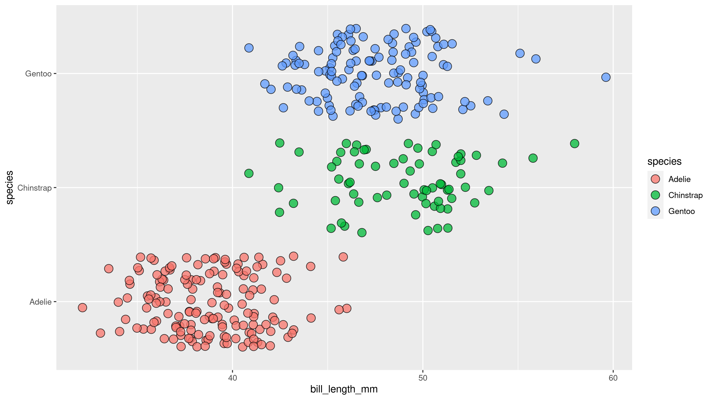
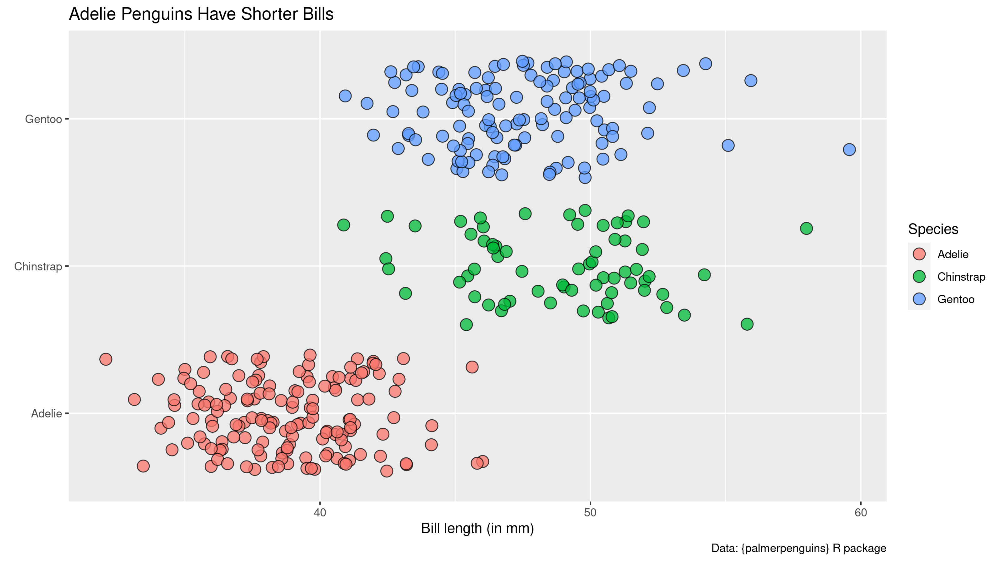
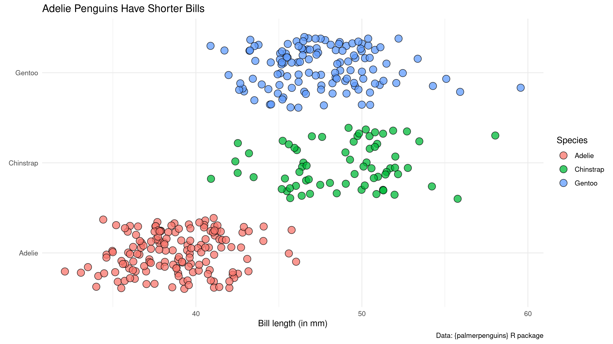
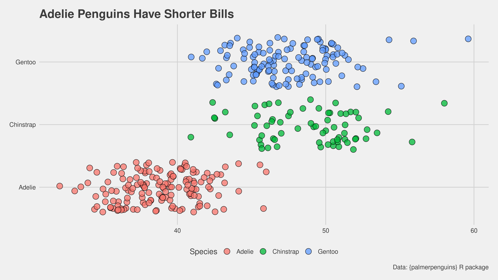
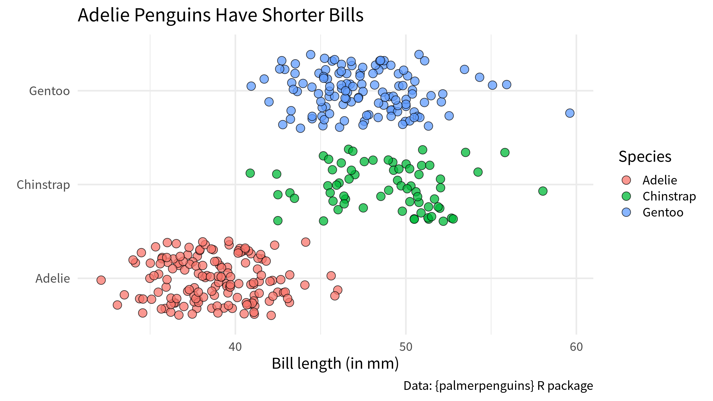
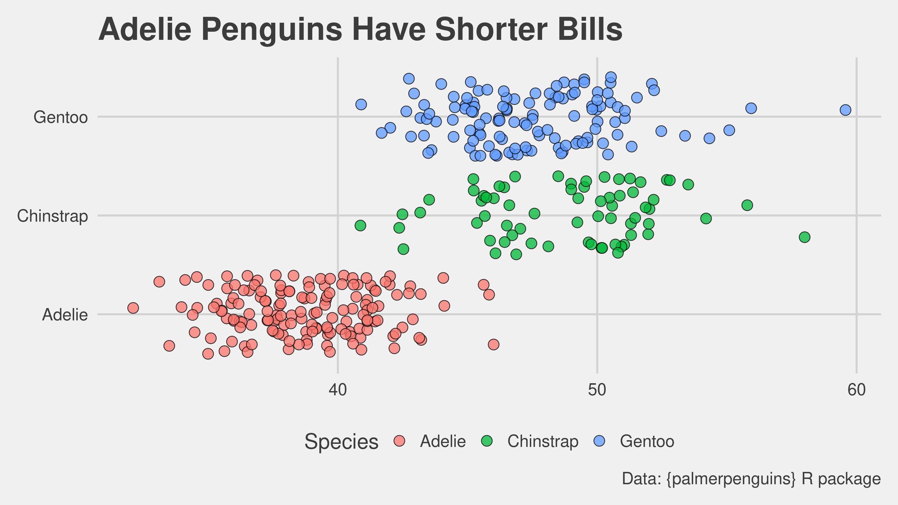
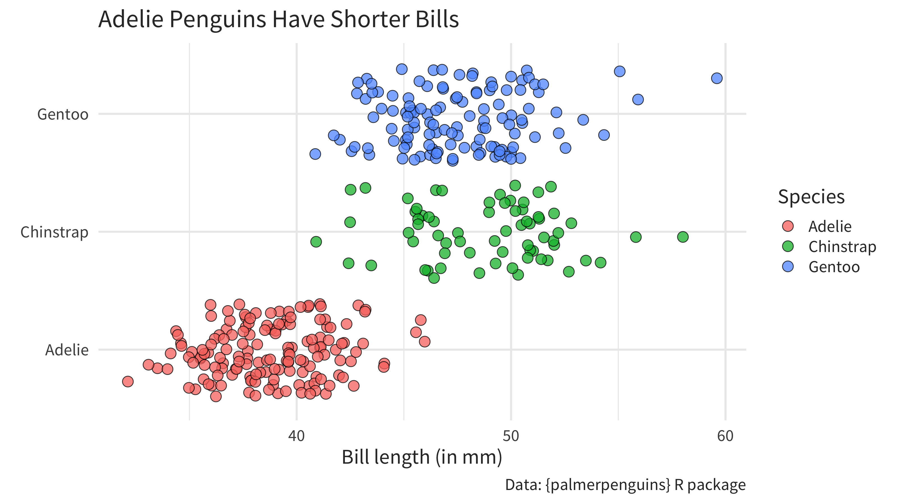
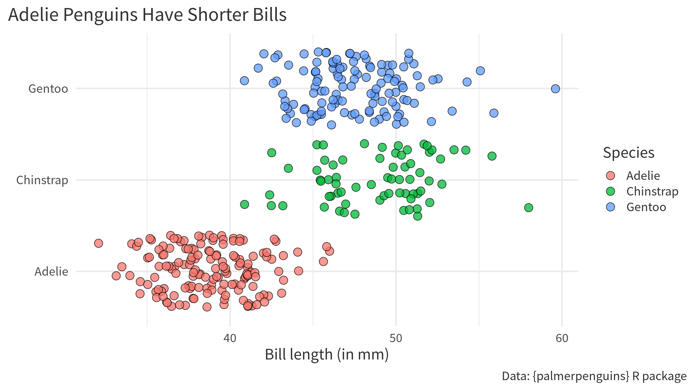
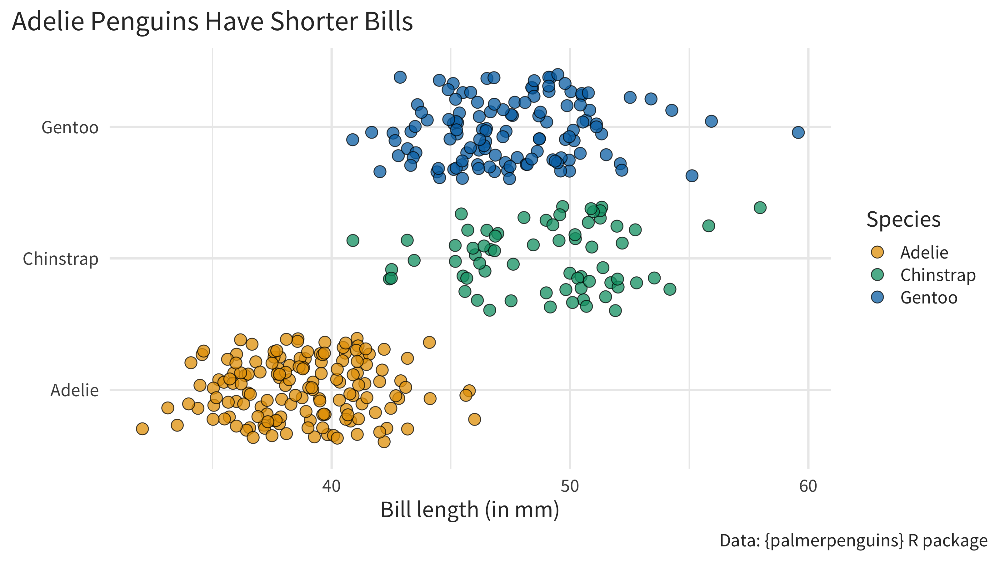

# Five Steps to Improve Your Chart Quickly
Albert Rapp
2023-11-01

Data visualization can be hard. From our experience, it can take hours and hours to perfect a visualization. Thankfully, if you’re stressed for time there are a couple of changes that always work. So let’s check out these evergreen steps we can use to make your chart instantly better.

## A chart to play with

First off, let us create a dummy dataviz with our favorite penguins data set. Once we have that, we can apply little tweaks to make the overall look of our chart better.

``` r
library(tidyverse)
plt <- palmerpenguins::penguins |> 
  ggplot(aes(x = bill_length_mm, y = species, fill = species)) +
  geom_jitter(shape = 21, size = 4, alpha = 0.75)
plt
```



## Use an active title

Cool. We have a dataviz now. But do you know what this chart is supposed to tell you? You don’t? Well, I don’t know either. The chart is pretty ambiguous.

That’s why it’s important to add proper labels to describe what’s on the axes. But even more important than axes labels is the title. It’s usually the first thing your reader sees (and reads). So you’d be wise to make that meaningful so that your reader immediately knows what’s up.

In the dataviz trade, this is known as an **active title**. [Instead of being some generic description of the variables in the data, an active title is filled with valuable insights](https://www.storytellingwithdata.com/blog/2017/3/22/so-what). This communicates what you want to say immediately. Just like any label, we can add the title via the `labs()` function.

Let’s use that function to

- format all the axes labels and
- communicate our insight that Adelie penguins seem to have shorter bills.

``` r
plt_with_labels <- plt +
  labs(
    x = 'Bill length (in mm)',
    y = element_blank(), # Species names don't need an extra label
    title = 'Adelie Penguins Have Shorter Bills',
    fill = 'Species',
    caption = 'Data: {palmerpenguins} R package'
  )
plt_with_labels
```



Notice that I have also added a caption here too. It’s always a good practice to tell people where your data is coming from. Also, you can use the caption for other helpful additional information.

## Apply a unique theme

Nice. Now that we know what the chart is about we can actually start to style the chart. Remember: Get your message in order first and cater the style towards that message second.

One of the easiest ways to make your chart look different quickly is to apply a theme. This is very low effort but will make sure that your chart doesn’t have the default look. And it’s a great strategy do avoid being judged by heinous people. You know these kind of people (like me) that will think that you haven’t really put any thought into the visual appeal of your visualization if your chart uses the defaults.

So, let me show you one theme you can never really go wrong with. That’s `theme_minimal()`. Let’s try that.

``` r
plt_with_labels +
  theme_minimal()
```



Even if you don’t think that applying `theme_minimal()` did do much, you probably want to keep it anyway. I’ll tell you why in a second. For now, I should probably mention that there are also some packages that offer more themes. For example, there’s the [ggthemes package](https://github.com/jrnold/ggthemes).

``` r
plt_with_labels + 
  ggthemes::theme_fivethirtyeight()
```



## Make sure your text is large enough

Remember that I told you that it’s good to have `theme_minimal()` around? I hope you do. I mentioned this like 5 seconds ago.

In any case, let me reveal what `theme_minimal()` can do for you: It can make sure that you set an appropriate font and font size for your chart ([this is one of the first changes data journalists at the BBC made when designing their own custom theme](https://book.rwithoutstatistics.com/custom-theme-chapter)). Yeah yeah, I know. I can already hear you scream *“Boooooring!”* But I want you to think about this when you’re sitting in a huge room for a keynote speech and the presenter didn’t think about increasing the font size. If you can’t read a thing on the super important chart, this might turn into a truly boring keynote.

Moving on from my little rant, let me show you that changing the font and the size couldn’t be easier. Just change the `base_size` and `base_family` argument in your `theme_minimal()` layer.

``` r
plt_with_labels +
  theme_minimal(base_size = 18, base_family = 'Source Sans Pro')
```



The same thing will (hopefully) work for other themes that you find online. For the FiveThirtyEight theme from `ggthemes` that’s the case.

``` r
plt_with_labels + 
  ggthemes::theme_fivethirtyeight(base_size = 18)
```



## Make your text grey rather than true black

In general, you want to make sure that you don’t overwhelm your reader with your titles and labels. This can sometimes be something you have to watch out for with long active titles or captions that include a lot of extra information. A quick trick to help you with that is to change the text color from black to a more subtle grey.

This can be done in the `theme()` layer. What you’ll need to know for that is that the `text` argument governs all text. Passing an `element_text()` with the right text properties to this argument will change the text properties in your chart (surprising, I know.)

``` r
plt_with_labels +
  theme_minimal(base_size = 18, base_family = 'Source Sans Pro') +
  theme(
    text = element_text(color = 'grey20')
  )
```



And while you’re at it in the `theme()` layer, you can give your title and caption a bit more room by aligning the text to the whole plot instead of aligning it to the grid panel. That’s done by setting `plot.title.position` and `caption.title.position` to `"plot"`.

``` r
plt_with_labels +
  theme_minimal(base_size = 18, base_family = 'Source Sans Pro') +
  theme(
    text = element_text(color = 'grey20'),
    plot.title.position = 'plot',
    plot.caption.position = 'plot'
  )
```



## Use a unique color palette

Another quick method to change the look of your chart is to move away from the default colors. For example, you could use your brand colors (if you have them) or get colors from a nice color palette. My go-to color palette is the colorblind-friendly Okabe-Ito color palette.

You can either look for the hex codes of that color palette online. Or you can call `okabe_ito(3)` from the `thematic` package to get three hex codes from that palette. Once you have those, you can pass them to the `values` argument of a `scale_(color|fill)_manual()` layer to change the colors.

``` r
plt_with_labels +
  theme_minimal(base_size = 18, base_family = 'Source Sans Pro') +
  theme(
    text = element_text(color = 'grey20'),
    plot.title.position = 'plot',
    plot.caption.position = 'plot'
  ) +
  scale_fill_manual(values = c("#E69F00", "#009E73", "#0072B2"))
```



## Conclusion

Those were our five quick changes that you can insert into any chart that you create. Chances are that you won’t win any awards for most beautiful dataviz with this. But these little changes (and in particular the active title) will at least give your chart a fighting chance to communicate your insight to an audience.
