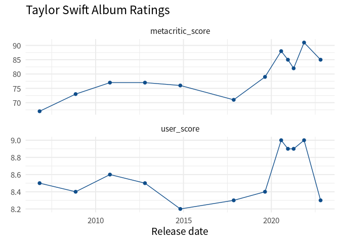
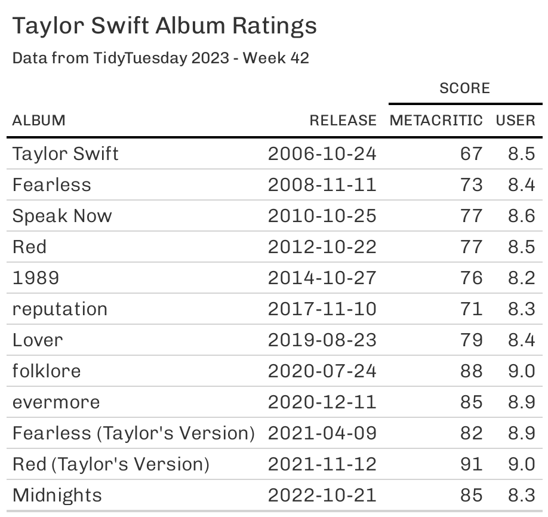
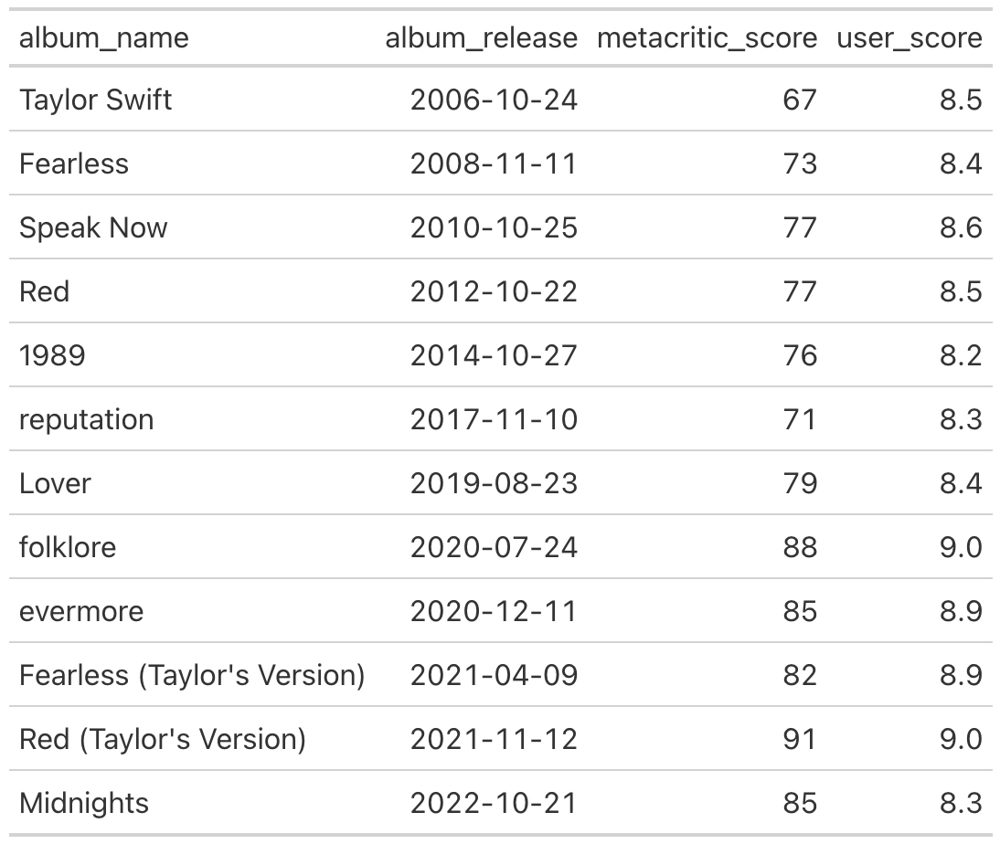

# Put your data into the right format with `pivot_longer()` and `pivot_wider()`
Albert Rapp
2023-11-08

Conventional wisdom tells us that data wrangling is 90% of all data work. And it’s true. Often, you will have to get your data into the right format before you can get any “real” work done. In the tidyverse, there are two powerful functions to help you with one of the most common data wrangling tasks: going from wide to long and lnog to wide. These functions are `pivot_longer()` and `pivot_wider()`.

Here, we will cover the standard use case of `pivot_*()` (we’ll cover more of what they can do next week).

## The standard use case

Let’s have a look at a data set from the weekly [tidyTuesday challenge](https://github.com/rfordatascience/tidytuesday/blob/master/data/2023/2023-10-17/readme.md). The data of that week’s challenge is Taylor Swift albums. That’s always a fun topic. You can download it straight from GitHub:

``` r
library(tidyverse)
taylor_albums <- readr::read_csv('https://raw.githubusercontent.com/rfordatascience/tidytuesday/master/data/2023/2023-10-17/taylor_albums.csv') |> 
  filter(!ep)
taylor_albums 
#> # A tibble: 12 × 5
#>    album_name                  ep    album_release metacritic_score user_score
#>    <chr>                       <lgl> <date>                   <dbl>      <dbl>
#>  1 Taylor Swift                FALSE 2006-10-24                  67        8.5
#>  2 Fearless                    FALSE 2008-11-11                  73        8.4
#>  3 Speak Now                   FALSE 2010-10-25                  77        8.6
#>  4 Red                         FALSE 2012-10-22                  77        8.5
#>  5 1989                        FALSE 2014-10-27                  76        8.2
#>  6 reputation                  FALSE 2017-11-10                  71        8.3
#>  7 Lover                       FALSE 2019-08-23                  79        8.4
#>  8 folklore                    FALSE 2020-07-24                  88        9  
#>  9 evermore                    FALSE 2020-12-11                  85        8.9
#> 10 Fearless (Taylor's Version) FALSE 2021-04-09                  82        8.9
#> 11 Red (Taylor's Version)      FALSE 2021-11-12                  91        9  
#> 12 Midnights                   FALSE 2022-10-21                  85        8.3
```

Let’s try to build a chart from this. For example, we could try to check whether the Metacritic and user scores look similar. Here’s the line chart that we’re building:


Now, if we want to build this with ggplot, we have to do two things in a `geom_line()` and a `geom_point()` layer:

1.  Map the `y` aesthetic to a `score` column
2.  Map the `color` aesthetic to a `score_type` column (Metacritic or User)

But neither of those columns exists in the data. What we have are the columns `metacritic_score` and `user_score`. Clearly, the **names** of these columns have the information that should go into the `score_type` column. And the **values** of the `metacritic_score` and `user_score` columns have the information that should go into the `score` column.

Hence, it seems that our data has all the information we need. But it’s just not in the right format. That’s unfortunate but an all too real scenario. When you’re working with data, this happens a lot.

So let’s not despair and fix the data instead. Luckily, the tidyverse has tools for that. Here, the `pivot_longer()` function can rearrange our data. We just have to tell it:

- which columns should be reshaped,
- what kind of information is in the column names, and
- what kind of information is in the values of each column that gets rearranged.

Here’s how we would turn these steps into code. I hope you will find this is pretty much how we phrased the text earlier.

``` r
taylor_longer <- taylor_albums |> 
  pivot_longer(
    cols = c(metacritic_score, user_score),
    names_to = 'score_type',
    values_to = 'score'
  )
taylor_longer
#> # A tibble: 24 × 5
#>    album_name   ep    album_release score_type       score
#>    <chr>        <lgl> <date>        <chr>            <dbl>
#>  1 Taylor Swift FALSE 2006-10-24    metacritic_score  67  
#>  2 Taylor Swift FALSE 2006-10-24    user_score         8.5
#>  3 Fearless     FALSE 2008-11-11    metacritic_score  73  
#>  4 Fearless     FALSE 2008-11-11    user_score         8.4
#>  5 Speak Now    FALSE 2010-10-25    metacritic_score  77  
#>  6 Speak Now    FALSE 2010-10-25    user_score         8.6
#>  7 Red          FALSE 2012-10-22    metacritic_score  77  
#>  8 Red          FALSE 2012-10-22    user_score         8.5
#>  9 1989         FALSE 2014-10-27    metacritic_score  76  
#> 10 1989         FALSE 2014-10-27    user_score         8.2
#> # ℹ 14 more rows
```

Well, look at that. We have the data in exactly the format that `ggplot()` needs. Check it out:

``` r
taylor_longer |> 
  ggplot(aes(album_release, score)) +
  geom_line(col = 'dodgerblue4') +
  geom_point(col = 'dodgerblue4', size = 2) +
  facet_wrap(vars(score_type), scales = 'free_y', ncol = 1) +
  theme_minimal(base_size = 16, base_family = 'Source Sans Pro') +
  labs(
    x = 'Release date',
    y = element_blank(),
    title = 'Taylor Swift Album Ratings'
  )
```



You’ll see that `taylor_longer` has more rows than the initial `taylor_albums` data set. That’s why it’s usually referred to as being in a **long** format. Hence, the function that makes a data set longer is called `pivot_longer()`. Similarly, the initial data set `taylor_albums` is called **wide**.

## Why the wide format then?

Sometimes it can actually be convenient to have your data in a wide format. Tables are a common scenario where want wide data. For example, check out this table created with `gt`.



If you want to create that table, then you need your data set to be in the wide format (just like the initial `taylor_albums` data set.) Thus, you’d need to pass the `taylor_albums` data set to `gt()` from the `gt` package to create this table.

``` r
taylor_albums |> 
  select(album_name, album_release, metacritic_score, user_score) |> 
  gt() 
```



After applying styling you will get the first table that we saw earlier. Since the styling is not really part of this blog post, we’ll not cover it. But you can take a peek at the code here:

<details>
<summary>Code</summary>

``` r
library(gt)
tbl <- taylor_albums |> 
  select(album_name, album_release, metacritic_score, user_score) |> 
  gt() |> 
  cols_label(
    album_name = 'Album',
    album_release = 'Release',
    metacritic_score = 'Metacritic',
    user_score = 'User'
  ) |> 
  tab_spanner(
    label = 'Score',
    columns = 3:4
  ) |> 
  tab_header(
    title = 'Taylor Swift Album Ratings',
    subtitle = 'Data from TidyTuesday 2023 - Week 42'
  ) |> 
  gtExtras::gt_theme_538() 
tbl
```

</details>

## But what if we only have long data?

Now imagine for a second that we only have the data set `taylor_longer`. In case you forgot, here’s how it looks.

``` r
taylor_longer
#> # A tibble: 24 × 5
#>    album_name   ep    album_release score_type       score
#>    <chr>        <lgl> <date>        <chr>            <dbl>
#>  1 Taylor Swift FALSE 2006-10-24    metacritic_score  67  
#>  2 Taylor Swift FALSE 2006-10-24    user_score         8.5
#>  3 Fearless     FALSE 2008-11-11    metacritic_score  73  
#>  4 Fearless     FALSE 2008-11-11    user_score         8.4
#>  5 Speak Now    FALSE 2010-10-25    metacritic_score  77  
#>  6 Speak Now    FALSE 2010-10-25    user_score         8.6
#>  7 Red          FALSE 2012-10-22    metacritic_score  77  
#>  8 Red          FALSE 2012-10-22    user_score         8.5
#>  9 1989         FALSE 2014-10-27    metacritic_score  76  
#> 10 1989         FALSE 2014-10-27    user_score         8.2
#> # ℹ 14 more rows
```

Oh snap. We can’t pass this to `gt()`. This won’t look good. So instead, let’s convert this into wide format.

*“How could we possibly to that?”*, I can hear you asking. Well, we already know half of the answer. Remember how `pivot_longer()` helped us to make our table long? This function has a sibling. It’s `pivot_wider()` and it does exactly what you’d guess.

But it works the other way around. Instead of throwing column names like `metacritic_score` and `user_score` into the cells of a column `score_type`, it reverts the process and moves the names **from** the values of a column to the names of a newly created column. But then `pivot_wider()` will also need to know how to fill these newly created columns. Therefore, you will need to tell it where the values of the new columns should come from.

``` r
taylor_longer |> 
  pivot_wider(
    names_from = score_type,
    values_from = score
  )
#> # A tibble: 12 × 5
#>    album_name                  ep    album_release metacritic_score user_score
#>    <chr>                       <lgl> <date>                   <dbl>      <dbl>
#>  1 Taylor Swift                FALSE 2006-10-24                  67        8.5
#>  2 Fearless                    FALSE 2008-11-11                  73        8.4
#>  3 Speak Now                   FALSE 2010-10-25                  77        8.6
#>  4 Red                         FALSE 2012-10-22                  77        8.5
#>  5 1989                        FALSE 2014-10-27                  76        8.2
#>  6 reputation                  FALSE 2017-11-10                  71        8.3
#>  7 Lover                       FALSE 2019-08-23                  79        8.4
#>  8 folklore                    FALSE 2020-07-24                  88        9  
#>  9 evermore                    FALSE 2020-12-11                  85        8.9
#> 10 Fearless (Taylor's Version) FALSE 2021-04-09                  82        8.9
#> 11 Red (Taylor's Version)      FALSE 2021-11-12                  91        9  
#> 12 Midnights                   FALSE 2022-10-21                  85        8.3
```

Nice. Now, to round off this blog post, let me give you a gif that shows you these functions in action.


This is one of the amazing visualizations that you can find in the [tidyexplain repository on GitHub](https://github.com/gadenbuie/tidyexplain). And with that, we have completed the basics on `pivot_longer()` and `pivot_wider()`. Stay tuned for the more advanced stuff next week. 👋
