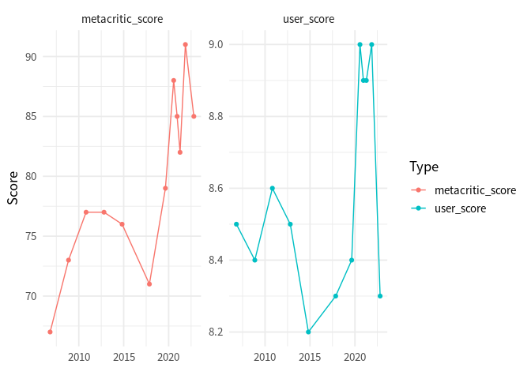
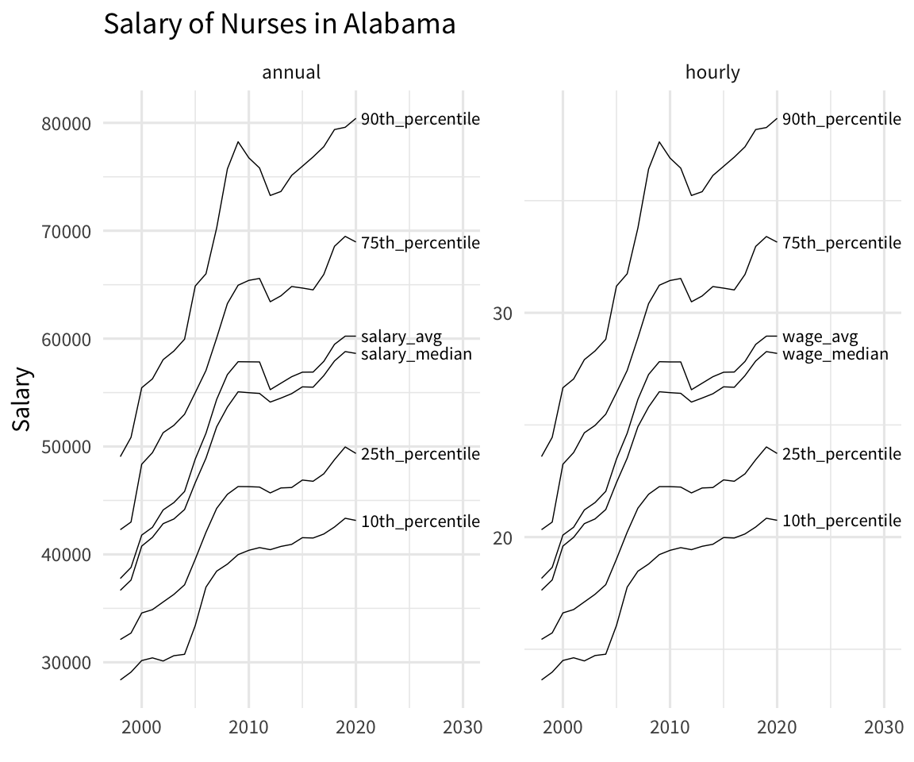

# Advanced tricks to put your data into the right format with `pivot_longer()` and `pivot_wider()`
Albert Rapp
2023-11-15

Last week, we started to learn about `pivot_longer()` and `pivot_wider()`. These are two essential functions to speed up you data wrangling process. Check out [the video and blog post from last week](https://rfortherestofus.com/2023/11/pivot-functions) if you haven’t seen that yet.

As promised, this week we continue on this path and learn some of the advanced tricks that these two functions have to offer. This should help you clean your data even faster. Let’s begin by revisiting what we did last week.

## Taylor Swift again

Last week, we have worked with a data set from [tidyTuesday](https://github.com/rfordatascience/tidytuesday/blob/master/data/2023/2023-10-17/readme.md). And not just any data set, we worked with this data set about Taylor Swift albums.

``` r
library(tidyverse)
taylor_albums <- readr::read_csv('https://raw.githubusercontent.com/rfordatascience/tidytuesday/master/data/2023/2023-10-17/taylor_albums.csv') |> 
  filter(!ep)
taylor_albums 
#> # A tibble: 12 × 5
#>    album_name                  ep    album_release metacritic_score user_score
#>    <chr>                       <lgl> <date>                   <dbl>      <dbl>
#>  1 Taylor Swift                FALSE 2006-10-24                  67        8.5
#>  2 Fearless                    FALSE 2008-11-11                  73        8.4
#>  3 Speak Now                   FALSE 2010-10-25                  77        8.6
#>  4 Red                         FALSE 2012-10-22                  77        8.5
#>  5 1989                        FALSE 2014-10-27                  76        8.2
#>  6 reputation                  FALSE 2017-11-10                  71        8.3
#>  7 Lover                       FALSE 2019-08-23                  79        8.4
#>  8 folklore                    FALSE 2020-07-24                  88        9  
#>  9 evermore                    FALSE 2020-12-11                  85        8.9
#> 10 Fearless (Taylor's Version) FALSE 2021-04-09                  82        8.9
#> 11 Red (Taylor's Version)      FALSE 2021-11-12                  91        9  
#> 12 Midnights                   FALSE 2022-10-21                  85        8.3
```

We figured out that we can rearrange the data from the columns `metacritic_score` and `user_score` so that we can pass this new data set to `ggplot()` for quick plotting.

``` r
taylor_longer <- taylor_albums |> 
  pivot_longer(
    cols = c(metacritic_score, user_score),
    names_to = 'score_type',
    values_to = 'score'
  )
taylor_longer
#> # A tibble: 24 × 5
#>    album_name   ep    album_release score_type       score
#>    <chr>        <lgl> <date>        <chr>            <dbl>
#>  1 Taylor Swift FALSE 2006-10-24    metacritic_score  67  
#>  2 Taylor Swift FALSE 2006-10-24    user_score         8.5
#>  3 Fearless     FALSE 2008-11-11    metacritic_score  73  
#>  4 Fearless     FALSE 2008-11-11    user_score         8.4
#>  5 Speak Now    FALSE 2010-10-25    metacritic_score  77  
#>  6 Speak Now    FALSE 2010-10-25    user_score         8.6
#>  7 Red          FALSE 2012-10-22    metacritic_score  77  
#>  8 Red          FALSE 2012-10-22    user_score         8.5
#>  9 1989         FALSE 2014-10-27    metacritic_score  76  
#> 10 1989         FALSE 2014-10-27    user_score         8.2
#> # ℹ 14 more rows

taylor_longer |> 
  ggplot(aes(x = album_release, y = score, color = score_type)) +
  geom_line() +
  geom_point() +
  facet_wrap(vars(score_type), scales = 'free_y') +
  theme_minimal(base_size = 14, base_family = 'Source Sans Pro') +
  labs(
    x = element_blank(),
    y = 'Score',
    color = 'Type'
  )
```



## Nicer labels

Notice that in our previous chart, the labels are a bit reduntant. We always write `metacritic_score` or `user_score`. Why not just `Metacritic` or `User` (spelled with a capital letter)?

Well, we could manually make this look nicer. But this would require working with the text variables using functions like `str_remove_all()` or `str_to_title()`.

``` r
taylor_longer |> 
  mutate(
    score_type = score_type |> str_remove_all('_score') |> str_to_title() 
  )
#> # A tibble: 24 × 5
#>    album_name   ep    album_release score_type score
#>    <chr>        <lgl> <date>        <chr>      <dbl>
#>  1 Taylor Swift FALSE 2006-10-24    Metacritic  67  
#>  2 Taylor Swift FALSE 2006-10-24    User         8.5
#>  3 Fearless     FALSE 2008-11-11    Metacritic  73  
#>  4 Fearless     FALSE 2008-11-11    User         8.4
#>  5 Speak Now    FALSE 2010-10-25    Metacritic  77  
#>  6 Speak Now    FALSE 2010-10-25    User         8.6
#>  7 Red          FALSE 2012-10-22    Metacritic  77  
#>  8 Red          FALSE 2012-10-22    User         8.5
#>  9 1989         FALSE 2014-10-27    Metacritic  76  
#> 10 1989         FALSE 2014-10-27    User         8.2
#> # ℹ 14 more rows
```

See how the labels in the `score_type` column now say what we’d want to show in a ggplot? That’s great. We could pass this to `ggplot()` now and everything would be fine. But all of this was an extra step we had to do. Can’t we just let `pivot_longer()` handle that as it’s rearranging the data?

Well, we’re in luck. It turns out `pivot_longer()` can do all of this for us. The trick here is to also specifiy the arguments `names_pattern` and `names_transform`. Here’s what they do.

- `names_pattern`: Describes a so-called *regular expression (regex)* that describes the pattern of the column names and by specifying groups with `()` we can tell `pivot_longer()` which parts we want to extract.

- `names_transform`: Describes a function that transforms the labels in the end. In our case this could just be `str_to_title` (without paranthesis).

``` r
taylor_albums |> 
  pivot_longer(
    cols = c(metacritic_score, user_score),
    names_to = 'score_type',
    values_to = 'score',
    names_pattern = '(.+)_score',
    names_transform = str_to_title
  )
#> # A tibble: 24 × 5
#>    album_name   ep    album_release score_type score
#>    <chr>        <lgl> <date>        <chr>      <dbl>
#>  1 Taylor Swift FALSE 2006-10-24    Metacritic  67  
#>  2 Taylor Swift FALSE 2006-10-24    User         8.5
#>  3 Fearless     FALSE 2008-11-11    Metacritic  73  
#>  4 Fearless     FALSE 2008-11-11    User         8.4
#>  5 Speak Now    FALSE 2010-10-25    Metacritic  77  
#>  6 Speak Now    FALSE 2010-10-25    User         8.6
#>  7 Red          FALSE 2012-10-22    Metacritic  77  
#>  8 Red          FALSE 2012-10-22    User         8.5
#>  9 1989         FALSE 2014-10-27    Metacritic  76  
#> 10 1989         FALSE 2014-10-27    User         8.2
#> # ℹ 14 more rows
```

Neat, this worked out pretty nicely. But what´s that `(.+)` we used? Here, this is part of the regular expression we built. And without going into too much details about regex in general, let’s go through what we did here one by one.

- `.`: This is a placeholder that can mean any character (except for a new line)
- `+`: This means that whatever preceded this symbol, it can show up once or multiple times (but at least once).
- `.+`: Together this means that this will “catch” any text that consist out of anything but a line break
- `.+_score`: This means that this catches all patterns that consists out of text without line breaks that are followed by the text `_score`. This means that our regex describes the exact pattern that our column names `metacritic_score` and `user_score` have.
- `(.+)_score`: Adding the parantheses tells `pivot_longer()` which part of the pattern we are interested in. Here that’s what comes before `_score`.

Oof. That was a lot to digest, I know. You may wonder why it’s worth figuring this stuff out. This technique really shines with more complex data sets that you may find in the wild. Let’s have a look.

## A more complex example

Here’s another data set from TidyTuesday. It’s about the wages of nurses in different states of the US.

``` r
nurses <- readr::read_csv('https://raw.githubusercontent.com/rfordatascience/tidytuesday/master/data/2021/2021-10-05/nurses.csv') |>  
  janitor::clean_names()
#> Rows: 1242 Columns: 22
#> ── Column specification ────────────────────────────────────────────────────────
#> Delimiter: ","
#> chr  (1): State
#> dbl (21): Year, Total Employed RN, Employed Standard Error (%), Hourly Wage ...
#> 
#> ℹ Use `spec()` to retrieve the full column specification for this data.
#> ℹ Specify the column types or set `show_col_types = FALSE` to quiet this message.
nurses
#> # A tibble: 1,242 × 22
#>    state           year total_employed_rn employed_standard_er…¹ hourly_wage_avg
#>    <chr>          <dbl>             <dbl>                  <dbl>           <dbl>
#>  1 Alabama         2020             48850                    2.9            29.0
#>  2 Alaska          2020              6240                   13              45.8
#>  3 Arizona         2020             55520                    3.7            38.6
#>  4 Arkansas        2020             25300                    4.2            30.6
#>  5 California      2020            307060                    2              58.0
#>  6 Colorado        2020             52330                    2.8            37.4
#>  7 Connecticut     2020             33400                    6.5            40.8
#>  8 Delaware        2020             11410                   11.4            35.7
#>  9 District of C…  2020             10320                    1.2            43.3
#> 10 Florida         2020            183130                    2.2            33.4
#> # ℹ 1,232 more rows
#> # ℹ abbreviated name: ¹​employed_standard_error_percent
#> # ℹ 17 more variables: hourly_wage_median <dbl>, annual_salary_avg <dbl>,
#> #   annual_salary_median <dbl>, wage_salary_standard_error_percent <dbl>,
#> #   hourly_10th_percentile <dbl>, hourly_25th_percentile <dbl>,
#> #   hourly_75th_percentile <dbl>, hourly_90th_percentile <dbl>,
#> #   annual_10th_percentile <dbl>, annual_25th_percentile <dbl>, …
```

As you can see, this data set has a loooot of columns. It’s pretty wide, you might say. Let’s check out how wide by just considering the column names.

``` r
colnames(nurses)
#>  [1] "state"                                       
#>  [2] "year"                                        
#>  [3] "total_employed_rn"                           
#>  [4] "employed_standard_error_percent"             
#>  [5] "hourly_wage_avg"                             
#>  [6] "hourly_wage_median"                          
#>  [7] "annual_salary_avg"                           
#>  [8] "annual_salary_median"                        
#>  [9] "wage_salary_standard_error_percent"          
#> [10] "hourly_10th_percentile"                      
#> [11] "hourly_25th_percentile"                      
#> [12] "hourly_75th_percentile"                      
#> [13] "hourly_90th_percentile"                      
#> [14] "annual_10th_percentile"                      
#> [15] "annual_25th_percentile"                      
#> [16] "annual_75th_percentile"                      
#> [17] "annual_90th_percentile"                      
#> [18] "location_quotient"                           
#> [19] "total_employed_national_aggregate"           
#> [20] "total_employed_healthcare_national_aggregate"
#> [21] "total_employed_healthcare_state_aggregate"   
#> [22] "yearly_total_employed_state_aggregate"
```

Let’s narrow this down a little bit. We have a lot of columns about average, median and [percentiles](https://en.wikipedia.org/wiki/Percentile) of hourly and annual salary. We can select only those columns by using the tidyselect helper `matches()`. In there, we have to specify that we are looking for columns with the word ‘hourly’ or ‘annual’ in them. That’s done with the `|` operator (another regex by the way).

``` r
nurses |> 
  select(state, year, matches('hourly|annual')) |> 
  colnames()
#>  [1] "state"                  "year"                   "hourly_wage_avg"       
#>  [4] "hourly_wage_median"     "annual_salary_avg"      "annual_salary_median"  
#>  [7] "hourly_10th_percentile" "hourly_25th_percentile" "hourly_75th_percentile"
#> [10] "hourly_90th_percentile" "annual_10th_percentile" "annual_25th_percentile"
#> [13] "annual_75th_percentile" "annual_90th_percentile"
```

Now look at those names. Do you see a pattern? Apart from the column `state` and `year`, we always have the following pattern

- hourly or annual,
- an underscore `_` and
- one of the following words:
  - “wage_avg”,
  - “wage_median”,
  - “salary_avg”,
  - “salary_median”,
  - some number followed by “th_percentile”

This means that from each column we can actually extract two information:

- Do we talk about hourly or annual salary?
- What kind of quantity of that salary do we mean? Average, median or some other percentile?

Luckily we can catch all of this with one regex that contains **two** groups (indicated by `()`). Here’s how that could look in `pivot_longer()`.

``` r
nurses |> 
  select(state, year, matches('hourly|annual')) |> 
  pivot_longer(
    cols = -c(state, year),
    names_pattern = '(.+)_(.+)',
    names_to = c('timeframe', 'type'),
    values_to = 'wage'
  )
#> # A tibble: 14,904 × 5
#>    state    year timeframe     type          wage
#>    <chr>   <dbl> <chr>         <chr>        <dbl>
#>  1 Alabama  2020 hourly_wage   avg           29.0
#>  2 Alabama  2020 hourly_wage   median        28.2
#>  3 Alabama  2020 annual_salary avg        60230  
#>  4 Alabama  2020 annual_salary median     58630  
#>  5 Alabama  2020 hourly_10th   percentile    20.8
#>  6 Alabama  2020 hourly_25th   percentile    23.7
#>  7 Alabama  2020 hourly_75th   percentile    33.2
#>  8 Alabama  2020 hourly_90th   percentile    38.7
#>  9 Alabama  2020 annual_10th   percentile 43150  
#> 10 Alabama  2020 annual_25th   percentile 49360  
#> # ℹ 14,894 more rows
```

Oh no. It seems like the `timeframe` column contains more than just “hourly” or “annual”. That’s because our regex `(.+)_(.+)` was a bit ambiguous. Since the `.` operator catches all things including underscores `_` it is not clear weather `pivot_longer()` should split at the first or second underscore.

But we can fix that. Instead of using `.` in the first group, we can use `[a-z]`. This means what we only want to “catch” things that contain lower letters a-z. As the percentiles also contain numbers (as in `25th_percentile`) we get an unambiguous split.

``` r
nurses_longer <- nurses |> 
  select(state, year, matches('hourly|annual')) |> 
  pivot_longer(
    cols = -c(state, year),
    names_pattern = '([a-z]+)_(.+)',
    names_to = c('timeframe', 'type'),
    values_to = 'wage'
  )
nurses_longer
#> # A tibble: 14,904 × 5
#>    state    year timeframe type               wage
#>    <chr>   <dbl> <chr>     <chr>             <dbl>
#>  1 Alabama  2020 hourly    wage_avg           29.0
#>  2 Alabama  2020 hourly    wage_median        28.2
#>  3 Alabama  2020 annual    salary_avg      60230  
#>  4 Alabama  2020 annual    salary_median   58630  
#>  5 Alabama  2020 hourly    10th_percentile    20.8
#>  6 Alabama  2020 hourly    25th_percentile    23.7
#>  7 Alabama  2020 hourly    75th_percentile    33.2
#>  8 Alabama  2020 hourly    90th_percentile    38.7
#>  9 Alabama  2020 annual    10th_percentile 43150  
#> 10 Alabama  2020 annual    25th_percentile 49360  
#> # ℹ 14,894 more rows
```

And with that data set we could now take a look at a specific state in a chart.

``` r
nurses_longer |> 
  filter(state == 'Alabama') |> 
  ggplot(aes(x = year, y = wage, group = type)) +
  geom_line() +
  geom_text(
    data = nurses_longer |> filter(state == 'Alabama', year == 2020),
    aes(label = type),
    hjust = 0,
    nudge_x = 0.5,
    size = 6,
    family = 'Source Sans Pro'
  ) +
  facet_wrap(vars(timeframe), scales = 'free_y') +
  theme_minimal(base_size = 24, base_family = 'Source Sans Pro') +
  coord_cartesian(xlim = c(1998, 2030)) +
  labs(
    x = element_blank(),
    y = 'Salary',
    title = 'Salary of Nurses in Alabama'
  )
```



# Conclusion

Of course, there’s lots more to do to polish our nurses chart. But the first step here was (once again) getting the data into the right format. In this blog post, we have seen that we can use pretty advanced tricks like regex to let `pivot_longer()` (and similarly `pivot_wider()`) rearrange the data.

Clearly, these advanced steps require a bit getting used to. So don’t worry if you don’t get it immediately. And with that said, I’ll give you a little bit of time to think these things through and then I’ll see you next week 👋
