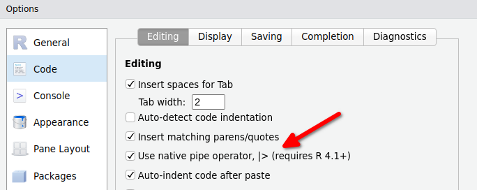
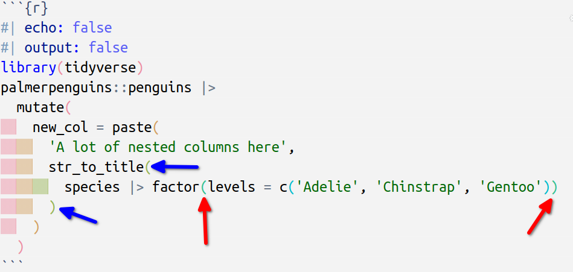
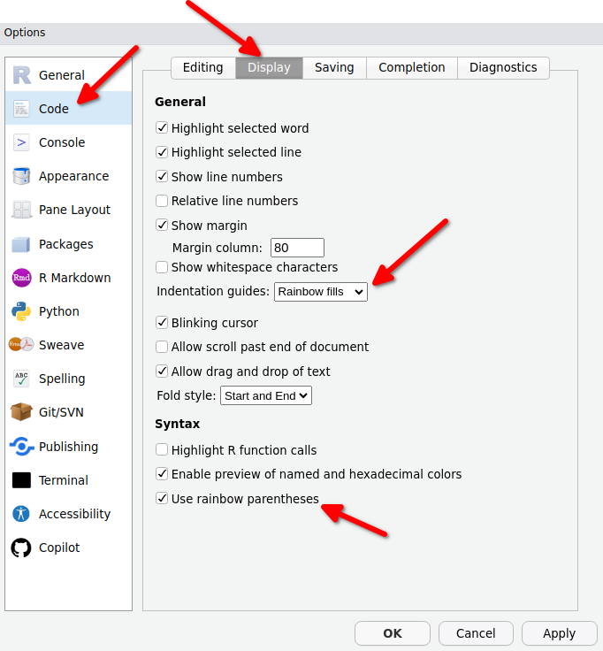
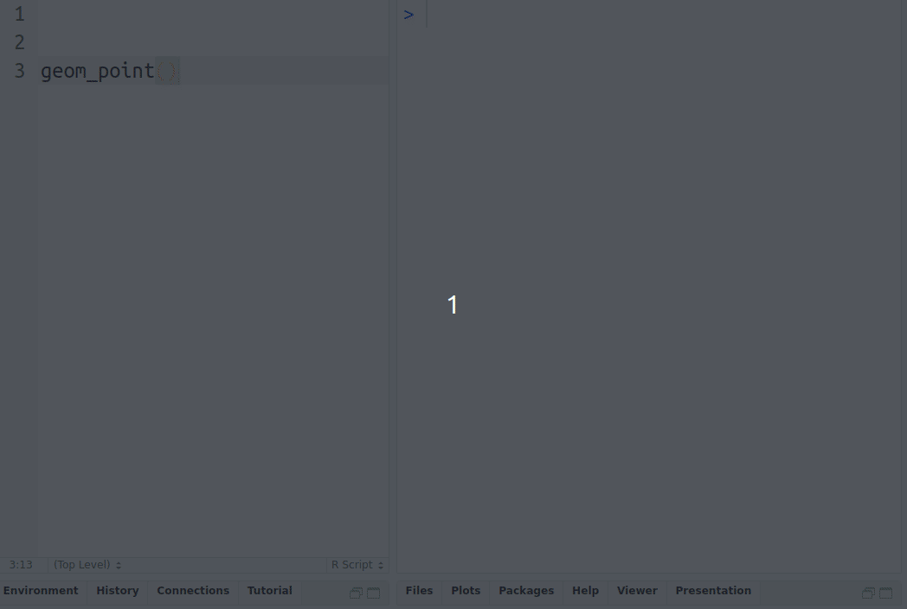
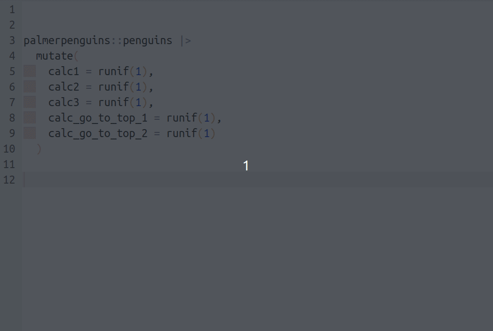
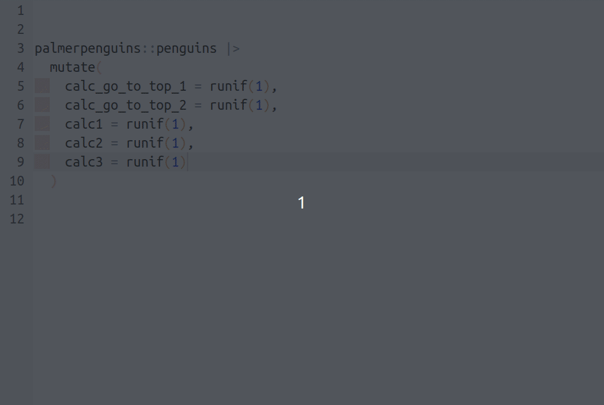
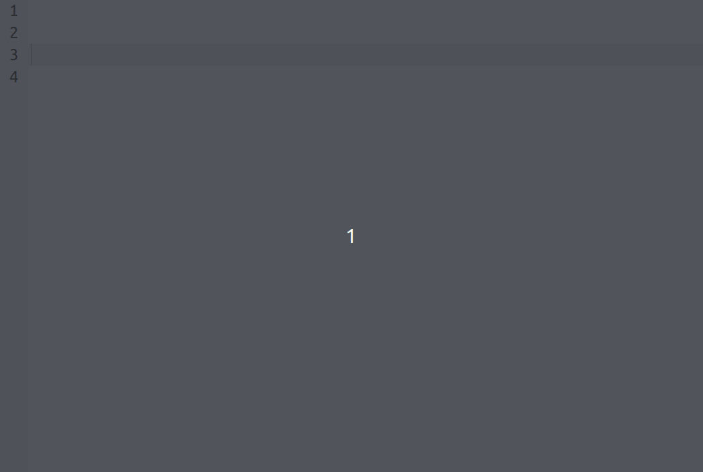

# Speed up your coding workflow with RStudio hotkeys
Albert Rapp
2023-11-22

RStudio is the premier tool to write R code. And just like any tool, the better you know RStudio’s features the faster you can write code. That’s why we decided show you the best hotkeys we use all the time.

## Don’t type the pipe

Whether it is `%>%` or `|>`, it is tempting to write out the pipe letter by letter. But the pipe is such an integral part of the tidy workflow that it makes sense to give yourself a tiny speed boost whenever you use the pipe.

Just hit `ctrl` + `shift` + `M` to get the job done. Not only will this throw the pipe, it will also add surrounding white space. And if you want to use the R native pipe `|>` instead of `%>%`, then go to **Tools \> Global Options** and enable it in the **Code** tab.

## Rainbow parantheses & pane layout

These are not really hotkeys but while we’re in the RStudio settings, we might as well change two things there:

- **Pane Layout**: In the Pane Layout tab, I usually try to make sure that my console is on the right and my source view (`.R` script or Quarto file) is on the left. The reason for this is simple:

  The code-file and the console output are the premier things one usually works with **most** of the time. So it makes sense to give those two things the maximum amount of space instead of shoving both of them on the left side of the panel. Don’t worry, the plot panel will automatically pop up when you create a new plot and you can also open any panel manually if you need it.

  

- **Rainbow paranthesis & indent**: This is one of the things I use to make sure that I can clearly see indentations and which closing parenthesis belongs to which opening parenthesis. Here’s how that looks:

  

  You can enable these things in **Code \> Display**:

  

## Open documentation with F1

I have years of experience coding with R but I still need to consult the documentation on a recurring basis. The faster you get used to consulting the docs, the better. And the fastest way to consult the documentation for a given function is to click on the function in your code and hit `F1`. This will immediately open the Help Panel in RStudio.

## Rearrange your code quickly with `alt` + arrows

The fastest way to move lines of code is to highlight them and then by pressing `alt`, you can move the code via the arrow keys.

## Indent + Unindent with (shift) + Tab

This is one of those things that I can still remember clearly from the beginnings of my coding journey. I already knew that you can indent code by highlighting it with your cursor and then pressing `tab`. But sometimes I hit `tab` one too many times and had to go in to each line and remove the extra space.

As embarrassing as this may be to admit, this is the tedious thing I did for a long time. But then at some point I realized, you actually also unindent your code by pressing `shift` + `tab`. Hoorayyy. 🥳

By the way, the same trick works with a lot of keyboard shortcuts. Hit `ctrl` + `z` one too many times? Press `shift` + `ctrl` + `z` to redo what you’ve just undone.

## Multiple cursors with alt + click

Ever wanted to copy an Excel column to a vector. It’s a bit annoying that you have to add additional quotation marks manually. But with multiple cursors, that becomes pretty easy.

Just hold `alt` and drag your cursor across lines where you want to use additional cursors.

## Conclusion

These were some of our most favorite little tricks within RStudio. Did we miss anything important? Feel free to let us know in the comments.
