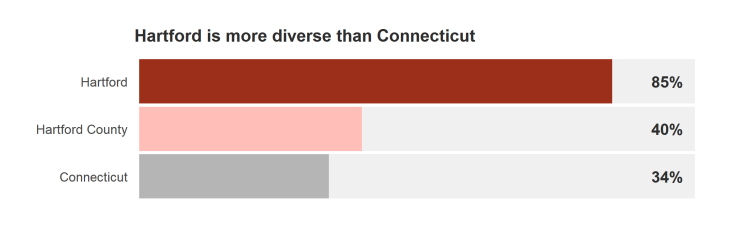
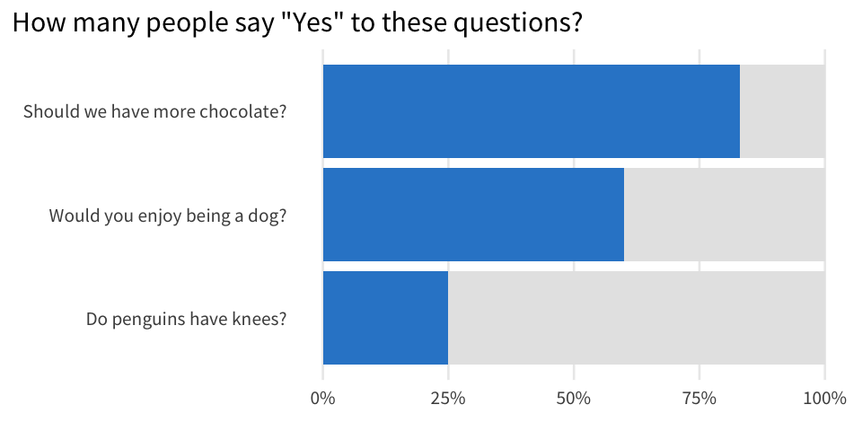
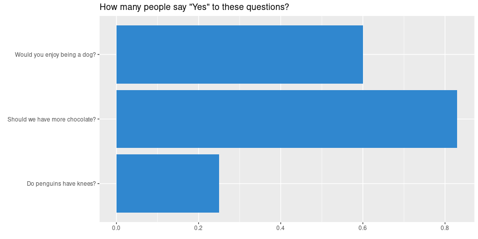
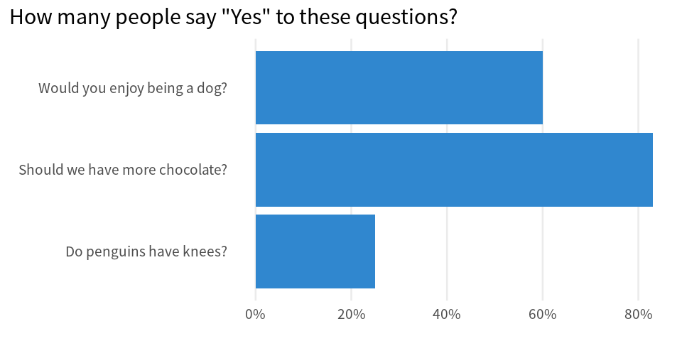
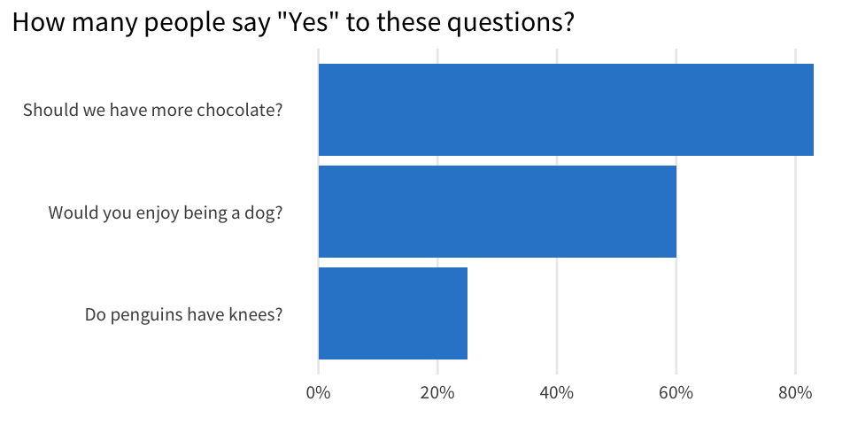
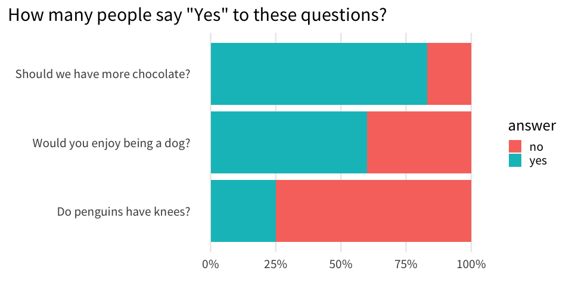
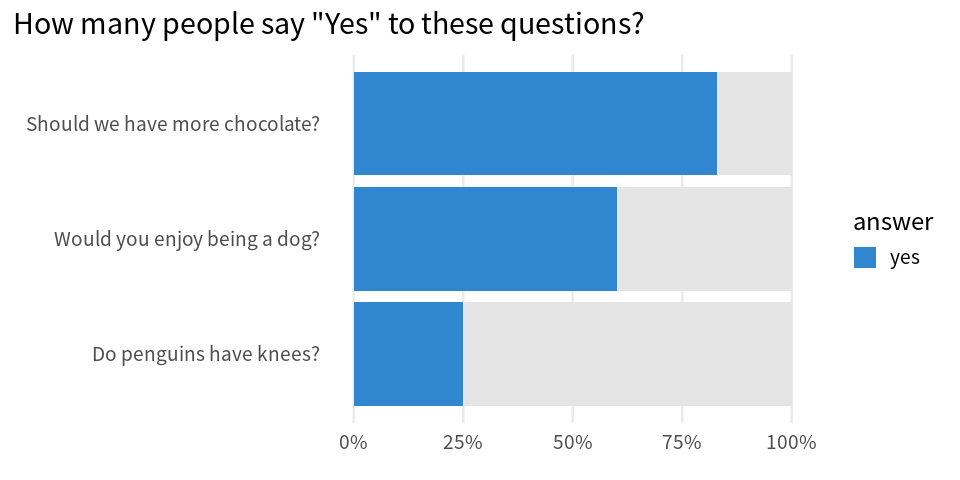

# Create Parts-of-a-Whole Bar Charts
Albert Rapp
2023-11-29

In our [consulting work](https://rfortherestofus.com/consulting), we often think about what could be a better visualization for our clients. And sometimes it’s really small tweaks. One example of this is adding a gray background behind bar charts to show percentages as a part of the whole. We did this, for example, in [reports about Connecticut housing](https://rfortherestofus.test/success-stories/pschousing).



To show how to make this in R, let’s start with a bar chart that represents the results of some absolutely fictitious survey.


It would be neat if we had another bar on top of each bar that goes all the way to 100%. This way, we could quickly see if a majority of people say “Yes” to a given question.



We could even add a vertical line at the 50% mark to make the majority more obvious. Check out how that looks and then let us build all of these charts.


## Build the standard bar chart

First, we need to have a data set. So, let’s create that on-the-fly using the `tribble()` function. It works just like `tibble()` but the way we include data points is a bit more readable in the code.

``` r
library(tidyverse)
questions <- tribble(
  ~question, ~yes_rate,
  'Should we have more chocolate?', 0.83,
  'Do penguins have knees?', 0.25,
  'Would you enjoy being a dog?', 0.6
)
```

Then, we can pass this to `ggplot` to create a bar chart.

``` r
first_bar_chart <- questions |> 
  ggplot(aes(y = question, x = yes_rate)) +
  geom_col(fill = '#3087CF') +
  labs(
    x = element_blank(), 
    y = element_blank(),
    title = 'How many people say "Yes" to these questions?'
  )
first_bar_chart
```



And using some of the tricks we have learned [in a previous blog post](https://rfortherestofus.com/2023/11/theme-minimal), we can make this chart look a little bit nicer.

``` r
themed_chart <- first_bar_chart +  
  theme_minimal(base_size = 20, base_family = 'Source Sans Pro') +
  theme(
    plot.title.position = 'plot',
    panel.grid.minor = element_blank(),
    panel.grid.major.y = element_blank()
  )  +
  scale_x_continuous(labels = scales::label_percent())
themed_chart
```



Notice that the bars are not sorted in ascending order. But as we have learned [a couple of weeks ago](https://rfortherestofus.com/2023/10/ggplot-order), we can modify the way things are sorted. We just have to modify the data that goes into `ggplot()`. Specifically, we need to convert the `y`-axis variable to a `factor` variable.

``` r
questions |> 
  mutate(question = fct_reorder(question, yes_rate)) |> 
  ggplot(aes(y = question, x = yes_rate)) +
  geom_col(fill = '#3087CF') +
  theme_minimal(base_size = 20, base_family = 'Source Sans Pro') +
  theme(
    plot.title.position = 'plot',
    panel.grid.minor = element_blank(),
    panel.grid.major.y = element_blank()
  ) +
  labs(
    x = element_blank(), 
    y = element_blank(),
    title = 'How many people say "Yes" to these questions?'
  ) +
  scale_x_continuous(labels = scales::label_percent())
```



Nice, this gives us the first bar chart that we have seen in this blog post. Time to add the grey parts on top of that.

## Compute and rearrange data

The first thing we need to do is to compute how many people actually said no. With `mutate()`, that’s a pretty straightforward calculation. Let’s just add another line to the `mutate()` call we already have anyway.

``` r
questions |> 
  mutate(
    no_rate = 1 - yes_rate,
    question = fct_reorder(question, yes_rate)
  ) 
#> # A tibble: 3 × 3
#>   question                       yes_rate no_rate
#>   <fct>                             <dbl>   <dbl>
#> 1 Should we have more chocolate?     0.83    0.17
#> 2 Do penguins have knees?            0.25    0.75
#> 3 Would you enjoy being a dog?       0.6     0.4
```

The question now becomes \*“How do be pass both, yes and no, to `ggplot()`?” The answer (as we’ve learned in [yet another blog post](https://rfortherestofus.com/2023/11/pivot-functions-advanced)) lies in rearranging the data. Specifically, we call `pivot_longer()` to rearrange the data like this:

``` r
complementary_rates <- questions |> 
  mutate(
    no_rate = 1 - yes_rate,
    question = fct_reorder(question, yes_rate)
  ) |> 
  pivot_longer(
    cols = -question,
    names_to = 'answer',
    names_pattern = '(.+)_rate',
    values_to = 'percentage'
  )
complementary_rates
#> # A tibble: 6 × 3
#>   question                       answer percentage
#>   <fct>                          <chr>       <dbl>
#> 1 Should we have more chocolate? yes          0.83
#> 2 Should we have more chocolate? no           0.17
#> 3 Do penguins have knees?        yes          0.25
#> 4 Do penguins have knees?        no           0.75
#> 5 Would you enjoy being a dog?   yes          0.6 
#> 6 Would you enjoy being a dog?   no           0.4
```

Just in case you don’t understand what `pivot_longer()` does, don’t worry. We have spilled out the details in [another blog post](https://rfortherestofus.com/2023/11/pivot-functions-advanced). You can read up on all the details later. For now, you can just enjoy the rest of this blog post here.

## Finish the plot

With our newly computed data set, we can basically reuse our `ggplot` code from before. We only have to make two adjustments:

- Map `x` to the new `percentage` column
- Map `fill` to the new \`answer column

``` r
complementary_rates |> 
  ggplot(aes(y = question, x = percentage, fill = answer)) +
  geom_col() +
  theme_minimal(base_size = 20, base_family = 'Source Sans Pro') +
  theme(
    plot.title.position = 'plot',
    panel.grid.minor = element_blank(),
    panel.grid.major.y = element_blank()
  ) +
  labs(
    x = element_blank(), 
    y = element_blank(),
    title = 'How many people say "Yes" to these questions?'
  ) +
  scale_x_continuous(labels = scales::label_percent()) 
```



This isn’t exactly what we were going for. Let’s start to add correct colors. The way to do that here is to add a `scale_fill_manual()` layer in which we only add a color for the “yes” category. The color for the “no” category can then be modified via `na.nalue`.

``` r
complementary_rates |> 
  ggplot(aes(y = question, x = percentage, fill = answer)) +
  geom_col() +
  theme_minimal(base_size = 20, base_family = 'Source Sans Pro') +
  theme(
    plot.title.position = 'plot',
    panel.grid.minor = element_blank(),
    panel.grid.major.y = element_blank()
  ) +
  labs(
    x = element_blank(), 
    y = element_blank(),
    title = 'How many people say "Yes" to these questions?'
  ) +
  scale_x_continuous(labels = scales::label_percent()) +
  scale_fill_manual(
    values = c('yes' = '#3087CF'),
    na.value = 'grey90'
  )
```



Now, all that’s left to do is to get rid of the legend. This can be done by setting `show.legend = FALSE` in `geom_col()`.

``` r
complementary_plot <- complementary_rates |> 
  ggplot(aes(y = question, x = percentage, fill = answer)) +
  geom_col(show.legend = FALSE) +
  theme_minimal(base_size = 20, base_family = 'Source Sans Pro') +
  theme(
    plot.title.position = 'plot',
    panel.grid.minor = element_blank(),
    panel.grid.major.y = element_blank()
  ) +
  labs(
    x = element_blank(), 
    y = element_blank(),
    title = 'How many people say "Yes" to these questions?'
  ) +
  scale_x_continuous(labels = scales::label_percent()) +
  scale_fill_manual(
    values = c('yes' = '#3087CF'),
    na.value = 'grey90'
  )
complementary_plot
```


## Add a vertical line

Finally, all that is left to do is add a vertical dashed line at the 50% mark. Luckily, this is only one extra layer in `ggplot`. Namely, we have to add a `geom_vline()`.

``` r
complementary_plot + 
  geom_vline(xintercept = 0.5, color = 'grey20', linetype = 2)
```


## Conclusion

Hooooray. We have successfully made our standard bar chart into a part-of-a-whole bar chart 🥳. Here, our work was supported by a couple of previous blog posts. Neat how everything falls together when you nail the basics, isn’t it?

In any case, don’t worry if some parts bamboozled you. Feel free to read up on all the tricky parts using the linked blog posts. Have a nice day and see you next week. 👋
