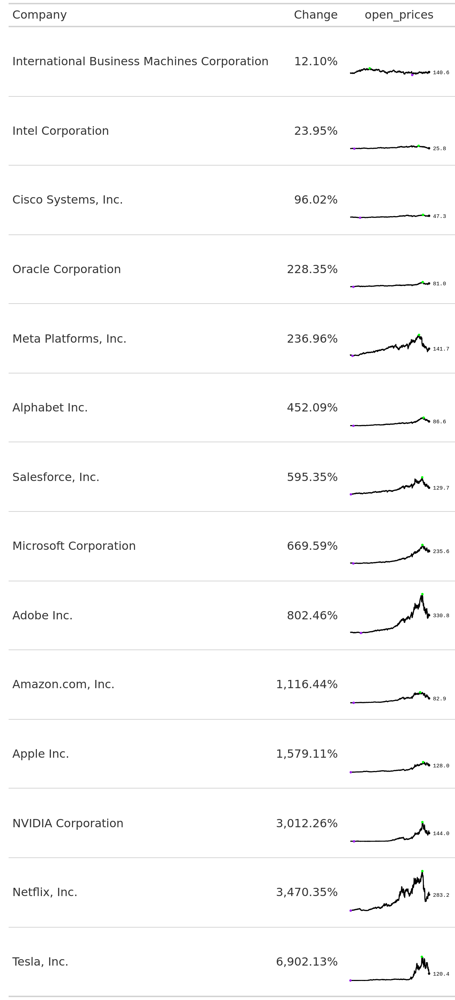
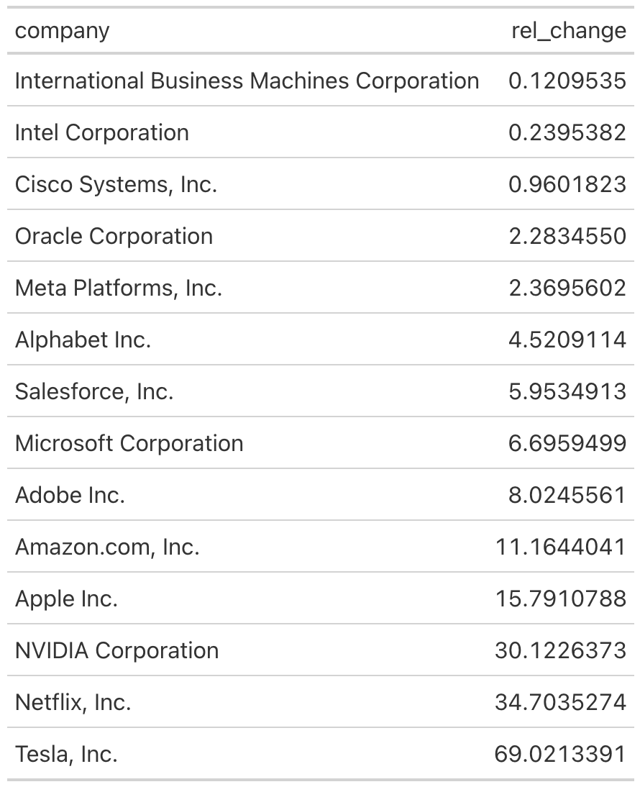
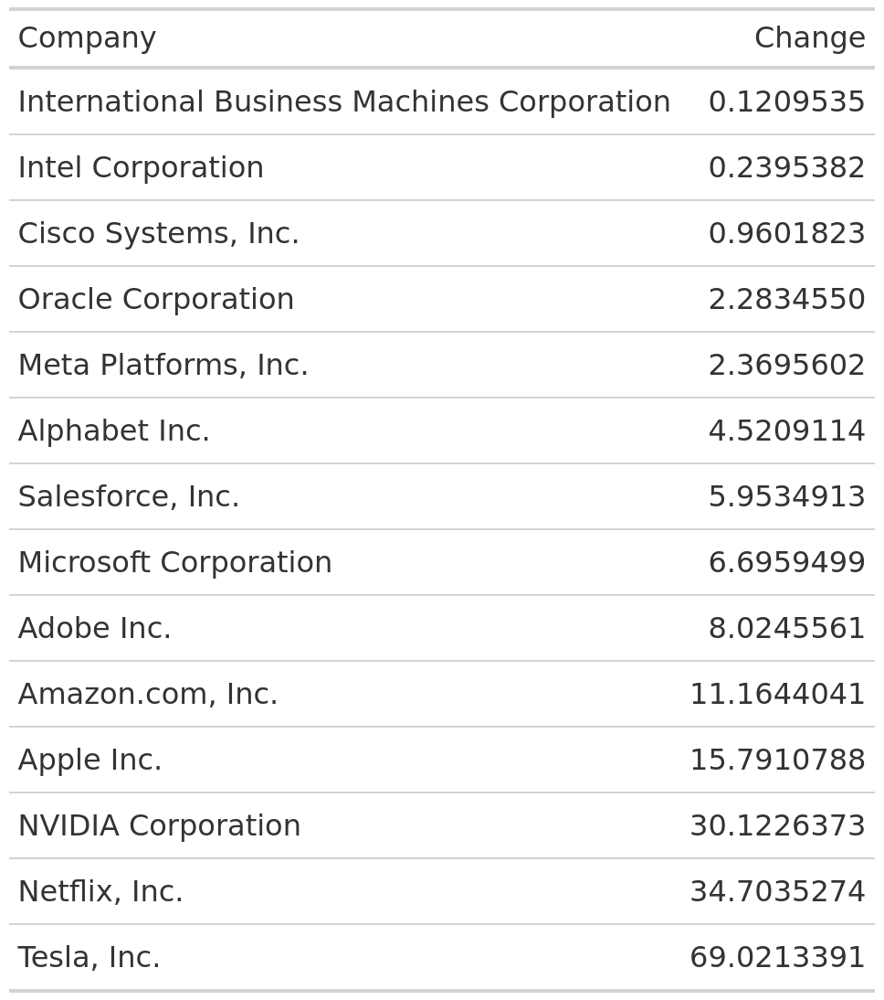
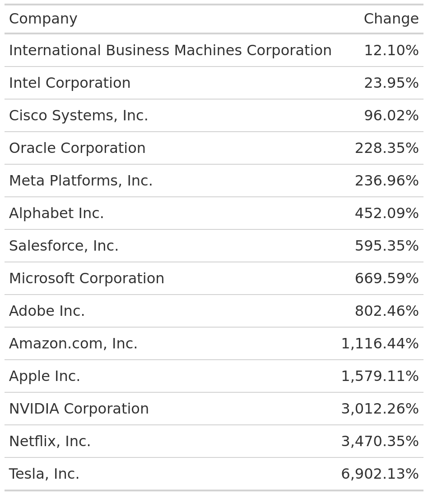
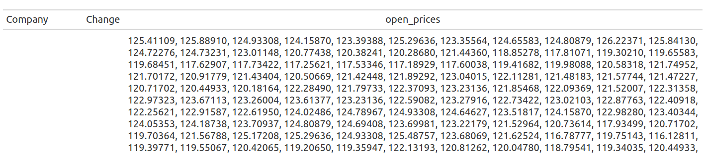
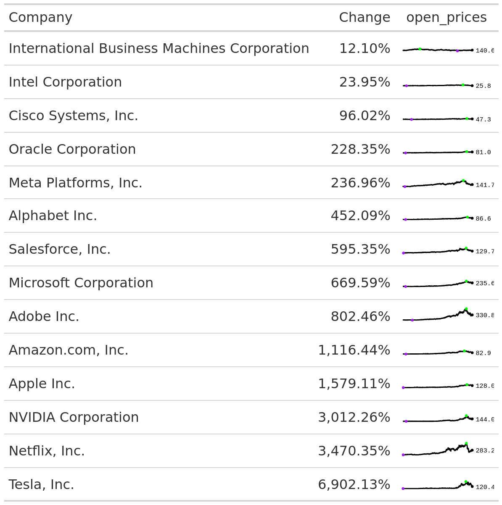

# How to add sparklines to a {gt} table
Albert Rapp
2024-02-14

Any table can be spiced up by adding small visual elements to it. Ideally, this makes the table more engaging *and* informative. One popular visual element that can get both jobs done is a **sparkline**.

These are little line charts in a table cell that can give you a miniature overview of a time series evolution over time. Sounds complicated? It probably becomes clear when you see it in action. Here, have a look:



See those little lines. They show you exactly how the open price of the stock prices evolved over time. Seeing this can give you more information on the volatility of a stock. And in `gt` it’s pretty easy to create such a line chart. Let me show you how.

## Grab the data

Let’s first grab the data that was used in the above table. In this case, the data comes from a [TidyTuesday challenge](https://github.com/rfordatascience/tidytuesday/blob/master/data/2023/2023-02-07/readme.md). This means we can download the data by executing this code chunk:

``` r
library(tidyverse)
big_tech_stock_prices <- readr::read_csv('https://raw.githubusercontent.com/rfordatascience/tidytuesday/master/data/2023/2023-02-07/big_tech_stock_prices.csv')

big_tech_stock_prices
#> # A tibble: 45,088 × 8
#>    stock_symbol date        open  high   low close adj_close    volume
#>    <chr>        <date>     <dbl> <dbl> <dbl> <dbl>     <dbl>     <dbl>
#>  1 AAPL         2010-01-04  7.62  7.66  7.58  7.64      6.52 493729600
#>  2 AAPL         2010-01-05  7.66  7.70  7.62  7.66      6.53 601904800
#>  3 AAPL         2010-01-06  7.66  7.69  7.53  7.53      6.42 552160000
#>  4 AAPL         2010-01-07  7.56  7.57  7.47  7.52      6.41 477131200
#>  5 AAPL         2010-01-08  7.51  7.57  7.47  7.57      6.45 447610800
#>  6 AAPL         2010-01-11  7.6   7.61  7.44  7.50      6.40 462229600
#>  7 AAPL         2010-01-12  7.47  7.49  7.37  7.42      6.32 594459600
#>  8 AAPL         2010-01-13  7.42  7.53  7.29  7.52      6.41 605892000
#>  9 AAPL         2010-01-14  7.50  7.52  7.46  7.48      6.38 432894000
#> 10 AAPL         2010-01-15  7.53  7.56  7.35  7.35      6.27 594067600
#> # ℹ 45,078 more rows
```

## Get company names

Unless you’re into stocks, you probably won’t know which companies the abbreviations in the `stock_symbol` represent. Thankfully, TidyTuesday also offers a dictionary for that. We can download it from GitHub as well.

``` r
big_tech_companies <- readr::read_csv('https://raw.githubusercontent.com/rfordatascience/tidytuesday/master/data/2023/2023-02-07/big_tech_companies.csv')
big_tech_companies
#> # A tibble: 14 × 2
#>    stock_symbol company                                    
#>    <chr>        <chr>                                      
#>  1 AAPL         Apple Inc.                                 
#>  2 ADBE         Adobe Inc.                                 
#>  3 AMZN         Amazon.com, Inc.                           
#>  4 CRM          Salesforce, Inc.                           
#>  5 CSCO         Cisco Systems, Inc.                        
#>  6 GOOGL        Alphabet Inc.                              
#>  7 IBM          International Business Machines Corporation
#>  8 INTC         Intel Corporation                          
#>  9 META         Meta Platforms, Inc.                       
#> 10 MSFT         Microsoft Corporation                      
#> 11 NFLX         Netflix, Inc.                              
#> 12 NVDA         NVIDIA Corporation                         
#> 13 ORCL         Oracle Corporation                         
#> 14 TSLA         Tesla, Inc.
```

Now, we can combine those two data sets so that we have everything in one place.

``` r
big_tech_stock_prices |> 
  left_join(big_tech_companies, by = 'stock_symbol')
#> # A tibble: 45,088 × 9
#>    stock_symbol date        open  high   low close adj_close    volume company  
#>    <chr>        <date>     <dbl> <dbl> <dbl> <dbl>     <dbl>     <dbl> <chr>    
#>  1 AAPL         2010-01-04  7.62  7.66  7.58  7.64      6.52 493729600 Apple In…
#>  2 AAPL         2010-01-05  7.66  7.70  7.62  7.66      6.53 601904800 Apple In…
#>  3 AAPL         2010-01-06  7.66  7.69  7.53  7.53      6.42 552160000 Apple In…
#>  4 AAPL         2010-01-07  7.56  7.57  7.47  7.52      6.41 477131200 Apple In…
#>  5 AAPL         2010-01-08  7.51  7.57  7.47  7.57      6.45 447610800 Apple In…
#>  6 AAPL         2010-01-11  7.6   7.61  7.44  7.50      6.40 462229600 Apple In…
#>  7 AAPL         2010-01-12  7.47  7.49  7.37  7.42      6.32 594459600 Apple In…
#>  8 AAPL         2010-01-13  7.42  7.53  7.29  7.52      6.41 605892000 Apple In…
#>  9 AAPL         2010-01-14  7.50  7.52  7.46  7.48      6.38 432894000 Apple In…
#> 10 AAPL         2010-01-15  7.53  7.56  7.35  7.35      6.27 594067600 Apple In…
#> # ℹ 45,078 more rows
```

Actually, we don’t need all of that data. Let’s just focus on the company names, the dates and the open prices.

``` r
open_prices_over_time <- big_tech_stock_prices |> 
  left_join(big_tech_companies, by = 'stock_symbol') |> 
  select(company, date, open)
open_prices_over_time
#> # A tibble: 45,088 × 3
#>    company    date        open
#>    <chr>      <date>     <dbl>
#>  1 Apple Inc. 2010-01-04  7.62
#>  2 Apple Inc. 2010-01-05  7.66
#>  3 Apple Inc. 2010-01-06  7.66
#>  4 Apple Inc. 2010-01-07  7.56
#>  5 Apple Inc. 2010-01-08  7.51
#>  6 Apple Inc. 2010-01-11  7.6 
#>  7 Apple Inc. 2010-01-12  7.47
#>  8 Apple Inc. 2010-01-13  7.42
#>  9 Apple Inc. 2010-01-14  7.50
#> 10 Apple Inc. 2010-01-15  7.53
#> # ℹ 45,078 more rows
```

## Summarize the data

Currently, the data set has ~45,000 rows. That’s way too big for a table. So let’s summarize that. Maybe we could just look how much each stock price increased from the earliest to the latest record in the data set. That could be interesting.

``` r
rel_changes <- open_prices_over_time |> 
  arrange(date) |> 
  summarize(
    rel_change = open[length(open)] / open[1] - 1,
    .by = company
  ) |> 
  arrange(rel_change)
rel_changes
#> # A tibble: 14 × 2
#>    company                                     rel_change
#>    <chr>                                            <dbl>
#>  1 International Business Machines Corporation      0.121
#>  2 Intel Corporation                                0.240
#>  3 Cisco Systems, Inc.                              0.960
#>  4 Oracle Corporation                               2.28 
#>  5 Meta Platforms, Inc.                             2.37 
#>  6 Alphabet Inc.                                    4.52 
#>  7 Salesforce, Inc.                                 5.95 
#>  8 Microsoft Corporation                            6.70 
#>  9 Adobe Inc.                                       8.02 
#> 10 Amazon.com, Inc.                                11.2  
#> 11 Apple Inc.                                      15.8  
#> 12 NVIDIA Corporation                              30.1  
#> 13 Netflix, Inc.                                   34.7  
#> 14 Tesla, Inc.                                     69.0
```

Oh wow. Some stock prices increased by up to 6900%. That’s wild. Let’s put this into a table.

## Get data into a `gt` table

With `gt` it is pretty straight-forward to create a table. Just load the package and then pass your data set to the `gt()` function.

``` r
library(gt)

rel_changes |> 
  gt()
```



Right now, the column labels do not look that nice. Let’s change those to something more meaningful.

``` r
rel_changes |> 
  gt() |> 
  cols_label(
    company = 'Company',
    rel_change = 'Change'
  )
```



This looks a bit better. But to make sure that people understand that the second column means relative change, we might want to use percent labels in that column. No problem. The `fmt_percent()` function will do that for us.

``` r
rel_changes |> 
  gt() |> 
  cols_label(
    company = 'Company',
    rel_change = 'Change'
  ) |> 
  fmt_percent(columns = rel_change)
```



Cool! Much better. Of course, there’s still lots more to be done to [make this table great](https://rfortherestofus.com/courses/tables). But let’s leave that aside and focus on the sparklines.

## Get more information into the data set

To create the sparklines, we first need to get the data for that into the tibble that is passed to `gt()`. After all, how else is `gt()` supposed to know how the sparklines should look. So let’s modify the `rel_changes` data set to incorporate another column.

``` r
rel_changes <- open_prices_over_time |> 
  arrange(date) |> 
  summarize(
    rel_change = open[length(open)] / open[1] - 1,
    open_prices = list(open), # Add this line
    .by = company
  ) |> 
  arrange(rel_change)
rel_changes
#> # A tibble: 14 × 3
#>    company                                     rel_change open_prices  
#>    <chr>                                            <dbl> <list>       
#>  1 International Business Machines Corporation      0.121 <dbl [3,271]>
#>  2 Intel Corporation                                0.240 <dbl [3,271]>
#>  3 Cisco Systems, Inc.                              0.960 <dbl [3,271]>
#>  4 Oracle Corporation                               2.28  <dbl [3,271]>
#>  5 Meta Platforms, Inc.                             2.37  <dbl [2,688]>
#>  6 Alphabet Inc.                                    4.52  <dbl [3,271]>
#>  7 Salesforce, Inc.                                 5.95  <dbl [3,271]>
#>  8 Microsoft Corporation                            6.70  <dbl [3,271]>
#>  9 Adobe Inc.                                       8.02  <dbl [3,271]>
#> 10 Amazon.com, Inc.                                11.2   <dbl [3,271]>
#> 11 Apple Inc.                                      15.8   <dbl [3,271]>
#> 12 NVIDIA Corporation                              30.1   <dbl [3,271]>
#> 13 Netflix, Inc.                                   34.7   <dbl [3,271]>
#> 14 Tesla, Inc.                                     69.0   <dbl [3,148]>
```

Notice how we were able to get all of the open prices into one cell via the `list()` function in `summarize()`. Pretty cool, isn’t it? Now, we could pass this to data set to `gt()` like before.

``` r
rel_changes |> 
  gt() |> 
  cols_label(
    company = 'Company',
    rel_change = 'Change'
  ) |> 
  fmt_percent(columns = rel_change)
```

But if we did that, then all of the numbers would just be thrown into the table. That would be pretty terrible. Here’s how the first few rows of the new table would look.



## Lines instead of numbers

To overcome this, let’s just tell `gt()` to make a line out of those numbers. Thankfully, another package, namely `gtExtras`, makes that pretty easy for us. All we need is the function `gt_plt_sparkline()` from that package.

``` r
rel_changes |> 
  gt() |> 
  cols_label(
    company = 'Company',
    rel_change = 'Change'
  ) |> 
  fmt_percent(columns = rel_change) |> 
  gtExtras::gt_plt_sparkline(column = open_prices)
```



That looks a little bit flat. We can make out that much. With the `fig_dim` argument, we can make the line charts a little bit larger.

``` r
rel_changes |> 
  gt() |> 
  cols_label(
    company = 'Company',
    rel_change = 'Change'
  ) |> 
  fmt_percent(columns = rel_change) |> 
  gtExtras::gt_plt_sparkline(
    column = open_prices,
    fig_dim = c(20, 40)
  )
```


Ah that’s better. We can now see that some of these stocks had really huge jumps.

## Conclusion

Nice, we have learned a quick way to add spark lines to our tables. 🥳 Clearly, one could customize this chart further. But that would bring us into realm where we have to combine `ggplot2` and `gt` to add custom charts to the table. That would be a bit much to do here as well. But you can check out our [other blog post](https://rfortherestofus.com/2023/10/ggplots-in-gt-tables) that teaches you just that if you’re curious. Enjoy the rest of your day and see you next time 👋.
