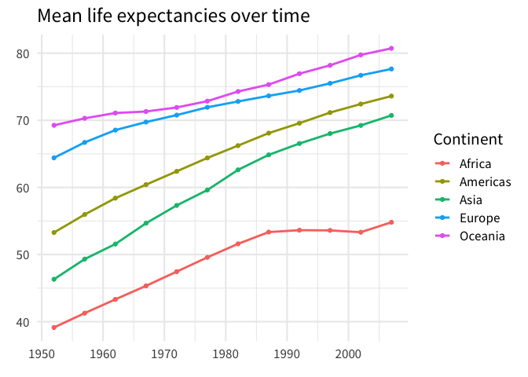
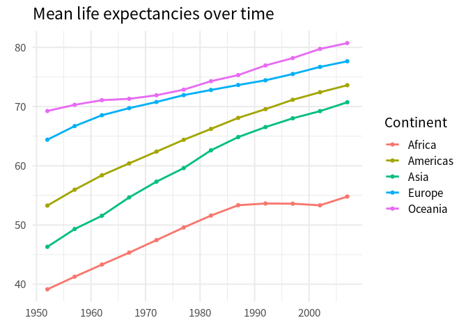

# How to know if your data is tidy
Albert Rapp
2024-03-13

One of the most frequent questions we get when we teach R is *“How do I know if my data is in a tidy format?”* Rightfully so. [Tidy data](https://tidyr.tidyverse.org/articles/tidy-data.html) is a powerful concept and I remember asking myself the exact same questions when I first learned about tidy data. So to help you answer this question, let me give you **an** answer to this question that eventually helped me and made my life easier. But beware: You might find the answer a little bit unintuitive at first.

## Forget about tidy data

Yup, that’s right. Forget about tidy data. That’s my answer. *“Hold on, why?”*, I can already hear you say. Well, the thing isn’t that there’s no place for knowing tidy data as a concept. But I don’t want you to get paralyzed by it. Instead, I propose to appreciate the theoretical foundation that is tidy data and take a more utilitarian approach for your day-to-day work.

## A better question

Instead of asking *“Is my data tidy?”*, ask yourself *“What do I want to do with my data? And how can I get my tools to achieve that with this data?”* Let’s make this more explicit with an example. Here’s a data set that might be considered untidy.

``` r
continent_mean_life_exps
#> # A tibble: 5 × 13
#>   continent year_1952 year_1957 year_1962 year_1967 year_1972 year_1977
#>   <fct>         <dbl>     <dbl>     <dbl>     <dbl>     <dbl>     <dbl>
#> 1 Asia           46.3      49.3      51.6      54.7      57.3      59.6
#> 2 Europe         64.4      66.7      68.5      69.7      70.8      71.9
#> 3 Africa         39.1      41.3      43.3      45.3      47.5      49.6
#> 4 Americas       53.3      56.0      58.4      60.4      62.4      64.4
#> 5 Oceania        69.3      70.3      71.1      71.3      71.9      72.9
#> # ℹ 6 more variables: year_1982 <dbl>, year_1987 <dbl>, year_1992 <dbl>,
#> #   year_1997 <dbl>, year_2002 <dbl>, year_2007 <dbl>
```

This data shows us the mean life expectancies of countries from different continents in various years. For now, let us ignore where `continent_mean_life_exps` comes from and how it was computed. Let’s rather think about what we might do with this. For example, a line chart like this could be nice.



As soon as we have a goal in mind, we can think about what to do. Here, we would have to call `ggplot()` and map some data columns to aesthetics in the `aes()` call. Let’s see. On the `x`-axis we want to have year labels. Do we have something like that in our data set? Well, yes. In the column names. But those year labels are spread out over multiple columns. That won’t fly with `ggplot`. We will have to work something out here.

Similarly, what we have on the `y`-axis are mean life expectancies. Do we have something like that in our data set? Well, yes. In the cells of all but the first column. Once again, what we want to pass to an aesthetic is spread out over multiple columns. That won’t fly with `ggplot`. We will have to work something out here.

At this point, it becomes clear: Our obstacle to getting `ggplot` to do what we want is that the data is not in the format that `ggplot` likes. Not by coincidence this means that the data is not tidy. But at this point? Who cares about that “tidy” label? We want to create a chart and we want `ggplot` to do it. So let’s rather focus on a solution than on some label.

Here, that solution is to rearrange the data. This means that

- the column names of `continent_mean_life_exps` should go into one column, say, `year` and
- all the values from all but the first column should move into another column, say, `mean_life_exp`.

And with a little bit of magic from `pivot_longer()` we can do that. Check it out. (And don’t worry about the details of `pivot_longer()`. We have [another blog post](https://rfortherestofus.com/2023/11/pivot-functions) to help you with that. Let’s just focus on this tidy data thing for now.)

``` r
dat_rearranged <- continent_mean_life_exps |> 
  pivot_longer(
    cols = -continent,
    names_to = 'year', 
    names_prefix = 'year_',
    names_transform = as.numeric
  )
dat_rearranged
#> # A tibble: 60 × 3
#>    continent  year value
#>    <fct>     <dbl> <dbl>
#>  1 Asia       1952  46.3
#>  2 Asia       1957  49.3
#>  3 Asia       1962  51.6
#>  4 Asia       1967  54.7
#>  5 Asia       1972  57.3
#>  6 Asia       1977  59.6
#>  7 Asia       1982  62.6
#>  8 Asia       1987  64.9
#>  9 Asia       1992  66.5
#> 10 Asia       1997  68.0
#> # ℹ 50 more rows
```

Aha! That’s tidy data. Why? Because it’s in the format that we need to get our job done. That’s my definition of tidy(in more practical terms.)

``` r
dat_rearranged  |> 
  ggplot(aes(year, value, color = continent)) +
  geom_line(linewidth = 1) +
  geom_point() +
  theme_minimal(base_size = 16, base_family = 'Source Sans Pro') +
  labs(
    x = element_blank(),
    y = element_blank(),
    color = 'Continent',
    title = 'Mean life expectancies over time'
  )
```



## Is tidy data useless?

I hope that you can see that it’s no use to worry too much about whether a data set is tidy. Tidy data is an abstract concept. And in practical terms it will rarely deliver much value to think about whether this abstract concept is fulfilled. (Unless you’re responsible for things like setting up a database. Then by all means think about what’s the best concept to store data.)

But does that mean that tidy data is useless? Of course not. After all, this concept is the theoretical underpinning of the tidyverse. It is at the core of all our amazing tools from the tidyverse. But it’s no use getting paralyzed by the concept. Especially as a beginner.

Think about it this way: You have probably learned at an early age that $1 + 1 = 2$. And then adding one of top of that equals $3$. And after that comes $4$. And so on.

Cool. You know how numbers work. You can always add a 1 to any number and there’s a number that represents the result. The fact that this works is at its core an abstract concept.

But does this help you to calculate $123 + 67$? I doubt that you stop to think *“Hold on. Is this even possible? Is this set up right?”* You probably just do the number crunching to get the job done.

And by now I hope that you can appreciate that we should to the same thing when it comes to “tidy” data. Just like with adding numbers, it’s nice that there is some theory that ensures that things just work. But in the day-to-day (and in particular as you get more comfortable with your tools) you just do the steps to get the result.

## Conclusion

Hopefully, this gives you a new perspective on thinking really hard about whether a data set is tidy. If anything, I hope this frees up some mental capacity for you to rather focus on mastering the tools like `ggplot()`. Once these tools become second nature, worries about tidy data should fade away. Have a nice day and see you next time. 👋
