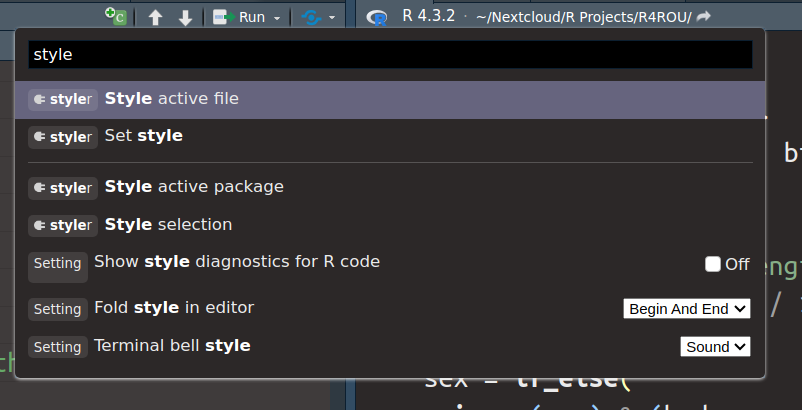
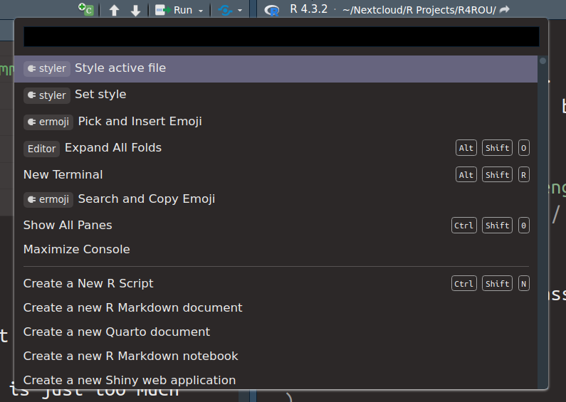
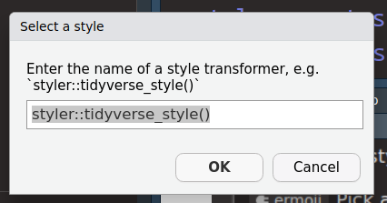

# Let the {styler} package help you reformat your code
Albert Rapp
2024-03-27

The [tidyverse style guide](https://style.tidyverse.org/) offers many helpful suggestions for how to write your code. Of course, the style guide is very opinionated as all style guides usually are. Still, [in our R courses](https://rfortherestofus.com/courses) we try to adhere to the tidyverse style guide as much as possible because we believe that this makes for pretty legible code.

Now, even as seasoned tidyverse users, we sometimes mess up our code structure. This is just a normal thing that happenes to everyone. So to save some time trying to fix the mistakes, it’s best to use some tools. One such tool is the [`styler` package](https://styler.r-lib.org/). Let’s have a look how it works.

# A formatted example first

Before we use `styler` let’s have look at what kind of result we’re going for. Here, we have a small pipe chain that uses `select()`, `mutate()` and `across()`.

``` r
library(tidyverse)
palmerpenguins::penguins |>
  select(flipper_length_mm, bill_length_mm, sex) |> 
  mutate(
    across(
      .cols = c("flipper_length_mm", "bill_length_mm"),
      .fns = function(x) x / 10
    ),
    sex = if_else(is.na(sex), 'unknown', sex)
  ) 
#> # A tibble: 344 × 3
#>    flipper_length_mm bill_length_mm sex    
#>                <dbl>          <dbl> <chr>  
#>  1              18.1           3.91 male   
#>  2              18.6           3.95 female 
#>  3              19.5           4.03 female 
#>  4              NA            NA    unknown
#>  5              19.3           3.67 female 
#>  6              19             3.93 male   
#>  7              18.1           3.89 female 
#>  8              19.5           3.92 male   
#>  9              19.3           3.41 unknown
#> 10              19             4.2  unknown
#> # ℹ 334 more rows
```

Basically, this transforms the two columns `flipper_length_mm` and `bill_length_mm` by applying the function `\(x) x / 10` on them. This means that all numbers in those two columns get divided by ten. Also, the missing values in the `sex` column get replaced by the word “unknown”.

Clearly, these aren’t very exciting calculations. But the point of this blog post is more about how the code is structured. Notice a couple of things in this particular code chunk:

- There’s a line break after the pipe `|>`, `mutate()`, `across()` and `),`
- Each argument (`.cols` and `.fns`) in `across()` gets its own line.
- There are spaces after commas
- There are spaces before and after operators such as `=` and `/`

All of this is in compliance with the tidyverse style guide and makes for legible code. Watch how the same code looks when we leave out the white spaces and line breaks in `across()`.

``` r
library(tidyverse)
palmerpenguins::penguins |>
  select(flipper_length_mm,bill_length_mm,sex) |> 
  mutate(
    across(.cols=c("flipper_length_mm","bill_length_mm"),.fns=function(x) x/10),
    sex=if_else(is.na(sex),'unknown',sex)
  ) 
#> # A tibble: 344 × 3
#>    flipper_length_mm bill_length_mm sex    
#>                <dbl>          <dbl> <chr>  
#>  1              18.1           3.91 male   
#>  2              18.6           3.95 female 
#>  3              19.5           4.03 female 
#>  4              NA            NA    unknown
#>  5              19.3           3.67 female 
#>  6              19             3.93 male   
#>  7              18.1           3.89 female 
#>  8              19.5           3.92 male   
#>  9              19.3           3.41 unknown
#> 10              19             4.2  unknown
#> # ℹ 334 more rows
```

It starts to look more like a block of text, right? That’s not very legible code. In general, you want to make code skimmable. You rarely want to read code like a book where you read lines from left to right one after the other. Instead, you usually want to jump into the parts of the code that are of interest to you.

Hence, a block structure makes sense for a book but not for code. Instead, try to stretch out bits and pieces with extra spaces and over multiple lines. And at an absolute bare minimum do a line break after pipe steps. (We didn’t even show you the terrible version that does not include line breaks after `|>`. We don’t want you to get any bad ideas.)

# Let clean up our code

Now, let’s see how the `styler` package can help us clean our code. For example, let’s take our bad code and try to get it into a nice shape again. To do so, install the `styler` package with `install.packages('styler')`. Once, you’ve done that, we can apply the `style_text()` function from that package on our bad code.

``` r
styler::style_text(
  "library(tidyverse)
palmerpenguins::penguins |>
  select(flipper_length_mm,bill_length_mm,sex) |> 
  mutate(
    across(.cols=c('flipper_length_mm','bill_length_mm'),.fns=function(x) x/10),
    sex=if_else(is.na(sex),'unknown',sex)
  )"
)
#> library(tidyverse)
#> palmerpenguins::penguins |>
#>   select(flipper_length_mm, bill_length_mm, sex) |>
#>   mutate(
#>     across(.cols = c("flipper_length_mm", "bill_length_mm"), .fns = function(x) x / 10),
#>     sex = if_else(is.na(sex), "unknown", sex)
#>   )
```

Nice. This inserted the white spaces for us. Unfortunately, this didn’t help us to add line breaks for the arguments in `across()`. That’s too bad. But the nice thing is that inserting line breaks is super easy. What’s time consuming is to reindent everything and match closing parantheses to their openings. Have a look how this looks with a line break manually inserted.

``` r
library(tidyverse)
palmerpenguins::penguins |>
  select(flipper_length_mm, bill_length_mm, sex) |>
  mutate(
    across(.cols = c("flipper_length_mm", "bill_length_mm"), 
           .fns = function(x) x / 10),
    sex = if_else(is.na(sex), "unknown", sex)
  )
```

This isn’t too bad. But the inconsistent indentations will drive me crazy. Thankfully, at this stage `styler` can do the rest for us.

``` r
styler::style_text(
  "library(tidyverse)
palmerpenguins::penguins |>
  select(flipper_length_mm, bill_length_mm, sex) |>
  mutate(
    across(.cols = c('flipper_length_mm', 'bill_length_mm'), 
           .fns = function(x) x / 10),
    sex = if_else(is.na(sex), 'unknown', sex)
  )"
)
#> library(tidyverse)
#> palmerpenguins::penguins |>
#>   select(flipper_length_mm, bill_length_mm, sex) |>
#>   mutate(
#>     across(
#>       .cols = c("flipper_length_mm", "bill_length_mm"),
#>       .fns = function(x) x / 10
#>     ),
#>     sex = if_else(is.na(sex), "unknown", sex)
#>   )
```

Very nice! This does the rest for us. Personally, I run into situations like these all the time. I have code like this that’s already neat and then I change stuff. For example, I could add more conditions to the `if_else()` function.

``` r
library(tidyverse)
palmerpenguins::penguins |>
  select(flipper_length_mm, bill_length_mm, sex) |>
  mutate(
    across(
      .cols = c("flipper_length_mm", "bill_length_mm"),
      .fns = function(x) x / 10
    ),
    sex = if_else(is.na(sex) & (body_mass_g > 3000) & (flipper_length_mm <= 30), "unknown", sex)
  )
```

Now the condition is fairly long. So it’s probably best to add line breaks manually and let `styler` do the rest.

``` r
styler::style_text(
  "library(tidyverse)
palmerpenguins::penguins |>
  select(flipper_length_mm, bill_length_mm, sex) |>
  mutate(
    across(.cols = c('flipper_length_mm', 'bill_length_mm'), 
           .fns = function(x) x / 10),
    sex = if_else(
is.na(sex) & (body_mass_g > 3000) & (flipper_length_mm <= 30),
'unknown', 
sex)
  )"
)
#> library(tidyverse)
#> palmerpenguins::penguins |>
#>   select(flipper_length_mm, bill_length_mm, sex) |>
#>   mutate(
#>     across(
#>       .cols = c("flipper_length_mm", "bill_length_mm"),
#>       .fns = function(x) x / 10
#>     ),
#>     sex = if_else(
#>       is.na(sex) & (body_mass_g > 3000) & (flipper_length_mm <= 30),
#>       "unknown",
#>       sex
#>     )
#>   )
```

## How to use `styler` in RStudio

Now that we know how `styler` works, we want to incorporate it nicely into our workflow. Copying and pasting code into `styler::style_text()` is just too much effort. But the cool thing is that you can apply code formatting in RStudio without touching your initial code. The way to do that is to execute the *“Style active file”* command. The easiest way to do that is to press `ctrl/cmd` + `shift` + `P` and then type in “style”. From there, you can select the correct command from a dropdown menu.



And once you execute this command, it will show up in your most recent commands. So you don’t even have to type out “style” anymore. Here’s how my command palette looks at the start when I press `ctrl` + `shift` + `P`. The desired command is right at the top.



When you do this the first time, `styler` may ask you to set a style. Just use the “Set style” command from the command palette. And insert the default tidyverse style with `styler::tidyverse_style()`.



## Conclusion

I hope that helps you avoid some pain when you’re re-formatting code. As you have seen, `styler` can’t take all work from you (since you have to insert line breaks). But it least takes the most tedious parts away. And within RStudio it’s really easy to execute it on the fly. Happy coding and see you next time 👋.
