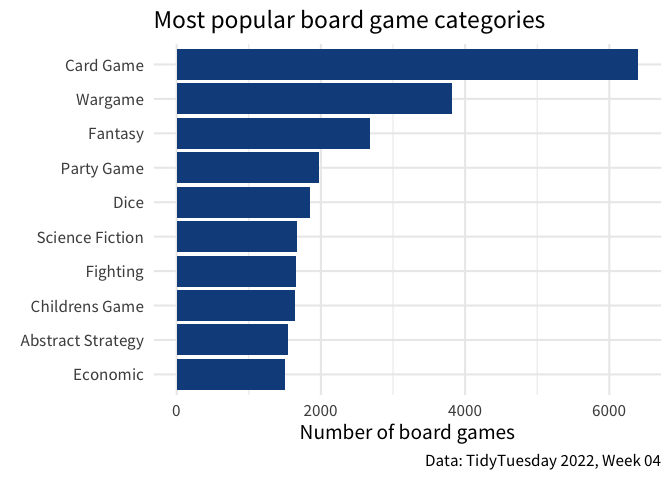

# How to separate a single column into multiple ones
Albert Rapp
2024-04-10

<!-- Reference to an R4ROU project -->

Every now and then it happens that a lot of information is crunched into one column. For example, take a look at this data about board games from [tidyTuesday](https://github.com/rfordatascience/tidytuesday/blob/master/data/2022/2022-01-25/readme.md).

``` r
library(tidyverse)
details <- readr::read_csv("https://raw.githubusercontent.com/rfordatascience/tidytuesday/master/data/2022/2022-01-25/details.csv")

board_games <- details |>
  select(id, name = primary, boardgamecategory)
board_games
#> # A tibble: 21,631 × 3
#>        id name              boardgamecategory                                   
#>     <dbl> <chr>             <chr>                                               
#>  1  30549 Pandemic          ['Medical']                                         
#>  2    822 Carcassonne       ['City Building', 'Medieval', 'Territory Building'] 
#>  3     13 Catan             ['Economic', 'Negotiation']                         
#>  4  68448 7 Wonders         ['Ancient', 'Card Game', 'City Building', 'Civiliza…
#>  5  36218 Dominion          ['Card Game', 'Medieval']                           
#>  6   9209 Ticket to Ride    ['Trains']                                          
#>  7 178900 Codenames         ['Card Game', 'Deduction', 'Party Game', 'Spies/Sec…
#>  8 167791 Terraforming Mars ['Economic', 'Environmental', 'Industry / Manufactu…
#>  9 173346 7 Wonders Duel    ['Ancient', 'Card Game', 'City Building', 'Civiliza…
#> 10  31260 Agricola          ['Animals', 'Economic', 'Farming']                  
#> # ℹ 21,621 more rows
```

Notice how the column of `boardgamecategory` contains a lot of labels. These labels represent all of the different categories a board game can fall into. Now, if we wanted to visualize the most popular board game categories, we might make a chart like this:


But the question becomes: How do we count the board game categories if all of them are stuck in one column? Let’s find out in this blog post.

## Use `separate_*` functions

The easiest way to split up columns is using one of the `separate_*` functions. There are six of them:

- Split by delimiter (e.g. comma)
  - `separate_wider_delim()`
  - `separate_longer_delim()`
- Split by fixed width
  - `separate_wider_position()`
  - `separate_longer_position()`
- Split by matches from regular expression (powerful but very advanced)
  - `separate_wider_regex()`
  - `separate_longer_regex()`

In this blog post, we’re going do focus on the first set (splitting by delimiter.) These are the easiest to handle. For example, in our data set we can see that all of the board categories are split by comma + one white space. In case you forgot, here’s the data again:

``` r
board_games
#> # A tibble: 21,631 × 3
#>        id name              boardgamecategory                                   
#>     <dbl> <chr>             <chr>                                               
#>  1  30549 Pandemic          ['Medical']                                         
#>  2    822 Carcassonne       ['City Building', 'Medieval', 'Territory Building'] 
#>  3     13 Catan             ['Economic', 'Negotiation']                         
#>  4  68448 7 Wonders         ['Ancient', 'Card Game', 'City Building', 'Civiliza…
#>  5  36218 Dominion          ['Card Game', 'Medieval']                           
#>  6   9209 Ticket to Ride    ['Trains']                                          
#>  7 178900 Codenames         ['Card Game', 'Deduction', 'Party Game', 'Spies/Sec…
#>  8 167791 Terraforming Mars ['Economic', 'Environmental', 'Industry / Manufactu…
#>  9 173346 7 Wonders Duel    ['Ancient', 'Card Game', 'City Building', 'Civiliza…
#> 10  31260 Agricola          ['Animals', 'Economic', 'Farming']                  
#> # ℹ 21,621 more rows
```

So we can pass the data set to `separate_longer_delim()` and tell it to

- target the column `boardgamecategory` while
- using `,` (include a white space) as delimiter.

``` r
board_games |>
  separate_longer_delim(cols = boardgamecategory, delim = ", ")
#> # A tibble: 56,915 × 3
#>       id name        boardgamecategory    
#>    <dbl> <chr>       <chr>                
#>  1 30549 Pandemic    ['Medical']          
#>  2   822 Carcassonne ['City Building'     
#>  3   822 Carcassonne 'Medieval'           
#>  4   822 Carcassonne 'Territory Building']
#>  5    13 Catan       ['Economic'          
#>  6    13 Catan       'Negotiation']       
#>  7 68448 7 Wonders   ['Ancient'           
#>  8 68448 7 Wonders   'Card Game'          
#>  9 68448 7 Wonders   'City Building'      
#> 10 68448 7 Wonders   'Civilization'       
#> # ℹ 56,905 more rows
```

Nice! This split up the things nicely. But there are still the annoying backticks `'` and brackets `[`, `]`. We can remove those by using `str_remove_all()`. But this requires regular expressions (which are an incredibly powerful but tricky tool). Luckily, there’s an easy way to circumvent that.

Instead of removing things, we can replace the unwanted characters with nothing. What sounds super philosophical really means that I want to use `str_replace_all()`. Why? Because in this function I can simply create a named vector where

- the names are the things I want to replace and
- the values are the things I want to insert instead.

Here’s how that looks.

``` r
rearranged_dat <- board_games |>
  separate_longer_delim(cols = boardgamecategory, delim = ", ") |>
  mutate(
    boardgamecategory = str_replace_all(
      boardgamecategory,
      c(
        # pattern_to_replace = replacement
        `[` = "",
        `]` = "",
        `"` = "",
        `'` = ""
      ) |> coll()
    )
  )
rearranged_dat
#> # A tibble: 56,915 × 3
#>       id name        boardgamecategory 
#>    <dbl> <chr>       <chr>             
#>  1 30549 Pandemic    Medical           
#>  2   822 Carcassonne City Building     
#>  3   822 Carcassonne Medieval          
#>  4   822 Carcassonne Territory Building
#>  5    13 Catan       Economic          
#>  6    13 Catan       Negotiation       
#>  7 68448 7 Wonders   Ancient           
#>  8 68448 7 Wonders   Card Game         
#>  9 68448 7 Wonders   City Building     
#> 10 68448 7 Wonders   Civilization      
#> # ℹ 56,905 more rows
```

Notice two things here:

1.  We have to wrap the names in backticks because all of the things we want to replace are special characters and R doesn’t like them in vector names if they’re not in backticks

2.  We had to apply the `coll()` function to tell `str_replace_all()` that what we use as replacement dictionary should be treated as is. You see, all of the special characters are also used in regular expressions. `coll()` tells `str_replace_all()` that we explicitly do not want to use regular expressions.

All of this may be a bit tedious but it’s sure less tediuous than working with `str_remove_all()` and regular expressions. In any case, we have successfully cleaned up our data and we could now visualize it:

``` r
# Count categories and get only ten largest categories
counts <- rearranged_dat |>
  count(boardgamecategory, sort = TRUE) |>
  slice(1:10)

counts |>
  ggplot(aes(x = n, y = fct_reorder(boardgamecategory, n))) +
  geom_col(fill = "dodgerblue4") +
  theme_minimal(base_size = 16, base_family = "Source Sans Pro") +
  labs(
    x = "Number of board games",
    y = element_blank(),
    title = "Most popular board game categories",
    caption = "Data: TidyTuesday 2022, Week 04"
  )
```



## Make it wider instead

After having split the initial column `boardgamecategory`, we may want to know what `separate_wider_delim()` does. You can probably guess that this does exactly the thing that you might expect: It moves the new values into new columns instead of new rows. The problem is that `seperate_wider_delim()` requires us to specify new column names. Here’s the error that we could get:

``` r
board_games |>
  separate_wider_delim(
    cols = boardgamecategory,
    delim = ", "
  )
#> Error in `separate_wider_delim()`:
#> ! Must specify at least one of `names` or `names_sep`.
```

So in this scenario using `separate_wider_delim()` is not particularly useful. After all, we never know how many column names we need to specify as this depends on the number of game categories a given board game falls in to. Instead, let us look at the small example where using `separate_wider_delim()` might make more sense. For example, you might run into data sets where everything is in one column like this.

``` r
dat <- tibble(
  input = c("vanilla,1.30", "chocolate,1.50", "strawberry,1.00")
)
dat
#> # A tibble: 3 × 1
#>   input          
#>   <chr>          
#> 1 vanilla,1.30   
#> 2 chocolate,1.50 
#> 3 strawberry,1.00
```

Here, we could split by `,` and split the data into the two columns `ice_cream_flavor` and `scoop_price` (assuming that this is what the data is about.)

``` r
dat |>
  separate_wider_delim(
    cols = input, 
    delim = ",", 
    names = c("ice_cream_flavor", "scoop_price")
  )
#> # A tibble: 3 × 2
#>   ice_cream_flavor scoop_price
#>   <chr>            <chr>      
#> 1 vanilla          1.30       
#> 2 chocolate        1.50       
#> 3 strawberry       1.00
```

## Conclusion

Yaay! We made it through another tutorial and we learned two new data cleaning functions. In the real world, it’s not uncommon to find data where everything is jumbled into one column. So hopefully, these new tools will serve you well. I hope you have a great day and I’ll see you on our next R adventure 👋
