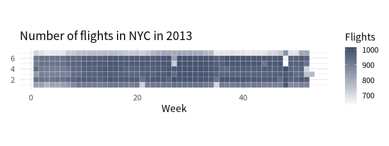

# How to work with times and dates
Albert Rapp
Invalid Date

Time series data is everywhere. <!-- We could insert an example consulting project here --> But time- and date-related data is notoriously hard to work with. But as always, the tidyverse has a nice package that makes our life just a little bit easier. In this case, it is the `lubridate` package that helps us. But just like time data itself, it requires a bit of effort to get used to working with `lubridate`. In this blog post, we go through a couple of things you might struggle with when you want to work with time data. This should help you get started with `lubridate` much faster.

## Getting data

Let’s get started by grabbing a suitable data set. Here, we’re going to look at flights data from New York City in 2013. That data is conveniently available in the package `nycflights13`.

``` r
# If you don't have `nycflights13` installed, run:
# install.packages('nycflights13')
flights <- nycflights13::flights
flights
#> # A tibble: 336,776 × 19
#>     year month   day dep_time sched_dep_time dep_delay arr_time sched_arr_time
#>    <int> <int> <int>    <int>          <int>     <dbl>    <int>          <int>
#>  1  2013     1     1      517            515         2      830            819
#>  2  2013     1     1      533            529         4      850            830
#>  3  2013     1     1      542            540         2      923            850
#>  4  2013     1     1      544            545        -1     1004           1022
#>  5  2013     1     1      554            600        -6      812            837
#>  6  2013     1     1      554            558        -4      740            728
#>  7  2013     1     1      555            600        -5      913            854
#>  8  2013     1     1      557            600        -3      709            723
#>  9  2013     1     1      557            600        -3      838            846
#> 10  2013     1     1      558            600        -2      753            745
#> # ℹ 336,766 more rows
#> # ℹ 11 more variables: arr_delay <dbl>, carrier <chr>, flight <int>,
#> #   tailnum <chr>, origin <chr>, dest <chr>, air_time <dbl>, distance <dbl>,
#> #   hour <dbl>, minute <dbl>, time_hour <dttm>
```

That’s a large data set. It has a whooping 336,776 rows and 19 columns. Let’s work only with the first 5 columns and the first 3 columns from each month. It’s not like the calculations would take super long with this data set. But it’s much nicer to learn the package when the output displays different values in the `month` and `day` column.

``` r
library(tidyverse)
flights_subset <- flights |>
  select(year:sched_dep_time) |>
  slice(1:3, .by = month) |>
  arrange(month)
flights_subset
#> # A tibble: 36 × 5
#>     year month   day dep_time sched_dep_time
#>    <int> <int> <int>    <int>          <int>
#>  1  2013     1     1      517            515
#>  2  2013     1     1      533            529
#>  3  2013     1     1      542            540
#>  4  2013     2     1      456            500
#>  5  2013     2     1      520            525
#>  6  2013     2     1      527            530
#>  7  2013     3     1        4           2159
#>  8  2013     3     1       50           2358
#>  9  2013     3     1      117           2245
#> 10  2013     4     1      454            500
#> # ℹ 26 more rows
```

## Computing the day of the year

Let’s try to add a new column `day_of_year`. For each row of the data set, this new column should show us which day of the year the flight happened on. So, January 01 is 1, January 2 is 2 and so on. To do that we first have to actually get a date. Right now, we have the date information spread out over three columns `year`, `month` and `day`. That’s no way to make a nice calculation. So let’s create the dates using the `make_date()` function.

``` r
flights_subset |>
  mutate(
    date = make_date(year = year, month = month, day = day)
  )
#> # A tibble: 36 × 6
#>     year month   day dep_time sched_dep_time date      
#>    <int> <int> <int>    <int>          <int> <date>    
#>  1  2013     1     1      517            515 2013-01-01
#>  2  2013     1     1      533            529 2013-01-01
#>  3  2013     1     1      542            540 2013-01-01
#>  4  2013     2     1      456            500 2013-02-01
#>  5  2013     2     1      520            525 2013-02-01
#>  6  2013     2     1      527            530 2013-02-01
#>  7  2013     3     1        4           2159 2013-03-01
#>  8  2013     3     1       50           2358 2013-03-01
#>  9  2013     3     1      117           2245 2013-03-01
#> 10  2013     4     1      454            500 2013-04-01
#> # ℹ 26 more rows
```

Nice, we have dates. `make_date()` made that almost effortless. All we had to do was plug in the columns `year`, `month` and `day` into the respective arguments from `make_date()`.

Also, this new column actually “knows” that it’s a date and will behave accordingly in the all functions that need such a format (which is mostly all functions related to time data.) You can actually see that in the output via the little `<date>` indicator below the column name. And because this column knows that it’s a date, we can apply the `yday()` function to compute the day of the year.

``` r
flights_subset |>
  mutate(
    date = make_date(year = year, month = month, day = day),
    day_of_year = yday(date)
  )
#> # A tibble: 36 × 7
#>     year month   day dep_time sched_dep_time date       day_of_year
#>    <int> <int> <int>    <int>          <int> <date>           <dbl>
#>  1  2013     1     1      517            515 2013-01-01           1
#>  2  2013     1     1      533            529 2013-01-01           1
#>  3  2013     1     1      542            540 2013-01-01           1
#>  4  2013     2     1      456            500 2013-02-01          32
#>  5  2013     2     1      520            525 2013-02-01          32
#>  6  2013     2     1      527            530 2013-02-01          32
#>  7  2013     3     1        4           2159 2013-03-01          60
#>  8  2013     3     1       50           2358 2013-03-01          60
#>  9  2013     3     1      117           2245 2013-03-01          60
#> 10  2013     4     1      454            500 2013-04-01          91
#> # ℹ 26 more rows
```

Similarly, we could just as easily compute the day of the week or the day of the month of a given date. Or we could also compute the week of the year.

``` r
flights_subset |>
  mutate(
    date = make_date(year = year, month = month, day = day),
    day_of_year = yday(date),
    day_of_month = mday(date),
    day_of_week = wday(date),
    week_of_year = week(date)
  ) |>
  select(date:week_of_year) # just so that you can see all new columns
#> # A tibble: 36 × 5
#>    date       day_of_year day_of_month day_of_week week_of_year
#>    <date>           <dbl>        <int>       <dbl>        <dbl>
#>  1 2013-01-01           1            1           3            1
#>  2 2013-01-01           1            1           3            1
#>  3 2013-01-01           1            1           3            1
#>  4 2013-02-01          32            1           6            5
#>  5 2013-02-01          32            1           6            5
#>  6 2013-02-01          32            1           6            5
#>  7 2013-03-01          60            1           6            9
#>  8 2013-03-01          60            1           6            9
#>  9 2013-03-01          60            1           6            9
#> 10 2013-04-01          91            1           2           13
#> # ℹ 26 more rows
```

## Visualize time data

A very nice thing you could do with these kind of functions is to visualize patterns. For example, you could count the flights by week and day of the week and create a calender plot that way. Here’s how:

``` r
# First count the full data
counts <- flights |>
  mutate(
    date = make_date(year = year, month = month, day = day),
    day_of_week = wday(date),
    week_of_year = week(date)
  ) |>
  count(day_of_week, week_of_year)

# Then pass to ggplot and map fill to the counts
counts |>
  ggplot(aes(x = week_of_year, y = day_of_week, fill = n)) +
  geom_tile(col = "white") +
  theme_minimal(base_size = 16, base_family = "Source Sans Pro") +
  coord_equal() +
  scale_fill_gradient(high = "#404E6B", low = "white") +
  labs(
    y = element_blank(),
    x = "Week",
    fill = "Flights",
    title = "Number of flights in NYC in 2013"
  )
```



Aha! There’s less people traveling on one day of the week. But which day is it? It seems that `day_of_week` are only numbers and not actual labels like Monday, Tuesday, etc. We could look into the documentation what the number outputs mean. But why don’t we try to compute that instead?

## Get time labels

Let’s take a look at our smaller data set again and focus only on the day of the week. It turns out that the `wday()` function has arguments called `label` and `abbr`. Here’s what they do:

``` r
flights_subset |>
  mutate(
    date = make_date(year = year, month = month, day = day),
    day_of_week = wday(date),
    day_of_week_label = wday(date, label = TRUE),
    day_of_week_full_label = wday(date, label = TRUE, abbr = FALSE),
  ) |>
  select(date, day_of_week:day_of_week_full_label)
#> # A tibble: 36 × 4
#>    date       day_of_week day_of_week_label day_of_week_full_label
#>    <date>           <dbl> <ord>             <ord>                 
#>  1 2013-01-01           3 Tue               Tuesday               
#>  2 2013-01-01           3 Tue               Tuesday               
#>  3 2013-01-01           3 Tue               Tuesday               
#>  4 2013-02-01           6 Fri               Friday                
#>  5 2013-02-01           6 Fri               Friday                
#>  6 2013-02-01           6 Fri               Friday                
#>  7 2013-03-01           6 Fri               Friday                
#>  8 2013-03-01           6 Fri               Friday                
#>  9 2013-03-01           6 Fri               Friday                
#> 10 2013-04-01           2 Mon               Monday                
#> # ℹ 26 more rows
```

Cool, this gives us labels. But just in case you’re wondering: These are not the English labels that you might expect. The reason for that is that my computer system is set to German and R detects that. So that is why R uses the German **“locale”**.

To get control over the locale, the locale-dependent time functions (like those that assign labels) have an argument that we can set to a different locale. Here’s how that looks:

``` r
flights_subset |>
  mutate(
    date = make_date(year = year, month = month, day = day),
    day_of_week = wday(
      date,
      locale = "en_US.UTF-8"
    ),
    day_of_week_label = wday(
      date,
      label = TRUE,
      locale = "en_US.UTF-8"
    ),
    day_of_week_full_label = wday(
      date,
      label = TRUE,
      abbr = FALSE,
      locale = "en_US.UTF-8"
    )
  ) |>
  select(date, day_of_week:day_of_week_full_label)
#> # A tibble: 36 × 4
#>    date       day_of_week day_of_week_label day_of_week_full_label
#>    <date>           <dbl> <ord>             <ord>                 
#>  1 2013-01-01           3 Tue               Tuesday               
#>  2 2013-01-01           3 Tue               Tuesday               
#>  3 2013-01-01           3 Tue               Tuesday               
#>  4 2013-02-01           6 Fri               Friday                
#>  5 2013-02-01           6 Fri               Friday                
#>  6 2013-02-01           6 Fri               Friday                
#>  7 2013-03-01           6 Fri               Friday                
#>  8 2013-03-01           6 Fri               Friday                
#>  9 2013-03-01           6 Fri               Friday                
#> 10 2013-04-01           2 Mon               Monday                
#> # ℹ 26 more rows
```

How did I find this ominous `"en_US.UTF-8"`? Well, the thing is that the `wday()` function shows you in its docs that it by default uses `Sys.getlocale("LC_TIME")`. And if I run this, then I get:

``` r
Sys.getlocale("LC_TIME")
#> [1] "en_US.UTF-8"
```

So getting the correct English locale was only about changing the `de_DE` part which I know is the code for German spoken in Germany (there’s also Swiss and Austrian German). Thus, if you’re unsure how your locale on your system might look (and that’s something that can happen depending on your OS), then run this function and make the changes as necessary.

So coming back to our chart from before, it seems like the number 7 stands for Saturday. Thus, there are much less travelers on Saturday (which might be due to less people traveling for work on Saturday).

## Time calculations

Next, let us do some calculations with times instead of dates. Notice that our small data set has two columns `dep_time` and `sched_dep_time` in it.

``` r
flights_subset
#> # A tibble: 36 × 5
#>     year month   day dep_time sched_dep_time
#>    <int> <int> <int>    <int>          <int>
#>  1  2013     1     1      517            515
#>  2  2013     1     1      533            529
#>  3  2013     1     1      542            540
#>  4  2013     2     1      456            500
#>  5  2013     2     1      520            525
#>  6  2013     2     1      527            530
#>  7  2013     3     1        4           2159
#>  8  2013     3     1       50           2358
#>  9  2013     3     1      117           2245
#> 10  2013     4     1      454            500
#> # ℹ 26 more rows
```

As you can probably guess, both columns contain the departure times in a 24h format. So, simply taking the difference between the two columns to find out how much departure delay there was will not cut it. For example, let’s consider one illustrative row:

``` r
flights_subset |>
  mutate(
    departure_delay = dep_time - sched_dep_time
  ) |>
  slice(4)
#> # A tibble: 1 × 6
#>    year month   day dep_time sched_dep_time departure_delay
#>   <int> <int> <int>    <int>          <int>           <int>
#> 1  2013     2     1      456            500             -44
```

Our computed column says that the flight left 44 minutes early. That would be A LOT. But if you look at the numbers and convert that to the times 4:56 and 5:00, you realize that it’s actually only 4 minutes. The problem is that the regular calculation assumes that after 4:59 there should be 4:60 and then 4:61, etc. all the way to 5:00. Clearly, that’s not how time works.

So instead, let us convert both columns to time formats and then redo the calculation. It’s easy to think that *“To convert things in R to something else, there’s always a function like `as.numeric()` or `as_vector()`. So maybe there’s something similar here.* And indeed there is something called `as_datetime()`. But it doesn’t lead to the correct results.

``` r
flights_subset |>
  mutate(
    dep_time = as_datetime(dep_time),
    sched_dep_time = as_datetime(sched_dep_time),
    departure_delay = dep_time - sched_dep_time
  ) |>
  slice(4)
#> # A tibble: 1 × 6
#>    year month   day dep_time            sched_dep_time      departure_delay
#>   <int> <int> <int> <dttm>              <dttm>              <drtn>         
#> 1  2013     2     1 1970-01-01 00:07:36 1970-01-01 00:08:20 -44 secs
```

Here, the result says that the flight left 44 seconds early. That’s not quite right either. The problem with that can be seen in the `dep_time` and `sched_dep_time` columns. The `as_datetime()` function computed datetimes that come 456 and 500 seconds after 1970-01-01 00:00. But that’s not what we want.

Instead, we have to construct a datetime ourselves using the `make_datetime()` function. It works exactly the same as `make_date()` but has additional arguments for `hour` and `min`. And then we can compute the difference

``` r
converted_times <- flights_subset |>
  mutate(
    dep_time = make_datetime(
      year, month, day,
      hour = dep_time %/% 100, # integer division
      min = dep_time %% 100 # get remainder
    ),
    sched_dep_time = make_datetime(
      year, month, day,
      hour = sched_dep_time %/% 100,
      min = sched_dep_time %% 100
    )
  )

converted_times |>
  slice(4)
#> # A tibble: 1 × 5
#>    year month   day dep_time            sched_dep_time     
#>   <int> <int> <int> <dttm>              <dttm>             
#> 1  2013     2     1 2013-02-01 04:56:00 2013-02-01 05:00:00
```

Aha, this looks much better. The computed datetimes look correct now.

## Compute time difference

All that is left to do is to compute the difference in time. We could try subtracting the two columns again and that would actually give us a result. But in `lubridate`, there’s an approach for that involving **intervals** (this approach may feel complicated at first but will help you in the long run.)

First, you create an interval and then when you want to know the time span, say, in minutes, then you divide that interval by a one-minute interval. Conveniently, for typical time intervals like minutes there are helper functions to create those intervals. Here’s how that looks:

``` r
converted_times |>
  mutate(
    departure_interval = interval(start = sched_dep_time, end = dep_time),
    delay_in_mins = departure_interval / minutes(1)
  ) |>
  select(departure_interval, delay_in_mins) |>
  slice(4)
#> # A tibble: 1 × 2
#>   departure_interval                               delay_in_mins
#>   <Interval>                                               <dbl>
#> 1 2013-02-01 05:00:00 UTC--2013-02-01 04:56:00 UTC            -4
```

Hooray! This worked perfectly now. Similarly, you can compute the delay in any time frame that you want.

``` r
converted_times |>
  mutate(
    departure_interval = interval(start = sched_dep_time, end = dep_time),
    delay_in_mins = departure_interval / minutes(1),
    delay_in_hrs = departure_interval / hours(1),
    delay_in_10min_blocks = departure_interval / minutes(10),
    delay_in_1.5min_blocks = departure_interval / (minutes(1) + seconds(30))
  ) |>
  select(delay_in_mins:delay_in_1.5min_blocks) |>
  slice(4)
#> # A tibble: 1 × 4
#>   delay_in_mins delay_in_hrs delay_in_10min_blocks delay_in_1.5min_blocks
#>           <dbl>        <dbl>                 <dbl>                  <dbl>
#> 1            -4      -0.0667                  -0.4                  -2.67
```

## Conclusion

Hooray 🎉 We made it through the date-and-time calculations. Hopefully, this blog post arms you with more tools to work with time data.
