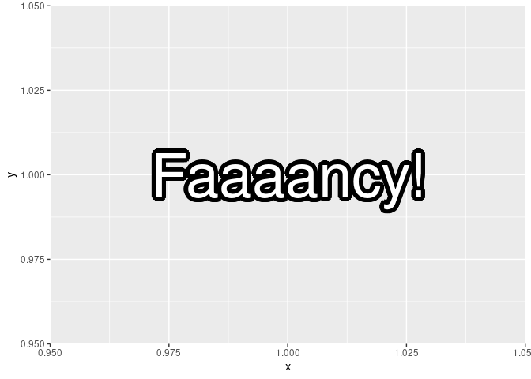
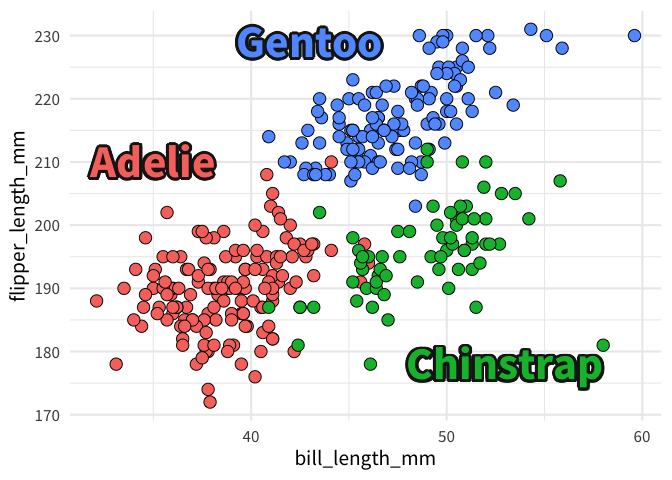
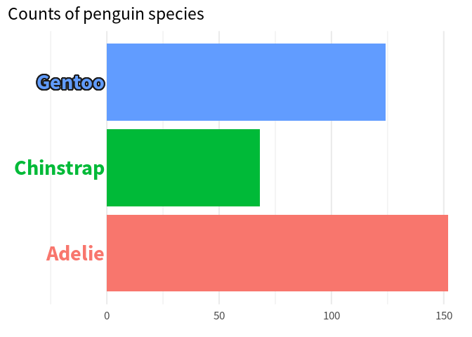
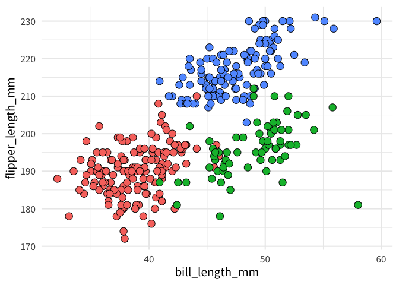
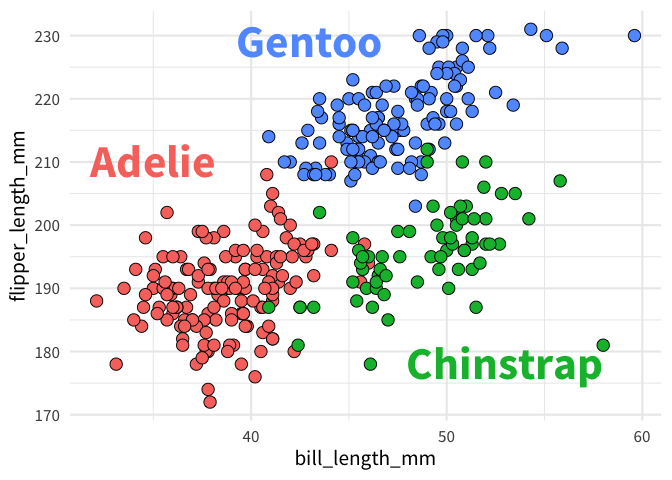
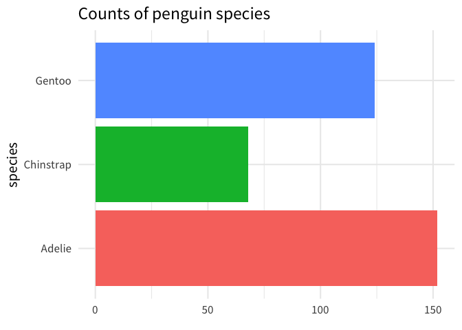
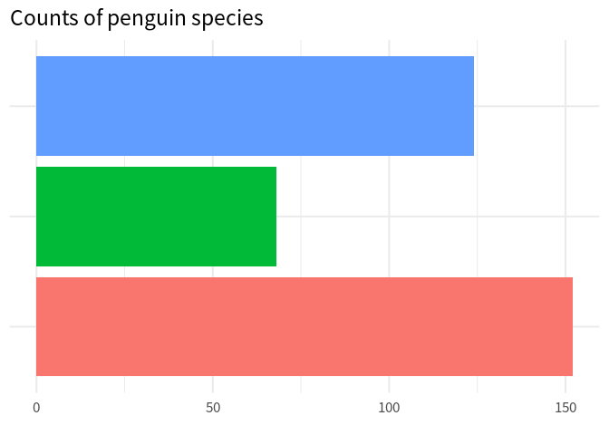
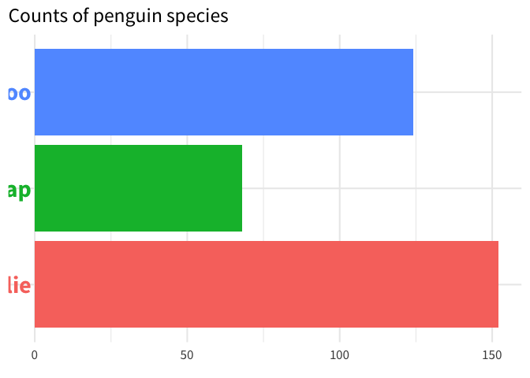
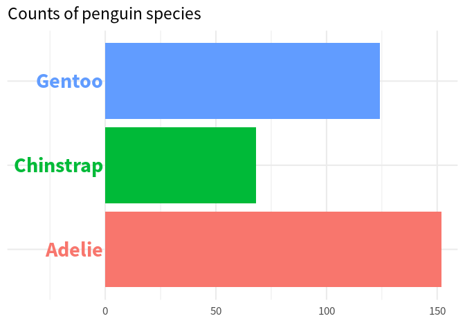
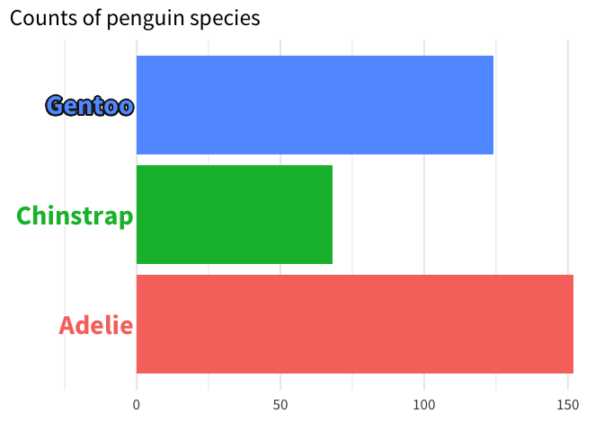

# Use geomtextpath to add outlines to your texts
Albert Rapp
Invalid Date

As probably most of you know, the premier package to create charts in the tidyverse is `ggplot2`. On its own, this package is already **incredibly** powerful. It really cannot be stressed enough that you can create impressive charts with just this one package. Still, there are some things that ggplot cannot do on its own. And one such thing is adding outline strokes to texts like this:



See that black outline around the text? That’s the work of an extra package called `shadowtext`. On it’s own `ggplot` cannot do this. Now, you may ask yourself: Why would we even want to do that? There are a two main reasons for that:

**More contrast for visibility:** Adding this outline can give text labels more contrast such that they stand out more. Consequently, texts become more legible. This can be really useful when you have a lot of things going on in the charts (like lots of dots from a scatter plot)



**Highlights:** In a chain of text categories, you could give one label a little bit of extra weight. This way, it becomes even more clear that this is the important one.



<!-- In our own work, we have used this package for (insert here)... -->

Now that we’ve seen this package in action, let’s figure out how it works. We’ll do this by recreating the two penguin charts.

## Recreate the scatter plot

To build the scatter plot with the fancy labels, let’s first create the chart without them. Here’s the code for that.

``` r
palmerpenguins::penguins |> 
  ggplot(
    aes(bill_length_mm, flipper_length_mm, fill = species)
  ) +
  geom_point(shape = 21, size = 4) +
  theme_minimal(base_size = 16, base_family = 'Source Sans Pro') +
  theme(legend.position = 'none')
```



Then, we have to create a new data set that specifies the coordinates of the labels.

``` r
species_labels_tib <- tibble(
  species = c('Adelie', 'Gentoo', 'Chinstrap'),
  x = c(35, 43, 53),
  y = c(210, 229, 178)
)
```

Normally, we could add labels using another `geom_text()` layer into which we stick our new data set `species_labels_tib`. Let’s have a look how that would look.

``` r
palmerpenguins::penguins |> 
  ggplot(
    aes(bill_length_mm, flipper_length_mm, fill = species)
  ) +
  geom_point(shape = 21, size = 4) +
  geom_text(
    data = species_labels_tib,
    aes(x, y, col = species, label = species),
    size = 12,
    fontface = 'bold',
    family = 'Source Sans Pro'
  ) +
  theme_minimal(base_size = 16, base_family = 'Source Sans Pro') +
  theme(legend.position = 'none')
```



Finally, and this is where the magic happens:

- We load the `shadowtext` package,
- replace `geom_text()` with `geom_shadowtext()` and
- set the outline color via `bg.color`.

``` r
library(shadowtext)
palmerpenguins::penguins |> 
  ggplot(
    aes(bill_length_mm, flipper_length_mm, fill = species)
  ) +
  geom_point(shape = 21, size = 4) +
  geom_shadowtext(
    data = species_labels_tib,
    aes(x, y, col = species, label = species),
    size = 12,
    fontface = 'bold',
    family = 'Source Sans Pro',
    bg.color = 'grey10',
  ) +
  theme_minimal(base_size = 16, base_family = 'Source Sans Pro') +
  theme(legend.position = 'none')
```


Hooray! That’s chart number one. Now that we know how `shadowtext` works in principle, let’s move on to the slightly more complicated second chart.

## Recreate the bar chart

Just like before we start with the basic bar plot and worry about the labels later. To do so, we first count how many penguin species there are in the data.

``` r
penguin_counts <- palmerpenguins::penguins |> 
  count(species)
penguin_counts
#> # A tibble: 3 × 2
#>   species       n
#>   <fct>     <int>
#> 1 Adelie      152
#> 2 Chinstrap    68
#> 3 Gentoo      124
```

Then, we create a bar chart with the data and `geom_col()`.

``` r
penguin_counts |> 
  ggplot(
    aes(x = n, y = species, fill = species)
  ) +
  geom_col()  +
  theme_minimal(base_size = 16, base_family = 'Source Sans Pro') +
  theme(
    legend.position = 'none'
  ) +
  labs(
    title = 'Counts of penguin species',
    x = element_blank()
  )
```



Now, comes the tricky part, we remove the y-axis completely and then we add labels manually via `geom_text()`. Let’s start with removing the `y`-axis via `theme()`:

``` r
penguin_counts |> 
  ggplot(
    aes(x = n, y = species, fill = species)
  ) +
  geom_col()  +
  theme_minimal(base_size = 16, base_family = 'Source Sans Pro') +
  theme(
    legend.position = 'none',
    axis.title.y = element_blank(),
    axis.line.y = element_blank(),
    axis.text.y = element_blank(),
    axis.ticks.length.y = unit(0, 'mm')
  ) +
  labs(
    title = 'Counts of penguin species',
    x = element_blank()
  )
```



Nice, now we can throw our labels into this via `geom_text()`. And by setting `hjust = 1` inside that layer, we can make sure that the labels are right-aligned.

``` r
penguin_counts |> 
  ggplot(
    aes(x = n, y = species, fill = species)
  ) +
  geom_col()  +
  geom_text(
    data = penguin_counts,
    aes(x = -1, color = species, label = species),
    hjust = 1,
    size = 8,
    family = 'Source Sans Pro',
    fontface = 'bold'
  ) +
  theme_minimal(base_size = 16, base_family = 'Source Sans Pro') +
  theme(
    legend.position = 'none',
    axis.title.y = element_blank(),
    axis.line.y = element_blank(),
    axis.text.y = element_blank(),
    axis.ticks.length.y = unit(0, 'mm')
  ) +
  labs(
    title = 'Counts of penguin species',
    x = element_blank()
  )
```



Oh no! The labels are barely visible. But we can save them by increasing the range of the `x`-axis via `coord_cartesian()`.

``` r
penguin_counts |> 
  ggplot(
    aes(x = n, y = species, fill = species)
  ) +
  geom_col()  +
  geom_text(
    data = penguin_counts,
    aes(x = -1, color = species, label = species),
    hjust = 1,
    size = 8,
    family = 'Source Sans Pro',
    fontface = 'bold'
  ) +
  theme_minimal(base_size = 16, base_family = 'Source Sans Pro') +
  theme(
    legend.position = 'none',
    axis.title.y = element_blank(),
    axis.line.y = element_blank(),
    axis.text.y = element_blank(),
    axis.ticks.length.y = unit(0, 'mm')
  ) +
  labs(
    title = 'Counts of penguin species',
    x = element_blank()
  ) +
  coord_cartesian(xlim = c(-35, 150))
```



Notice how the horizonal grid lines go through the labels. That makes them a little bit hard to read. I think we can live without the y-axis grid lines and increase legibility instead. So let’s remove those grid lines via `theme()`.

``` r
penguin_counts |> 
  ggplot(
    aes(x = n, y = species, fill = species)
  ) +
  geom_col()  +
  geom_text(
    data = penguin_counts,
    aes(x = -1, color = species, label = species),
    hjust = 1,
    size = 8,
    family = 'Source Sans Pro',
    fontface = 'bold'
  ) +
  theme_minimal(base_size = 16, base_family = 'Source Sans Pro') +
  theme(
    legend.position = 'none',
    axis.title.y = element_blank(),
    axis.line.y = element_blank(),
    axis.text.y = element_blank(),
    axis.ticks.length.y = unit(0, 'mm'),
    panel.grid.major.y = element_blank() # Removes grid lines
  ) +
  labs(
    title = 'Counts of penguin species',
    x = element_blank()
  ) +
  coord_cartesian(xlim = c(-35, 150))
```


Niiiice! We’re getting close. All that’s left to do is to change `geom_text()` to `geom_shadowtext()`. The trick here is to use a vector for the `bg.color` background. For the label that we want to highlight, we set `bg.color` to some dark color and to white otherwise.

``` r
# Compute order of colors first
bg_colors <- if_else(
  penguin_counts$species == 'Gentoo', 
  'grey10', 
  'white'
)
bg_colors
#> [1] "white"  "white"  "grey10"

penguin_counts |> 
  ggplot(
    aes(x = n, y = species, fill = species)
  ) +
  geom_col()  +
  geom_shadowtext(
    data = penguin_counts,
    aes(x = -1, color = species, label = species),
    hjust = 1,
    size = 8,
    family = 'Source Sans Pro',
    fontface = 'bold',
    bg.color = bg_colors # Use new vector here
  ) +
  theme_minimal(base_size = 16, base_family = 'Source Sans Pro') +
  theme(
    legend.position = 'none',
    axis.title.y = element_blank(),
    axis.line.y = element_blank(),
    axis.text.y = element_blank(),
    axis.ticks.length.y = unit(0, 'mm'),
    panel.grid.major.y = element_blank() 
  ) +
  labs(
    title = 'Counts of penguin species',
    x = element_blank()
  ) +
  coord_cartesian(xlim = c(-35, 150))
```



Hooray 🤸 We recreated both charts and learned how to use `shadowtext`. If that’s not cause for celebration, then I don’t know what is. So, enjoy your celebration and I’ll see you on our next data adventure 👋
