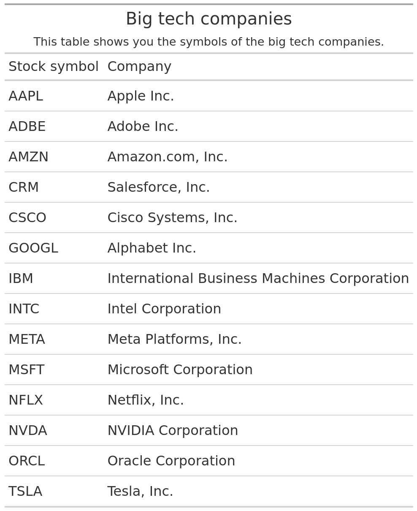
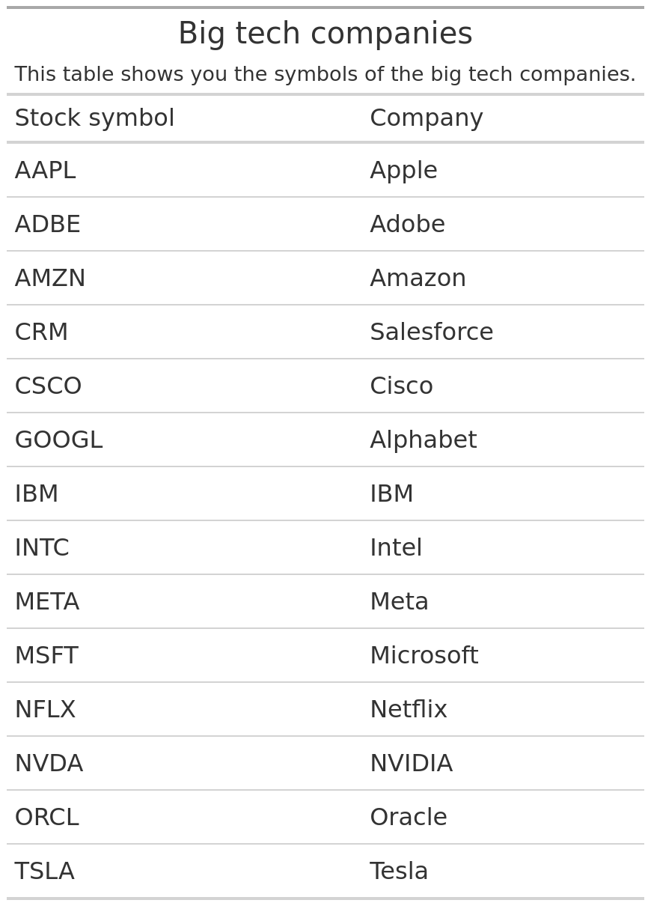

# How to remove unwanted texts in your data
Albert Rapp
Invalid Date

Text cleaning is a common part of data analysis. You may not really want to do it but it’s necessary all the time. For example, have a look at this data set from tidyTuesday. It shows you the stock prices of some big tech companies.

``` r
big_tech_stock_prices <- readr::read_csv('https://raw.githubusercontent.com/rfordatascience/tidytuesday/master/data/2023/2023-02-07/big_tech_stock_prices.csv')
big_tech_stock_prices
#> # A tibble: 45,088 × 8
#>    stock_symbol date        open  high   low close adj_close    volume
#>    <chr>        <date>     <dbl> <dbl> <dbl> <dbl>     <dbl>     <dbl>
#>  1 AAPL         2010-01-04  7.62  7.66  7.58  7.64      6.52 493729600
#>  2 AAPL         2010-01-05  7.66  7.70  7.62  7.66      6.53 601904800
#>  3 AAPL         2010-01-06  7.66  7.69  7.53  7.53      6.42 552160000
#>  4 AAPL         2010-01-07  7.56  7.57  7.47  7.52      6.41 477131200
#>  5 AAPL         2010-01-08  7.51  7.57  7.47  7.57      6.45 447610800
#>  6 AAPL         2010-01-11  7.6   7.61  7.44  7.50      6.40 462229600
#>  7 AAPL         2010-01-12  7.47  7.49  7.37  7.42      6.32 594459600
#>  8 AAPL         2010-01-13  7.42  7.53  7.29  7.52      6.41 605892000
#>  9 AAPL         2010-01-14  7.50  7.52  7.46  7.48      6.38 432894000
#> 10 AAPL         2010-01-15  7.53  7.56  7.35  7.35      6.27 594067600
#> # ℹ 45,078 more rows
```

Maybe you want work only with this financal data set. But at some point you will probably have to communicate your findings to someone. And if these people are anything like me, then they probably don’t immediately know which company is meant by a symbol like “AAPL”. Luckily, there’s another data set `big_tech_companies`. It gives us the translations we need.

``` r
big_tech_companies <- readr::read_csv('https://raw.githubusercontent.com/rfordatascience/tidytuesday/master/data/2023/2023-02-07/big_tech_companies.csv')
big_tech_companies
#> # A tibble: 14 × 2
#>    stock_symbol company                                    
#>    <chr>        <chr>                                      
#>  1 AAPL         Apple Inc.                                 
#>  2 ADBE         Adobe Inc.                                 
#>  3 AMZN         Amazon.com, Inc.                           
#>  4 CRM          Salesforce, Inc.                           
#>  5 CSCO         Cisco Systems, Inc.                        
#>  6 GOOGL        Alphabet Inc.                              
#>  7 IBM          International Business Machines Corporation
#>  8 INTC         Intel Corporation                          
#>  9 META         Meta Platforms, Inc.                       
#> 10 MSFT         Microsoft Corporation                      
#> 11 NFLX         Netflix, Inc.                              
#> 12 NVDA         NVIDIA Corporation                         
#> 13 ORCL         Oracle Corporation                         
#> 14 TSLA         Tesla, Inc.
```

Ah nice. This translates all of the abbreviations. But if you wanted to communicate these translations to someone, you would probably not want to just send them this data set. You might put this into a table.

``` r
library(tidyverse)
library(gt)
big_tech_companies |>
  gt() |> 
  tab_header(
    title = "Big tech companies",
    subtitle = "This table shows you the symbols of the big tech companies."
  ) |> 
  gt::cols_label(
    stock_symbol = "Stock symbol",
    company = "Company"
  )
```



This might do for communicating the abbrevations to somebody. Personally, I find the company names a little bit verbose though. I’ve never talked about “Apple Inc.” in my life. I always just say “Apple”. And the same goes for the other companies. In fact, I have trouble understanding which company “International Business Machines Corporation” is. I’ve only heard the common abbreviation IBM.

So, it’s probably best if we clean up our text labels to make our table nicer. And that’s exactly where text cleaning techniques comes into play. Let’s dive into this week’s blog post and I’ll show you how that works.

## Remove texts

The `stringr` package has excellent functions to make our labels a little bit nicer. First let’s remove all the `Inc.` and `Corporation` stuff. The premier functions from `stringr` to remove texts are `str_remove()` and `str_remove_all()`. The latter removes all occurences of a given text whereas the former only removes the first occurence. Thus, most of the time it’s best to use `str_remove_all()`.

``` r
big_tech_companies |>
  mutate(
    company = str_remove_all(company, "Inc.|Corporation")
  ) 
#> # A tibble: 14 × 2
#>    stock_symbol company                           
#>    <chr>        <chr>                             
#>  1 AAPL         "Apple "                          
#>  2 ADBE         "Adobe "                          
#>  3 AMZN         "Amazon.com, "                    
#>  4 CRM          "Salesforce, "                    
#>  5 CSCO         "Cisco Systems, "                 
#>  6 GOOGL        "Alphabet "                       
#>  7 IBM          "International Business Machines "
#>  8 INTC         "Intel "                          
#>  9 META         "Meta Platforms, "                
#> 10 MSFT         "Microsoft "                      
#> 11 NFLX         "Netflix, "                       
#> 12 NVDA         "NVIDIA "                         
#> 13 ORCL         "Oracle "                         
#> 14 TSLA         "Tesla, "
```

Here, we removed all the `Inc.` and `Corporation` labels with `str_remove_all()`. The first argument of that function is the column we want to remove texts from (in this case that’s `company`.) The second argument is the pattern we want to remove. But here we have to be careful. We have to use **regex** to remove things.

For starters, we want to remove “Inc.” **AND** “Corporation”. This means we had to tell `str_remove_all()` to look for either of these words. Here, we did that by using the `|` symbol.

But we have actually made a mistake here. 😱 Look what happens if I use the same pattern in `str_remove_all()` on the text “Apple Incorporation”. In theory, it should not remove anything because the text “Inc.” isn’t even in there. But check out what happens.

``` r
str_remove_all("Apple Incorporation", "Inc.|Corporation")
#> [1] "Apple rporation"
```

Argh. This doesn’t look right. The function removed “Inco” and now we’re left with “Apple rporation”. Not exactly nice, is it? The reason for this is that `str_remove_all()` uses **regex** (like I’ve mentioned before.) You can think of regex as its own powerful language. And in this language the dot `.` is not just a dot. It’s actually a symbol meaning “any character”.

So what we’ve told `str_remove_all()` is the following: *“Please remove any texts that correspond to one of the following patterns:*

- *“Inc” followed by any character*
- *“Corporation”*

And `str_remove_all()` did exactly that. But it’s just not what we wanted. We wanted to remove the text “Inc.” and the text “Corporation”. And we meant the dot `.` literally. So that’s why we have to tell `str_remove_all()` that. In regex. this is done by “escaping” (that’s the technical word) it with a backslash `\`. Let’s try that.

``` r
str_remove_all("Apple Incorporation", "Inc\.|Corporation")
#> Error: '\.' is an unrecognized escape in character string (<text>:1:44)
```

Bummer. This didn’t work at all. We wanted to escape the dot but we get an error that *“`\.` is an unrecognized escape.”* That’s unfortunate but easily fixed. You see, this happens because R also uses the backslash `\` for its own purposes. For example, you may use `\n` to add line breaks in any strings that you create. So R thinks that `\.` is one of these special things. But it’s not. And then R is all confused and throws a ~~tantrum~~ error.

The way to avoid that is to tell R that we literally mean `\.`. You know, to give the other language (regex) what it needs. And we do that by adding another backslash in front of the first one. You can think of this as “escaping the escape”. It’s yet another layer of escaping. Let’s try that.

``` r
str_remove_all("Apple Incorporation", "Inc\\.|Corporation")
#> [1] "Apple Incorporation"
```

Ahh nice. Now it works like expected. `str_remove_all()` didn’t remove anything. So let’s fix our regular expression for the whole data set. After all, we don’t want to get any unintended surprises.

``` r
big_tech_companies |>
  mutate(
    company = str_remove_all(company, "Inc\\.|Corporation")
  ) 
#> # A tibble: 14 × 2
#>    stock_symbol company                           
#>    <chr>        <chr>                             
#>  1 AAPL         "Apple "                          
#>  2 ADBE         "Adobe "                          
#>  3 AMZN         "Amazon.com, "                    
#>  4 CRM          "Salesforce, "                    
#>  5 CSCO         "Cisco Systems, "                 
#>  6 GOOGL        "Alphabet "                       
#>  7 IBM          "International Business Machines "
#>  8 INTC         "Intel "                          
#>  9 META         "Meta Platforms, "                
#> 10 MSFT         "Microsoft "                      
#> 11 NFLX         "Netflix, "                       
#> 12 NVDA         "NVIDIA "                         
#> 13 ORCL         "Oracle "                         
#> 14 TSLA         "Tesla, "
```

## Remove whitespaces

Now that we’ve removed the `Inc.` and `Corporation` stuff, we can move on to the next thing. We want to remove all the whitespaces. You know, the spaces after some of the words. (Notice the white space followed by a quotation mark after “Apple” and “Adobe”.)

``` r
big_tech_companies |>
  mutate(
    company = str_remove_all(company, "Inc\\.|Corporation")
  ) 
#> # A tibble: 14 × 2
#>    stock_symbol company                           
#>    <chr>        <chr>                             
#>  1 AAPL         "Apple "                          
#>  2 ADBE         "Adobe "                          
#>  3 AMZN         "Amazon.com, "                    
#>  4 CRM          "Salesforce, "                    
#>  5 CSCO         "Cisco Systems, "                 
#>  6 GOOGL        "Alphabet "                       
#>  7 IBM          "International Business Machines "
#>  8 INTC         "Intel "                          
#>  9 META         "Meta Platforms, "                
#> 10 MSFT         "Microsoft "                      
#> 11 NFLX         "Netflix, "                       
#> 12 NVDA         "NVIDIA "                         
#> 13 ORCL         "Oracle "                         
#> 14 TSLA         "Tesla, "
```

That’s excess baggage. Less remove that. We could actually include that white space in our regular expression from before.

``` r
big_tech_companies |>
  mutate(
    # Add white space in front of Inc and Corporation in pattern
    company = str_remove_all(company, " Inc\\.| Corporation")
  ) 
#> # A tibble: 14 × 2
#>    stock_symbol company                        
#>    <chr>        <chr>                          
#>  1 AAPL         Apple                          
#>  2 ADBE         Adobe                          
#>  3 AMZN         Amazon.com,                    
#>  4 CRM          Salesforce,                    
#>  5 CSCO         Cisco Systems,                 
#>  6 GOOGL        Alphabet                       
#>  7 IBM          International Business Machines
#>  8 INTC         Intel                          
#>  9 META         Meta Platforms,                
#> 10 MSFT         Microsoft                      
#> 11 NFLX         Netflix,                       
#> 12 NVDA         NVIDIA                         
#> 13 ORCL         Oracle                         
#> 14 TSLA         Tesla,
```

But I want to highlight another function from the `stringr` package, namely `str_trim()`. It does exactly what we want and we stops us from making our regular expression more complicated (it’s really easy to lose track of what’s going on in a regular expression.)

``` r
big_tech_companies |>
  mutate(
    company = str_remove_all(company, "Inc\\.|Corporation"),
    company = str_trim(company)
  ) 
#> # A tibble: 14 × 2
#>    stock_symbol company                        
#>    <chr>        <chr>                          
#>  1 AAPL         Apple                          
#>  2 ADBE         Adobe                          
#>  3 AMZN         Amazon.com,                    
#>  4 CRM          Salesforce,                    
#>  5 CSCO         Cisco Systems,                 
#>  6 GOOGL        Alphabet                       
#>  7 IBM          International Business Machines
#>  8 INTC         Intel                          
#>  9 META         Meta Platforms,                
#> 10 MSFT         Microsoft                      
#> 11 NFLX         Netflix,                       
#> 12 NVDA         NVIDIA                         
#> 13 ORCL         Oracle                         
#> 14 TSLA         Tesla,
```

Nice, this gives us the exact same result. And now that we know that `str_trim()` will always get rid of all excess white space at the beginning and end of a text, we can remove more undesired words from the text. Just add another layer `str_remove_all()` before you use `str_trim()`.

``` r
big_tech_companies |>
  mutate(
    company = str_remove_all(company, "Inc\\.|Corporation"),
    company = str_remove_all(company, "(\\.com|Systems|Platforms)?,"),
    company = str_trim(company)
  ) 
#> # A tibble: 14 × 2
#>    stock_symbol company                        
#>    <chr>        <chr>                          
#>  1 AAPL         Apple                          
#>  2 ADBE         Adobe                          
#>  3 AMZN         Amazon                         
#>  4 CRM          Salesforce                     
#>  5 CSCO         Cisco                          
#>  6 GOOGL        Alphabet                       
#>  7 IBM          International Business Machines
#>  8 INTC         Intel                          
#>  9 META         Meta                           
#> 10 MSFT         Microsoft                      
#> 11 NFLX         Netflix                        
#> 12 NVDA         NVIDIA                         
#> 13 ORCL         Oracle                         
#> 14 TSLA         Tesla
```

This gives us nice results. We have removed “.com”, “Systems”, “Platforms”, and all the “,”. But it required doing a complicated thing. Let’s go through it step by step. First, let’s just put “.com” (don’t forget to escape the point), “Systems”, “Platforms” into the pattern with `|` in between.

``` r
big_tech_companies |>
  mutate(
    company = str_remove_all(company, "Inc\\.|Corporation"),
    company = str_remove_all(company, "\\.com|Systems|Platforms"),
    company = str_trim(company)
  ) 
#> # A tibble: 14 × 2
#>    stock_symbol company                        
#>    <chr>        <chr>                          
#>  1 AAPL         Apple                          
#>  2 ADBE         Adobe                          
#>  3 AMZN         Amazon,                        
#>  4 CRM          Salesforce,                    
#>  5 CSCO         Cisco ,                        
#>  6 GOOGL        Alphabet                       
#>  7 IBM          International Business Machines
#>  8 INTC         Intel                          
#>  9 META         Meta ,                         
#> 10 MSFT         Microsoft                      
#> 11 NFLX         Netflix,                       
#> 12 NVDA         NVIDIA                         
#> 13 ORCL         Oracle                         
#> 14 TSLA         Tesla,
```

This works, but it also leaves the commas in. So let’s add this comma too.

``` r
big_tech_companies |>
  mutate(
    company = str_remove_all(company, "Inc\\.|Corporation"),
    # comma added at the end
    company = str_remove_all(company, "\\.com|Systems|Platforms,"),
    company = str_trim(company)
  ) 
#> # A tibble: 14 × 2
#>    stock_symbol company                        
#>    <chr>        <chr>                          
#>  1 AAPL         Apple                          
#>  2 ADBE         Adobe                          
#>  3 AMZN         Amazon,                        
#>  4 CRM          Salesforce,                    
#>  5 CSCO         Cisco ,                        
#>  6 GOOGL        Alphabet                       
#>  7 IBM          International Business Machines
#>  8 INTC         Intel                          
#>  9 META         Meta                           
#> 10 MSFT         Microsoft                      
#> 11 NFLX         Netflix,                       
#> 12 NVDA         NVIDIA                         
#> 13 ORCL         Oracle                         
#> 14 TSLA         Tesla,
```

Uhh what happened? The commas are still there. But why? Well, if you look closely you will see that the comma after “Meta” disappeared. Aha! So `str_remove_all()` only removed the comma when it was “Platforms,” and not when it was “.com,” or “Systems,”.

So let’s tell our regular expression to look for either of these three “words” followed by a comma. We do that by **grouping** them with `()`.

``` r
big_tech_companies |>
  mutate(
    company = str_remove_all(company, "Inc\\.|Corporation"),
    # group with ()
    company = str_remove_all(company, "(\\.com|Systems|Platforms),"),
    company = str_trim(company)
  ) 
#> # A tibble: 14 × 2
#>    stock_symbol company                        
#>    <chr>        <chr>                          
#>  1 AAPL         Apple                          
#>  2 ADBE         Adobe                          
#>  3 AMZN         Amazon                         
#>  4 CRM          Salesforce,                    
#>  5 CSCO         Cisco                          
#>  6 GOOGL        Alphabet                       
#>  7 IBM          International Business Machines
#>  8 INTC         Intel                          
#>  9 META         Meta                           
#> 10 MSFT         Microsoft                      
#> 11 NFLX         Netflix,                       
#> 12 NVDA         NVIDIA                         
#> 13 ORCL         Oracle                         
#> 14 TSLA         Tesla,
```

We’re almost there! This removed almost all the commas. But there are still some after “Salesforce”, “Netflix” and “Tesla”. These are the exact companies that don’t have a “.com”, “Systems”, or “Platforms” in their name. So that’s why the pattern that we passed to `str_remove_all()` didn’t work on them.

So let’s add a question mark `?` after the group. This tells the regular expression that the group is optional. In other words, it doesn’t have to be there. So even if the group is not there, the comma will be removed.

``` r
big_tech_companies |>
  mutate(
    company = str_remove_all(company, "Inc\\.|Corporation"),
    company = str_remove_all(company, "(\\.com|Systems|Platforms)?,"),
    company = str_trim(company)
  ) 
#> # A tibble: 14 × 2
#>    stock_symbol company                        
#>    <chr>        <chr>                          
#>  1 AAPL         Apple                          
#>  2 ADBE         Adobe                          
#>  3 AMZN         Amazon                         
#>  4 CRM          Salesforce                     
#>  5 CSCO         Cisco                          
#>  6 GOOGL        Alphabet                       
#>  7 IBM          International Business Machines
#>  8 INTC         Intel                          
#>  9 META         Meta                           
#> 10 MSFT         Microsoft                      
#> 11 NFLX         Netflix                        
#> 12 NVDA         NVIDIA                         
#> 13 ORCL         Oracle                         
#> 14 TSLA         Tesla
```

## Replace texts

Now that we’ve removed all the excess baggage, let’s move on to the final thing. We want to replace the text “International Business Machines” with its abbreviations “IBM”. This can be done with `str_replace_all()`.

``` r
cleaned_big_tech_companies <- big_tech_companies |>
  mutate(
    company = str_remove_all(company, "Inc\\.|Corporation"),
    company = str_remove_all(company, "(\\.com|Systems|Platforms)?,"),
    company = str_replace_all(company, "International Business Machines", "IBM"),
    company = str_trim(company)
  ) 
cleaned_big_tech_companies
#> # A tibble: 14 × 2
#>    stock_symbol company   
#>    <chr>        <chr>     
#>  1 AAPL         Apple     
#>  2 ADBE         Adobe     
#>  3 AMZN         Amazon    
#>  4 CRM          Salesforce
#>  5 CSCO         Cisco     
#>  6 GOOGL        Alphabet  
#>  7 IBM          IBM       
#>  8 INTC         Intel     
#>  9 META         Meta      
#> 10 MSFT         Microsoft 
#> 11 NFLX         Netflix   
#> 12 NVDA         NVIDIA    
#> 13 ORCL         Oracle    
#> 14 TSLA         Tesla
```

Nice. These are much nicer labels and now we could throw them into a table. Let’s use the same code from before.

``` r
cleaned_big_tech_companies |> 
  gt() |> 
  tab_header(
    title = "Big tech companies",
    subtitle = "This table shows you the symbols of the big tech companies."
  ) |> 
  gt::cols_label(
    stock_symbol = "Stock symbol",
    company = "Company"
  )
```



Great job! This is a nicer table. And whoever you show this too will probably have a much easier time understanding the abbreviations. That’s it for this week’s blog post. I hope this helps you with your data cleaning tasks. Enjoy the rest of your day and see you next time 👋
