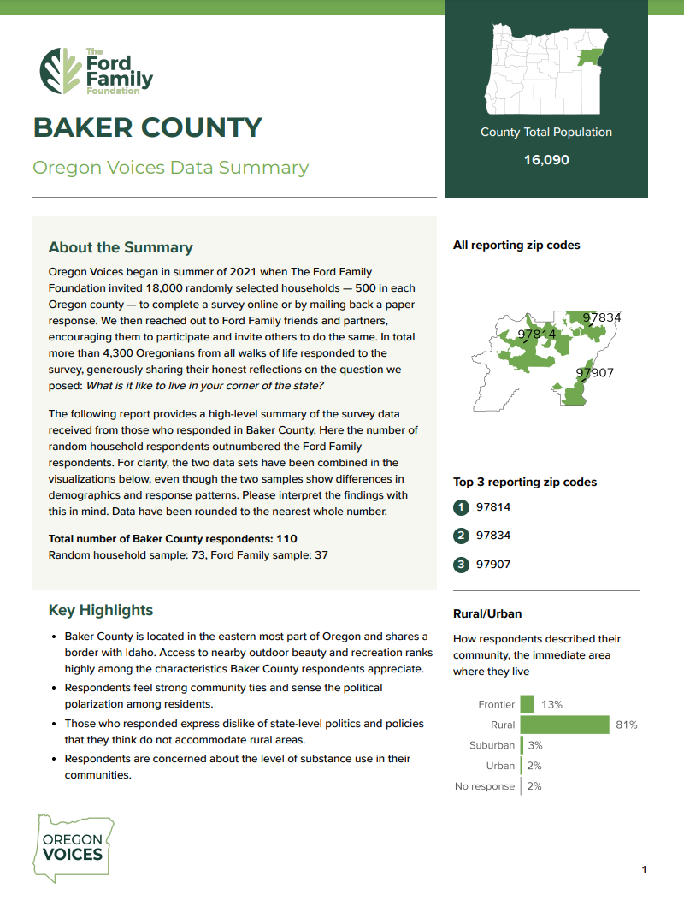
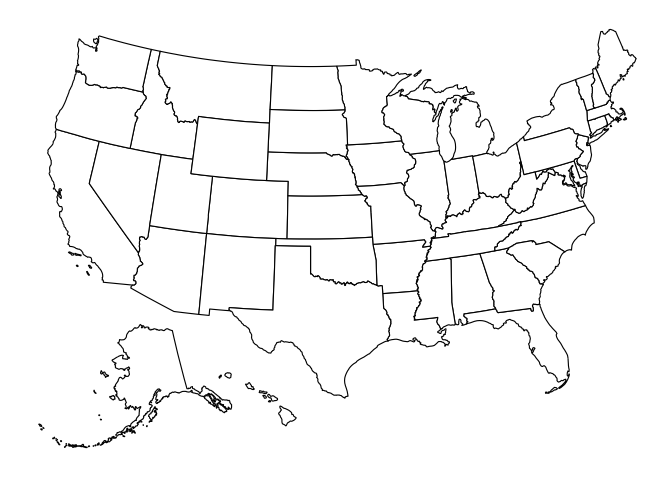
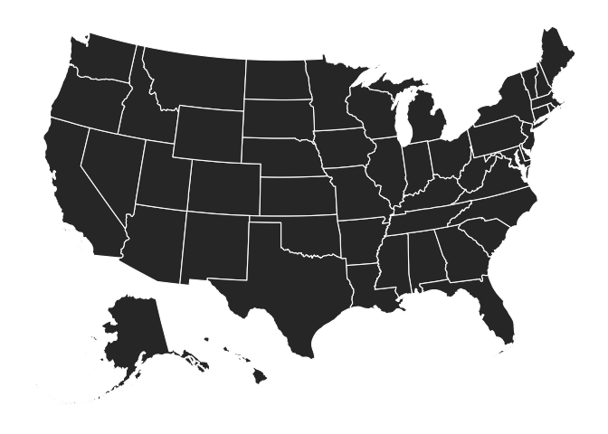
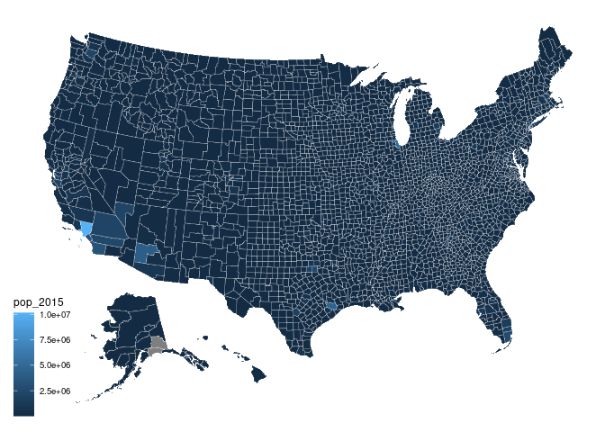
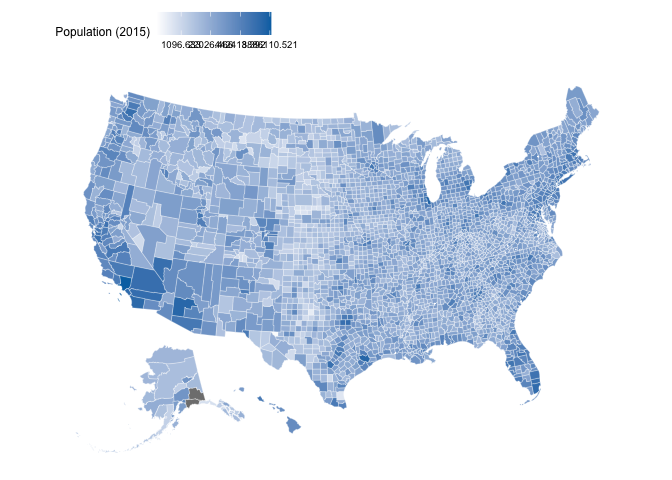
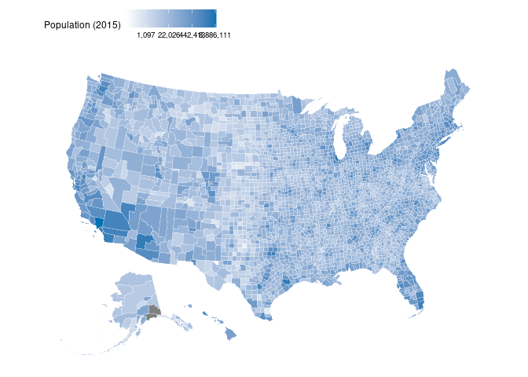
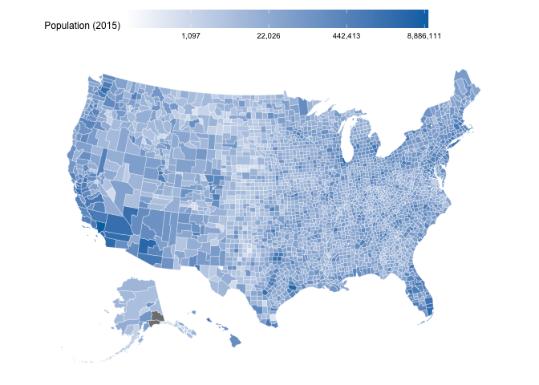
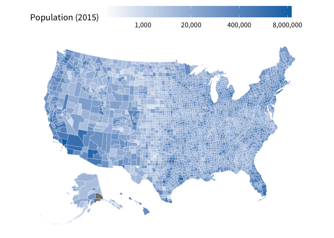

# How to create maps of the US with ggplot
Albert Rapp
Invalid Date

Ever wanted to create a map of the US with ggplot? We know that we have. For example, for our [Oregon Voices consulting project](https://orvoices.org/your-county/), it was invaluable to have a great package that allows to create nice charts of the US.



In this blog post, we show you how to get started with creating maps in R. And with that said, let’s dive in.

## Our first map chart

We start with a simple map of the US. The cool thing is that we don’t have to do much work to make that happen. All of the heavy lifting is done for us by the `usmap` package. Check it out.

``` r
library(tidyverse)
library(usmap)

plot_usmap()
```



Whoooa, that was easy. Let’s try to do a little bit more. Maybe we want to color the states differently. That’s easily done via the `fill` aesthetic just like in `ggplot`.

``` r
plot_usmap(fill = "grey20", color = "white")
```



Or maybe we want to use a different granularity. Maybe we can show the data at the county level.

``` r
plot_usmap(fill = "grey20", color = "white", regions = "counties")
```


## Adding data to the map

Interesting, there seem to be more counties in the east than in the west. Let’s see how that translates to population. Luckily, the `usmap` package comes with a dataset that contains the population of each county.

``` r
countypop
#> # A tibble: 3,142 × 4
#>    fips  abbr  county          pop_2015
#>    <chr> <chr> <chr>              <dbl>
#>  1 01001 AL    Autauga County     55347
#>  2 01003 AL    Baldwin County    203709
#>  3 01005 AL    Barbour County     26489
#>  4 01007 AL    Bibb County        22583
#>  5 01009 AL    Blount County      57673
#>  6 01011 AL    Bullock County     10696
#>  7 01013 AL    Butler County      20154
#>  8 01015 AL    Calhoun County    115620
#>  9 01017 AL    Chambers County    34123
#> 10 01019 AL    Cherokee County    25859
#> # ℹ 3,132 more rows
```

We can use that in `plot_usmap()` because this data set has a `fips` column. This one is necessary for `plot_usmap()` as the fips number is a unique identifier for each county. If that column isn’t present, then `plot_usmap()` cannot know how to map the values to counties. But we have to tell `plot_usmap()` to use the `pop_2015` column to colorize parts of the map. We do that via the `values` argument.

``` r
plot_usmap(
  color = "white",
  linewidth = 0.1,
  regions = "counties",
  data = countypop,
  values = "pop_2015"
)
```



## Modifying scales

This map isn’t particularly informative since basically everything uses the same color. We can change that by using a different color scale. Here, it’s probably best to use a logarithmic color scales because there are very densely and very sparsely populated counties. But since `plot_usmap()` creates a ggplot, we can use the same layers from ggplot to modify the scale. In this case, we have to use `scale_fill_gradient()`.

``` r
plot_usmap(
  color = "white",
  linewidth = 0.1,
  regions = "counties",
  data = countypop,
  values = "pop_2015"
) +
  scale_fill_gradient(
    trans = 'log',
    high = '#0072B2',
    low = 'white'
  )
```


Ah already better. But we can do more. For example, let’s move the color bar to the top. While we’re working on the legend we might as well change it’s title.

``` r
plot_usmap(
  color = "white",
  linewidth = 0.1,
  regions = "counties",
  data = countypop,
  values = "pop_2015"
) +
  scale_fill_gradient(
    trans = 'log',
    high = '#0072B2',
    low = 'white'
  ) +
  theme(legend.position = 'top') +
  labs(fill = 'Population (2015)')
```



The labels are a bit hard to read. So let’s transform them into something nice. We can use the `label_number()` function from the `scales` package to get the job done.

``` r
plot_usmap(
  color = "white",
  linewidth = 0.1,
  regions = "counties",
  data = countypop,
  values = "pop_2015"
) +
  scale_fill_gradient(
    trans = 'log',
    labels = scales::label_number(big.mark = ','),
    high = '#0072B2',
    low = 'white'
  ) +
  theme(legend.position = 'top') +
  labs(fill = 'Population (2015)')
```



Still not great. Let’s make the color bar longer in the `guides()` layer.

``` r
plot_usmap(
  color = "white",
  linewidth = 0.1,
  regions = "counties",
  data = countypop,
  values = "pop_2015"
) +
  scale_fill_gradient(
    trans = 'log',
    labels = scales::label_number(big.mark = ','),
    high = '#0072B2',
    low = 'white'
  ) +
  theme(legend.position = 'top') +
  labs(fill = 'Population (2015)') +
  guides(
    fill = guide_colorbar(
      barwidth = unit(10, 'cm')
    )
  )
```



Finally, we can create better break points than the current ones.

``` r
plot_usmap(
  color = "white",
  linewidth = 0.1,
  regions = "counties",
  data = countypop,
  values = "pop_2015"
) +
  scale_fill_gradient(
    trans = 'log',
    labels = scales::label_number(big.mark = ','),
    breaks = c(1000, 20000, 400000, 8000000),
    high = '#0072B2',
    low = 'white'
  ) +
  theme(legend.position = 'top') +
  labs(fill = 'Population (2015)') +
  guides(
    fill = guide_colorbar(
      barwidth = unit(10, 'cm')
    )
  )
```


Now all that’s left to do is to increase the font size. As always, we can do that in the `theme()` layer. While we’re at it, let’s set the font family to something nicer.

``` r
plot_usmap(
  color = "white",
  linewidth = 0.1,
  regions = "counties",
  data = countypop,
  values = "pop_2015"
) +
  scale_fill_gradient(
    trans = 'log',
    labels = scales::label_number(big.mark = ','),
    breaks = c(1000, 20000, 400000, 8000000),
    high = '#0072B2',
    low = 'white'
  ) +
  theme(
    text = element_text(family = 'Source Sans Pro', size = 14),
    legend.position = 'top'
  ) +
  labs(fill = 'Population (2015)') +
  guides(
    fill = guide_colorbar(
      barwidth = unit(10, 'cm')
    )
  )
```



## Conclusion

Nice, we created a map of the US. And we were able to connect a bit of data to that. (I think the map is actually quite nice to look at if I may say so myself.) With that you hopefully have a recipe for creating your own data-infused maps of the US. Have fun plotting your own maps and see you next time 👋.
