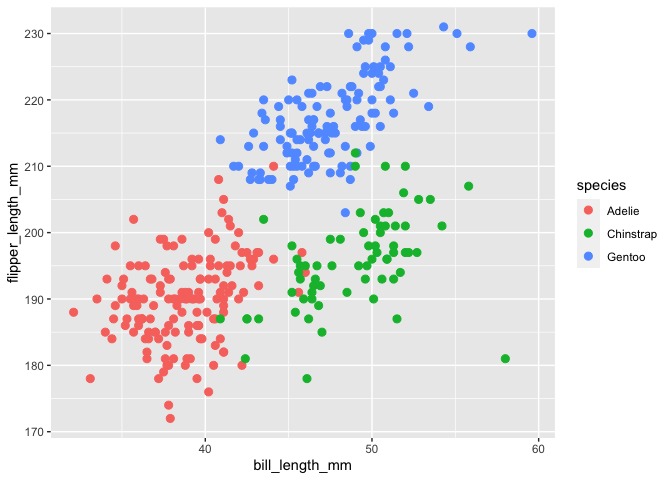
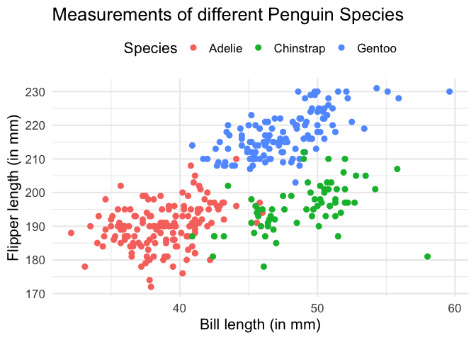
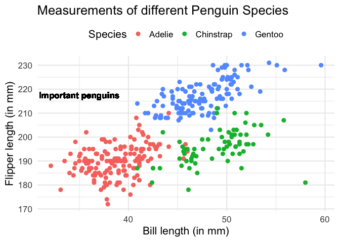
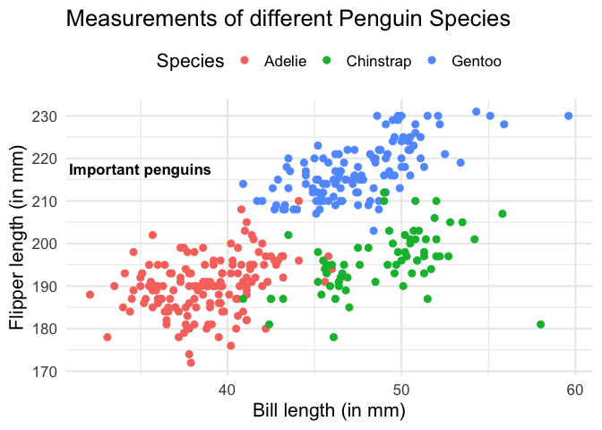
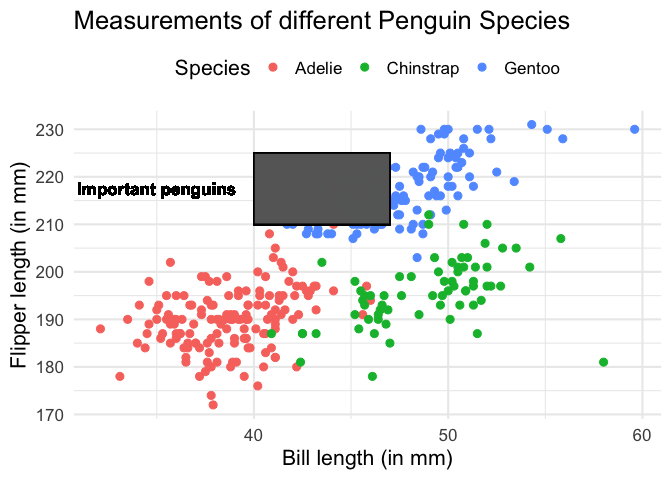
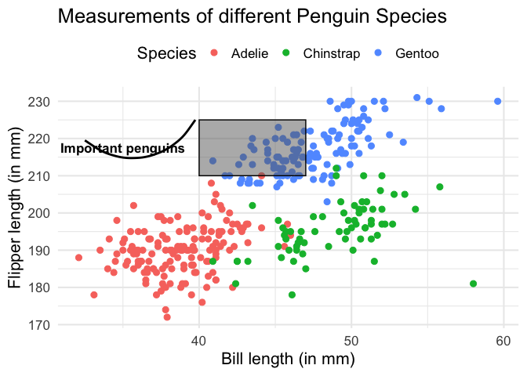

Annotations are a neat way to draw your readers attention to specific
parts of your data visualization. For example, you could use

- an arrow to point to a specific data point,
- a rectangle to draw a border around specific points in a scatter plot
  that you want to highlight or
- a text label to clarify something.

The possibilities for annotations are endless. Here’s a plot that
combines these ideas into a ggplot.


You can create such annotations with the `annotate()` layer. Who would
have thought that, right? Annotations are done with `annotate()`.
Shocking news, I know.

But regardless of this obvious function name, you might wonder why we
even need an extra function for that. Can’t we just create labels with
`geom_text()` or arrows with `geom_curve()` or rectangles with
`geom_rect()`?

Today I want to show you why `annotate()` is actually necessary. And to
answer this question, let us build the visualization from above with
both `annotate()` and the corresponding `geom_*()` layers. We will see
that `annotate()` leads to better results.

# The base plot

First, we need to build the scatter plot from above and then we can add
annotations. Here, this means that we combine a `ggplot()` and a
`geom_point()` layer to get the job done. The underlying data comes from
the famous `palmerpenguins` package.

``` r
palmerpenguins::penguins |> 
  ggplot(aes(bill_length_mm, flipper_length_mm, col = species)) +
  geom_point(size = 2.5) 
```



So that’s our basic plot. To make things look nicer, we can also add a
`theme_minimal()` to this and increase the `base_size` in that layer.
Also, let us make the axes labels into proper descriptions and let us
move the legend to the top.

``` r
scatterplot <- palmerpenguins::penguins |> 
  ggplot(aes(bill_length_mm, flipper_length_mm, col = species)) +
  geom_point(size = 2.5)+
  labs(
    x = 'Bill length (in mm)',
    y = 'Flipper length (in mm)',
    col = 'Species',
    title = 'Measurements of different Penguin Species'
  ) +
  theme_minimal(base_size = 16) +
  theme(legend.position = 'top')
scatterplot
```



# Our first annotation

Now let’s try to add a text annotation with `geom_text()`. In this
layer, we have to specify the coordinates and the label of the text
label. Notice that we can do all of this outside of the `aes()` call
because our annotation is not data dependent.

``` r
scatterplot +
  geom_text(
    x = 35,
    y = 217.5,
    label = 'Important penguins',
    fontface = 'bold', # makes text bold
    size = 4.5 # font size
  )
```


Oh no! The legend got all messed up and the text is colored. That’s a
bit annoying. But we can fix that with `show.legend = FALSE` and
`color = "black"`.

``` r
scatterplot +
  geom_text(
    x = 35,
    y = 217.5,
    label = 'Important penguins',
    fontface = 'bold', # makes text bold
    size = 4.5, # font size
    show.legend = FALSE,
    color = 'black'
  )
```



Now, let’s have a look at this chart. Did you notice that the text looks
weird? Maybe you don’t notice it right away. So let’s have a look at
what the same thing would look like if we use `annotate()` instead. Once
we have done that we can compare the two plots.

So, here’s the same plot using `annotate()`. In case you’ve never worked
with `annotate()`, I’ll provide an explainer after the code.

``` r
scatterplot +
  annotate(
    'text',
    x = 35,
    y = 217.5,
    label = 'Important penguins',
    fontface = 'bold', 
    size = 4.5
  )
```

As you’ve seen, basically `annotate()` layers need the exact same
information as the corresponding `geom_*()` layer. The only difference
is that `annotate()` **never** uses `aes()` and the first thing you must
pass to `annotate()` is the `geom` you want to use. But despite the
similarities, the resulting plot is a little bit different. Somehow, the
plot that uses `geom_text()` instead shows a text label which is a tiny
bit blurry. Have a look at what `annotate()` gives you instead.



Maybe you can already guess what causes this to look different. But if
not, don’t worry. I will reveal that secret in a second. For now, let us
try to create a rectangle annotation with `geom_rect()` and
`annotate()`. And then I will reveal what’s going on behind the scenes.
Exciting, isn’t it?

# Maybe rectangle annotations work better?

Let us start with `geom_rect()`. What this geom needs (in case you’ve
never used it), is the coordinates of the four corners of the rectangle
that we want to draw. We specify this with `xmin`, `xmax`, `ymin`,
`ymax`.

And since we want to have a colored rectangle with a border we will also
specify a fill color with `fill` and a border color with `col`. This
means that we also need to set the transparency aesthetic `alpha` to
something lower than 1. Otherwise, we cannot see the points below the
rectangle. Now, without further ado, look what happens.

``` r
scatterplot +
  geom_text(
    x = 35,
    y = 217.5,
    label = 'Important penguins',
    fontface = 'bold', # makes text bold
    size = 4.5, # font size
    show.legend = FALSE,
    color = 'black'
  ) +
  geom_rect(
    xmin = 40,
    xmax = 47,
    ymin = 210,
    ymax = 225,
    alpha = 0.5,
    fill = 'grey40',
    col = 'black'
  )
```



Oh no! We cannot see the points below the rectangle (even though we have
lowered `alpha`). So maybe go even lower with `alpha`?

``` r
scatterplot +
  geom_text(
    x = 35,
    y = 217.5,
    label = 'Important penguins',
    fontface = 'bold', # makes text bold
    size = 4.5, # font size
    show.legend = FALSE,
    color = 'black'
  ) +
  geom_rect(
    xmin = 40,
    xmax = 47,
    ymin = 210,
    ymax = 225,
    alpha = 0.1,
    fill = 'grey40',
    col = 'black'
  )
```


No joy. You will have to lower `alpha` to ridiculously low amounts like
0.01 in order to even begin to see the points a little bit. Clearly,
something is wrong here. Let’s check if `annotate()` fares better.

``` r
scatterplot +
  annotate(
    'text',
    x = 35,
    y = 217.5,
    label = 'Important penguins',
    fontface = 'bold', 
    size = 4.5
  ) +
  annotate(
    'rect',
    xmin = 40,
    xmax = 47,
    ymin = 210,
    ymax = 225,
    alpha = 0.5, # This was put back to 0.5
    fill = 'grey40',
    col = 'black'
  )
```


Nice. This works as expected. So it appears as if we actually do need
`annotate()` layers. That’s why I will (finally) reveal the secret about
what is going on here.

When you use an `annotate()` layer, you will draw the exact amount of
rectangles or labels that you’ve specified. In our case, we have always
specified exactly one label or coordinates for exactly one rectangle.
And `annotate()` fulfills our wish just like we would expect and that’s
why everything looks like it should.

But with `geom_*()` layers, things are different. Since all `geom_*()`
layers “know” the data that is passed to `ggplot()` (in this case the
`penguins` data), all `geom_*()` layers expect the same amount of data.
So, even if you specify only a single label, your `geom_text()` layer
will interpret this as one label **for every** data point. Same thing
with `geom_rect()`.

And then hundreds of labels and rectangles will be plotted above each
other. Consequently, your text label looks a little bit weird because
you have a lot of labels behind each other that are not always 100%
exactly in the same position. Similarly, you can make your rectangle’s
transparency very low and this won’t change a thing because there are so
many rectangles on top of each other.

So this is why `annotate()` layers are necessary. They break free from
the *“I always expect the same amount of data”*-paradigm. So now that
you understand the difference, let us finish our visualization.

# Create an arrow annotation

In general, we can create curved arrows with `geom_curve()`. But we know
better now than to use `geom_curve()`. Instead, use `annotate()` with
`"curve"` as its first argument. Then, we need to specify the start and
end coordinates of the arrow with `x`, `y`, `xend` and `yend`. This will
give us a curved segment line.

``` r
scatterplot +
  annotate(
    'text',
    x = 35,
    y = 217.5,
    label = 'Important penguins',
    fontface = 'bold', 
    size = 4.5
  ) +
  annotate(
    'rect',
    xmin = 40,
    xmax = 47,
    ymin = 210,
    ymax = 225,
    alpha = 0.5, 
    fill = 'grey40',
    col = 'black'
  ) +
  annotate(
    'curve',
    x = 32.5, # Play around with the coordinates until you're satisfied
    y = 219.5,
    yend = 225,
    xend = 39.75,
    linewidth = 1
  )
```



Here, we should change the curvature of our curved segment so that it
gets flipped. And to make this curved line into an arrow, we need to
also set the `arrow` argument and fill it using the `arrow()` function.
In that function, we can specify how long or how wide the arrowhead is
supposed to be.

``` r
scatterplot +
  annotate(
    'text',
    x = 35,
    y = 217.5,
    label = 'Important penguins',
    fontface = 'bold', 
    size = 4.5
  ) +
  annotate(
    'rect',
    xmin = 40,
    xmax = 47,
    ymin = 210,
    ymax = 225,
    alpha = 0.5, 
    fill = 'grey40',
    col = 'black'
  ) +
  annotate(
    'curve',
    x = 32.5, # Play around with the coordinates until you're satisfied
    y = 219.5,
    yend = 225,
    xend = 39.75,
    linewidth = 1,
    curvature = -0.5,
    arrow = arrow(length = unit(0.5, 'cm'))
  )
```


And with that, we have finished our visualization **and** we learned
what the point of `annotate()` is. Not bad for one blog post, eh? Now,
you can use all of that knowledge to draw your reader’s attention to
specific parts of your charts. Have fun with that and see you next time.
