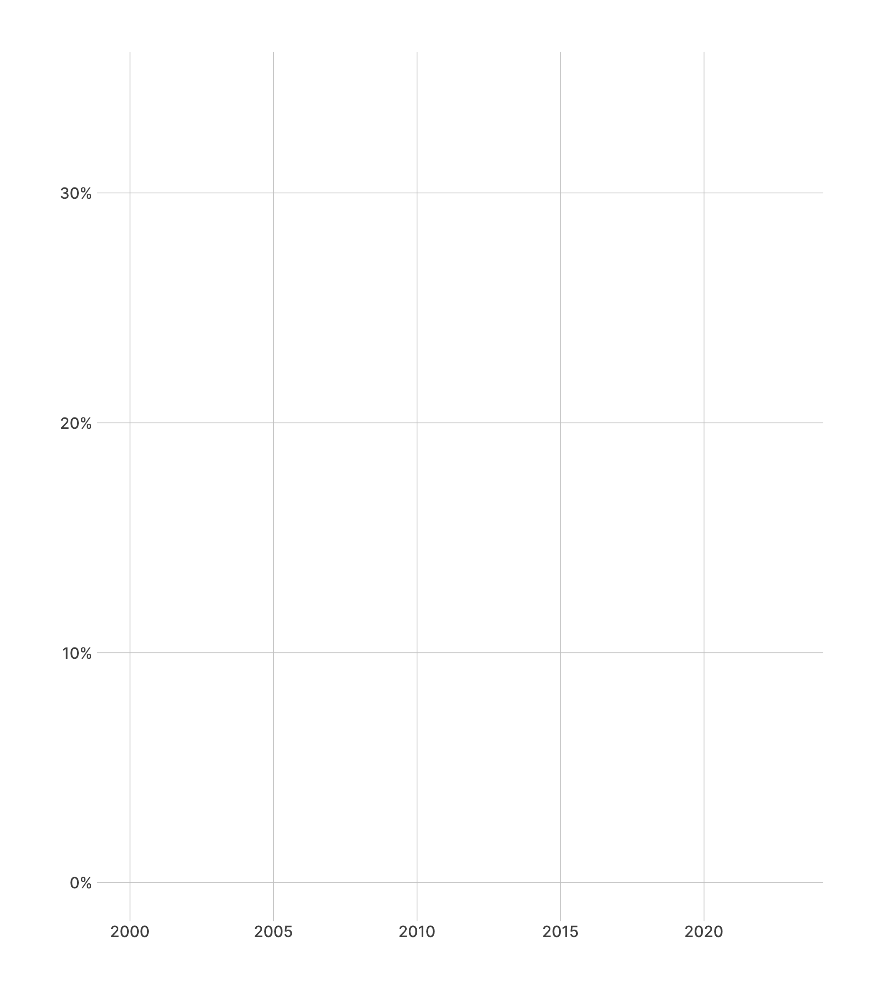
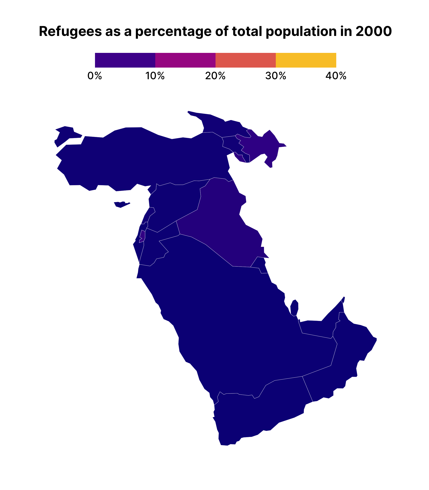

# Refugees animation
David Keyes
2024-01-17

## Data

## Intro

``` r
library(tidyverse)
library(gganimate)
library(sf)
library(scales)
library(hrbrthemes)
```

## Data

``` r
refugees_data <-
  read_rds("refugees_data.rds") # TODO: Switch to web URL
```

``` r
refugees_data_geospatial <-
  read_sf("refugees_data_geospatial.geojson")
```

## Plot

``` r
refugees_data |>
  filter(country_abbreviation == "SYR") |>
  ggplot(
    aes(
      x = year,
      y = refugees_as_pct
    )
  ) +
  scale_y_continuous(
    labels = percent_format()
  ) +
  geom_line() +
  labs(
    x = NULL,
    y = NULL
  ) +
  theme_ipsum_inter() +
  theme(panel.grid.minor = element_blank()) +
  transition_reveal(year) +
  ease_aes("linear")
```



## Map

``` r
refugees_data_geospatial |>
  left_join(
    refugees_data,
    join_by(country_abbreviation)
  ) |>
  filter(continent == "Asia") |>
  filter(subregion == "Western Asia") |>
  ggplot() +
  geom_sf(
    aes(fill = refugees_as_pct),
    linewidth = 0.1,
    color = "white"
  ) +
  theme_ipsum_inter(
    grid = FALSE
  ) +
  labs(
    title = "Refugees as a percentage of total population in {current_frame}",
    # caption = "{current_frame}",
    fill = NULL
  ) +
  scale_fill_viridis_c(
    labels = scales::percent_format(),
    limits = c(0, .4),
    option = "C",
    guide = guide_colorsteps(show.limits = TRUE)
  ) +
  theme(
    legend.position = "top",
    plot.title = element_text(
      face = "bold",
      hjust = 0.5
    ),
    axis.text.x = element_blank(),
    axis.text.y = element_blank(),
    legend.key.width = unit(2, "cm"),
    legend.text = element_text(
      size = 12
    )
  ) +
  transition_manual(year) +
  ease_aes("linear")
```


