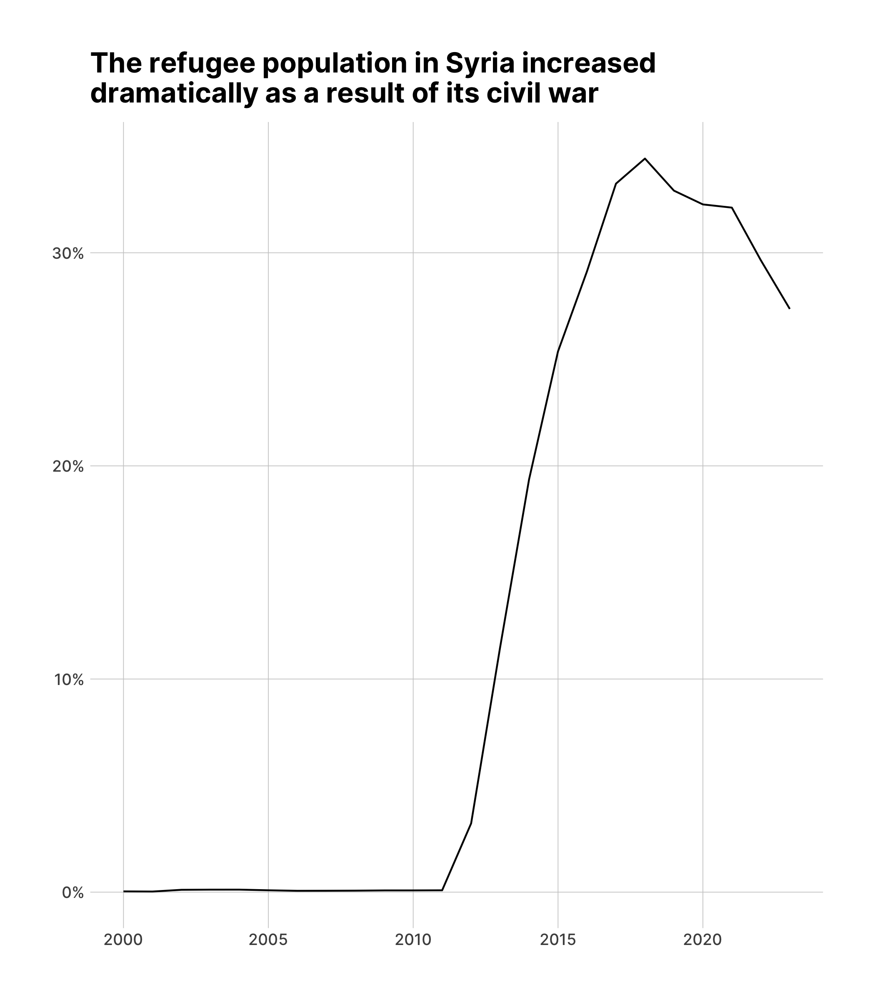
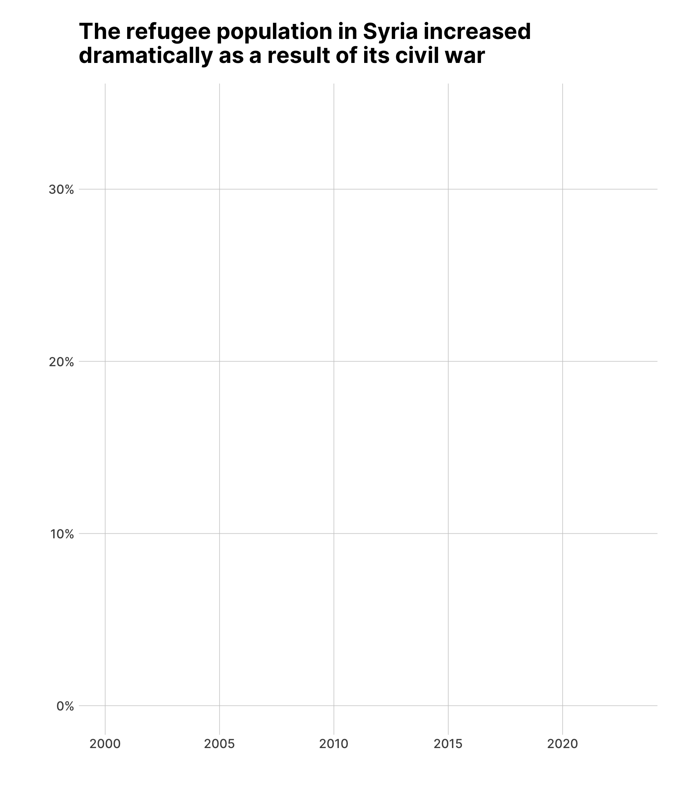
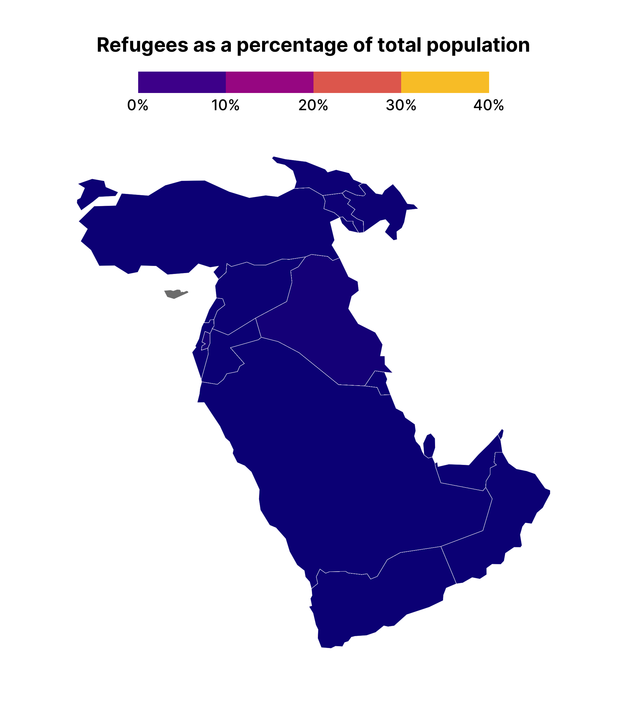
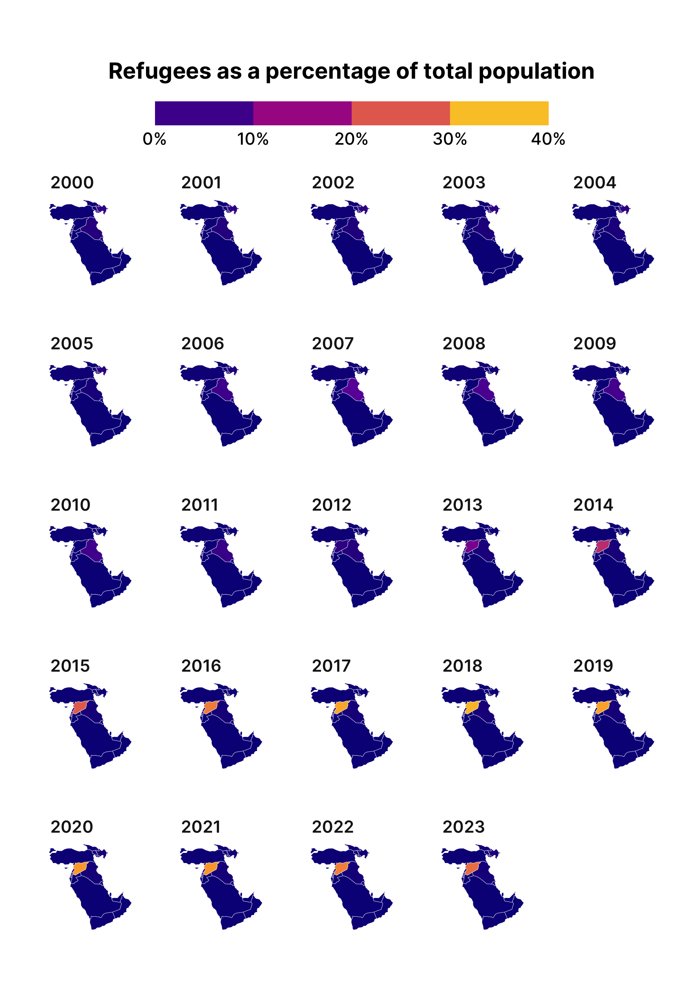

# Refugees animation
David Keyes
2024-11-27

## Data

The {gganimate} package is the easiest way to make animated plots in R. If you know how to make plots in ggplot, you can animate them with {gganimate}. Animated plots are a great way to capture attention, especially online where the next shiny object is just a scroll away. If you want to get attention on your data, using animation with a package like {gganimate} is a great option.

In this blog post, I’ll show how to use the {gganimate} package by animating data on refugees. As part of our [one percent for people, one percent for the planet giving program](https://rfortherestofus.com/1percent), we regularly support the work of the United Nations High Commissioner for Refugees (UNHCR). If you want to learn more about how the UNHCR uses R, please see our interviews with UNHCR statistician [Ahmadou Dicko](https://rfortherestofus.com/2024/03/podcast-episode-13) and information management officer Cédric Vidonne. TODO: Add link

## Import Data

To show how {gganimate} works, let’s use data from UNHCR. [Their {refugees} package](https://www.unhcr.org/refugee-statistics/insights/explainers/refugees-r-package.html) has data on a number of different datasets related to refugee populations. I’ll use one of these datasets, called `population`, which has “data on forcibly displaced and stateless persons by year, including refugees, asylum-seekers, internally displaced people (IDPs) and stateless people.”

I begin by loading the {refugees} package:

``` r
library(refugees)
```

And then showing the `population` data:

``` r
population
#> # A tibble: 126,402 × 16
#>     year coo_name coo   coo_iso coa_name   coa   coa_iso refugees asylum_seekers
#>    <dbl> <chr>    <chr> <chr>   <chr>      <chr> <chr>      <dbl>          <dbl>
#>  1  1951 Unknown  UKN   UNK     Australia  AUL   AUS       180000              0
#>  2  1951 Unknown  UKN   UNK     Austria    AUS   AUT       282000              0
#>  3  1951 Unknown  UKN   UNK     Belgium    BEL   BEL        55000              0
#>  4  1951 Unknown  UKN   UNK     Canada     CAN   CAN       168511              0
#>  5  1951 Unknown  UKN   UNK     Denmark    DEN   DNK         2000              0
#>  6  1951 Unknown  UKN   UNK     France     FRA   FRA       290000              0
#>  7  1951 Unknown  UKN   UNK     United Ki… GBR   GBR       208000              0
#>  8  1951 Unknown  UKN   UNK     Germany    GFR   DEU       265000              0
#>  9  1951 Unknown  UKN   UNK     Greece     GRE   GRC        18000              0
#> 10  1951 Unknown  UKN   UNK     China, Ho… HKG   HKG        30000              0
#> # ℹ 126,392 more rows
#> # ℹ 7 more variables: returned_refugees <dbl>, idps <dbl>, returned_idps <dbl>,
#> #   stateless <dbl>, ooc <dbl>, oip <dbl>, hst <dbl>
```

This dataset has more variables than we need. I’ve done some work to calculate the refugee population from each country as a percentage of its total population in all years since 2000 (you can see the code for that [here](https://github.com/rfortherestofus/blog/blob/main/gganimate/gganimate.qmd)). To see the data that I end up with, I’ll load the {tidyverse}:

``` r
library(tidyverse)
```

Next, I’ll import the data I’ve created and saved as an RDS file:

``` r
refugees_data <-
  read_rds("https://github.com/rfortherestofus/blog/raw/refs/heads/main/gganimate/refugees_data.rds")
```

We can take a look at the `refugees_data` tibble we now have to work with:

``` r
refugees_data
#> # A tibble: 5,136 × 3
#>     year country_abbreviation refugees_as_pct
#>    <dbl> <chr>                          <dbl>
#>  1  2018 SYR                            0.344
#>  2  2017 SYR                            0.332
#>  3  2019 SYR                            0.329
#>  4  2020 SYR                            0.323
#>  5  2021 SYR                            0.321
#>  6  2022 SYR                            0.296
#>  7  2016 SYR                            0.291
#>  8  2023 SYR                            0.274
#>  9  2015 SYR                            0.254
#> 10  2017 SSD                            0.229
#> # ℹ 5,126 more rows
```

I’ve sorted the data to show the single year and country with the highest percentage of refugees as a proportion of the total population. As you can see, Syria (with the country abbreviation SYR) has the top 9 observations, a result of its [decade-plus civil war](https://www.cfr.org/article/syrias-civil-war).

## Make an Animated Plot

We’re now ready to plot our data. I’ll load a few more packages: {scales} to give me nicely formatted axis text, {hrbrthemes} for its lovely ggplot themes, and {gganimate}.

``` r
library(scales)
library(hrbrthemes)
library(gganimate)
```

First, we can make a basic chart from our data. We filter to only show Syria and then make a line chart with `geom_line()`. We make some aesthetic tweaks: the `percent_format()` function give us nicely formatted percentages on the y axis and `theme_ipsum_inter()` makes our plot look good overall.

``` r
refugees_data |>
  filter(country_abbreviation == "SYR") |>
  ggplot(
    aes(
      x = year,
      y = refugees_as_pct
    )
  ) +
  geom_line() +
  scale_y_continuous(
    labels = percent_format()
  ) +
  labs(
    x = NULL,
    y = NULL,
    title = "The refugee population in Syria increased\ndramatically as a result of its civil war"
  ) +
  theme_ipsum_inter(base_size = 12) +
  theme(panel.grid.minor = element_blank())
```



We then save this plot as `syria_refugees_plot`.

Now, in order to animate the plot, we take the `syria_refugees_plot` object and add a transition to it. The {gganimate} package has [multiple transitions](https://gganimate.com/reference/index.html#transitions). Which one you use depends on the type of data you are working with as well as how you want to animate it. Here, I’ve used `transition_reveal(year)`, which tells {gganimate} to sequentially reveal the data, year by year. The result is an animated plot that shows the dramatic rise in the Syrian refugee population starting in 2011.

``` r
syria_refugees_plot +
  transition_reveal(year)
```



## Make an Animated Map

The {gganimate} package works with any type of data. You can even use it when making maps. To demonstrate this, I’ll begin by loading the {sf} package.

``` r
library(sf)
```

This package gives me access to the `read_sf()` function, which I use to import geospatial data on all countries.

``` r
countries_data <-
  read_sf("https://github.com/rfortherestofus/blog/raw/refs/heads/main/gganimate/countries_data.geojson")
```

Taking a look at the `countries_data` object, we can see it has a `country_abbreviation` column, as well as `continent` and `subregion`.

``` r
countries_data
#> Simple feature collection with 172 features and 3 fields
#> Geometry type: MULTIPOLYGON
#> Dimension:     XY
#> Bounding box:  xmin: -180 ymin: -90 xmax: 180 ymax: 83.64513
#> Geodetic CRS:  WGS 84
#> # A tibble: 172 × 4
#>    country_abbreviation continent     subregion                         geometry
#>    <chr>                <chr>         <chr>                   <MULTIPOLYGON [°]>
#>  1 FJI                  Oceania       Melanesia        (((180 -16.06713, 180 -1…
#>  2 TZA                  Africa        Eastern Africa   (((33.90371 -0.95, 34.07…
#>  3 ESH                  Africa        Northern Africa  (((-8.66559 27.65643, -8…
#>  4 CAN                  North America Northern America (((-122.84 49, -122.9742…
#>  5 USA                  North America Northern America (((-122.84 49, -120 49, …
#>  6 KAZ                  Asia          Central Asia     (((87.35997 49.21498, 86…
#>  7 UZB                  Asia          Central Asia     (((55.96819 41.30864, 55…
#>  8 PNG                  Oceania       Melanesia        (((141.0002 -2.600151, 1…
#>  9 IDN                  Asia          South-Eastern A… (((141.0002 -2.600151, 1…
#> 10 ARG                  South America South America    (((-68.63401 -52.63637, …
#> # ℹ 162 more rows
```

Next, I’m going to join this `countries_data` object with the `refugees_data` object we created above. I’ll then filter to only include countries in the subregion Western Asia and rearrange columns with `select()`.

``` r
middle_east_refugees_data <-
  countries_data |>
  left_join(
    refugees_data,
    join_by(country_abbreviation)
  ) |>
  filter(subregion == "Western Asia") |>
  select(year, country_abbreviation, refugees_as_pct)
```

This gives me geospatial data on refugees in the Middle East.

``` r
middle_east_refugees_data
#> Simple feature collection with 408 features and 3 fields
#> Geometry type: MULTIPOLYGON
#> Dimension:     XY
#> Bounding box:  xmin: 26.04335 ymin: 12.58595 xmax: 59.80806 ymax: 43.5531
#> Geodetic CRS:  WGS 84
#> # A tibble: 408 × 4
#>     year country_abbreviation refugees_as_pct                           geometry
#>    <dbl> <chr>                          <dbl>                 <MULTIPOLYGON [°]>
#>  1  2007 ISR                        0.000214  (((35.71992 32.70919, 35.54567 32…
#>  2  2008 ISR                        0.000203  (((35.71992 32.70919, 35.54567 32…
#>  3  2009 ISR                        0.000173  (((35.71992 32.70919, 35.54567 32…
#>  4  2011 ISR                        0.000170  (((35.71992 32.70919, 35.54567 32…
#>  5  2010 ISR                        0.000169  (((35.71992 32.70919, 35.54567 32…
#>  6  2012 ISR                        0.000168  (((35.71992 32.70919, 35.54567 32…
#>  7  2013 ISR                        0.000127  (((35.71992 32.70919, 35.54567 32…
#>  8  2006 ISR                        0.000124  (((35.71992 32.70919, 35.54567 32…
#>  9  2014 ISR                        0.000118  (((35.71992 32.70919, 35.54567 32…
#> 10  2004 ISR                        0.0000983 (((35.71992 32.70919, 35.54567 32…
#> # ℹ 398 more rows
```

I can now use this data to make a map. The `geom_sf()` function plots my data and I use the `fill` aesthetic to make the shading of each country different depending on the value in the `refugees_as_pct` variable.

``` r
middle_east_refugees_data |>
  ggplot() +
  geom_sf(
    aes(fill = refugees_as_pct),
    linewidth = 0.1,
    color = "white"
  ) +
  scale_fill_viridis_c(
    labels = percent_format(),
    limits = c(0, .4),
    option = "C",
    guide = guide_colorsteps(show.limits = TRUE)
  ) +
  labs(
    title = "Refugees as a percentage of total population",
    fill = NULL
  ) +
  theme_ipsum_inter(
    grid = FALSE
  ) +
  theme(
    legend.position = "top",
    plot.title = element_text(
      face = "bold",
      hjust = 0.5
    ),
    axis.text.x = element_blank(),
    axis.text.y = element_blank(),
    legend.key.width = unit(2, "cm"),
    legend.text = element_text(
      size = 12
    )
  )
```

The result, though, isn’t quite what we expect:



That’s because the data is longitudinal. That is, we have multiple years for each year, meaning earlier years are covering up later ones. To see what is going on, let’s make a small multiples chart. I’ve saved the previous plot as `middle_east_refugees_map`. If I add a `facet_wrap()` onto it, I can see the data for each year.

``` r
middle_east_refugees_map +
  facet_wrap(vars(year))
```



This plot allows us to see how the earlier data from 2000 is covering up later years, making it appear that no countries have refugees.

Making a facetted chart like this is actually quite instructive about how {gganimate} works. Specifically, it takes the variable that you use to animate on, creates one plot for each unique observation of that variable, and then puts each plot together, one after the other, kind of like an old [flipbook](https://en.wikipedia.org/wiki/Flip_book). If we add `transition_manual(year)` (this works with our geospatial data) to `middle_east_refugees_map`, you can see the animated result.

``` r
middle_east_refugees_map +
  transition_manual(year)
```


One difficult thing about the animated map we’ve just made is that we can’t see the year on display as the shading changes. To add this, we can use the `{current_frame}` syntax provided by {gganimate}, adjusting our title as follows:

``` r
middle_east_refugees_map +
  labs(title = "Refugees as a percentage of total population in {current_frame}") +
  transition_manual(year)
```

The resulting map will show `{current_frame}` replaced by the year, meaning your title is animated alongside the map itself.


I’ve only covered the surface here; the {gganimate} package has a [lot of additional functions](https://gganimate.com/reference/index.html) to tweak your animations. Hopefully this introduction to {gganimate} will inspire you to check them out!
