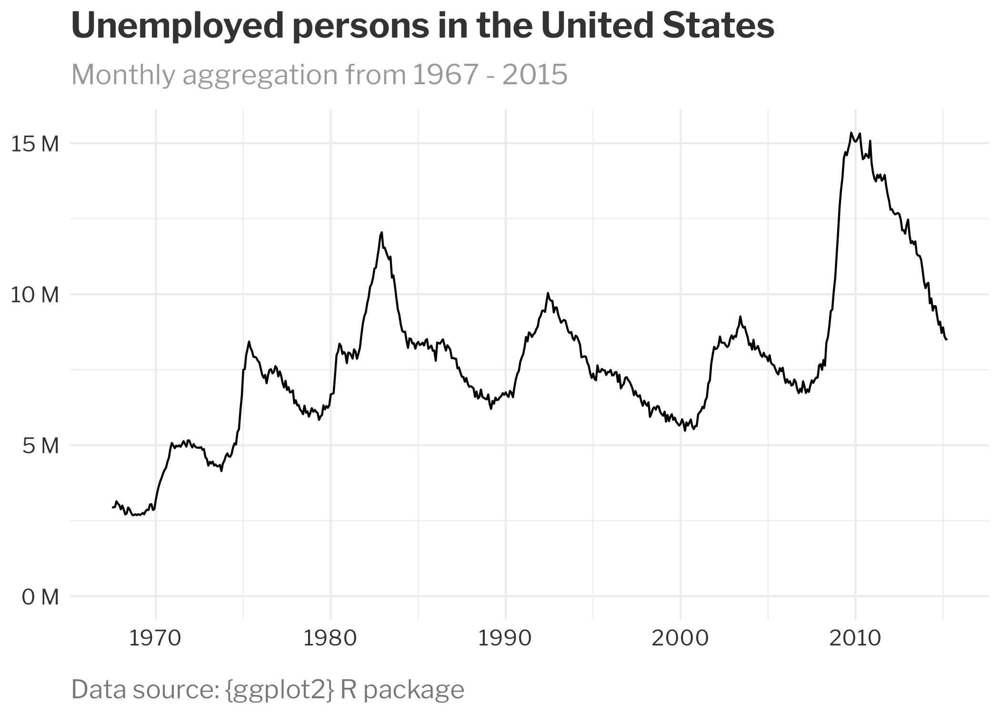

# Create your own custom {ggplot2} theme
Jadey Ryan
2024-11-09

Creating custom themes in `{ggplot2}` lets you elevate your data
visualizations from standard to standout.

Whether you’re aiming for a polished, brand-consistent look for your
organization or a unique aesthetic that reflects your personal style, a
custom theme function makes it easy to apply your design to all figures
with a single line of code.

In this tutorial, we’ll cover:

- the essentials of the powerful `ggplot2::theme()` function, including
  how to adjust fonts, colors, sizing, and spacing;

- how to wrap your custom theme into a reusable function for any figure;

- and how to add arguments to your function for further customization on
  specific plots.

# Today’s inspiration: New York Times

To demonstrate the creation of a custom theme function, let’s create a
custom function based on how the New York Times styles their plots.

Taking a look at [this sample New York Times (NYT) plot on ocean
temperatures](https://www.nytimes.com/2024/05/23/weather/noaa-atlantic-hurricane-forecast-prediction.html),
we can figure out the font, color, and sizing elements to include in our
custom theme:


First, we can see that the New York Times uses the [Franklin Gothic
font](https://fonts.adobe.com/fonts/atf-franklin-gothic) for their
plots. This is a paid font so instead I will use Libre Franklin, which
can be [downloaded for free from Google
Fonts](https://fonts.google.com/specimen/Libre+Franklin). Make sure to
install the font on your system before proceeding. For more information
on using custom fonts in R, see this [free
lesson](https://rfortherestofus.com/courses/going-deeper/lessons/customize-your-fonts-v2)
from [Going Deeper with
R](https://rfortherestofus.com/courses/going-deeper/).

From there, we can see that NYT plots use the following elements:

- **Title**: bold, largest, left-aligned to plot, darkest text
- **Subtitle**: regular face, medium sized, left-aligned to plot, light
  gray text
- **Caption**: regular face, smallest sized, left-aligned to plot, dark
  gray text
- **Axis text**: regular face, medium sized, dark gray text
- **Axis lines**: major grid lines only for y-axis that are dashed,
  light gray
- **Spacing**: plenty of breathing room with margins around each element


NYT figures generally rely on annotations instead of legends. Though
this is beyond the scope of this blog post, you can find a couple other
R for the Rest of Us posts to help you:

- [How to add annotations in ggplot: should you use geoms or
  annotations?](https://rfortherestofus.com/2023/10/annotate-vs-geoms)
- [Getting started with
  {geomtextpath}](https://rfortherestofus.com/2024/01/get-started-geomtextpath)

If you’re creating a custom theme for your organization’s branding, ask
your design or marketing team if they have a style guide you can follow,
rather than inspecting existing figures!

# Match the style elements with `theme()` arguments

Now that we’ve identified some font, color, and sizing elements to
include in our custom theme, we now need to figure out which `theme()`
arguments they correspond with.

To see all the available arguments (there are almost 100 of them!), you
can look at the `theme()` documentation by running `?theme` or by
skimming the [{ggplot2} reference
webpage](https://ggplot2.tidyverse.org/reference/theme.html).

These arguments offer fine-tuned customization of the look and feel of
your plots and can be grouped in these main categories:

- **Text elements**: `plot.title`, `axis.title`, `axis.text`,
  `legend.title`, etc., control font size, style, color, and alignment
  with `element_text()`.
- **Line elements**: `axis.line` and `panel.grid` adjust line color,
  size, and type with `element_line()`.
- **Rectangular elements**: `panel.background`, `plot.background`,
  `legend.background` affect color and border of background areas with
  `element_rect()`.

You definitely don’t need to memorize all of these arguments, but it is
worth it to learn where to find the descriptions so you can reference
them as needed. [Henry Wang’s blog
post](https://henrywang.nl/ggplot2-theme-elements-demonstration/) also
has a great figure to help you remember what is what!


# Create an example plot

First, let’s create a basic plot with the default {`ggplot2`} theme and
the built-in `economics` dataset.

``` r
default_plot <- ggplot(economics, aes(date, unemploy)) +
  geom_line() +
  labs(
    title = "Unemployed persons in the United States",
    subtitle = "Monthly aggregation from 1967 - 2015",
    caption = "Data source: {ggplot2} R package",
    x = NULL,
    y = NULL
  ) +
  # Unemployment level is number of unemployed in thousands.
  # This declutters the figure by presenting the number of
  # unemployed in millions
  scale_y_continuous(
    labels = scales::label_number(
      scale = 0.001,
      suffix = " M"
    ),
    limits = c(0, max(economics$unemploy))
  )
```

Here is our plot.


# Pick a built-in theme as a base

The easiest way to start customizing a theme is to pick one of the
built-in [complete `{ggplot2}`
themes](https://ggplot2.tidyverse.org/reference/ggtheme.html) that most
closely matches the style you’re going for.

We’ll use `theme_minimal()` and modify its `base_family` to change the
font family throughout all text elements in the plot.

``` r
nyt_plot <- default_plot +
  theme_minimal(
    base_family = "Libre Franklin"
  )
```

Taking a look at `nyt_plot`, we can see these changes.


Note, we could have set the base font family in the `theme()` function.
But that would require a lot more copying and pasting of the family
through multiple arguments, as we’ll see in the next section.

# Customize text elements

Next, let’s set the size, face, color, and spacing options of the text
elements in the `theme()` function that is called **after** we set the
the `theme_minimal()`. Remember, this {`ggplot2}` follows the [Grammar
of Graphics](https://ggplot2-book.org/), so each customization is
layered on top of the last.

We recommend having the `theme()` and `element_text()` reference
documentation on hand to help remember which arguments to use.

`plot.title`, `plot.subtitle`, `plot.caption`, and `axis.text` are all
text elements, which can be customized using dozen or so arguments
within the `element_text()` function:

- `size`: text size in pts
- `face`: font face (“plain”, “italic”, “bold”, “bold.italic”)
- `color`: color of the text, usually named (“red”) or hex color codes
- `margin`: uses the `margin()` function with arguments `t`, `r`, `b`,
  `l` for specifying top, right, bottom, or left
- `hjust`: horizontal justification between 0 and 1. Left-justified is
  0, center is 0.5, and right-justified is 1.

Below, you can see how we use these arguments to customize various
elements of our theme.

``` r
nyt_plot <- nyt_plot +
  theme(
    plot.title = element_text(
      size = 18,
      face = "bold",
      color = "#333333", # dark gray
      margin = margin(b = 10)
    ),
    plot.subtitle = element_text(
      size = 14,
      color = "#999999", # medium gray
      margin = margin(b = 10)
    ),
    plot.caption = element_text(
      size = 13,
      color = "#777777", # light gray
      margin = margin(t = 15),
      hjust = 0
    ),
    axis.text = element_text(
      size = 11,
      color = "#333333" # dark gray
    )
  )
```

We can now view our plot with the updated in-progress theme.



Currently, the title, subtitle, and caption are aligned to the plot
panel (default of `plot.title.position = "panel"`). But we want them
aligned to the entire plot so we’ll change the position to `"plot"`.

``` r
nyt_plot <- nyt_plot +
  theme(
    plot.title.position = "plot",
    plot.caption.position = "plot"
  )
```

Again, we can see our in-progress plot.


# Customize line elements

Grid lines and axes are controlled with `element_line()`.

Notice there is a hierarchy within the theme elements:

1.  `panel.grid.major`
2.  `panel.grid.major.x`, which [inherits
    attributes](https://ggplot2.tidyverse.org/reference/theme.html#theme-inheritance)
    from `panel.grid.major`

By setting `panel.grid.major.x` equal to `element_blank()`, we overwrite
the attributes of `panel.grid.major` and instead make the major x grid
lines blank.

Within `element_blank()`, we control the line type, line width, and
color. Running `?element_line` will show you several other arguments you
can use to further customize lines.

Sometimes there are arguments within `theme()` that cannot be controlled
by a higher element. For example, there is no argument within
`element_line()` to control the length of the x-axis ticks. Therefore,
we need the `axis.ticks.length.x` argument.

``` r
nyt_plot <- nyt_plot +
  theme(
    panel.grid.minor = element_blank(),
    panel.grid.major = element_line(
      linetype = "dashed",
      linewidth = 0.15,
      color = "#999999"
    ),
    panel.grid.major.x = element_blank(),
    axis.ticks.x = element_line(
      linetype = "solid",
      linewidth = 0.25,
      color = "#999999"
    ),
    axis.ticks.length.x = unit(4, units = "pt")
  )
```

The plot with tweaks to the gridlines and ticks can be seen below.


We went from the boring {ggplot2} default theme to this much more
polished, professional figure that looks like it could be from the New
York Times! While it took many lines of code, we can now create a custom
function so we can easily apply it to other plots with only one line of
code!

# Wrap it in a function

To make our custom theme function, we simply paste our previous theme
code within the curly braces of our new function called `theme_nyt()`.

As you can see, there are so many lines of code, it may help your future
self to separate text elements from line elements as you add more and
more arguments to the `theme()` function inside your custom function.

``` r
theme_nyt <- function() {
  # Set base theme and font family =============================================
  theme_minimal(
    base_family = "Libre Franklin"
  ) +
    # Overwrite base theme defaults ============================================
    theme(
      # Text elements ==========================================================
      plot.title = element_text(
        size = 18,
        face = "bold",
        color = "#333333",
        margin = margin(b = 10)
      ),
      plot.subtitle = element_text(
        size = 14,
        color = "#999999",
        margin = margin(b = 10)
      ),
      plot.caption = element_text(
        size = 13,
        color = "#777777",
        margin = margin(t = 15),
        hjust = 0
      ),
      axis.text = element_text(
        size = 11,
        color = "#333333"
      ),
      plot.title.position = "plot",
      plot.caption.position = "plot",
      # Line elements ==========================================================
      panel.grid.minor = element_blank(),
      panel.grid.major = element_line(
        linetype = "dashed",
        linewidth = 0.15,
        color = "#999999"
      ),
      panel.grid.major.x = element_blank(),
      axis.ticks.x = element_line(
        linetype = "solid",
        linewidth = 0.25,
        color = "#999999"
      ),
      axis.ticks.length.x = unit(4, units = "pt")
    )
}
```

Let’s test if we get the same figure using our new custom function
instead of calling the `theme()` function with many arguments.

``` r
default_plot +
  theme_nyt()
```

The resulting plot matches exactly!


While we created `theme_nyt()` specifically for a time-series plot that
only needs y-axis grid lines, we likely would need both x-axis and
y-axis grid lines for a different plot type such as a scatter plot.

# Add arguments to your custom theme function

We’ll add two new arguments to our `theme_nyt()` function: `gridline_x`
and `gridline_y` which we will set default to `TRUE` to make it clear to
the user that it should be logical.

``` r
theme_nyt <- function(gridline_x = TRUE, gridline_y = TRUE) {

}
```

Set `gridline_x` and `gridline_y` to `if` `else` statements that if
evaluated to `TRUE`, will evaluate to a variable defined within our
function that is set to the `element_line()` function with our desired
attributes for grid lines. If `gridline_x` or `gridline_y` evaluate to
`FALSE`, they will be set to `element_blank()` and will not appear in
the plot.

``` r
theme_nyt <- function(gridline_x = TRUE, gridline_y = TRUE) {
  gridline <- element_line(
    linetype = "dashed",
    linewidth = 0.15,
    color = "#999999"
  )

  gridline_x <- if (isTRUE(gridline_x)) {
    gridline
  } else {
    element_blank()
  }

  gridline_y <- if (isTRUE(gridline_y)) {
    gridline
  } else {
    element_blank()
  }
  ...
}
```

The last step is to set `panel.grid.major.x` and `panel.grid.major.y` to
our new variables `gridline_x` and `gridline_y`, respectively, within
the `theme()` function of our custom `theme_nyt()` function.

``` r
theme_nyt <- function(gridline_x = TRUE, gridline_y = TRUE) {
  ...
  # Overwrite base theme defaults ==============================================
  theme(
    panel.grid.major.x = gridline_x,
    panel.grid.major.y = gridline_y,
    ...
  )
}
```

Now let’s see it all together in the updated function with the grid line
arguments.

``` r
theme_nyt <- function(gridline_x = TRUE, gridline_y = TRUE) {
  gridline <- element_line(
    linetype = "dashed",
    linewidth = 0.15,
    color = "#999999"
  )

  gridline_x <- if (isTRUE(gridline_x)) {
    gridline
  } else {
    element_blank()
  }

  gridline_y <- if (isTRUE(gridline_y)) {
    gridline
  } else {
    element_blank()
  }

  # Set base theme and font family =============================================
  theme_minimal(
    base_family = "Libre Franklin"
  ) +
    # Overwrite base theme defaults ============================================
    theme(
      # Text elements ==========================================================
      plot.title = element_text(
        size = 18,
        face = "bold",
        color = "#333333",
        margin = margin(b = 10)
      ),
      plot.subtitle = element_text(
        size = 14,
        color = "#999999",
        margin = margin(b = 10)
      ),
      plot.caption = element_text(
        size = 13,
        color = "#777777",
        margin = margin(t = 15),
        hjust = 0
      ),
      axis.text = element_text(
        size = 11,
        color = "#333333"
      ),
      plot.title.position = "plot",
      plot.caption.position = "plot",
      # Line elements ==========================================================
      panel.grid.minor = element_blank(),
      panel.grid.major.x = gridline_x,
      panel.grid.major.y = gridline_y,
      axis.ticks.x = element_line(
        linetype = "solid",
        linewidth = 0.25,
        color = "#999999"
      ),
      axis.ticks.length.x = unit(4, units = "pt")
    )
}
```

We’ll test it out on the same unemployment plot we’ve been working with
to make sure it looks as expected.

``` r
default_plot +
  theme_nyt(gridline_x = FALSE, gridline_y = TRUE)
```

And it does! Yay!


Our last test will be applying it to a different type of plot that
should show grid lines for the x-axis and y-axis. First, we’ll create a
scatterplot.

``` r
mtcars_plot <- ggplot(mtcars, aes(wt, mpg)) +
  geom_point() +
  labs(
    title = "Fuel economy declines as weight increases",
    subtitle = "Fuel economy and weight for 32 automobiles (1973–74 models)",
    caption = "Data source: {ggplot2} R package",
    x = "Weight (1000 lbs)",
    y = "Miles per US gallon"
  )
```

Here’s what the plot looks like:


Next, we can apply the them to our plot, setting `gridline_x` and
`gridline_y` to `TRUE`.

``` r
mtcars_plot <- mtcars_plot +
  theme_nyt(gridline_x = TRUE, gridline_y = TRUE)
```

And here is the resulting plot:


Awesome! We now have a scatter plot that looks like it could have come
from the New York Times with both x-axis and y-axis grid lines!

You can follow this process to add more flexibility to your custom theme
function, whether you want to allow your users to pick the base font
family, grid line colors, legend placement, or any number of the other
dozens of customizable elements.

# Conclusion

Hooray! We’ve walked through where to find all the documentation for the
very powerful `theme()`, `element_text()`, and `element_line()`
functions that give `{ggplot2}` its flexibility in creating the visuals
that match your style. Hopefully, you can follow this guide to design
your own custom theme and apply it to many types of plots.

For other examples and inspiration, check out this [article by BBC
Visual and Data
Journalism](https://medium.com/bbc-visual-and-data-journalism/how-the-bbc-visual-and-data-journalism-team-works-with-graphics-in-r-ed0b35693535)
(there is also a [chapter in R for the Rest of Us: A Statistics-Free
Introduction about the creation of the BBC’s custom ggplot
theme](https://book.rfortherestofus.com/themes.html)). There are also
packages with custom themes in them, such as the [{ggthemes}
package](https://jrnold.github.io/ggthemes/) that compiles other
pre-built themes to replicate the styles of other media outlets,
including FiveThirtyEight, The Economist, and others.
