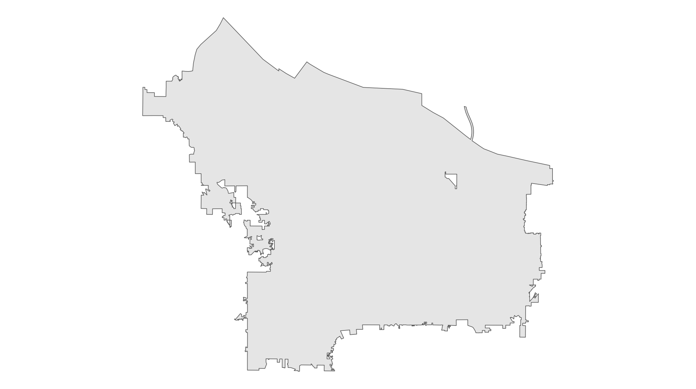
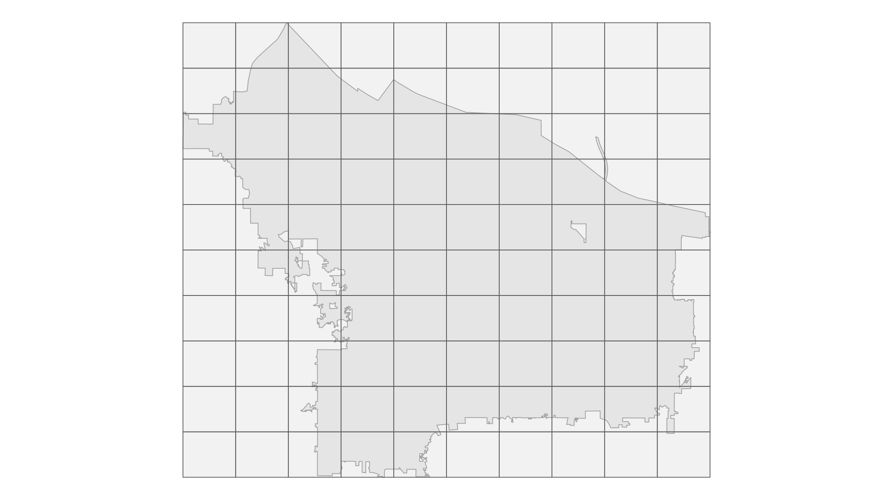
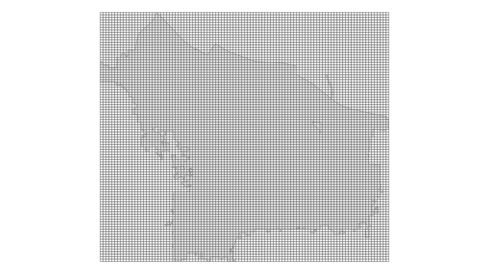
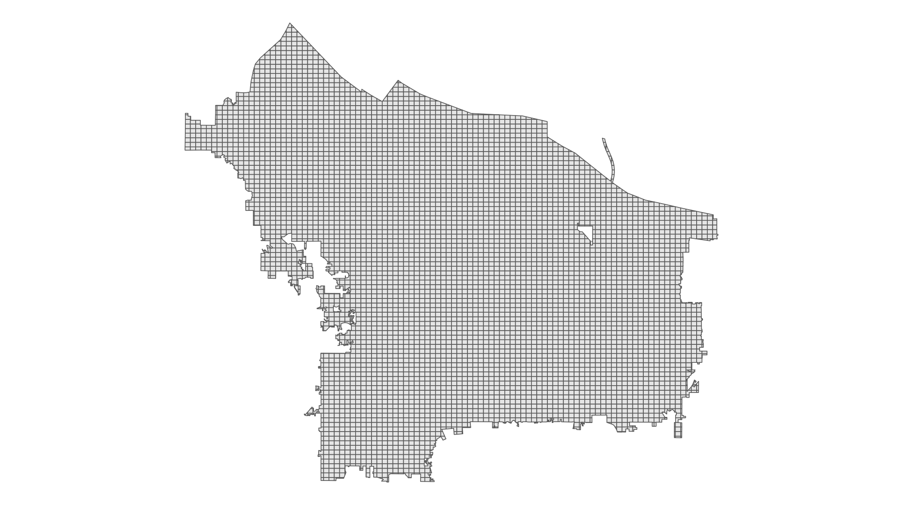
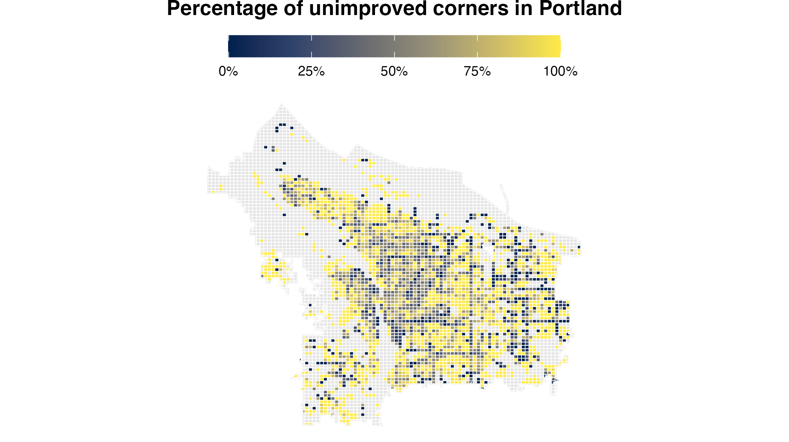

# How to make a heatmaps in ggplot
David Keyes
2024-11-09

### Import data

To start our map, we’ll load several packages: the {tidvyerse} for
general data wrangling and mapping with ggplot, {sf} for working with
geospatial data, and {scales} to make nicely formatted values.

``` r
library(tidyverse)
library(sf)
library(scales)
```

Next, we’ll import our data. We begin by importing a geojson file with
the location of all corners in Portland.

``` r
improved_corners <-
  read_sf(
    "https://raw.githubusercontent.com/rfortherestofus/mapping-with-r-v2/refs/heads/main/data/improved_corners.geojson"
  )
```

We can look the `improved_corners` data frame we’ve created and see that
it consists of an id variable (`objectid)`, a `ramp_style` variable
(which is either Improved or Unimproved), and a geometry column, which
consists of the location of each corner:

    #> Simple feature collection with 38492 features and 2 fields
    #> Geometry type: POINT
    #> Dimension:     XY
    #> Bounding box:  xmin: -122.8301 ymin: 45.43282 xmax: -122.4619 ymax: 45.63909
    #> Geodetic CRS:  WGS 84
    #> # A tibble: 38,492 × 3
    #>    objectid ramp_style             geometry
    #>       <int> <chr>               <POINT [°]>
    #>  1        1 Unimproved  (-122.6607 45.6012)
    #>  2        2 Unimproved (-122.6606 45.60167)
    #>  3        3 Unimproved (-122.6605 45.60117)
    #>  4        4 Unimproved (-122.6604 45.60163)
    #>  5        5 Unimproved (-122.6603 45.60056)
    #>  6        6 Unimproved (-122.6603 45.60072)
    #>  7        7 Unimproved (-122.6602 45.60079)
    #>  8        8 Unimproved (-122.6551 45.59177)
    #>  9        9 Unimproved (-122.6546 45.59212)
    #> 10       10 Unimproved (-122.6538 45.59125)
    #> # ℹ 38,482 more rows

We’ll also import a geojson file that has the boundaries of the city of
Portland.

``` r
portland_boundaries <-
  read_sf(
    "https://raw.githubusercontent.com/rfortherestofus/mapping-with-r-v2/refs/heads/main/data/portland_boundaries.geojson"
  )
```

The easiest way to see what this data looks like is with a quick map,
which we can do with ggplot:

``` r
portland_boundaries |>
  ggplot() +
  geom_sf() +
  theme_void()
```

This code gives us this map:



### Create a grid

Next, we’re going to take our `portland_boundaries` object and create a
grid from it. The `st_make_grid()` function enables us to do this as
follows:

``` r
portland_grid <-
  portland_boundaries |>
  st_make_grid()
```

We can see what this grid looks like by plotting it:

``` r
ggplot() +
  geom_sf(data = portland_boundaries) +
  geom_sf(
    data = portland_grid,
    alpha = 0.5
  ) +
  theme_void()
```

This code gives us a grid map overlaid on top of the boundaries of
Portland.



By default, the `st_make_grid()` creates a 10 by 10 grid. However, to
make our heatmap, we’d like to have more cells. So let’s adjust our code
to make a 100 by 100 grid:

``` r
portland_grid <-
  portland_boundaries |>
  st_make_grid(n = c(100, 100))
```

The same code as before makes a map that reflects the more fine-grained
cells:



### Clip city boundaries to the grid map

We’ve made a grid, but the grid has many cells outside of the boundaries
of Portland. To clip the grid to these boundaries, we can use the
`st_intersection()` function as follows. After `st_intersection()`, we
also run `st_make_valid()`, which deals with an issue particular to the
city of Portland where there is [separate city within its
boundaries](https://www.opb.org/artsandlife/article/maywood-park-oregon-portland-history-interstate-205/).
I also create a `grid_id` variable, which we will use below when joining
the data on corners with our grid map.

``` r
portland_grid_map <-
  st_intersection(
    portland_boundaries,
    portland_grid
  ) |>
  st_make_valid() |>
  mutate(grid_id = row_number()) |>
  select(grid_id)
```

We can now plot the `portland_grid_map` object:

``` r
portland_grid_map |>
  ggplot() +
  geom_sf() +
  theme_void()
```

Which gives us this map:



### Join our corners data with the grid map

Now that we’ve created a grid map that is clipped to the boundaries of
Portland, we need to join our data on corners with it. Doing so will
enable us to see where there are higher concentrations of unimproved
corners. We join our `portland_grid_map` and `improved_corners` objects
using the `st_join()` function:

``` r
improved_corners_grid <-
  st_join(
    portland_grid_map,
    improved_corners
  )
```

If we look at `improved_corners_grid`, we can see that it has each
corner joined to the grid cell within which it is located.

    #> Simple feature collection with 41222 features and 3 fields
    #> Geometry type: MULTIPOLYGON
    #> Dimension:     XY
    #> Bounding box:  xmin: -122.8368 ymin: 45.43254 xmax: -122.472 ymax: 45.65289
    #> Geodetic CRS:  WGS 84
    #> # A tibble: 41,222 × 4
    #>    grid_id                                          geometry objectid ramp_style
    #>  *   <int>                                <MULTIPOLYGON [°]>    <int> <chr>     
    #>  1       1 (((-122.7437 45.43474, -122.7437 45.43446, -122.…       NA <NA>      
    #>  2       2 (((-122.7419 45.43328, -122.7412 45.43327, -122.…    23683 Unimproved
    #>  3       2 (((-122.7419 45.43328, -122.7412 45.43327, -122.…    23684 Unimproved
    #>  4       2 (((-122.7419 45.43328, -122.7412 45.43327, -122.…    23685 Unimproved
    #>  5       2 (((-122.7419 45.43328, -122.7412 45.43327, -122.…    23686 Unimproved
    #>  6       2 (((-122.7419 45.43328, -122.7412 45.43327, -122.…    23687 Unimproved
    #>  7       2 (((-122.7419 45.43328, -122.7412 45.43327, -122.…    23688 Unimproved
    #>  8       3 (((-122.7383 45.43325, -122.7383 45.43325, -122.…    23692 Unimproved
    #>  9       3 (((-122.7383 45.43325, -122.7383 45.43325, -122.…    23696 Unimproved
    #> 10       3 (((-122.7383 45.43325, -122.7383 45.43325, -122.…    23697 Unimproved
    #> # ℹ 41,212 more rows

From there, we need to calculate the percentage of unimproved corners in
each grid. We can do this with some basic data wrangling using various
{dplyr} functions (see around 7:00 of the video for a full walkthrough
of this code). The code below also sees us use `st_drop_geometry()` to
turn geospatial data into a regular data frame before we later turn it
back into geospatial data with the `st_as_sf()` function (we do this in
order to speed up our code, which tends to run slowly on geospatial
data).

``` r
unimproved_corners_grid_pct <-
  improved_corners_grid |>
  st_drop_geometry() |>
  count(grid_id, ramp_style) |>
  complete(grid_id, ramp_style) |>
  group_by(grid_id) |>
  mutate(pct = n / sum(n, na.rm = TRUE)) |>
  ungroup() |>
  select(-n) |>
  pivot_wider(
    id_cols = grid_id,
    names_from = ramp_style,
    values_from = pct
  ) |>
  mutate(
    pct = case_when(
      is.na(Unimproved) & Improved == 1 ~ 0,
      .default = Unimproved
    )
  ) |>
  select(grid_id, pct) |>
  left_join(
    portland_grid_map,
    join_by(grid_id)
  ) |>
  st_as_sf()
```

Let’s now look at our `unimproved_corners_grid_pct` object. As you can
see, we now have one row for each grid cell, with a `pct` variable that
shows the percentage of unimproved corners in that cell.

    #> Simple feature collection with 5725 features and 2 fields
    #> Geometry type: MULTIPOLYGON
    #> Dimension:     XY
    #> Bounding box:  xmin: -122.8368 ymin: 45.43254 xmax: -122.472 ymax: 45.65289
    #> Geodetic CRS:  WGS 84
    #> # A tibble: 5,725 × 3
    #>    grid_id   pct                                                        geometry
    #>      <int> <dbl>                                              <MULTIPOLYGON [°]>
    #>  1       1    NA (((-122.7437 45.43474, -122.7437 45.43446, -122.7437 45.43419,…
    #>  2       2     1 (((-122.7419 45.43328, -122.7412 45.43327, -122.7411 45.43327,…
    #>  3       3     1 (((-122.7383 45.43325, -122.7383 45.43325, -122.7381 45.43325,…
    #>  4       4    NA (((-122.7346 45.43322, -122.7334 45.43321, -122.7334 45.43321,…
    #>  5       5    NA (((-122.731 45.43435, -122.7309 45.43435, -122.7305 45.43435, …
    #>  6       6    NA (((-122.7112 45.43474, -122.7112 45.43469, -122.7103 45.43468,…
    #>  7       7    NA (((-122.7047 45.43474, -122.7046 45.43472, -122.7046 45.4347, …
    #>  8       8     1 (((-122.7018 45.43404, -122.7011 45.43387, -122.701 45.43384, …
    #>  9       9     1 (((-122.6982 45.43255, -122.6981 45.43255, -122.6978 45.43254,…
    #> 10      10    NA (((-122.6841 45.43474, -122.6841 45.43471, -122.6841 45.4346, …
    #> # ℹ 5,715 more rows

### Making our heatmap

Having created a grid, clipped it to Portland boundaries, joined in our
data on improved corners, and calculated the percentage of unimproved
corners in each grid cell, we are now ready to create our heatmap. The
code below creates the heatmap. For a full walkthrough of the design
decisions, check out the video starting at around 10:00.

``` r
ggplot() +
  geom_sf(data = portland_boundaries) +
  geom_sf(
    data = unimproved_corners_grid_pct,
    aes(fill = pct),
    color = "white"
  ) +
  labs(fill = NULL, title = "Percentage of unimproved corners in Portland") +
  scale_fill_viridis_c(
    option = "E",
    na.value = "gray90",
    limits = c(0, 1),
    labels = percent_format()
  ) +
  theme_void() +
  theme(
    plot.title = element_text(
      hjust = 0.5,
      face = "bold",
      margin = margin(b = 10, unit = "pt")
    ),
    legend.key.width = unit(1.5, "cm"),
    legend.key.height = unit(0.5, "cm"),
    legend.position = "top"
  )
```

The result of this code is a great-looking heatmap that higlights areas
of Portland with more unimproved corners.



## Summing up

As you’ve seen the process of making a heatmap in ggplot is a bit
involved so let’s summarize:

1.  Import data on improved corners and data on the boundaries of
    Portland
2.  Create a grid map based on the boundaries data
3.  Join data on improved corners with the grid map
4.  Calculate the percentage of unimproved corners in each grid cell
5.  Map the resulting data, with cells with higher percentages of
    unimproved corners in different colors

While I’ve given an example on making a heatmap of unimproved corners in
Portland, you can use this process to make heatmaps for any outcome in
any location. Good luck making your own heatmaps!
