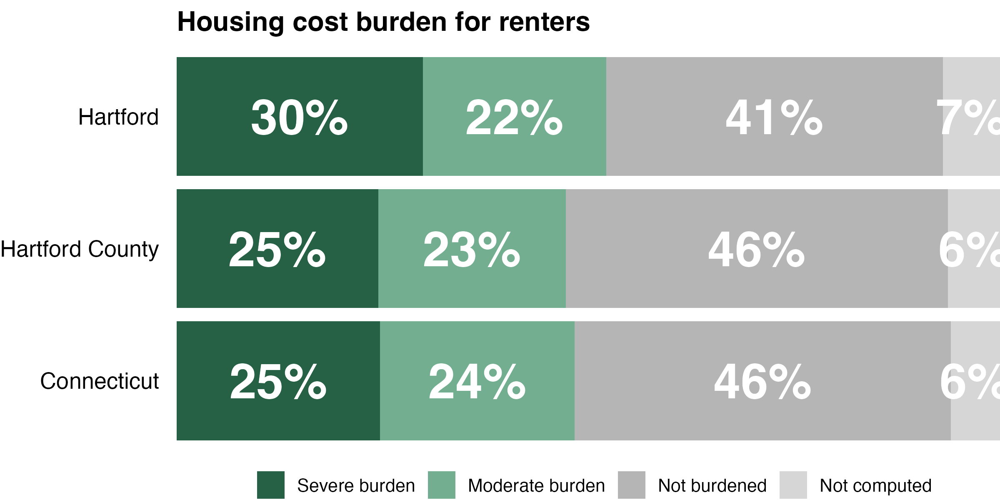

# Hide text labels with small values to make charts easier to read
David Keyes
2025-01-01

One issue that we often face when making data visualization in reports is text not fitting into graphs. This happened to us when working on reports for the [Connecticut Data Collaborative](https://www.ctdata.org/) and the [Partnership for Strong Communities](https://pschousing.org/) in Connecticut.

[The reports we made](https://rfortherestofus.com/consulting), which show key demographic and housing indicators for towns and counties across the state, have bar charts that show the housing cost burden for [renters](https://censusreporter.org/tables/B25070/) and [home owners](https://censusreporter.org/tables/B25091/) in the state. In addition to the categories severe burden (50% or greater of income spent on rent), moderate burden (between 30% and 50%), and not burdened (less than 30%), there is a not computed category, which is often quite small. For example, here is the graph for the city of Hartford.


See the light gray not computed bar? It does not have text in it. This was an intentional choice. Here’s what the renters portion of that same chart would like with text in the not computed bar.



Not great, right?

So how do we solve this problem? The answer, which I talked about in [my 2024 Cascadia R Conf talk](https://www.youtube.com/watch?v=ValvLQWYeEU&list=PLzwtsyfF_Z4ryjkFxkhvKl0IZr6_bhMvZ&index=6&ab_channel=CascadiaRConf), is to hide small values below a certain level in charts that we make. Let me show what this looks like.

## Load Packages and Import Data

To begin, I’ll load my packages (well, actually, just one package).

``` r
library(tidyverse)
```

Next, I’ll import my data. I’ve created an RDS file that I’ve posted on GitHub, which I’m importing in the code below.

``` r
housing_cost_burden <-
  read_rds("https://github.com/rfortherestofus/blog/raw/refs/heads/main/hide-small-values/housing_cost_burden.rds")
```

Having now created a `housing_cost_burden`, let’s take a look at it.

    #> # A tibble: 694 × 4
    #>    location   burden_level       pct pct_formatted
    #>    <fct>      <fct>            <dbl> <chr>        
    #>  1 Bethel     Not burdened    0.381  38%          
    #>  2 Bethel     Moderate burden 0.352  35%          
    #>  3 Bethel     Severe burden   0.229  23%          
    #>  4 Bethel     Not computed    0.0385 4%           
    #>  5 Bridgeport Not burdened    0.358  36%          
    #>  6 Bridgeport Moderate burden 0.260  26%          
    #>  7 Bridgeport Severe burden   0.332  33%          
    #>  8 Bridgeport Not computed    0.0494 5%           
    #>  9 Brookfield Not burdened    0.501  50%          
    #> 10 Brookfield Moderate burden 0.228  23%          
    #> # ℹ 684 more rows

You can see that it has variable for `location`, `burden_level`, `pct`, and `pct_formatted` (a nicely formatted version of the `pct` variable).

## Make A Basic Housing Burden Plot

Next, let’s make a basic version of the housing burden plot. The plots we made in the housing reports include one town, one county, and the state of Connecticut. To make this plot, I’m taking my `housing_cost_burden` data, filtering to only include Hartford, Hartford County, and Connecticut, then piping it into ggplot. I use `geom_col()` to make a stacked bar chart for each location and `geom_text()` to add the percent labels in the center of each bar.

``` r
housing_cost_burden |>
  filter(location %in% c(
    "Hartford",
    "Hartford County",
    "Connecticut"
  )) |>
  ggplot(
    aes(
      x = pct,
      y = location,
      fill = burden_level,
      label = pct_formatted
    )
  ) +
  geom_col() +
  geom_text(
    position = position_stack(vjust = 0.5),
    size = 10,
    fontface = "bold",
    color = "white"
  )
```

The resulting plot can be seen below. Take a look at the text labels in the not computed bars. They go beyond the boundaries of the bar, which isn’t ideal.


We’ll come back to this problem shortly. For now, let’s add a bit of styling and turn our code into a function. I start out the same, but then make tweaks with:

- `scale_fill_manual()` to use brand colors for PSC Housing and reverse the order of the legend (otherwise, it shows up in the opposite order from the bars themselves)
- `scale_y_continuous` to remove excess space around the bars
- `labs` to adjust the plot labels
- `theme_void()` to set my default theme and then `theme()` to make additional tweaks

``` r
housing_cost_burden |>
  filter(location %in% c(
    "Hartford",
    "Hartford County",
    "Connecticut"
  )) |>
  ggplot(
    aes(
      x = pct,
      y = location,
      fill = burden_level,
      label = pct_formatted
    )
  ) +
  geom_col() +
  geom_text(
    position = position_stack(vjust = 0.5),
    size = 10,
    fontface = "bold",
    color = "white"
  ) +
  scale_fill_manual(
    name = "",
    values = c(
      "Severe burden" = "#266045",
      "Moderate burden" = "#73ae90",
      "Not burdened" = "#b5b5b5",
      "Not computed" = "#d6d6d6"
    ),
    guide = guide_legend(reverse = TRUE)
  ) +
  scale_x_continuous(expand = expansion(0, 0)) +
  labs(
    fill = NULL,
    title = "Housing cost burden for renters"
  ) +
  theme_void(base_size = 13) +
  theme(
    legend.position = "bottom",
    plot.title = element_text(
      face = "bold"
    ),
    axis.text.y = element_text(
      hjust = 1,
      margin = margin(r = 10)
    )
  )
```

Before I show you the plot that this code makes, I’m going to turn it into a function. The `housing_cost_burden_plot` function below has nearly the exact same code, but it takes three arguments:

- `df`: a data frame
- `town_to_plot`: the town to be plotted
- `county_to_plot`: the county to be plotted

``` r
housing_cost_burden_plot <- function(df, town_to_plot, county_to_plot) {
  df |>
    filter(location %in% c(
      town_to_plot,
      county_to_plot,
      "Connecticut"
    )) |>
    ggplot(
      aes(
        x = pct,
        y = location,
        fill = burden_level,
        label = pct_formatted
      )
    ) +
    geom_col() +
    geom_text(
      position = position_stack(vjust = 0.5),
      size = 10,
      fontface = "bold",
      color = "white"
    ) +
    scale_fill_manual(
      name = "",
      values = c(
        "Severe burden" = "#266045",
        "Moderate burden" = "#73ae90",
        "Not burdened" = "#b5b5b5",
        "Not computed" = "#d6d6d6"
      ),
      guide = guide_legend(reverse = TRUE)
    ) +
    scale_x_continuous(expand = expansion(0, 0)) +
    labs(
      fill = NULL,
      title = "Housing cost burden for renters"
    ) +
    theme_void(base_size = 13) +
    theme(
      legend.position = "bottom",
      plot.title = element_text(
        face = "bold"
      ),
      axis.text.y = element_text(
        hjust = 1,
        margin = margin(r = 10)
      )
    )
}
```

Putting this code into a function makes it easy to create a plot for any town and county. Let’s make one for Hartford and Hartford County. Here’s the code we would use.

``` r
housing_cost_burden_plot(
  df = housing_cost_burden,
  town_to_plot = "Hartford",
  county_to_plot = "Hartford County"
)
```

Running the code, the plot now looks close to what I want, but take a look at that not computed bar. The text labels go outside of its boundaries, making it look visually messy.


## Hide Text Labels with Small Values

To fix this problem, I’m going to create a new data frame. Below, I take the original `housing_cost_burden` data frame, but then adjust the `pct_formatted` variable. The line `mutate(pct_formatted = if_else(pct > 0.07, pct_formatted, NA))` says: “if the value of `pct` is greater than 0.07, then keep the `pct_formatted` variable; if not, make it `NA`).

``` r
housing_cost_burden_2 <-
  housing_cost_burden |>
  mutate(pct_formatted = if_else(pct > 0.07, pct_formatted, NA))
```

You can see the result below:

    #> # A tibble: 694 × 4
    #>    location   burden_level       pct pct_formatted
    #>    <fct>      <fct>            <dbl> <chr>        
    #>  1 Bethel     Not burdened    0.381  38%          
    #>  2 Bethel     Moderate burden 0.352  35%          
    #>  3 Bethel     Severe burden   0.229  23%          
    #>  4 Bethel     Not computed    0.0385 <NA>         
    #>  5 Bridgeport Not burdened    0.358  36%          
    #>  6 Bridgeport Moderate burden 0.260  26%          
    #>  7 Bridgeport Severe burden   0.332  33%          
    #>  8 Bridgeport Not computed    0.0494 <NA>         
    #>  9 Brookfield Not burdened    0.501  50%          
    #> 10 Brookfield Moderate burden 0.228  23%          
    #> # ℹ 684 more rows

Practically, what this does is that it removes text from small values (take a look at the `NA` value in `pct_formatted` for the town of Bethel in the not computed category: because it is 3.85%, it has been converted to `NA`). This is what we want because we know, for example, that if a bar is six percent, it is likely too small to fit the text label.

To see what happens when we use the `housing_cost_burden_2` data frame, let’s use our function again, substituting in `housing_cost_burden_2` where we previously used `housing_cost_burden`.

``` r
housing_cost_burden_plot(
  df = housing_cost_burden_2,
  town_to_plot = "Hartford",
  county_to_plot = "Hartford County"
)
```

The resulting plot is just what we want: text labels for large bars, no text labels for small bars.


This code doesn’t just work for Hartford and Hartford County. Because the code removes text labels for any single bar that is seven percent or below, it works for, say, the city of Stamford and Fairfield County.

``` r
housing_cost_burden_plot(
  df = housing_cost_burden_2,
  town_to_plot = "Stamford",
  county_to_plot = "Fairfield County"
)
```

There are no text labels on the not computed bars.


Of course, this approach works for any burden level, not just not computed. If a town has, say, a severe burden level below seven percent, the text label will not show up for that bar.

Hiding small values in text labels is a great to make your charts easy to read. The approach we’ve shown here, which is more about tweaking our data frame rather than the plotting code, will work on any type of chart. No matter whether you are making a stacked bar chart, a pie chart, or any other type of chart in ggplot, you can use this approach to hide small values, making your chart easy for your reader to comprehend.
