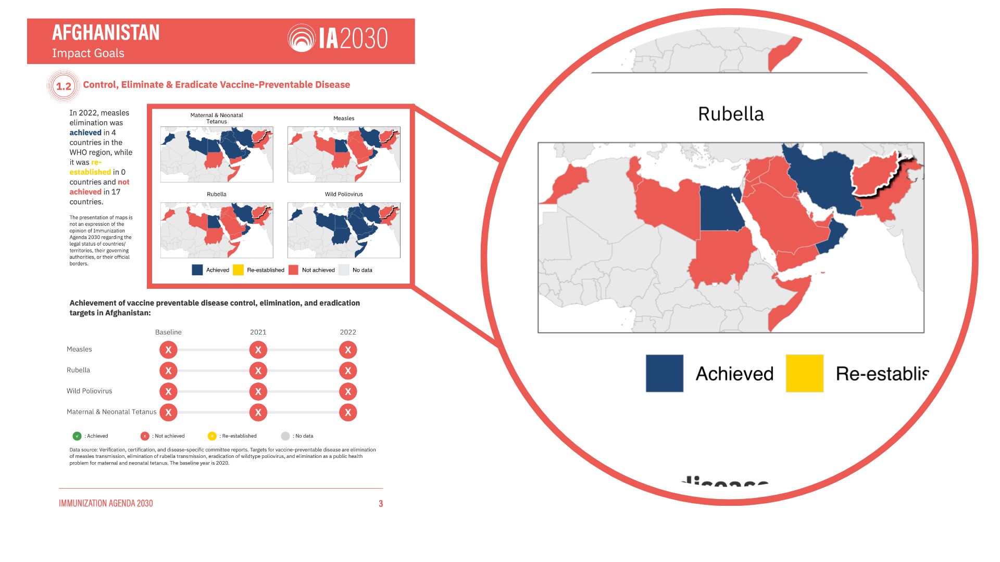
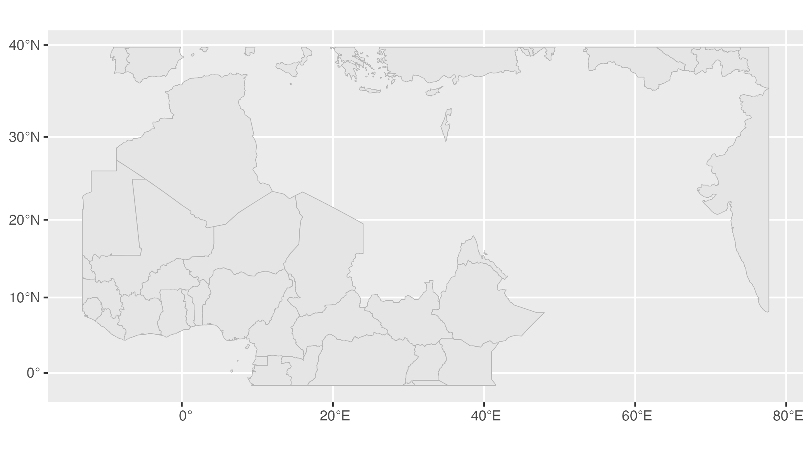
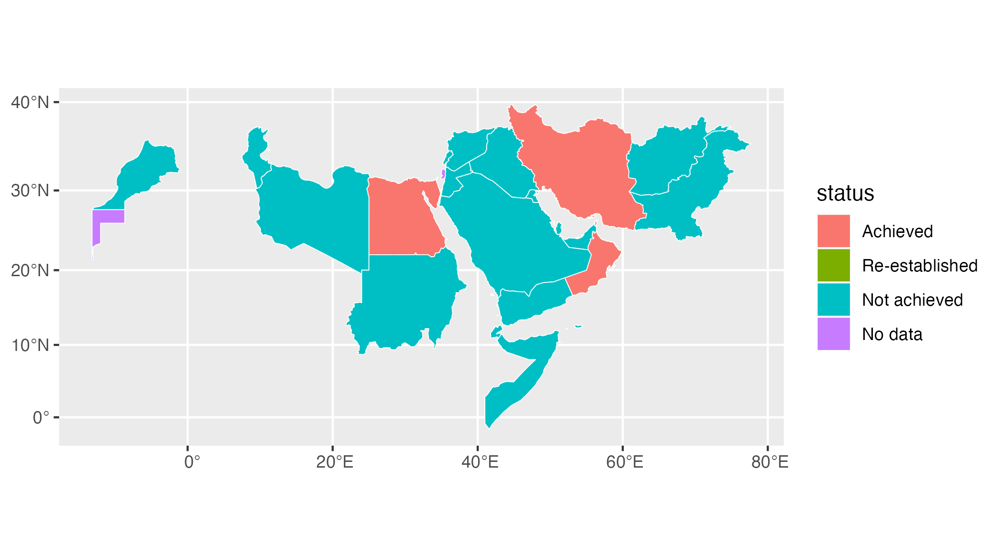
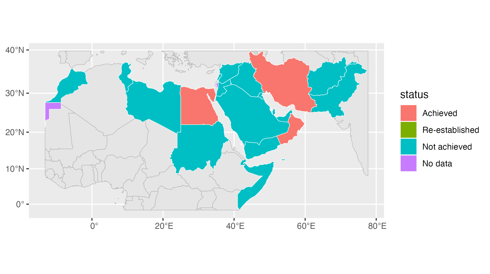
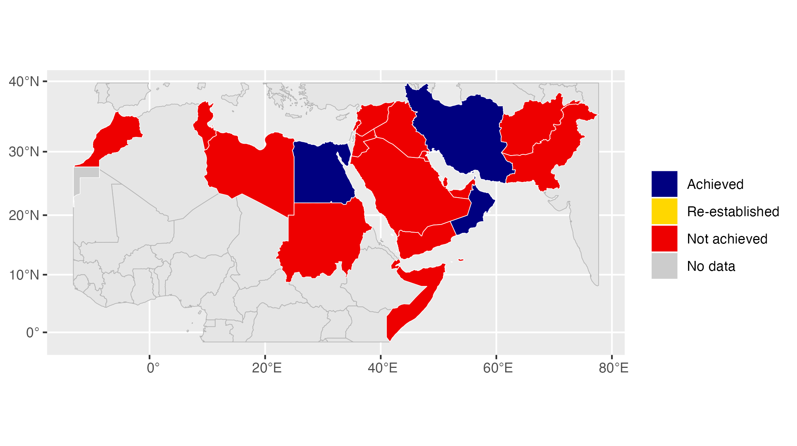
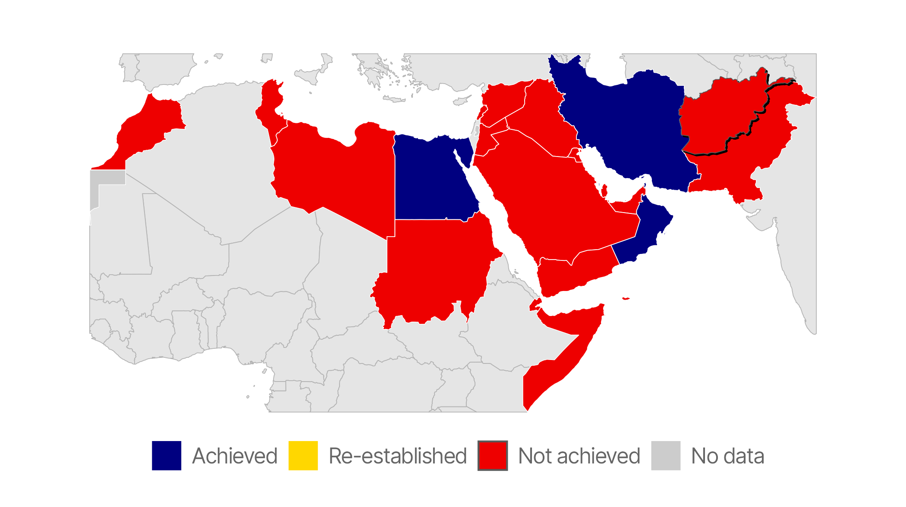
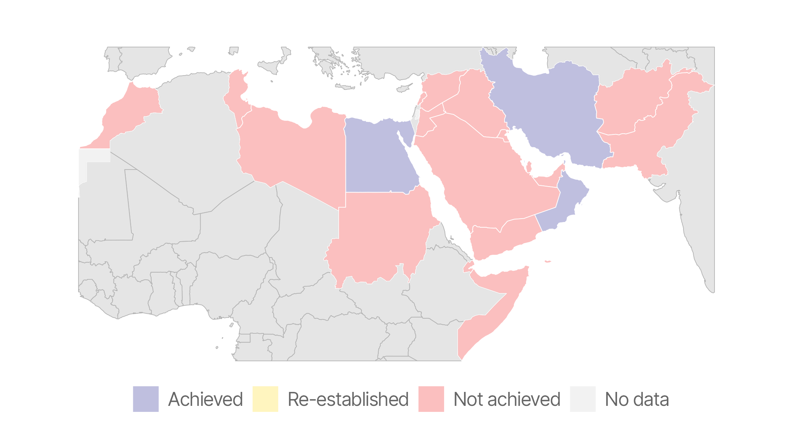
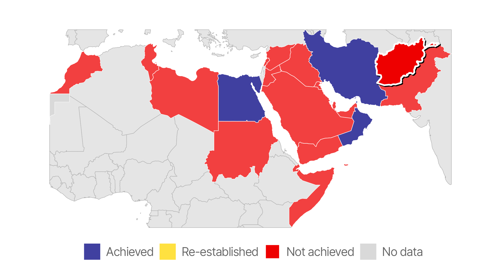

# Use shadows in ggplot to highlight findings
David Keyes
2024-11-09

## Intro

In our consulting work, we make a lot of the data visualization for
[parameterized
reporting](https://rfortherestofus.com/2024/06/parameterized-reporting-quarto).
It’s something I spoke about in my 2024 Cascadia R Conf talk, [How to
Make a Thousand Plots Look Good: Data Viz Tips for Parameterized
Reporting](https://cascadiarconf.org/2024/regular/david_keyes/).

<https://www.youtube.com/watch?v=ValvLQWYeEU>

One example I gave in this talk came from [our work with the Johns
Hopkins International Vaccine Access Center and the World Health
Organization](https://rfortherestofus.com/success-stories/ia2030). In
this project, we made reports for the [Immunization Agenda
2030](https://www.immunizationagenda2030.org/) project, which tracks the
progress countries around the world are making toward vaccination goals.

One challenge we face when making parameterized reports like the ones we
made for IA2030 is how to ensure that the focus of each report is
highlighted. For example, we made this map, which shows the progress
Afghanistan has made toward the eradication of rubella.



As you can see, we highlight Afghanistan in the map so that it is
obvious to reader. We do this highlighting using a less conventional
technique that you may not have considered: adding shadows. Using
shadows to highlight findings can make a big impact on the quality of
your maps and graphs, especially when doing parameterized reporting.
Let’s talk about how we do it.

## Import Our Data

The first step is to import our data. Let’s begin by loading two
packages: {tidyverse} for data wrangling and plotting with ggplot and
{sf} for importing our geospatial data.

``` r
library(tidyverse)
library(sf)
```

I’ve posted a simplified version of the data we used to make these maps
in [GeoJSON format](https://en.wikipedia.org/wiki/GeoJSON). The
`read_sf()` function can import this file, which I save as `rubella`.

``` r
rubella <-
  read_sf("https://github.com/rfortherestofus/blog/raw/refs/heads/main/highlight-shadow/rubella.geojson")
```

We can take a look at the data:

``` r
rubella
#> Simple feature collection with 69 features and 3 fields
#> Geometry type: MULTIPOLYGON
#> Dimension:     XY
#> Bounding box:  xmin: -1466635 ymin: -185219 xmax: 8649202 ymax: 4806756
#> Projected CRS: WGS 84 / World Mercator
#> # A tibble: 69 × 4
#>    country                  region status                               geometry
#>    <chr>                     <dbl> <chr>                      <MULTIPOLYGON [m]>
#>  1 Afghanistan                   1 Not achieved (((8328599 4443845, 8322613 445…
#>  2 United Arab Emirates          1 Not achieved (((6004988 2752921, 5987241 275…
#>  3 Benin                         0 Not achieved (((392437.9 1287537, 386846.1 1…
#>  4 Burkina Faso                  0 Not achieved (((21538.26 1659358, 26885.45 1…
#>  5 Bahrain                       1 Achieved     (((5634224 2996093, 5633599 296…
#>  6 Central African Republic      0 Not achieved (((2701448 953673.8, 2689646 93…
#>  7 China                         0 Not achieved (((8649200 4202120, 8628076 420…
#>  8 Cameroon                      0 Not achieved (((1719405 819975.1, 1695115 80…
#>  9 Djibouti                      1 Not achieved (((4780514 1224241, 4766042 122…
#> 10 Algeria                       0 Not achieved (((961591.4 4389977, 943599.8 4…
#> # ℹ 59 more rows
```

As you can see, it is [geospatial
data](https://book.rfortherestofus.com/maps.html#a-brief-primer-on-geospatial-data),
which is why it has the metadata at the top. In addition to the
`country` variable, `region` indicates whether the country is part of
the region we’re focusing on (1 if yes, 0 if no), and `status` shows
each country’s progress toward rubella eradication.

## Make the Basic Map

Let’s begin by making a simple map. To do this, I’ll separate the
`rubella` objects into two pieces. First, I’ll make a new object called
`rubella_region_0` by filtering countries with `region` 0.

``` r
rubella_region_0 <-
  rubella |>
  filter(region == 0)
```

If we plot this, we can see that countries with `region` 0 are those in
the surrounding area, but not in the Eastern Mediterranean region, which
we are focusing on.

``` r
ggplot() +
  geom_sf(
    data = rubella_region_0,
    fill = "grey90",
    color = "grey70",
    linewidth = 0.2
  )
```



We’ll also create a `rubella_region_1` object. However, before doing
this, let’s take a look at the data, focusing on the `status` variable.
Droping the geometry data with `st_drop_geometry()` before filtering our
data and then counting `status`, we see that there are three unique
observations in our data: Achieved, No data, and Not achieved.

``` r
rubella |>
  st_drop_geometry() |>
  filter(region == 1) |>
  count(status)
#> # A tibble: 3 × 2
#>   status           n
#>   <chr>        <int>
#> 1 Achieved         4
#> 2 No data          2
#> 3 Not achieved    17
```

While countries in the Eastern Mediterranean region only have these
statuses, we want to also show the status Re-established on our map
legend. To do this, we use the `add_row()` function to manually add a
row with `status` as Re-established. We then convert `status` into a
factor so that the statuses will show up in the correct order in the
legend.

``` r
rubella_region_1 <-
  rubella |>
  filter(region == 1) |>
  add_row(status = "Re-established") |>
  mutate(status = fct(
    status,
    levels = c(
      "Achieved",
      "Re-established",
      "Not achieved",
      "No data"
    )
  ))
```

We can run `count()` again on the `status` variable. Now we see that
there is a single Re-established observation, sufficient to ensure it
will show up in our legend.

``` r
rubella_region_1 |>
  st_drop_geometry() |>
  count(status)
#> # A tibble: 4 × 2
#>   status             n
#>   <fct>          <int>
#> 1 Achieved           4
#> 2 Re-established     1
#> 3 Not achieved      17
#> 4 No data            2
```

Let’s make a simple map using `rubella_region_1`:

``` r
ggplot() +
  geom_sf(
    data = rubella_region_1,
    aes(fill = status),
    linewidth = 0.2,
    color = "white",
    alpha = 1
  )
```



We can see the countries in the Eastern Mediterranean region, with each
status in a different color.

Next, let’s combine the two maps we made. Doing this will give us a map
that shows both the Eastern Mediterranean countries as well as
surrounding countries.

``` r
ggplot() +
  geom_sf(
    data = rubella_region_0,
    fill = "grey90",
    color = "grey70",
    linewidth = 0.2
  ) +
  geom_sf(
    data = rubella_region_1,
    aes(fill = status),
    linewidth = 0.2,
    color = "white"
  )
```



Let’s adjust our colors now. Using `scale_fill_manual()` we specify the
colors we want for each status.

``` r
ggplot() +
  geom_sf(
    data = rubella_region_0,
    fill = "grey90",
    color = "grey70",
    linewidth = 0.2
  ) +
  geom_sf(
    data = rubella_region_1,
    aes(fill = status),
    linewidth = 0.2,
    color = "white"
  ) +
  scale_fill_manual(
    name = "",
    values = c(
      "Achieved" = "navy",
      "Re-established" = "gold1",
      "Not achieved" = "red2",
      "No data" = "grey80"
    )
  )
```



The last step in making our basic map is to adjust the theme. I use
`theme_void()` to remove everything from our map, use the [Inter Tight
font](https://fonts.google.com/specimen/Inter+Tight), and make some
additional tweaks using the `theme()` function.

``` r
ggplot() +
  geom_sf(
    data = rubella_region_0,
    fill = "grey90",
    color = "grey70",
    linewidth = 0.2
  ) +
  geom_sf(
    data = rubella_region_1,
    aes(fill = status),
    linewidth = 0.2,
    color = "white"
  ) +
  scale_fill_manual(
    name = "",
    values = c(
      "Achieved" = "navy",
      "Re-established" = "gold1",
      "Not achieved" = "red2",
      "No data" = "grey80"
    )
  ) +
  theme_void(base_family = "Inter Tight") +
  theme(
    legend.text = element_text(
      size = 12,
      color = "grey40"
    ),
    plot.margin = margin(rep(20, 4)),
    legend.position = "bottom"
  )
```


Our plot is looking pretty decent at this point!

### Turn Our Basic Map into a Function

Before adding shadows for highlighting, I’m going to turn the code I’ve
created to make a basic map into a function. It’s as simple as wrapping
the code above in a function called `region_map()`:

``` r
region_map <- function() {
  ggplot() +
    geom_sf(
      data = rubella_region_0,
      fill = "grey90",
      color = "grey70",
      linewidth = 0.2
    ) +
    geom_sf(
      data = rubella_region_1,
      aes(fill = status),
      linewidth = 0.2,
      color = "white"
    ) +
    scale_fill_manual(
      name = "",
      values = c(
        "Achieved" = "navy",
        "Re-established" = "gold1",
        "Not achieved" = "red2",
        "No data" = "grey80"
      )
    ) +
    theme_void(base_family = "Inter Tight") +
    theme(
      legend.text = element_text(
        size = 12,
        color = "grey40"
      ),
      plot.margin = margin(rep(20, 4)),
      legend.position = "bottom"
    )
}
```

Now, I simply run `region_map()` and I get my basic map.

``` r
region_map()
```


## Add Shadow to Highlight

Now that we’ve got a function to make a basic map, we can add a shadow
behind any country in order to highlight it. To do this, we first load
the [{ggfx} package](http://ggfx.data-imaginist.com).

``` r
library(ggfx)
```

This package has a number of functions to tweak your plots. I’m going to
use the `with_shadow()` function. This function, which you wrap around
any geom, will add a shadow. Here you can see that I’m wrapping it
around `geom_sf()`, which I’m using to plot Afghanistan on the map. The
arguments in `with_shadow()` adjust the appearance of the shadow:
`x_offset` and `y_offset` determine how far the shadow will be from the
geom while `sigma` determines the level of blurring. With options set
for each argument, we can now see a shadow added to Afghanistan.

``` r
region_map() +
  with_shadow(
    geom_sf(
      data = rubella |> filter(country == "Afghanistan"),
      aes(fill = status),
    ),
    sigma = 0,
    x_offset = 4,
    y_offset = 4
  )
```



When we use shadows to highlight, we don’t typically *just* add shadows.
One additional thing we often do is add an outline. Using the lines
`linewidth = 0.8` and `color = "white` we create a white outline around
Afghanistan, which makes it even easier to pick out.

``` r
region_map() +
  with_shadow(
    geom_sf(
      data = rubella |> filter(country == "Afghanistan"),
      aes(fill = status),
      linewidth = 0.8,
      color = "white"
    ),
    sigma = 0,
    x_offset = 4,
    y_offset = 4
  )
```


Afghanistan is more and more obvious, but there’s one more thing we can
do: adjust the opacity of the background map to make the highlight
country pop even more. We do this by adding an argument to our
`region_map()` function. The `opacity_level` argument applies to the
geom made with `rubella_region_1`.

``` r
region_map <- function(opacity_level = 1) {
  ggplot() +
    geom_sf(
      data = rubella_region_0,
      fill = "grey90",
      color = "grey70",
      linewidth = 0.2
    ) +
    geom_sf(
      data = rubella_region_1,
      aes(fill = status),
      linewidth = 0.2,
      color = "white",
      alpha = opacity_level
    ) +
    scale_fill_manual(
      name = "",
      values = c(
        "Achieved" = "navy",
        "Re-established" = "gold1",
        "Not achieved" = "red2",
        "No data" = "grey80"
      )
    ) +
    theme_void(base_family = "Inter Tight") +
    theme(
      legend.text = element_text(
        size = 12,
        color = "grey40"
      ),
      plot.margin = margin(rep(20, 4)),
      legend.position = "bottom"
    )
}
```

To show you what this looks like, let’s run this code:

``` r
region_map(opacity_level = 0.25)
```



As you can see, the countries in the Eastern Mediterranean region are
faded. Now, 25% opacity, as I did above, is probably a bit too much.
Instead, let’s set our opacity to 75% (0.75) and see how it looks with
Afghanistan added.

``` r
region_map(opacity_level = 0.75) +
  with_shadow(
    geom_sf(
      data = rubella |> filter(country == "Afghanistan"),
      aes(fill = status),
      linewidth = 0.8,
      color = "white"
    ),
    sigma = 0,
    x_offset = 4,
    y_offset = 4
  )
```



Looks great! For someone just flipping through the Afghanistan report,
they’ll be able to easily pick out Afghanistan, which is exactly what we
want.

In this blog post, I’ve given an example of using the `with_shadow()`
function to highlight a country on a map, but it can work with any geom.
Try it next time you want to highlight a bar, line, or anything else you
might create with ggplot!
