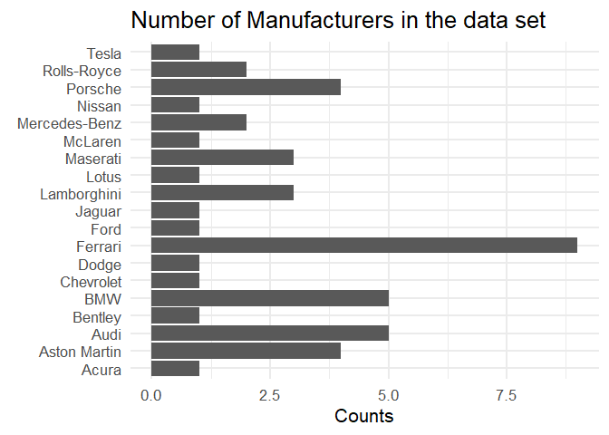
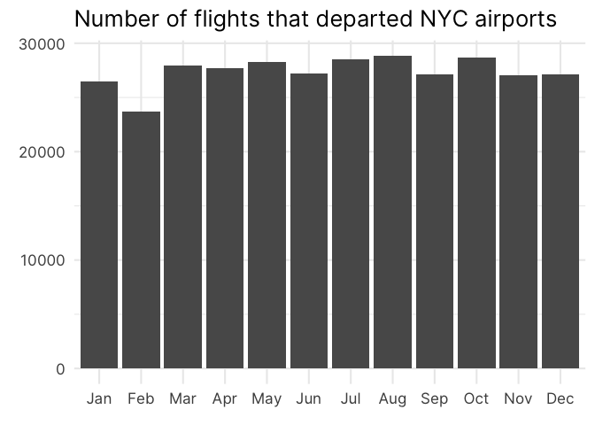
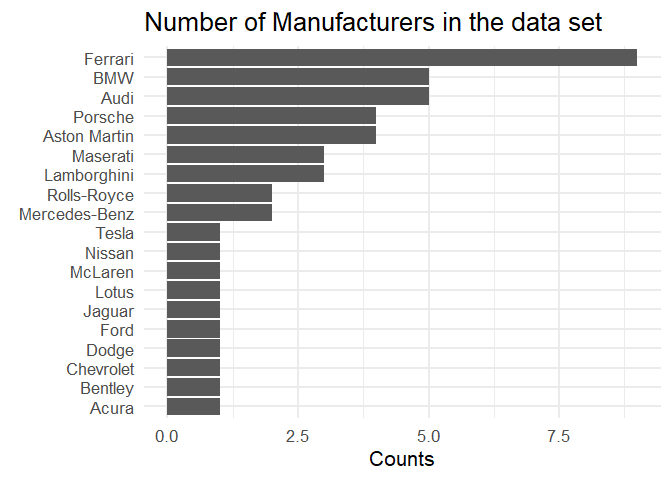
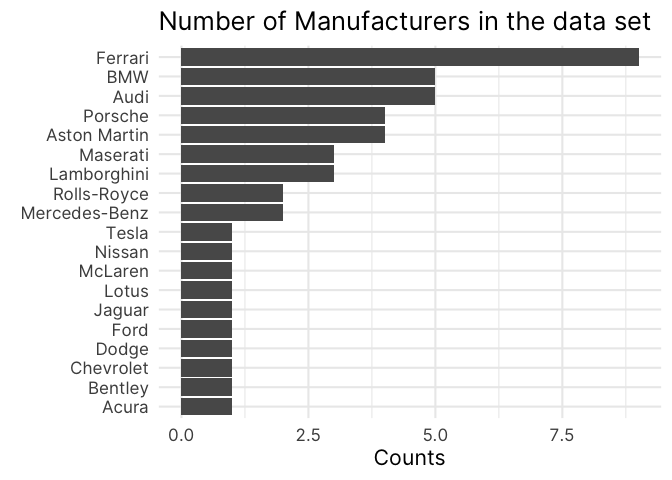
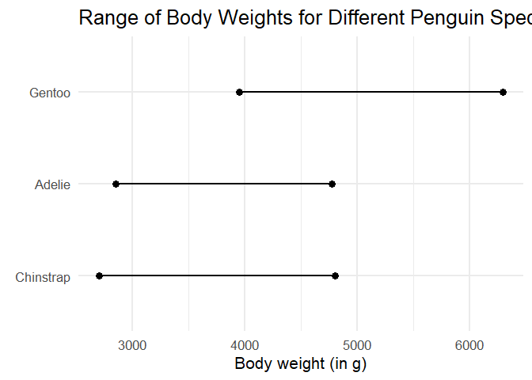
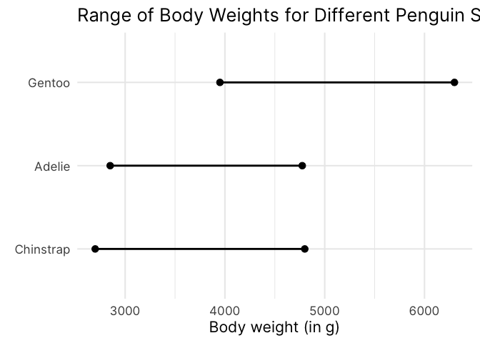
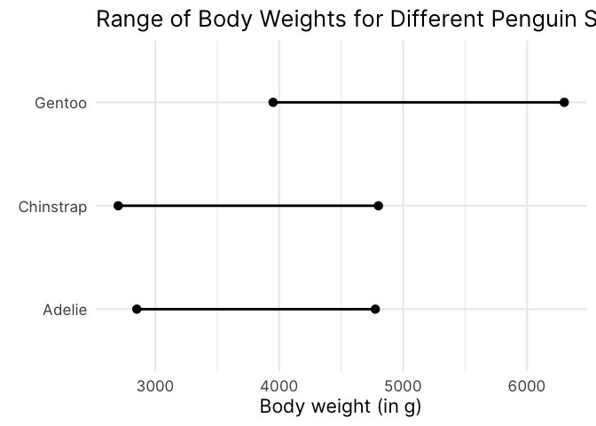

# How to Order Bars and Lines in `ggplot`
Albert Rapp
2023-08-22

- [Sort bar charts](#sort-bar-charts)
- [A better understanding of
  fct_reorder()](#a-better-understanding-of-fct_reorder)

With visualizations, it’s always better if there is some visual order in
your charts. For example, take a look at these two bar charts. Which one
do you find easier to read? And which chart gives you a better overview
over the data?




If you are like most people, then chances are that you will find that
the sorted bar chart is easier to read. This simple action of sorting
the bars can give a lot of structure to your data visualization. In
turn, your chart is easier to understand for your reader.

Now, this doesn’t always mean that you need to sort them from lowest to
highest value. Sometimes, you also need to preserve the intrinsic order
of the data. For example, have look a this bar chart.



Here, it doesn’t make sense to sort the bars from lowest to highest
because most of the time you are probably interested in the evolution of
the bar heights **over time**. Therefore, sorting the bar by month
preserves the intrinsic order of your data.

Thus, meaningfully sorting the visual elements in your chart can make it
easier for your reader to get the most out of it. Now that we’re on the
same page, let’s figure out how to actually sort our data with ggplot.

## Sort bar charts

With ggplot, bar charts will use an alphabetical sorting by default. For
example, here’s the code for our first unsorted chart from above.

``` r
library(tidyverse)
gt::gtcars |> 
  count(mfr) |> 
  ggplot(aes(x = n, y = mfr)) +
  geom_col() +
  labs(
    x = 'Counts',
    y = element_blank(),
    title = 'Number of Manufacturers in the data set'
  )
```


It is easy to think that if you sort your data, say, with `arrange()`,
then ggplot would understand that you want your bars to be sorted like
this as well. So let’s try this.

``` r
gt::gtcars |> 
  count(mfr) |> 
  arrange(mfr) |> 
  ggplot(aes(x = n, y = mfr)) +
  geom_col() +
  labs(
    x = 'Counts',
    y = element_blank(),
    title = 'Number of Manufacturers in the data set'
  )
```


Here, we get the exact same result because ggplot by default doesn’t
care how you sort the rows of your data. That’s why you have to force
ggplot to do what you want. And the way to do that is to transform your
data into a `factor` variable.

In R, factors a special data format that can not only store data, but
also store intrinsic orderings. So let us arrange our data again. But
this time we also use `mutate()` and `factor()` to transform our column
into a `factor` variable.

``` r
library(tidyverse)
gt::gtcars |> 
  count(mfr) |> 
  mutate(mfr = factor(mfr)) |> 
  ggplot(aes(x = n, y = mfr)) +
  geom_col() +
  labs(
    x = 'Counts',
    y = element_blank(),
    title = 'Number of Manufacturers in the data set'
  )
```


Unfortunately, this didn’t do the trick. We left out one important
ingredient, namely we have to set the `levels` of the `factor` variable.
Have a look.

``` r
gt::gtcars |> 
  count(mfr) |> 
  arrange(n) |> 
  mutate(mfr = factor(mfr, levels = mfr)) |> 
  ggplot(aes(x = n, y = mfr)) +
  geom_col() +
  labs(
    x = 'Counts',
    y = element_blank(),
    title = 'Number of Manufacturers in the data set'
  )
```



Here, we used the `mfr` column to set the `levels` in `factor()`. This
worked because we already arranged the rows of our data set to reflect
the ordering that we want. So basically, we followed a two-step process.

1.  We first used `arrange()` to sort our data.
2.  Then, we declared a `factor` variable with the correctly sorted
    levels.

But we can actually do all of this in one step: Meet `fct_reorder()`.
It’s a neat function that can turn a `character` (i.e. text) or `factor`
variable into a new `factor` variable whose levels are sorted by some
quantity. Hence, `fct_reorder()` needs two information. The variable
that we want to sort and the quantity we want to sort by.

``` r
gt::gtcars |> 
  count(mfr) |> 
  mutate(mfr = fct_reorder(mfr, n)) |> 
  ggplot(aes(x = n, y = mfr)) +
  geom_col() +
  labs(
    x = 'Counts',
    y = element_blank(),
    title = 'Number of Manufacturers in the data set'
  )
```



# A better understanding of fct_reorder()

Now, I’ve given you a sort of simplistic explanation of what
`fct_reorder()` does. A lot of times, you will be perfectly fine with
the explanation I just gave you. But sometimes you need a bit more from
`fct_reorder()`. Let’s have a look at the following chart.


This chart shows you the range of body weights for different penguin
species. The dots indicate the minimum and maximum body weights. Here,
the weights were computed using the `penguins` data set from the
`palmerpenguins` package. You don’t have to worry about the exact
details, just know that the data that we computed looks like this

``` r
min_max_weights
#> # A tibble: 6 × 3
#>   species   type       weight
#>   <fct>     <chr>       <int>
#> 1 Adelie    min_weight   2850
#> 2 Adelie    max_weight   4775
#> 3 Gentoo    min_weight   3950
#> 4 Gentoo    max_weight   6300
#> 5 Chinstrap min_weight   2700
#> 6 Chinstrap max_weight   4800
```

From this we can create a chart like the one above as follows.

``` r
min_max_weights |> 
  ggplot(aes(x = weight, y = species)) +
  geom_line(linewidth = 1) +
  geom_point(size = 3) +
  labs(
    x = 'Body weight (in g)',
    y = element_blank(),
    title = 'Range of Body Weights for Different Penguin Species'
  )
```


As we’ve discussed, having a visual order in your charts is helpful. Now
what if we wanted to sort the line charts so that the left points are
ordered like so?



Here, applying `fct_reorder()` to order the `species` column of
`min_max_weights` is different. Think about it. For each of the species,
we have two values now (minimum and maximum). How is `fct_reorder()`
supposed to handle the sorting in this case? And this is where the third
argument in `fct_reorder()` comes into play.

You see, apart from the variable that is sorted and the quantity by
which we sort, `fct_reorder()` can actually use one more thing. If we
pass a function to the `.fun` argument in `fct_reorder()`, then this
function will be used to consolidate multiple values into a single
value.

This is pretty similar to what you do in `summarise()`. For example, you
could manually extract the minimum weight for each species in
`min_max_weights` with `summarise()` like so.

``` r
min_max_weights |> 
  summarise(
    minimum = min(weight),
    .by = species
  )
#> # A tibble: 3 × 2
#>   species   minimum
#>   <fct>       <int>
#> 1 Adelie       2850
#> 2 Gentoo       3950
#> 3 Chinstrap    2700
```

Here, we have used the `min()` function to consolidate all of the values
from the `weight` column in `min_max_weights` to a single value for each
species. Similarly, you could use a function like `max()` or `mean()`
too.

``` r
min_max_weights |> 
  summarise(
    minimum = min(weight),
    maximum = max(weight),
    middle = mean(weight),
    .by = species
  )
#> # A tibble: 3 × 4
#>   species   minimum maximum middle
#>   <fct>       <int>   <int>  <dbl>
#> 1 Adelie       2850    4775  3812.
#> 2 Gentoo       3950    6300  5125 
#> 3 Chinstrap    2700    4800  3750
```

All of these functions take a bunch of values and turn them into a
single value. And once you’re at that stage, you can sort these values.
Coming back to `fct_reorder()`, this is essentially what the `.fun`
argument does. Let’s have a look.

``` r
min_max_weights |> 
  mutate(species = fct_reorder(species, weight, .fun = min)) |> 
  ggplot(aes(x = weight, y = species)) +
  geom_line(linewidth = 1) +
  geom_point(size = 3) +
  labs(
    x = 'Body weight (in g)',
    y = element_blank(),
    title = 'Range of Body Weights for Different Penguin Species'
  )
```



Here, we used the `min` function to sort the species. For each species
this will compute the minimum of the two weights that are in
`min_max_weights` and sort the species by this computed minimum.

In effect, this sorts the line charts so that the left points are in
ascending order. You could do the same with the right points by
replacing the `min` function with the `max` function.

``` r
min_max_weights |> 
  mutate(species = fct_reorder(species, weight, .fun = max)) |> 
  ggplot(aes(x = weight, y = species)) +
  geom_line(linewidth = 1) +
  geom_point(size = 3) +
  labs(
    x = 'Body weight (in g)',
    y = element_blank(),
    title = 'Range of Body Weights for Different Penguin Species'
  )
```



Similarly, you can use `mean()` or any other function that can take a
vector of values and return a single value from this. And with that we
have fully understand how `fct_reorder()` works. With the exact same
strategy we can now sort bars, line charts, box plots or whatever else
we want to sort in ggplot. Thank you for reading, and we’ll see each
other next time.
