# How to make polished population pyramids in ggplot: part 1
David Keyes
2024-07-23

How do you make a population pyramid in `ggplot2`? These charts, which
allow us to see the distribution of the population by gender and age,
are common ways to examine demographics in a particular place. The
ggplot code needed to make a population pyramid is quite
straightforward, but, as you’ll see in this blog post, you can go way
beyond straightforward to make a polished population pyramid (try saying
that three times fast!).

I’ve made hundreds of population pyramids for the last few years as
[I’ve produced many population
pyramids](https://rfortherestofus.com/2023/01/multiple-plots) as part of
the annual [Oregon by the Numbers report](https://www.tfff.org/obtn). In
past years, I made plots that looked like this:

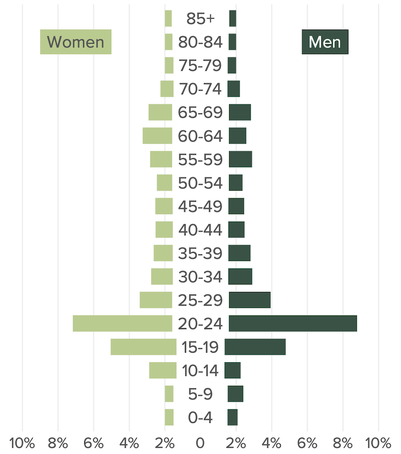

With the 0 in the very middle of the plot, I sometimes ran into issues
where portions of bars would be covered up. I implemented hacks to deal
with this, but it wasn’t a great situation.

I tried out a new technique this year, making separate plots for women,
men, and the age categories and combining them using the [`patchwork`
package](https://patchwork.data-imaginist.com/). When the report comes
out in September, you’ll see population pyramids that look like this:

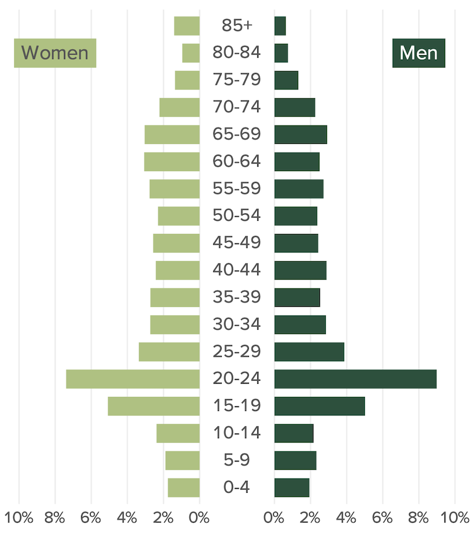

Keep reading to learn how to make polished population pyramids in
ggplot!

## Make a basic population pyramid

To make a basic population pyramid, I’ll load the `tidyverse` and then
bring in the data I use for Oregon by the Numbers, saving it as an
object called `oregon_population_pyramid_data`.

``` r
library(tidyverse)

oregon_population_pyramid_data <-
  read_csv("https://raw.githubusercontent.com/rfortherestofus/blog/main/population-pyramid-part-1/oregon_population_pyramid_data.csv")
```

We can take a look at the data to see its structure. Here I’m just
showing one county.

``` r
oregon_population_pyramid_data |>
  filter(county == "Benton") |>
  arrange(age, gender) |>
  print(n = 36)
#> # A tibble: 36 × 4
#>    county age   gender percent
#>    <chr>  <chr> <chr>    <dbl>
#>  1 Benton 0-4   Men    0.0194 
#>  2 Benton 0-4   Women  0.0176 
#>  3 Benton 10-14 Men    0.0217 
#>  4 Benton 10-14 Women  0.0239 
#>  5 Benton 15-19 Men    0.0502 
#>  6 Benton 15-19 Women  0.0508 
#>  7 Benton 20-24 Men    0.0899 
#>  8 Benton 20-24 Women  0.0739 
#>  9 Benton 25-29 Men    0.0387 
#> 10 Benton 25-29 Women  0.0337 
#> 11 Benton 30-34 Men    0.0286 
#> 12 Benton 30-34 Women  0.0273 
#> 13 Benton 35-39 Men    0.0254 
#> 14 Benton 35-39 Women  0.0273 
#> 15 Benton 40-44 Men    0.0289 
#> 16 Benton 40-44 Women  0.0243 
#> 17 Benton 45-49 Men    0.0243 
#> 18 Benton 45-49 Women  0.0257 
#> 19 Benton 5-9   Men    0.0233 
#> 20 Benton 5-9   Women  0.0189 
#> 21 Benton 50-54 Men    0.0238 
#> 22 Benton 50-54 Women  0.0231 
#> 23 Benton 55-59 Men    0.0272 
#> 24 Benton 55-59 Women  0.0277 
#> 25 Benton 60-64 Men    0.0251 
#> 26 Benton 60-64 Women  0.0307 
#> 27 Benton 65-69 Men    0.0292 
#> 28 Benton 65-69 Women  0.0305 
#> 29 Benton 70-74 Men    0.0226 
#> 30 Benton 70-74 Women  0.0222 
#> 31 Benton 75-79 Men    0.0133 
#> 32 Benton 75-79 Women  0.0136 
#> 33 Benton 80-84 Men    0.00751
#> 34 Benton 80-84 Women  0.00960
#> 35 Benton 85+   Men    0.00634
#> 36 Benton 85+   Women  0.0141
```

A population pyramid is essentially a back-to-back bar chart, with women
on one side and men on the other. Here’s how I would filter my data to
just show one county in Oregon (Benton again) and attempt to make a
population pyramid.

``` r
oregon_population_pyramid_data |>
  filter(county == "Benton") |>
  ggplot(aes(
    x = percent,
    y = age,
    fill = gender
  )) +
  geom_col()
```

However, as you can see in the resulting plot, this doesn’t work because
the bars for Women and Men stack on top of each other, both going to the
right.

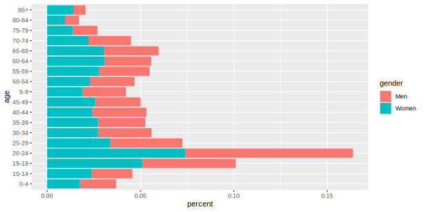

To fix this, I need to have the data for Women show up as negative
numbers. To do that, I use an `if_else()` statement, stating that, if
the `gender` variable is “Men”, keep `percent` as the `percent` value.
However, if `gender` is “Women” then `percent` becomes `-percent`
(i.e. the negative value of `percent`).

``` r
oregon_population_pyramid_data <-
  oregon_population_pyramid_data |>
  mutate(percent = if_else(gender == "Men", percent, -percent))
```

With this change, we can now use the same code to make a basic
population pyramid, with Women on the left and Men on the right.

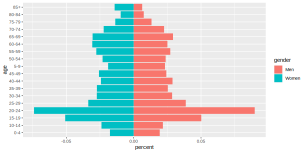

One thing I’ve always done in population pyramids for Oregon by the
Numbers is to put the age labels in the center of the bars. I think it’s
much easier for people to see them there than at the left, where they
appear by default. To do this, I have used `geom_label()` to put the age
labels in the center of the population pyramid.

``` r
oregon_population_pyramid_data |>
  filter(county == "Benton") |>
  ggplot(
    aes(
      x = percent,
      y = age,
      fill = gender
    )
  ) +
  geom_col() +
  geom_label(
    aes(
      x = 0,
      label = age
    ),
    fill = "white",
    label.size = 0
  )
```

As you can see in the resulting plot, there are two issues:

1.  The age labels are not in the right order.
2.  The age labels cover up portions of the bars.

``` r
oregon_population_pyramid_data |>
  filter(county == "Benton") |>
  ggplot(
    aes(
      x = percent,
      y = age,
      fill = gender
    )
  ) +
  geom_col() +
  geom_label(
    aes(
      x = 0,
      label = age
    ),
    fill = "white",
    label.size = 0
  )
```

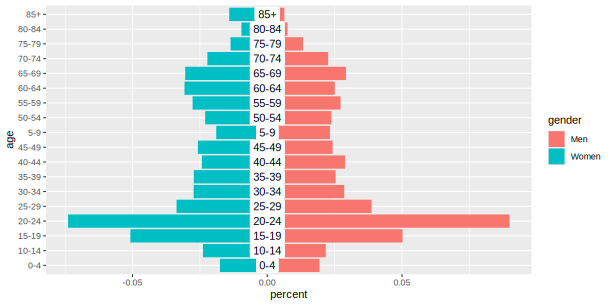

We can fix the order by converting `age` to a factor. The
`fct_inorder()` function from the `forcats` package makes `age` into a
factor and sets its order to be the order that the values appear.

``` r
oregon_population_pyramid_data <-
  oregon_population_pyramid_data |>
  mutate(age = fct_inorder(age))
```

Now, reusing the same code, we see the age labels in the right order.

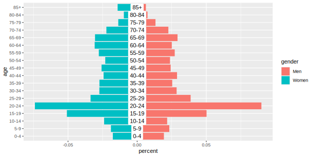

The second issue – that the age labels cover up bars – is harder to fix.
Depending on the size of the plots you ultimately output, some bars can
be covered up entirely. Not ideal!

To fix this, I decided to use a different approach: making separate
plots for Women, Men, and the age labels and then stitching them
together with the `patchwork` package. I’ll show you how this works and
show you some of the other small tweaks I made along the way to make a
polished population pyramid.

## Making a population pyramid using the patchwork package

To make our multi-plot population pyramid, I’ll create a plot for the
women half and save it as `population_pyramid_women`. In addition to the
code above, I’ve applied `theme_void()` to remove all of the elements
except the bars themselves.

``` r
population_pyramid_women <-
  oregon_population_pyramid_data |>
  filter(county == "Benton") |>
  filter(gender == "Women") |>
  ggplot(aes(
    x = percent,
    y = age
  )) +
  geom_col() +
  theme_void()
```

I’ll do the same thing for men, saving it as `population_pyramid_men`.

``` r
population_pyramid_men <-
  oregon_population_pyramid_data |>
  filter(county == "Benton") |>
  filter(gender == "Men") |>
  ggplot(aes(
    x = percent,
    y = age
  )) +
  geom_col() +
  theme_void()
```

The magic comes by loading the `patchwork` package and stitching the two
plots together. After we’ve loaded the `patchwork` package, we can
combine two plots using the plus sign.

``` r
library(patchwork)

population_pyramid_women +
  population_pyramid_men
```

The result is the women and men plot back to back.


Now we need to add the age labels in the center. To do this, we manually
create a tibble called `age_labels`, which has all age categories.
Applying `fct_inorder()` to the `age` variable ensures they appear in
the right order when we plot.

``` r
age_labels <-
  tibble(
    age = c(
      "0-4",
      "5-9",
      "10-14",
      "15-19",
      "20-24",
      "25-29",
      "30-34",
      "35-39",
      "40-44",
      "45-49",
      "50-54",
      "55-59",
      "60-64",
      "65-69",
      "70-74",
      "75-79",
      "80-84",
      "85+"
    )
  ) |>
  mutate(
    age = fct_inorder(age)
  )
```

We can then use the `age_labels` object to create a plot with ggplot.

``` r
age_labels |>
  ggplot(
    aes(
      x = 1,
      y = age,
      label = age
    )
  ) +
  geom_text() +
  theme_void()
```

The plot is just the ages in a vertical list.

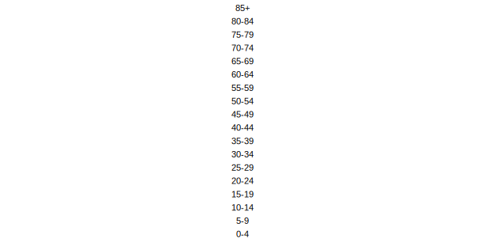

I want to combine this plot with the women and men plot so I’ll save it
as an object called `age_labels_plot`

``` r
age_labels_plot <-
  age_labels |>
  ggplot(
    aes(
      x = 1,
      y = age,
      label = age
    )
  ) +
  geom_text() +
  theme_void()
```

Now, I can add `age_labels_plot` to my combined plot.

``` r
population_pyramid_women +
  age_labels_plot +
  population_pyramid_men
```

This gives me a combined plot with women, the age labels, and men.

``` r
population_pyramid_women +
  age_labels_plot +
  population_pyramid_men
```

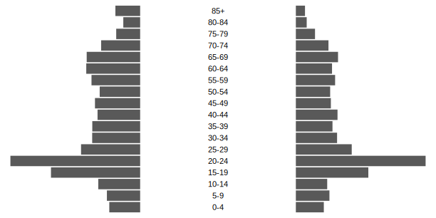

By default, `patchwork` will make each plot the same width. For the
population pyramid we’re making, we don’t need the age labels to be as
wide as they are. We can use the `plot_layout()` function to set their
widths manually. The code below sets the widths of the plots relative to
each other. The women and men plots are 7.5 times the size of the age
labels plot.

``` r
population_pyramid_women +
  age_labels_plot +
  population_pyramid_men +
  plot_layout(
    widths = c(7.5, 1, 7.5)
  )
```

The result looks much better!

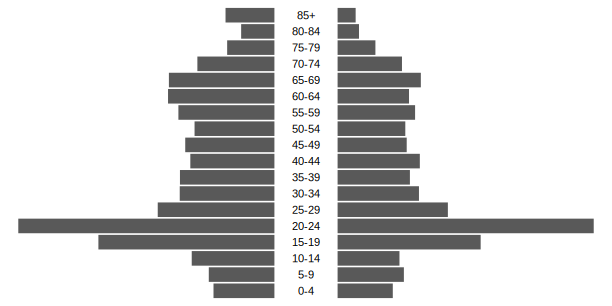

## Polishing our population pyramid

There is still a lot of work to get the type of polished population
pyramids that I made for Oregon by the Numbers. The overall population
pyramid looks better (and doesn’t have age labels covering up bars), but
it is impossible to tell which bars are for women and which are for men.
Additionally, after we applied `theme_void()`, we no longer have axis
text showing what percents the bars correspond to. Let’s get started
polishing our population pyramid!

### Add labels for men and women

To begin, I’m going to add different colors to the women and men plots.
This is done by manually setting the fill colors for women to a light
green and men to a dark green (the hex values below are brand colors for
the Ford Family Foundation, which publishes Oregon by the Numbers).
Additionally, we use the `annotate()` function to manually place text
labels for Women and Men in appropriate locations.

``` r
population_pyramid_men <-
  oregon_population_pyramid_data |>
  filter(county == "Benton") |>
  filter(gender == "Men") |>
  ggplot(aes(
    x = percent,
    y = age
  )) +
  geom_col(fill = "#004f39") +
  annotate(
    geom = "label",
    x = 0.05,
    y = 17,
    label = "Men",
    fill = "#004f39",
    color = "white",
    label.size = 0,
    label.padding = unit(0.3, "lines")
  ) +
  theme_void()
```

``` r
population_pyramid_women <-
  oregon_population_pyramid_data |>
  filter(county == "Benton") |>
  filter(gender == "Women") |>
  ggplot(aes(
    x = percent,
    y = age
  )) +
  geom_col(fill = "#A9C27F") +
  annotate(
    geom = "label",
    x = -0.05,
    y = 17,
    label = "Women",
    fill = "#A9C27F",
    color = "grey30",
    label.size = 0,
    label.padding = unit(0.3, "lines")
  ) +
  theme_void()
```

Combining the plots using `patchwork`, it’s already looking better!

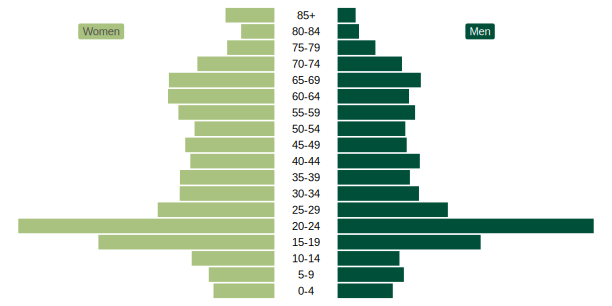

### Add axis text

Next, we use the `theme()` function add x axis grid lines and text back
(recall that `theme_void()` took them away). Here’s what this looks like
for `population_pyramid_women`:

``` r
population_pyramid_women <-
  oregon_population_pyramid_data |>
  filter(county == "Benton") |>
  filter(gender == "Women") |>
  ggplot(aes(
    x = percent,
    y = age
  )) +
  geom_col(fill = "#A9C27F") +
  annotate(
    geom = "label",
    x = -0.05,
    y = 17,
    label = "Women",
    fill = "#A9C27F",
    color = "grey30",
    label.size = 0,
    label.padding = unit(0.3, "lines")
  ) +
  theme_void() +
  theme(
    axis.text.x = element_text(),
    panel.grid.major.x = element_line(color = "grey90")
  )
```

After doing the same thing for `population_pyramid_men`, it is now
easier to see the value of each bar.

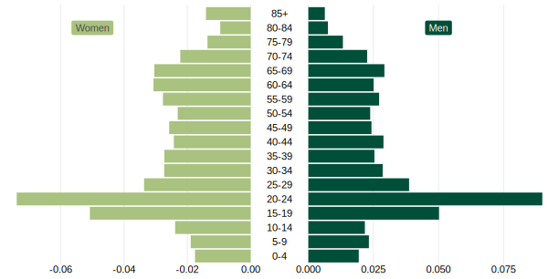

However, there are several issues with the axis text:

1.  The values are not easy to read (we’d much rather have 5% than
    0.050).
2.  The values on women side are negative.
3.  The values on the women and men side are different, which just looks
    a bit odd.

Let’s deal with each of these issues.

### Improve axis text formatting

The `scales` package is a lifesaver when it comes to formatting numbers.
After loading it, we use the `label_percent()` function with
`accuracy = 1` to make our axis text show up as whole number percents.

``` r
library(scales)

population_pyramid_women <-
  oregon_population_pyramid_data |>
  filter(county == "Benton") |>
  filter(gender == "Women") |>
  ggplot(aes(
    x = percent,
    y = age
  )) +
  geom_col(fill = "#A9C27F") +
  annotate(
    geom = "label",
    x = -0.05,
    y = 17,
    label = "Women",
    fill = "#A9C27F",
    color = "grey30",
    label.size = 0,
    label.padding = unit(0.3, "lines")
  ) +
  scale_x_continuous(
    labels = label_percent(accuracy = 1)
  ) +
  theme_void() +
  theme(
    axis.text.x = element_text(),
    panel.grid.major.x = element_line(color = "grey90")
  )
```

Note on the resulting plot how the x axis text is now formatted as
easy-to-read percent values.


However, the values on the women side are negative. To make them look
better, we’re going to create a custom function, which takes the value
the is to appear on the x axis, uses the base R `abs()` function to get
the absolute value (e.g. turning -0.02 into 0.02), and then applies
`label_percent(accuracy = 1)` to it. We do this within the
`scale_x_continuous()` function for women:

``` r
population_pyramid_women <-
  oregon_population_pyramid_data |>
  filter(county == "Benton") |>
  filter(gender == "Women") |>
  ggplot(aes(
    x = percent,
    y = age
  )) +
  geom_col(fill = "#A9C27F") +
  annotate(
    geom = "label",
    x = -0.05,
    y = 17,
    label = "Women",
    fill = "#A9C27F",
    color = "grey30",
    label.size = 0,
    label.padding = unit(0.3, "lines")
  ) +
  scale_x_continuous(
    labels = function(x) label_percent(accuracy = 1)(abs(x))
  ) +
  theme_void() +
  theme(
    axis.text.x = element_text(),
    panel.grid.major.x = element_line(color = "grey90")
  )
```

And for men:

``` r
population_pyramid_men <-
  oregon_population_pyramid_data |>
  filter(county == "Benton") |>
  filter(gender == "Men") |>
  ggplot(aes(
    x = percent,
    y = age
  )) +
  geom_col(fill = "#004f39") +
  annotate(
    geom = "label",
    x = 0.05,
    y = 17,
    label = "Men",
    fill = "#004f39",
    color = "white",
    label.size = 0,
    label.padding = unit(0.3, "lines")
  ) +
  scale_x_continuous(
    labels = function(x) label_percent(accuracy = 1)(abs(x))
  ) +
  theme_void() +
  theme(
    axis.text.x = element_text(),
    panel.grid.major.x = element_line(color = "grey90")
  )
```

The result looks much better!


However, we can now more clearly see an additional issue: the breaks on
the men side are uneven. Rather than 0%, 2%, 5%, and 8%, we’d rather
have the value go up by 2%. The simplest way to do this is to use the
`breaks_pretty()` function from the `scales` package. Adding
`breaks_pretty()` within `scale_x_continuous()` makes a big difference.

``` r
population_pyramid_women <-
  oregon_population_pyramid_data |>
  filter(county == "Benton") |>
  filter(gender == "Women") |>
  ggplot(aes(
    x = percent,
    y = age
  )) +
  geom_col(fill = "#A9C27F") +
  annotate(
    geom = "label",
    x = -0.05,
    y = 17,
    label = "Women",
    fill = "#A9C27F",
    color = "grey30",
    label.size = 0,
    label.padding = unit(0.3, "lines")
  ) +
  scale_x_continuous(
    labels = function(x) label_percent(accuracy = 1)(abs(x)),
    breaks = breaks_pretty()
  ) +
  theme_void() +
  theme(
    axis.text.x = element_text(),
    panel.grid.major.x = element_line(color = "grey90")
  )
```

``` r
population_pyramid_men <-
  oregon_population_pyramid_data |>
  filter(county == "Benton") |>
  filter(gender == "Men") |>
  ggplot(aes(
    x = percent,
    y = age
  )) +
  geom_col(fill = "#004f39") +
  annotate(
    geom = "label",
    x = 0.05,
    y = 17,
    label = "Men",
    fill = "#004f39",
    color = "white",
    label.size = 0,
    label.padding = unit(0.3, "lines")
  ) +
  scale_x_continuous(
    labels = function(x) label_percent(accuracy = 1)(abs(x)),
    breaks = breaks_pretty()
  ) +
  theme_void() +
  theme(
    axis.text.x = element_text(),
    panel.grid.major.x = element_line(color = "grey90")
  )
```

The resulting plot has much more consistent breaks!


We’re almost there! The breaks are consistent, but now we can see that
the women side only goes out to 6% while the men side goes out to 8%. It
would be nice if we could set the limits to be identical on both plots.

### Setting consistent x axis limits

To do this, we need to calculate the maximum value of any age group,
women or men, in our data. Below, I use the `slice_max()` function to
keep only the top observation in the `percent` column. I then use the
`pull()` function to get this as a single value.

``` r
max_percent <-
  oregon_population_pyramid_data |>
  filter(county == "Benton") |>
  slice_max(
    order_by = percent,
    n = 1
  ) |>
  pull(percent)
```

If we look at `max_percent`, we can see its value is 0.0898708.

We can now use `max_percent` to set the limits of our plots. For the
women plot, we set the limits to be `c(-max_percent, 0)`. That is, they
go from -0.0898708 to 0.

``` r
population_pyramid_women <-
  oregon_population_pyramid_data |>
  filter(county == "Benton") |>
  filter(gender == "Women") |>
  ggplot(aes(
    x = percent,
    y = age
  )) +
  geom_col(fill = "#A9C27F") +
  annotate(
    geom = "label",
    x = -0.05,
    y = 17,
    label = "Women",
    fill = "#A9C27F",
    color = "grey30",
    label.size = 0,
    label.padding = unit(0.3, "lines")
  ) +
  scale_x_continuous(
    labels = function(x) label_percent(accuracy = 1)(abs(x)),
    breaks = breaks_pretty(),
    limits = c(-max_percent, 0)
  ) +
  theme_void() +
  theme(
    axis.text.x = element_text(),
    panel.grid.major.x = element_line(color = "grey90")
  )
```

For men, the x axis limits go from 0 to 0.0898708.

``` r
population_pyramid_men <-
  oregon_population_pyramid_data |>
  filter(county == "Benton") |>
  filter(gender == "Men") |>
  ggplot(aes(
    x = percent,
    y = age
  )) +
  geom_col(fill = "#004f39") +
  annotate(
    geom = "label",
    x = 0.05,
    y = 17,
    label = "Men",
    fill = "#004f39",
    color = "white",
    label.size = 0,
    label.padding = unit(0.3, "lines")
  ) +
  scale_x_continuous(
    labels = function(x) label_percent(accuracy = 1)(abs(x)),
    breaks = breaks_pretty(),
    limits = c(0, max_percent)
  ) +
  theme_void() +
  theme(
    axis.text.x = element_text(),
    panel.grid.major.x = element_line(color = "grey90")
  )
```

When running this code, ggplot now sets the limits on both sides such
that they look identical.

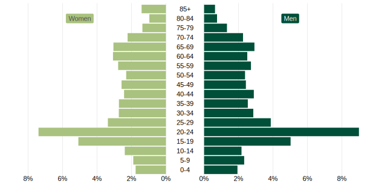

And there we go! We’ve gone from a basic population pyramid plot to a
polished one, with the help of the `patchwork` and `scales` packages.
Thanks for following along on the involved process I’ve gone through to
get the final version of the population pyramids that will show up in
the 2024 version of Oregon by the Numbers.

Of course, the code we’ve written just works for one county (Benton).
I’ll be back soon with a follow-up blog post showing how to turn what
we’ve created into a function to make a population pyramid for any
county in Oregon.
