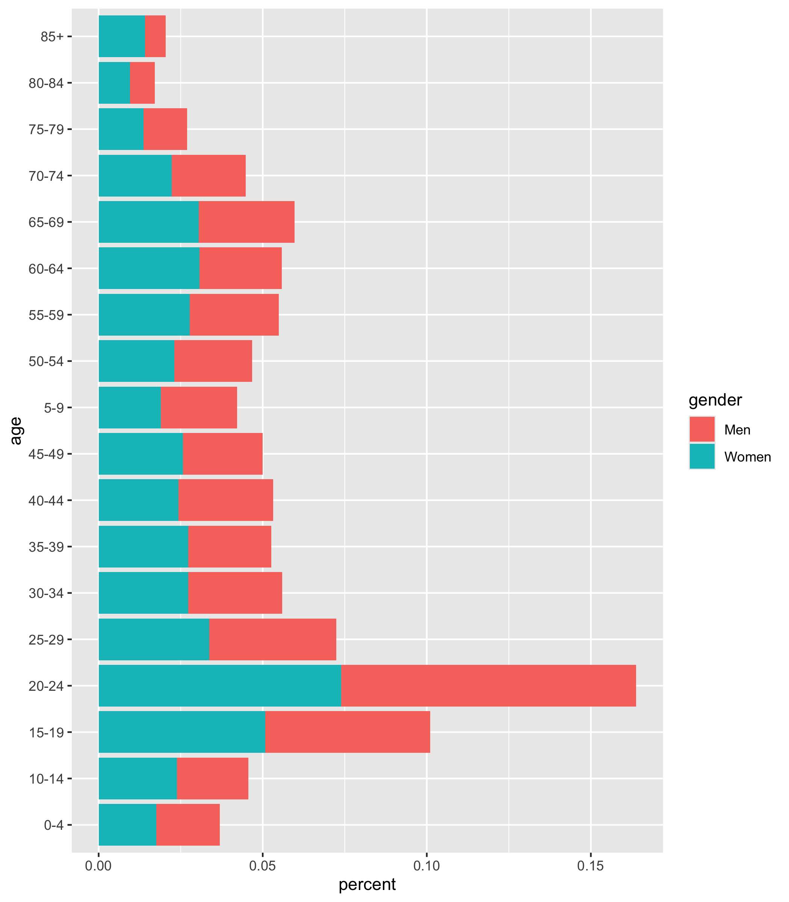
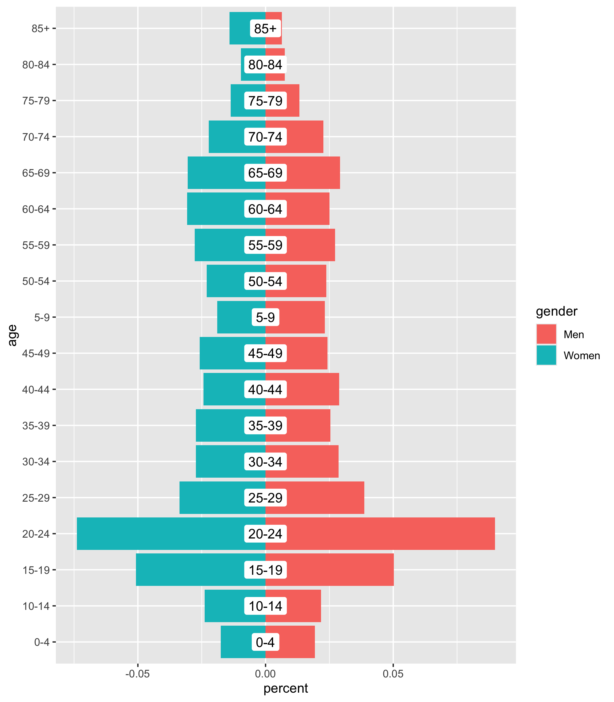
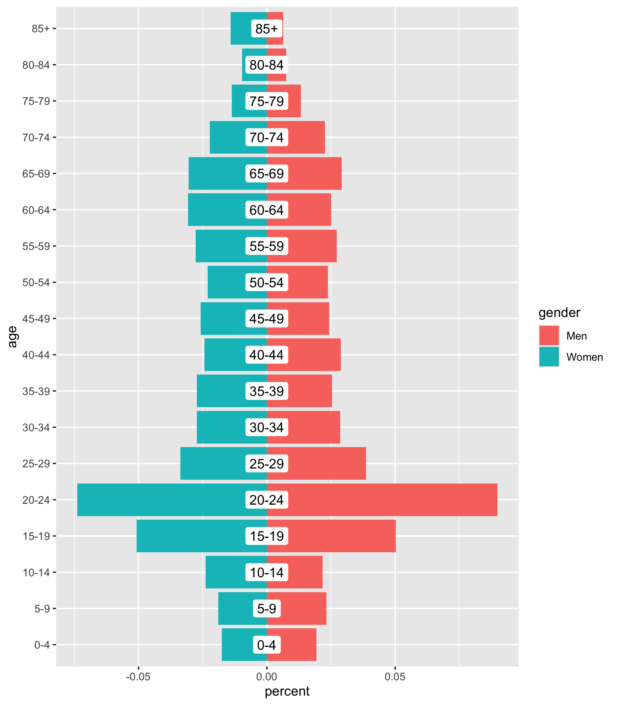

# How to make polished population pyramids in ggplot: part 1
David Keyes
2024-07-23

How do you make a population pyramid in `ggplot2`? These charts, which
allow us to see the distribution of the population by gender and age,
are common ways to examine demographics in a particular place. The
ggplot code needed to make a population pyramid is quite
straightforward, but, as you’ll see in this blog post, you can go way
beyond straightforward to make a polished population pyramid (try saying
that three times fast!).

I’ve made hundreds of population pyramids for the last few years as
[I’ve produced many population
pyramids](https://rfortherestofus.com/2023/01/multiple-plots) as part of
the annual [Oregon by the Numbers report](https://www.tfff.org/obtn). In
past years, I made plots that looked like this:


With the 0 in the very middle of the plot, I sometimes ran into issues
where portions of bars would be covered up. I implemented hacks to deal
with this, but it wasn’t a great situation.

I tried out a new technique this year, making separate plots for women,
men, and the age categories and combining them using the [`patchwork`
package](https://patchwork.data-imaginist.com/). When the report comes
out in September, you’ll see population pyramids that look like this:


Keep reading to learn how to make polished population pyramids in
ggplot!

## Make a basic population pyramid

To make a basic population pyramid, I’ll load the `tidyverse` and then
bring in the data I use for Oregon by the Numbers, saving it as an
object called `oregon_population_pyramid_data`.

``` r
library(tidyverse)

oregon_population_pyramid_data <-
  read_csv("https://raw.githubusercontent.com/rfortherestofus/blog/main/population-pyramid-part-1/oregon_population_pyramid_data.csv")
```

We can take a look at the data to see its structure. Here I’m just
showing one county.

``` r
oregon_population_pyramid_data |>
  filter(county == "Benton") |>
  arrange(age, gender) |>
  print(n = 36)
#> # A tibble: 36 × 4
#>    county age   gender percent
#>    <chr>  <chr> <chr>    <dbl>
#>  1 Benton 0-4   Men    0.0194 
#>  2 Benton 0-4   Women  0.0176 
#>  3 Benton 10-14 Men    0.0217 
#>  4 Benton 10-14 Women  0.0239 
#>  5 Benton 15-19 Men    0.0502 
#>  6 Benton 15-19 Women  0.0508 
#>  7 Benton 20-24 Men    0.0899 
#>  8 Benton 20-24 Women  0.0739 
#>  9 Benton 25-29 Men    0.0387 
#> 10 Benton 25-29 Women  0.0337 
#> 11 Benton 30-34 Men    0.0286 
#> 12 Benton 30-34 Women  0.0273 
#> 13 Benton 35-39 Men    0.0254 
#> 14 Benton 35-39 Women  0.0273 
#> 15 Benton 40-44 Men    0.0289 
#> 16 Benton 40-44 Women  0.0243 
#> 17 Benton 45-49 Men    0.0243 
#> 18 Benton 45-49 Women  0.0257 
#> 19 Benton 5-9   Men    0.0233 
#> 20 Benton 5-9   Women  0.0189 
#> 21 Benton 50-54 Men    0.0238 
#> 22 Benton 50-54 Women  0.0231 
#> 23 Benton 55-59 Men    0.0272 
#> 24 Benton 55-59 Women  0.0277 
#> 25 Benton 60-64 Men    0.0251 
#> 26 Benton 60-64 Women  0.0307 
#> 27 Benton 65-69 Men    0.0292 
#> 28 Benton 65-69 Women  0.0305 
#> 29 Benton 70-74 Men    0.0226 
#> 30 Benton 70-74 Women  0.0222 
#> 31 Benton 75-79 Men    0.0133 
#> 32 Benton 75-79 Women  0.0136 
#> 33 Benton 80-84 Men    0.00751
#> 34 Benton 80-84 Women  0.00960
#> 35 Benton 85+   Men    0.00634
#> 36 Benton 85+   Women  0.0141
```

A population pyramid is essentially a back-to-back bar chart, with women
on one side and men on the other. Here’s how I would filter my data to
just show one county in Oregon (Benton again) and attempt to make a
population pyramid.

``` r
oregon_population_pyramid_data |>
  filter(county == "Benton") |>
  ggplot(aes(
    x = percent,
    y = age,
    fill = gender
  )) +
  geom_col()
```

However, as you can see in the resulting plot, this doesn’t work because
the bars for Women and Men stack on top of each other, both going to the
right.



To fix this, I need to have the data for Women show up as negative
numbers. To do that, I use an `if_else()` statement, stating that, if
the `gender` variable is “Men”, keep `percent` as the `percent` value.
However, if `gender` is “Women” then `percent` becomes `-percent`
(i.e. the negative value of `percent`).

``` r
oregon_population_pyramid_data <-
  oregon_population_pyramid_data |>
  mutate(percent = if_else(gender == "Men", percent, -percent))
```

With this change, we can now use the same code to make a basic
population pyramid, with Women on the left and Men on the right.


One thing I’ve always done in population pyramids for Oregon by the
Numbers is to put the age labels in the center of the bars. I think it’s
much easier for people to see them there than at the left, where they
appear by default. To do this, I have used `geom_label()` to put the age
labels in the center of the population pyramid.

``` r
oregon_population_pyramid_data |>
  filter(county == "Benton") |>
  ggplot(
    aes(
      x = percent,
      y = age,
      fill = gender
    )
  ) +
  geom_col() +
  geom_label(
    aes(
      x = 0,
      label = age
    ),
    fill = "white",
    label.size = 0
  )
```

As you can see in the resulting plot, there are two issues:

1.  The age labels are not in the right order.
2.  The age labels cover up portions of the bars.

``` r
oregon_population_pyramid_data |>
  filter(county == "Benton") |>
  ggplot(
    aes(
      x = percent,
      y = age,
      fill = gender
    )
  ) +
  geom_col() +
  geom_label(
    aes(
      x = 0,
      label = age
    ),
    fill = "white",
    label.size = 0
  )
```



We can fix the order by converting `age` to a factor. The
`fct_inorder()` function from the `forcats` package makes `age` into a
factor and sets its order to be the order that the values appear.

``` r
oregon_population_pyramid_data <-
  oregon_population_pyramid_data |>
  mutate(age = fct_inorder(age))
```

Now, reusing the same code, we see the age labels in the right order.


