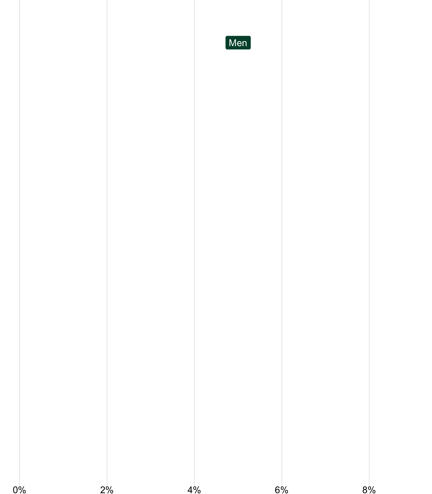
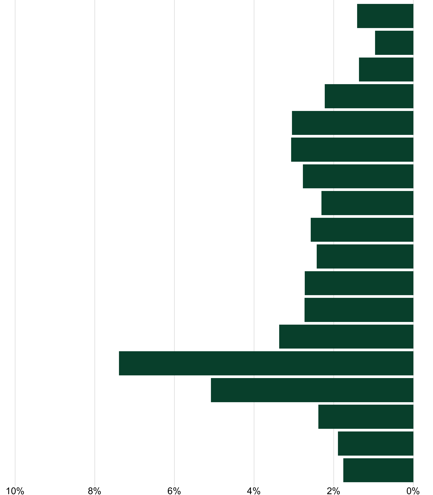
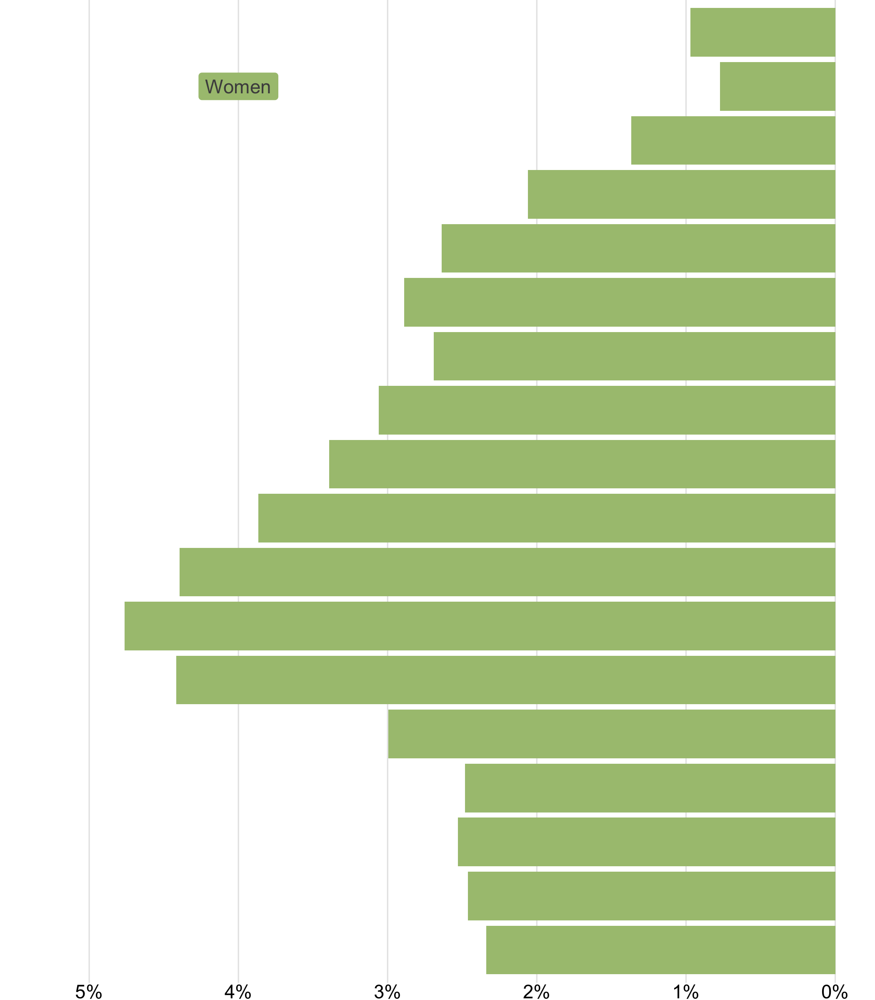
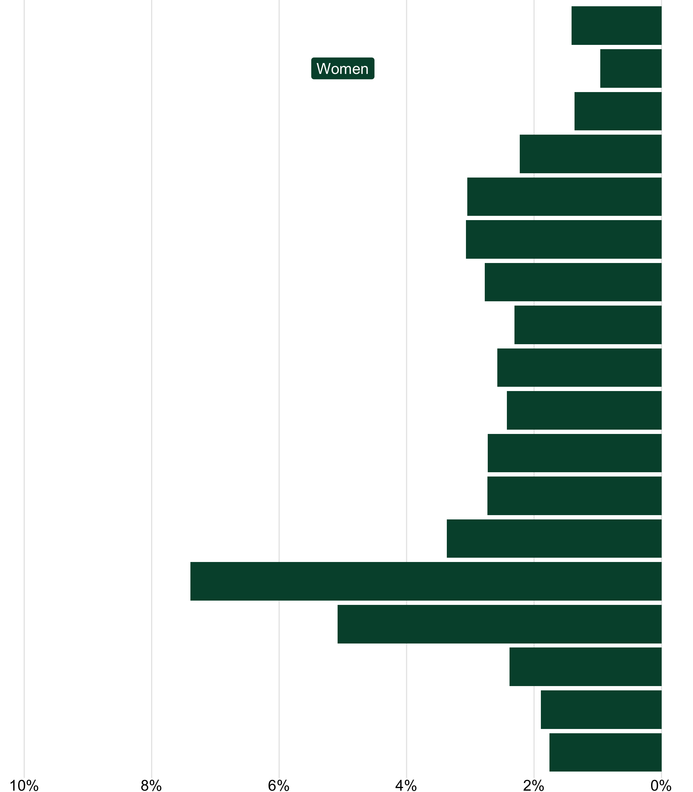
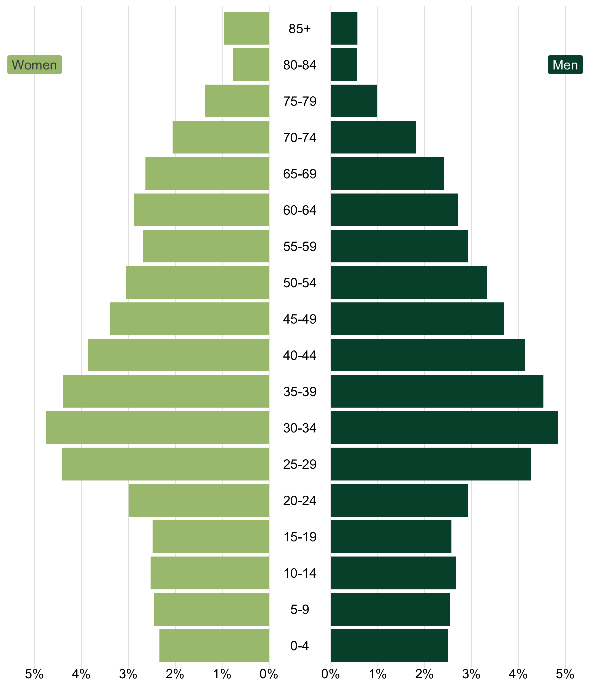

# How to make polished population pyramids in ggplot: part 2
David Keyes
2024-01-17

[I wrote recently](TODO:%20Add%20link) about how I revamped the process of making population pyramids for Oregon by the Numbers, the report I’ve worked on for the last several years. Rather than making one plot, I used the `patchwork` package to stitch together three parts:

1.  A plot for women on the left
2.  Age labels in the center
3.  A plot for men on the right

The result is a polished version of a population pyramid that I’m quite pleased with.


The blog post I wrote about making this version of the population pyramid saw us make one for Benton county. But this is only one of the 36 counties that make up Oregon. Given that my job is to make 36 population pyramids ([alongside a couple hundred other visuals](TODO:%20Add%20link)), what I really need is not the code to make *one* population pyramid, but a function to make *all* population pyramids.

In this blog post, I detail how I would turn code for a single population pyramid into a function. As you’ll see, it’s not that much more work to make a function that works for any county.

## Getting started

To do this, I’ll use three packages:

1.  `tidyverse` for data wrangling and plotting.
2.  `scales` to give me nicely formatted values in my plots.
3.  `patchwork` to stitch together my women, men, and age labels plots.

``` r
library(tidyverse)
library(scales)
library(patchwork)
```

Next, I’ll import my data. As I showed in part 1, the first step is to make the values in `percent` variable show up as negative for women so that they appear on the left side while the values for men show up on the right side. Additionally, I make the `age` variable a factor and use `fct_inorder()` to ensure the age categories show up in the right order.

``` r
oregon_population_pyramid_data <-
  read_csv("https://raw.githubusercontent.com/rfortherestofus/blog/main/population-pyramid-part-1/oregon_population_pyramid_data.csv") |>
  mutate(percent = if_else(gender == "Men", percent, -percent)) |>
  mutate(age = fct_inorder(age))
```

Next, I created an `age_labels` tibble in order to make a plot that just shows the age categories. As we saw in part 1, we can use the `patchwork` package to combine this with our women and men bar charts to make a population pyramid. I saved this as `age_labels_plot` so I can use it later on.

``` r
age_labels <-
  tibble(
    age = c(
      "0-4",
      "5-9",
      "10-14",
      "15-19",
      "20-24",
      "25-29",
      "30-34",
      "35-39",
      "40-44",
      "45-49",
      "50-54",
      "55-59",
      "60-64",
      "65-69",
      "70-74",
      "75-79",
      "80-84",
      "85+"
    )
  ) |>
  mutate(
    age = fct_inorder(age)
  )

age_labels_plot <-
  age_labels |>
  ggplot(
    aes(
      x = 1,
      y = age,
      label = age
    )
  ) +
  geom_text() +
  theme_void()
```

Finally, I’ll add back in the calculation to get the `max_percent` value (i.e. the maximum bar length for men and women), which we use to create consistent limits in our plots.

``` r
max_percent <-
  oregon_population_pyramid_data |>
  filter(county == "Benton") |>
  slice_max(
    order_by = percent,
    n = 1
  ) |>
  pull(percent)
```

## Filter by county and gender

First, I’m going to take the code I used to make the men plot and make it a function. In part 1, I manually filtered `oregon_population_pyramid_data` to only include Benton county and men. To start my function, however, I’ll add two arguments: `county_to_filter` and `gender_to_filter`.

``` r
population_pyramid_single_gender_plot <-
  function(
  county_to_filter,
  gender_to_filter
  ) {
    oregon_population_pyramid_data |>
      filter(county == county_to_filter) |>
      filter(gender == gender_to_filter) |>
      ggplot(aes(
        x = percent,
        y = age
      )) +
      geom_col(fill = "#004f39") +
      annotate(
        geom = "label",
        x = 0.05,
        y = 17,
        label = "Men",
        fill = "#004f39",
        color = "white",
        label.size = 0,
        label.padding = unit(0.3, "lines")
      ) +
      scale_x_continuous(
        labels = function(x) label_percent(accuracy = 1)(abs(x)),
        breaks = breaks_pretty(),
        limits = c(0, max_percent)
      ) +
      theme_void() +
      theme(
        axis.text.x = element_text(),
        panel.grid.major.x = element_line(color = "grey90")
      )
  }
```

Now, instead of manually specifying the county and gender, I’ll add them as function arguments.

``` r
population_pyramid_single_gender_plot(
  county_to_filter = "Benton",
  gender_to_filter = "Men"
)
```

I can run my code and see that it creates a nice plot for men.


Unfortunately, when I try to run this function for women, it doesn’t work.



Why doesn’t this function work for women? The problem is that the x axis limits go from 0 to `max_percent`, which is 0.0898708. But, since the values for women are all negative, nothing appears on our chart.

There’s one other issue with our chart x axis limits. When we calculated `max_percent` we manually specified Benton county. What if we adjust our code to create a plot for Multnomah county as follows?

``` r
population_pyramid_single_gender_plot(
  county_to_filter = "Multnomah",
  gender_to_filter = "Men"
)
```

Let’s see!


That doesn’t look right. If we try to create a plot for Multnomah county, the x axis limits don’t adapt. That’s why there’s too much space on the right side. Let’s make our x axis limits adapt to the data we’re plotting.

## Make our x axis limits dynamic

To do this, we need to move the `max_percent` calculation *inside* our function. I’ve done that below, replacing the line that read `filter(county == "Benton)` with `filter(county == county_to_filter)` so that `max_percent` will be calculated for the county being plotted.

In addition, I’ve added a couple `if` statements to ensure the limits show up correctly for women and men. Within these two `if` statements, I’ve created an object called `x_limits`. For men, it goes from 0 to `max_percent` times 1.1 (I do this just to give it a bit of padding and make sure nothing gets cut off). For women, it goes from `-max_percent` times 1.1 to 0. We then use `limits = x_limits` within `scale_x_continuous()` to apply our calculated x axis limits.

``` r
population_pyramid_single_gender_plot <-
  function(
  county_to_filter,
  gender_to_filter
  ) {
    max_percent <-
      oregon_population_pyramid_data |>
      filter(county == county_to_filter) |>
      slice_max(
        order_by = percent,
        n = 1
      ) |>
      pull(percent)

    if (gender_to_filter == "Men") {
      x_limits <- c(0, max_percent * 1.1)
    }

    if (gender_to_filter == "Women") {
      x_limits <- c(-max_percent * 1.1, 0)
    }

    oregon_population_pyramid_data |>
      filter(county == county_to_filter) |>
      filter(gender == gender_to_filter) |>
      ggplot(aes(
        x = percent,
        y = age
      )) +
      geom_col(fill = "#004f39") +
      annotate(
        geom = "label",
        x = 0.05,
        y = 17,
        label = "Men",
        fill = "#004f39",
        color = "white",
        label.size = 0,
        label.padding = unit(0.3, "lines")
      ) +
      scale_x_continuous(
        labels = function(x) label_percent(accuracy = 1)(abs(x)),
        breaks = breaks_pretty(),
        limits = x_limits
      ) +
      theme_void() +
      theme(
        axis.text.x = element_text(),
        panel.grid.major.x = element_line(color = "grey90")
      )
  }
```

Now, if we run our code to make the Benton plot for women, the x axis limits look good and, importantly, we can actually see our bars!

``` r
population_pyramid_single_gender_plot(
  county_to_filter = "Benton",
  gender_to_filter = "Women"
)
```


However, we can’t see the Women label. Let’s fix that.

## Adjust gender label position and text

The reason why we can’t see the Women label is that its x position is hard coded within the `annotate()` function to 0.04. This works for the Men label, but not for Women, where all values are negative. To remedy this, let’s create a `gender_label_x_position` variable within our two `if` statements. If `gender_to_filter` is Men, then `gender_label_x_position` is 0.05; if it is Women, `gender_label_x_position` is -0.05 (I cheated a bit because I know from having worked with my data that the bars will never overlap at this location). Then, we update the `annotate()` function to specify that the x position should be the value of `gender_label_x_position`. Additionally, we set the `label` argument in `annotate()` to take the value of the `gender_to_filter` argument so that the label text adapts dynamically.

``` r
population_pyramid_single_gender_plot <-
  function(
  county_to_filter,
  gender_to_filter
  ) {
    max_percent <-
      oregon_population_pyramid_data |>
      filter(county == county_to_filter) |>
      slice_max(
        order_by = percent,
        n = 1
      ) |>
      pull(percent)

    if (gender_to_filter == "Men") {
      x_limits <- c(0, max_percent * 1.1)
      gender_label_x_position <- 0.04
    }

    if (gender_to_filter == "Women") {
      x_limits <- c(-max_percent * 1.1, 0)
      gender_label_x_position <- -0.04
    }

    oregon_population_pyramid_data |>
      filter(county == county_to_filter) |>
      filter(gender == gender_to_filter) |>
      ggplot(aes(
        x = percent,
        y = age
      )) +
      geom_col(fill = "#004f39") +
      annotate(
        geom = "label",
        x = gender_label_x_position,
        y = 17,
        label = gender_to_filter,
        fill = "#004f39",
        color = "white",
        label.size = 0,
        label.padding = unit(0.3, "lines")
      ) +
      scale_x_continuous(
        labels = function(x) label_percent(accuracy = 1)(abs(x)),
        breaks = breaks_pretty(),
        limits = x_limits
      ) +
      theme_void() +
      theme(
        axis.text.x = element_text(),
        panel.grid.major.x = element_line(color = "grey90")
      )
  }
```

This works for Men:



And for Women:


## Use different colors for men and women

The only remaining issue to deal with at this point is the color of the bars and the gender labels. I want to make women show up in a light green and men in the dark green we’ve seen up to this point. To do this, I follow the same procedure as above, creating a new variable called `fill_color` in our `if` statements and then applying it within both `geom_col()` and the `annotate()` functions.

``` r
population_pyramid_single_gender_plot <-
  function(
  county_to_filter,
  gender_to_filter
  ) {
    max_percent <-
      oregon_population_pyramid_data |>
      filter(county == county_to_filter) |>
      slice_max(
        order_by = percent,
        n = 1
      ) |>
      pull(percent)

    if (gender_to_filter == "Men") {
      x_limits <- c(0, max_percent * 1.1)
      gender_label_x_position <- 0.04
      fill_color <- "#004f39"
      gender_text_color <- "white"
    }

    if (gender_to_filter == "Women") {
      x_limits <- c(-max_percent * 1.1, 0)
      gender_label_x_position <- -0.04
      fill_color <- "#A9C27F"
      gender_text_color <- "grey30"
    }

    oregon_population_pyramid_data |>
      filter(county == county_to_filter) |>
      filter(gender == gender_to_filter) |>
      ggplot(aes(
        x = percent,
        y = age
      )) +
      geom_col(fill = fill_color) +
      annotate(
        geom = "label",
        x = gender_label_x_position,
        y = 17,
        label = gender_to_filter,
        fill = fill_color,
        color = gender_text_color,
        label.size = 0,
        label.padding = unit(0.3, "lines")
      ) +
      scale_x_continuous(
        labels = function(x) label_percent(accuracy = 1)(abs(x)),
        breaks = breaks_pretty(),
        limits = x_limits
      ) +
      coord_cartesian(clip = "off") +
      theme_void() +
      theme(
        axis.text.x = element_text(),
        panel.grid.major.x = element_line(color = "grey90")
      )
  }
```

Now, when I make a plot for women in Multnomah county, we can see the light green in action.



## Combine everything into a population pyramid

Now that we’ve adjusted our `population_pyramid_single_gender_plot()` function so that it works for men and women, let’s make a population pyramid! I’ll create a population pyramid for Multnomah county by running the function to create a `women_plot` object and a `men_plot` object. I then use the `patchwork` package to combine these with the `age_labels_plot` I made above.

``` r
women_plot <-
  population_pyramid_single_gender_plot(
    county_to_filter = "Multnomah",
    gender_to_filter = "Women"
  )

men_plot <-
  population_pyramid_single_gender_plot(
    county_to_filter = "Multnomah",
    gender_to_filter = "Men"
  )

women_plot +
  age_labels_plot +
  men_plot +
  plot_layout(
    widths = c(7.5, 1, 7.5)
  )
```

Run this code and I’ve got a really nice population pyramid!



To top it off, let’s make a single function to make a population pyramid by just passing the name of a county. I’ll call it `population_pyramid_combined_plot()`. The function takes just one argument (`county_to_filter`), which it uses to make a `women_plot` and a `men_plot`, which it then combines with the `age_labels_plot`.

``` r
population_pyramid_combined_plot <- function(county_to_filter) {
  women_plot <-
    population_pyramid_single_gender_plot(
      county_to_filter = county_to_filter,
      gender_to_filter = "Women"
    )

  men_plot <-
    population_pyramid_single_gender_plot(
      county_to_filter = county_to_filter,
      gender_to_filter = "Men"
    )

  women_plot +
    age_labels_plot +
    men_plot +
    plot_layout(
      widths = c(7.5, 1, 7.5)
    )
}
```

Now, I can run this code, passing any Oregon county name as my `county_to_filter` argument. To make a population pyramid for Gilliam county, for example, I just write this:

``` r
population_pyramid_combined_plot(county_to_filter = "Gilliam")
```

And I get a nicely formatted population pyramid in return!


And, just for fun, here’s Wallowa county (one of my favorite places in Oregon!).



I could now run this for [any county in Oregon](https://www.oregon.gov/pages/counties.aspx). Don’t believe me? Copy the code and try it for yourself!
