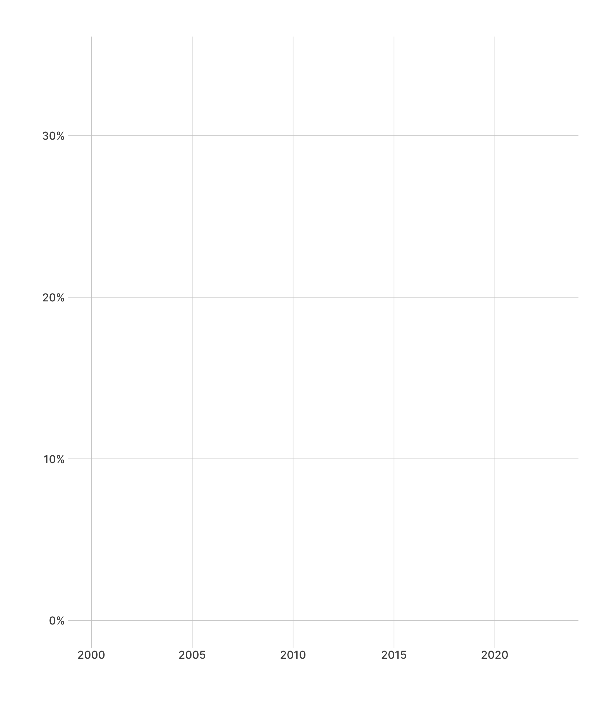
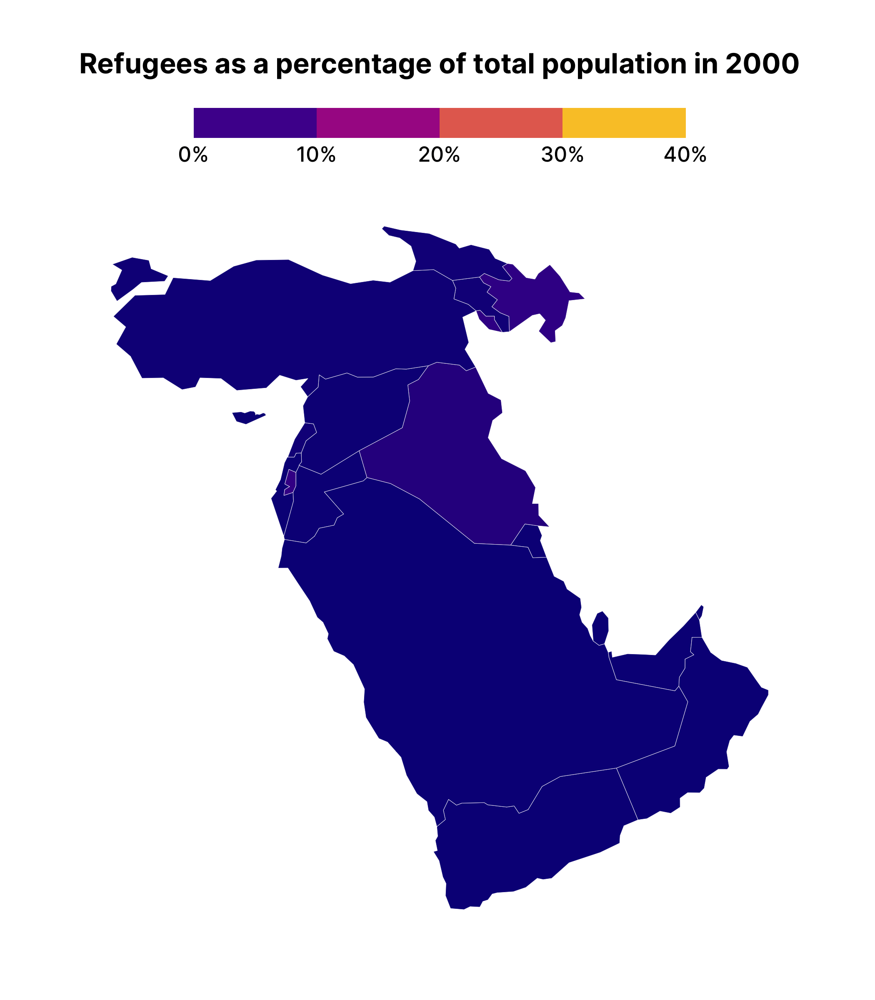

# Refugees animation
David Keyes
2024-01-17

``` r
# Load necessary libraries
library(tidyverse)
library(gganimate)
library(sf)
library(refugees)
library(viridis)
library(RColorBrewer)
library(scales)
```

# Data

``` r
population |>
  select(year, coo_iso, refugees) |>
  group_by(year, coo_iso) |>
  summarise(number_of_refugees = sum(refugees, na.rm = TRUE)) |>
  ungroup() |>
  filter(year >= 2000)
#> # A tibble: 4,635 × 3
#>     year coo_iso number_of_refugees
#>    <dbl> <chr>                <dbl>
#>  1  2000 AFG                3587327
#>  2  2000 AGO                 433756
#>  3  2000 ALB                   6801
#>  4  2000 ARE                     17
#>  5  2000 ARG                    608
#>  6  2000 ARM                   5787
#>  7  2000 ATG                      0
#>  8  2000 AUS                      0
#>  9  2000 AUT                     33
#> 10  2000 AZE                 284278
#> # ℹ 4,625 more rows
```

``` r
population
#> # A tibble: 126,402 × 16
#>     year coo_name coo   coo_iso coa_name   coa   coa_iso refugees asylum_seekers
#>    <dbl> <chr>    <chr> <chr>   <chr>      <chr> <chr>      <dbl>          <dbl>
#>  1  1951 Unknown  UKN   UNK     Australia  AUL   AUS       180000              0
#>  2  1951 Unknown  UKN   UNK     Austria    AUS   AUT       282000              0
#>  3  1951 Unknown  UKN   UNK     Belgium    BEL   BEL        55000              0
#>  4  1951 Unknown  UKN   UNK     Canada     CAN   CAN       168511              0
#>  5  1951 Unknown  UKN   UNK     Denmark    DEN   DNK         2000              0
#>  6  1951 Unknown  UKN   UNK     France     FRA   FRA       290000              0
#>  7  1951 Unknown  UKN   UNK     United Ki… GBR   GBR       208000              0
#>  8  1951 Unknown  UKN   UNK     Germany    GFR   DEU       265000              0
#>  9  1951 Unknown  UKN   UNK     Greece     GRE   GRC        18000              0
#> 10  1951 Unknown  UKN   UNK     China, Ho… HKG   HKG        30000              0
#> # ℹ 126,392 more rows
#> # ℹ 7 more variables: returned_refugees <dbl>, idps <dbl>, returned_idps <dbl>,
#> #   stateless <dbl>, ooc <dbl>, oip <dbl>, hst <dbl>

refugees <-
  population |>
  rename(country_abbreviation = coo_iso) |>
  group_by(year, country_abbreviation) |>
  summarise(number_of_refugees = sum(refugees, na.rm = TRUE)) |>
  ungroup() |>
  filter(year >= 2000) |>
  arrange(country_abbreviation)

library(wbstats)

country_population <-
  wb_data("SP.POP.TOTL", start_date = 2000, end_date = 2023) |>
  select(date, iso3c, SP.POP.TOTL) |>
  set_names("year", "country_abbreviation", "total_population") |>
  labelled::remove_var_label()

refugees_as_pct <-
  refugees |>
  left_join(
    country_population,
    join_by(year, country_abbreviation)
  ) |>
  mutate(refugees_as_pct = number_of_refugees / total_population) |>
  select(year, country_abbreviation, total_population, number_of_refugees, refugees_as_pct) |>
  complete(year, country_abbreviation) |> 
  arrange(desc(refugees_as_pct))
  
```

- Syria

# Plot

``` r
refugees_as_pct |>
  filter(country_abbreviation == "SYR") |>
  ggplot(
    aes(
      x = year,
      y = refugees_as_pct
    )
  ) +
  scale_y_continuous(
    labels = percent_format()
  ) +
  geom_line() +
  labs(
    x = NULL,
    y = NULL
  ) +
  hrbrthemes::theme_ipsum_inter() +
  theme(panel.grid.minor = element_blank()) +
  transition_reveal(year)
```



# Map

``` r
library(rnaturalearth)

countries_geospatial <-
  ne_countries() |>
  select(iso_a3, continent, subregion) |>
  rename(country_abbreviation = iso_a3)

countries_geospatial |>
  left_join(
    refugees_as_pct,
    join_by(country_abbreviation)
  ) |>
  filter(continent == "Asia") |>
  filter(subregion == "Western Asia") |>
  ggplot() +
  geom_sf(
    aes(fill = refugees_as_pct),
    linewidth = 0.1,
    color = "white"
  ) +
  hrbrthemes::theme_ipsum_inter(
    grid = FALSE
  ) +
  labs(
    title = "Refugees as a percentage of total population in {current_frame}",
    # caption = "{current_frame}",
    fill = NULL
  ) +
  scale_fill_viridis_c(
    labels = scales::percent_format(),
    limits = c(0, .4),
    option = "C",
    guide = guide_colorsteps(show.limits = TRUE)
  ) +
  theme(
    legend.position = "top",
    plot.title = element_text(
      face = "bold",
      hjust = 0.5
    ),
    axis.text.x = element_blank(),
    axis.text.y = element_blank(),
    legend.key.width = unit(2, "cm"),
    legend.text = element_text(
      size = 12
    )
  ) +
  transition_manual(year)
```



``` r

# anim_save(
#   "refugees-animation/animated_refugee_map.gif",
#   fps = 5,
#   width = 1200, height = 800, res = 150, # Higher resolution
#   renderer = gifski_renderer(loop = TRUE)
# )
```
