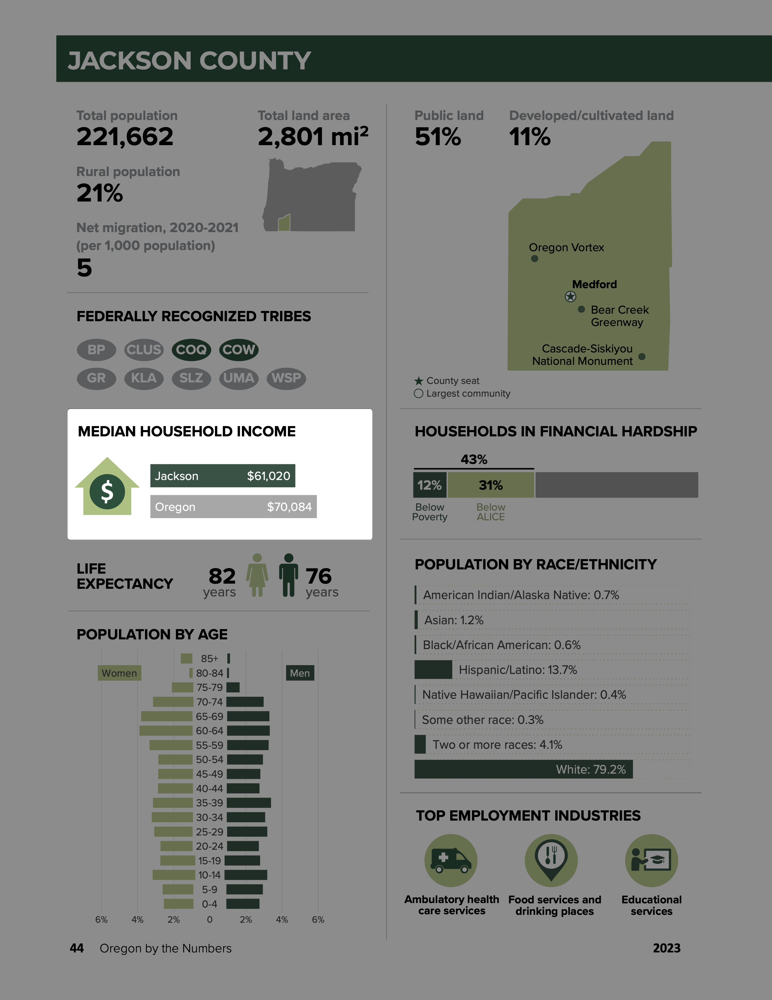
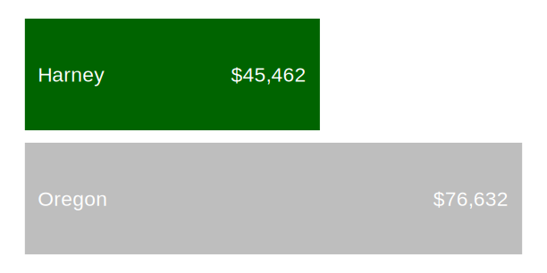
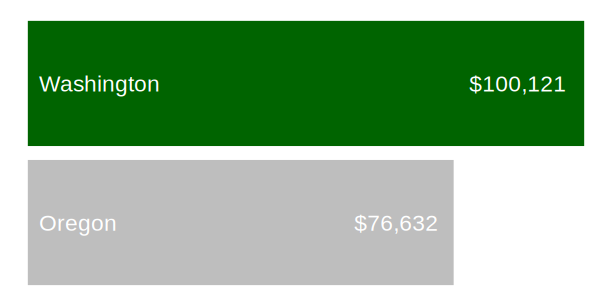
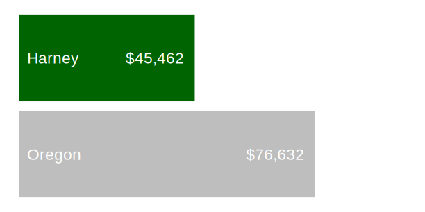
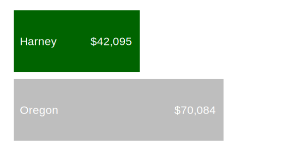

# Data viz tips for parameterized reporting: set consistent axis limits
David Keyes
2024-08-01

One of the biggest challenges we face when doing [parameterized
reporting](https://rfortherestofus.com/2024/06/parameterized-reporting-quarto)
is how to make plots consistent across multiple reports. We’ve learned
(oftentimes the hard way) many tricks for dealing with this problem. One
I want to share with you today is making your axis limits consistent.

Here’s an issue I made making plots that show median income by county
for the [annual Oregon by the Numbers
report](https://rfortherestofus.com/success-stories/oregon-by-the-numbers).



Let me show you a simplified version of the function I created to make
these plots. We’ll begin by loading two packages: `tidyverse` for data
wrangling and plotting with `ggplot2` and the `scales` package to create
numbers formatted as dollars for plotting.

``` r
library(tidyverse)
library(scales)
```

Next, we’ll import my data.

``` r
median_income <-
  read_csv("https://raw.githubusercontent.com/rfortherestofus/blog/main/set-consistent-limits/median_income.csv")
```

You can see the four variables we have in this data frame.

``` r
median_income
#> # A tibble: 37 × 4
#>    geography  year amount amount_formatted
#>    <chr>     <dbl>  <dbl> <chr>           
#>  1 Oregon     2024  76632 $76,632         
#>  2 Baker      2024  51657 $51,657         
#>  3 Benton     2024  72882 $72,882         
#>  4 Clackamas  2024  95740 $95,740         
#>  5 Clatsop    2024  68025 $68,025         
#>  6 Columbia   2024  83265 $83,265         
#>  7 Coos       2024  57563 $57,563         
#>  8 Crook      2024  74969 $74,969         
#>  9 Curry      2024  64300 $64,300         
#> 10 Deschutes  2024  82042 $82,042         
#> # ℹ 27 more rows
```

Next, we’ll create a function to a single median income plot. This
function has one argument (`county`), which is used to filter the
`median_income` data before plotting it.

``` r
median_income_plot <- function(county) {
  median_income |>
    filter(geography %in% c(county, "Oregon")) |>
    mutate(geography = fct(geography, levels = c("Oregon", county))) |>
    ggplot(
      aes(
        x = amount,
        y = geography,
        label = amount_formatted,
        fill = geography
      )
    ) +
    geom_col(show.legend = FALSE) +
    geom_text(
      color = "white",
      hjust = 1.2,
      size = 8
    ) +
    geom_text(
      aes(
        x = 2000,
        label = geography
      ),
      color = "white",
      hjust = 0,
      size = 8
    ) +
    scale_fill_manual(values = c(
      "gray",
      "darkgreen"
    )) +
    theme_void()
}
```

Now that we have my `median_income_plot()` function, we can use it to
make some plots. Here’s the plot for Jackson county.

``` r
median_income_plot("Jackson")
```


And here’s the plot for Harney county.

``` r
median_income_plot("Harney")
```



Everything looks good so far. But take a look at what happens when we
make the same plot for Washington county. Because the median income of
Washington county is above that of Oregon, the x axis limits go beyond
the limits of the plots for Jackson and Harney counties.

``` r
median_income_plot("Washington")
```



If we were to put plots with different x axis limits in the Oregon by
the Numbers report, readers might be confused. If they looked at two
plots side by side, for example, they might see that the bar for Oregon
for the Harney plot is larger than it is in the Washington plot.

How do we deal with this? The answer is to adjust our
`median_income_plot()` function so that we calculate the maximum median
income for *all* counties and then use to set the x axis limits in our
plots. To do this, let’s first create a variable called
`max_median_income` by starting with the `median_income` data frame,
using `slice_max()` to get the top row by the `amount` variable, and
then using the `pull()` function to turn this into a single value.

``` r
max_median_income <-
  median_income |>
  slice_max(
    order_by = amount,
    n = 1
  ) |>
  pull(amount)
```

We can now see the value of `max_median_income`:

``` r
max_median_income
#> [1] 100121
```

Next, what we’ll do is adjust our `median_income_plot()` function by
adding the following code. This will set the x axis limits to go from 0
to the value of `max_median_income`.

``` r
scale_x_continuous(
  limits = c(0, max_median_income)
)
```

We’ll create a new function called `median_income_plot_v2()` with this
code added at the bottom:

``` r
median_income_plot_v2 <- function(county) {
  max_median_income <-
    median_income |>
    slice_max(
      order_by = amount,
      n = 1
    ) |>
    pull(amount)

  median_income |>
    filter(geography %in% c(county, "Oregon")) |>
    mutate(geography = fct(geography, levels = c("Oregon", county))) |>
    ggplot(
      aes(
        x = amount,
        y = geography,
        label = amount_formatted,
        fill = geography
      )
    ) +
    geom_col(show.legend = FALSE) +
    geom_text(
      color = "white",
      hjust = 1.2,
      size = 8
    ) +
    geom_text(
      aes(
        x = 2000,
        label = geography
      ),
      color = "white",
      hjust = 0,
      size = 8
    ) +
    scale_fill_manual(values = c(
      "gray",
      "darkgreen"
    )) +
    theme_void() +
    scale_x_continuous(
      limits = c(0, max_median_income)
    ) 
}
```

Now let’s use our function make a plot for Jackson county:

``` r
median_income_plot_v2("Jackson")
```


For Harney county:

``` r
median_income_plot_v2("Harney")
```



And for Washington county:

``` r
median_income_plot_v2("Washington")
```



The size of the Oregon bar is the same throughout and our readers will
no longer be confused. By calculating the maximum median income and
using that to set our x axis limits, we’ve made our plots consistent
across all 36 Oregon counties.

Creating data viz when doing parameterized reporting requires thinking
about what plots will look like when you [make them many
times](https://rfortherestofus.com/2023/01/multiple-plots). It’s a bit
more upfront work, but the results are worth it!
