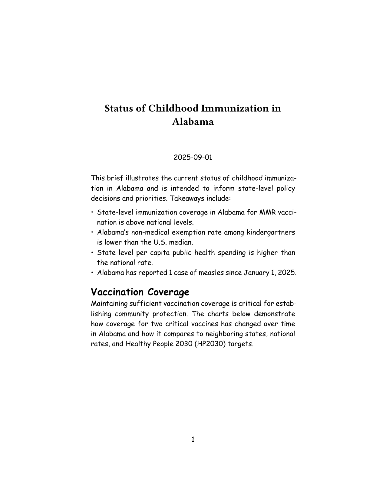
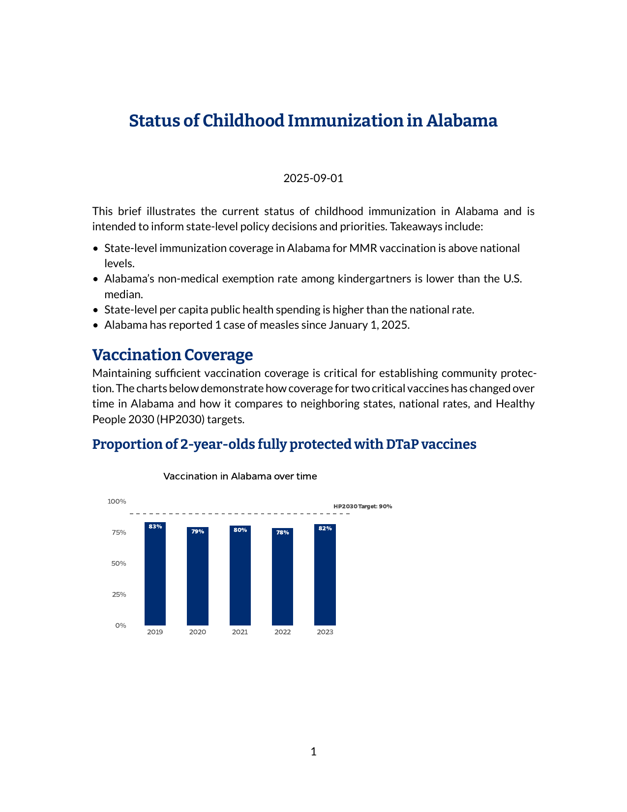
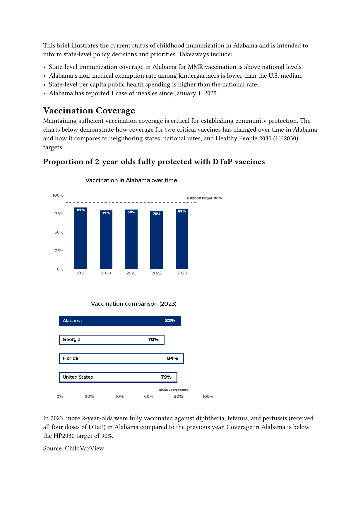
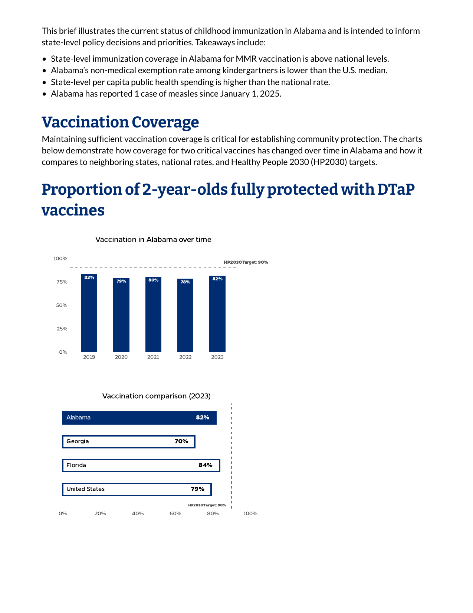
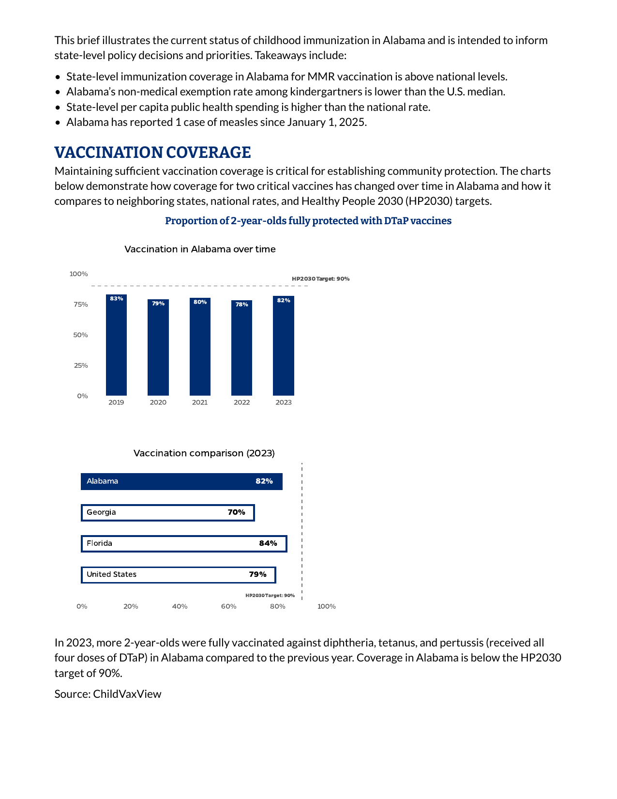
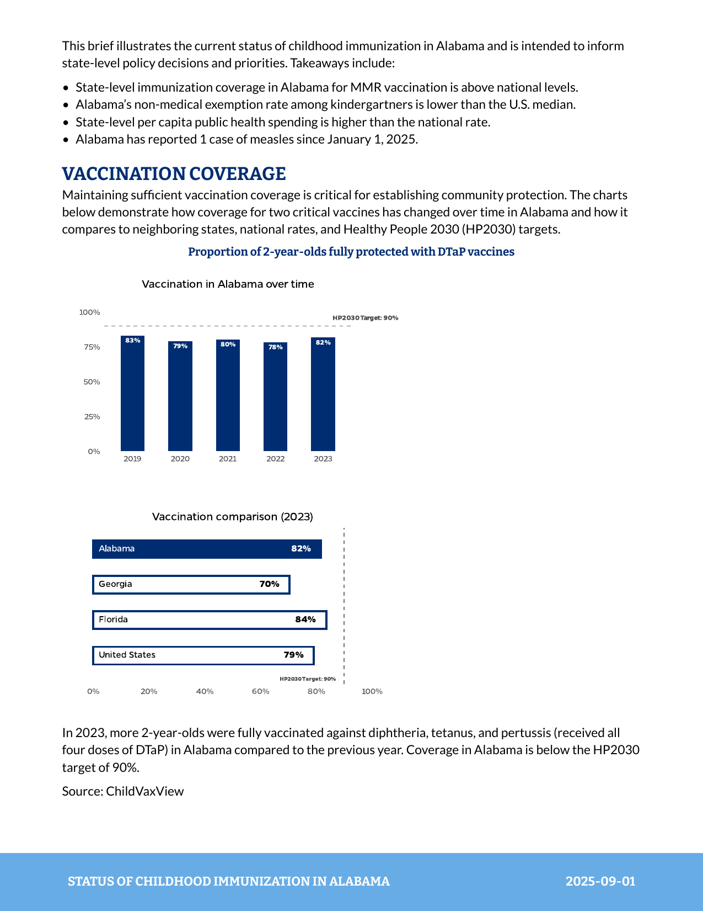
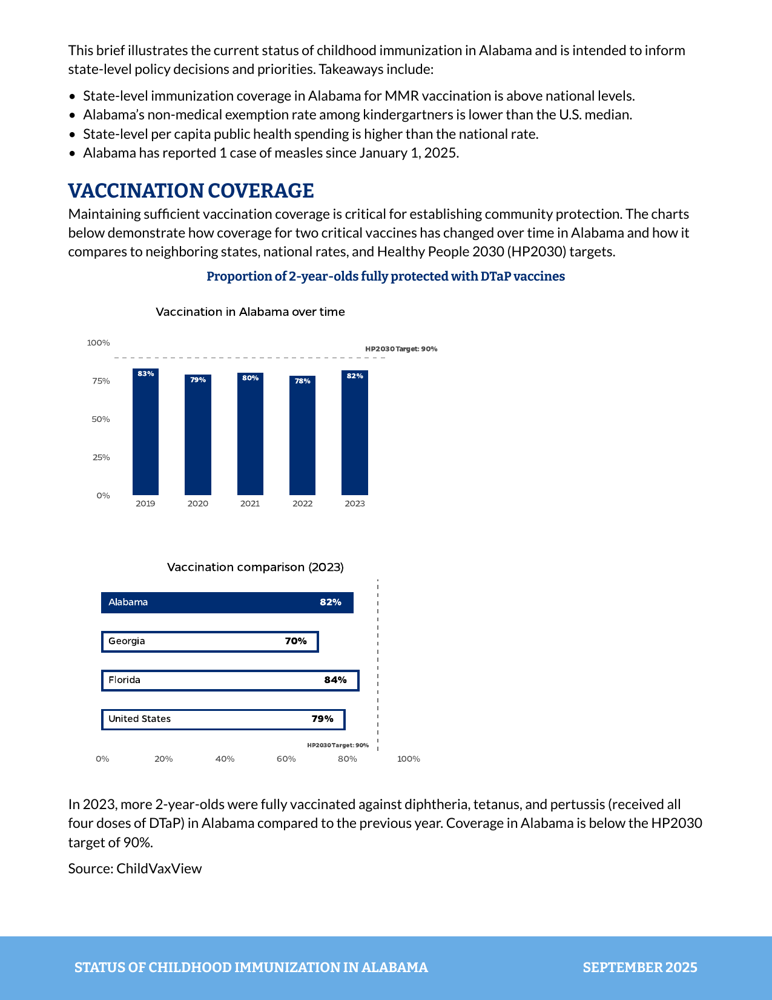
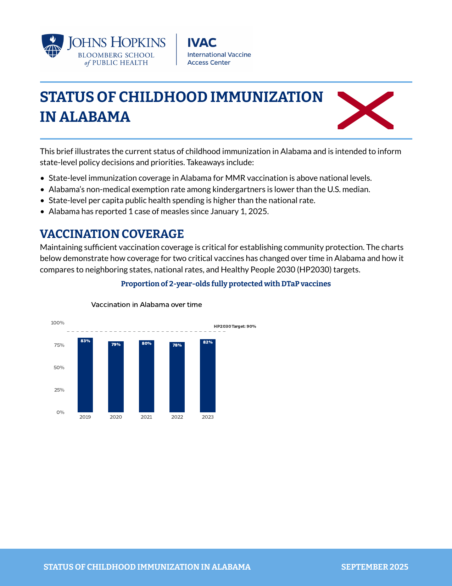
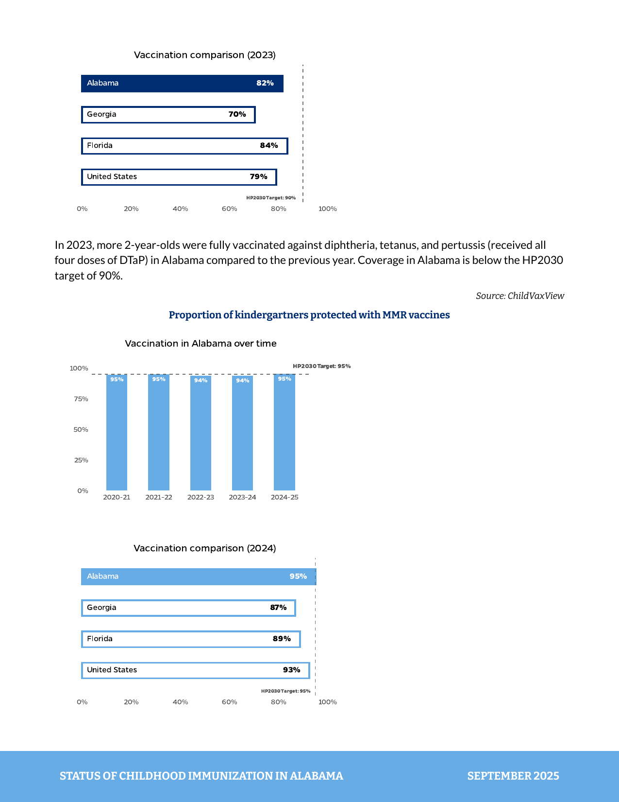
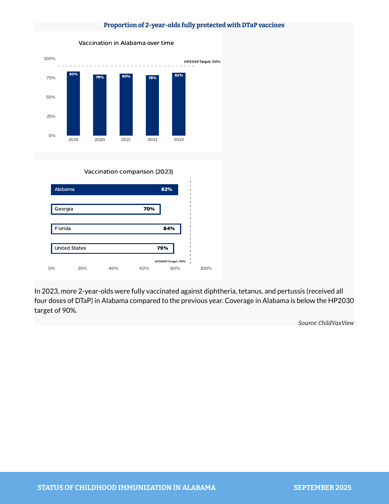

# How to Make High-Quality PDFs with Quarto and Typst
David Keyes
2025-10-28

In our consulting work at [Clarity Data Studio](https://claritydatastudio.com/), many clients come to us for support making highly-branded PDF reports. I spoke about how we make these reports in my 2024 posit::conf talk Report Design in R: Small Tweaks that Make a Big Difference.

TODO: Embed video: https://www.youtube.com/watch?v=bp1SMhLoz_M&list=PL9HYL-VRX0oSFkdF4fJeY63eGDvgofcbn&index=30&t=1s&ab_channel=PositPBC

In the last couple years, we’ve moved to [Typst](https://quarto.org/docs/output-formats/typst.html) almost exclusively for making PDFs. Of the two promises that Typst makes (powerful and easy to learn), we agree with the first. The second, however, a bit less so. [The Typst website has great documentation](https://typst.app/docs/), but it mostly covers how to write directly in Typst, rather than working in Quarto and rendering with Typst. People often ask me how we make reports with Typst, but I don’t have anywhere to point them to.

So, in conjunction with consultant [Joseph Barbier](https://barbierjoseph.com/) (who has become a true expert in creating custom Typst templates), here is an extended tutorial on making high-quality PDFs using Quarto and Typst. We’ll recreate most elements of the [childhood immunization reports we recently made for the Johns Hopkins University International Vaccine Access Center](https://publichealth.jhu.edu/ivac/monitoring-childhood-immunization-at-the-state-level).


Let’s get started!

## Create a Quarto document using Typst

To begin, we’ll create a Quarto document. I’ll add a content from the childhood immunization report for Alabama so we have something to work with.

Initially, when creating a PDF report in Quarto, you might think to use YAML with `format: pdf`, like so:

``` yaml
---
title: Status of Childhood Immunization in Alabama
date: September 2025
format: pdf
---
```

With `format: pdf`, Quarto will use LaTeX to render your PDF. Instead, we’ll use `format: typst`:

``` yaml
---
title: Status of Childhood Immunization in Alabama
date: September 2025
format: typst
---
```

If you render your report, it looks quite plain:


## Customize the PDF by tweaking YAML options

If you look at the [Quarto docs](https://quarto.org/docs/output-formats/typst.html), you’ll see that you can make additional tweaks within the YAML. You can set properties like the font (I’ll change it to something very obviously different), paper size, and margins:

``` yaml
---
title: Status of Childhood Immunization in Alabama
date: September 2025
format:
  typst:
    mainfont: "Comic Sans MS"
    papersize: us-letter
    margin:
      x: 2in
      y: 2in
---
```

On rendering, we can see our updated PDF:



YAML options get us started, but they don’t let us do things like set different fonts for headings and paragraph text. To do that, let’s take a quick detour away from Typst and to `brand.yml`.

## Customize PDF with `brand.yml`

[`brand.yml`](https://posit-dev.github.io/brand-yml/), created by Posit developer Garrick Aden-Buie ([I spoke with him about it in June 2025](https://rfortherestofus.com/2025/06/podcast-episode-27)), is a tool that allows you to create a single `_brand.yml` file that controls the look and feel of files rendered from Quarto docs (this goes beyond the scope of this blog post, but you can use a single `_brand.yml` file to make multiple formats follow your brand guidelines).


Let’s create a `_brand.yml` file. This file will allow us to use custom fonts (Bitter and Lato, which is close to the actual font, known as Gentian, used for the reports). Additionally, we will set the color of the headings to be a navy blue (#002D72).

``` yaml
typography:
  base: 
    family: Lato
    size: 11pt
  headings: 
    family: Bitter
    color: "#002D72"
```

This gets us a decent part of the way there.



But see how all of the headings are the same size? That’s not ideal and `_brand.yml` doesn’t give us any tools to fix this. It also doesn’t allow us to make customizations to the header or the footer of our report. Overall, `_brand.yml` is great if you want to make some simple customizations to a PDF document, but if we want to make a truly unique report, we’ll need to create a custom Typst template.

## Create a custom Typst template

In order to make a custom Typst template, we’ll begin by deleting the `_brand.yml` file. Instead, we’ll create two files, known as template partials:

- `typst-show.typ`
- `typst-template.typ`

The `typst-show.typ` file connects Quarto and Typst, enabling us to pass variables from the former to the latter. We’ll see this show up when doing things like adding the title in the footer of the report:


The `typst-template.typ` file is where we will define our custom template. We’ll use it to do things like set text styles, design headers and footers, and more.

We also need to tell our Quarto document to use these files, which we can do by adjusting our YAML:

``` yaml
---
title: Status of Childhood Immunization in Alabama
date: September 2025
format:
   typst:
      template-partials: 
         - typst-show.typ
         - typst-template.typ
---
```

## Create Typst template partial files

We’ll begin by creating a `typst-show.typ` file, adding this content:

``` typ
#show: body => report(
  title: [$title$],
  date: [$date$],
  body,
)
```

The Typst syntax ([detailed in great depth on the Typst website](https://typst.app/docs/reference/syntax/)) tells Typst to take the `title` (“Status of Childhood Immunization in Alabama”) and `date` (“September 2025”) data from Quarto and pass them to Typst. You’ll see that `title` and `date` are wrapped within a function we create called `report()` ([Typst has functions just like R does](https://typst.app/docs/reference/foundations/function/)). This function is how we’ll create our template, which we’ll do in the `typst-template.typ` file.

The `typst-template.typ` file defines our template. We’ll use it to do things like define our paper size, margins and text styles, add headers and footers, and more.

We’ll begin by adding the following code to our `typst-template.typ` file:

``` typ
#let report(
  title: none,
  date: none,
  content,
) = {
  content
}
```

This again allows us to define a Typst function we call `report()` with three arguments: `title`, `date`, and `content`. The `title` and `date` arguments will take data from our Quarto doc (passed through by the `typst-show.typ` file). The `content` argument allows us to pass all content from our Quarto document to the template.

We can render our report again and see what it looks like:



Nothing looks terribly different, though you’ll likely see that the title and date are no longer there (we’ll add them back soon). For now, though, let’s begin by customizing the look and feel of the report.

## Set page properties

We can begin by adjusting the paper size and margins of our report. We’ll use what’s known as a [set rule](https://typst.app/docs/reference/styling/#set-rules) in Typst. The set rule allows us to define the styling of some element. We want to style the report as a whole, which we do using the `page()` function:

``` typ
#let report(
  title: none,
  date: none,
  content,
) = {
  set page(
    paper: "us-letter",
    margin: (top: 0.5in, bottom: 1in, x: 2in),
  )
  content
}
```

You can see that I’ve defined the paper size with the `paper` argument to be “us-letter” (i.e. 8.5 by 11 inches). You can choose [any number of preset options for paper sizes](https://typst.app/docs/reference/layout/page/#parameters-paper) or use the `height` and `width` arguments to manually specify the size.

I’ve also defined the margins, setting the top and bottom margins to a reasonable 0.5 inches and 1 inch respectively. I’ve made the margins on the side (that is, the `x` margins) be 2 inches in order to make this change obvious when rendering:


Now that we’ve adjusted the overall page properties, it’s time to adjust the text style.

## Set text style

Before we adjust the text style, we’ll begin by making our margins a bit more reasonable. Then, to set the text style, we’ll also use a set rule. In this case, we’ll combine the set rule with the `text()` function. Our updated `typst-template.typ` file now looks like this:

``` typ
#let report(
  title: none,
  date: none,
  content,
) = {
  set page(
    paper: "us-letter",
    margin: (top: 0.5in, bottom: 1in, x: 0.75in),
  )
  set text(
    lang: "en",
    region: "US",
    font: "Lato",
    size: 11pt,
  )

  content
}
```

You can see how, within the `text()` function, we’ve set both the language (English), the region (US), the font family to use (Lato), and the size (11pt). The font family and size will be visible when we render again:


You’ll see that while we’ve changed the font family for both paragraph text and headings in our rendered report, we haven’t changed the size of headings (i.e. the headings still use their default sizes, not 11pt). In order to target headings, we need to use what’s known as a [show rule](https://typst.app/docs/reference/styling/#show-rules). Our `typst-template.typ` file now looks like this:

``` typ
#let report(
  title: none,
  date: none,
  content,
) = {
  set page(
    paper: "us-letter",
    margin: (top: 0.5in, bottom: 1in, x: 0.75in),
  )
  set text(
    lang: "en",
    region: "US",
    font: "Lato",
    size: 11pt,
  )
  show heading: set text(
    font: "Bitter",
    fill: rgb("#002D72"),
    size: 20pt,
    weight: "bold",
  )

  content
}
```

Our show rule `show heading` tells Typst to just target headings. From there, we again use a set rule to specify the font, color, size, and weight. At this point, all of the headings are still the exact same size:



But we likely want to have level 1 headings be larger than level 2 headings and so on. Looking at our report, we also want to have level 1 headings be written in uppercase. And, we want to have level 2 headings be centered rather than left-aligned.


To do all of this, we need to alter our heading syntax a bit, using instead what Typst calls a [show rule with function](https://typst.app/docs/reference/styling/#show-rules). Our `typst-template.typ` file now looks like this:

``` typ
#let report(
  title: none,
  date: none,
  content,
) = {
  set page(
    paper: "us-letter",
    margin: (top: 0.5in, bottom: 1in, x: 0.75in),
  )
  set text(
    lang: "en",
    region: "US",
    font: "Lato",
    size: 11pt,
  )
  show heading: it => {
    let sizes = (
      "1": 16pt, // Heading level 1
      "2": 10pt, // Heading level 2
    )
    let level = str(it.level)
    let size = sizes.at(level)
    let formatted_heading = if level == "2" { it } else { upper(it) }
    let alignment = if level == "2" { center } else { left }

    set text(
      font: "Bitter",
      fill: rgb("#002D72"),
      size: size,
      weight: "bold",
    )
    align(alignment)[#formatted_heading]
  }

  content
}
```

The code now uses the show rule with function with the parameter `heading_properties`. The line `show heading: it =>` defines what Typst calls an [unnamed function](https://typst.app/docs/reference/foundations/function/#unnamed). The `it` here is the function’s parameter. Within the function, we begin by defining the sizes in what Typst calls a [dictionary](https://typst.app/docs/reference/foundations/dictionary/):

``` typ
let sizes = (
  "1": 16pt, // Heading level 1
  "2": 10pt, // Heading level 2
)
```

We then tell Typst to pull the level from the sizes using the code `let level = str(it.level)`. Next, we define `size` with this code: `let size = sizes.at(level)`. Next, we use the `size` variable we have created in setting the properties of the headings (we’ve also adjusted the color here to be a navy blue, \#002D72):

``` typ
set text(
  size: size,
  fill: rgb("#002D72"),
  font: "Bitter",
  weight: "bold",
)
```

To make level 1 headings uppercase, we use this syntax:

``` typ
let formatted_heading = if level == "1" { upper(it) } else { it }
```

This tells Typst to create a new variable called `formatted_heading`. If the heading being formatted is level 1, it is transformed to uppercase. All other headings remain in whatever case they are written in the Quarto document.

We set alignment with this line:

``` typ
let alignment = if level == "2" { center } else { left }
```

This syntax tells Typst to center level 2 headings and left-align all other headings. We then use the `alignment` variable when returning the `formatted_heading` with this code:

``` typ
align(alignment)[#formatted_heading]
```

We can now render and see our updated headings:



One important thing to note here is that Quarto shifts Typst headings up one level on rendering ([see details in the `shift-heading-levels-by` argument on the Quarto docs page](https://quarto.org/docs/reference/formats/typst.html#numbering)). That is, if you have a level 1 heading in your Quarto document, it will be treated as a level 2 heading in Typst. If you look at the Quarto document code we use, the level 2 headings are styled by what we defined as level 1 headings in our `typst-template.typ` file.

## Style the header and footer

We’ve dealt with paragraph and heading text. Next, let’s customize our report’s footer. In the reports we made, we added the report title as well as the date in the footer:


To do this, we use the `footer` parameter within the `page()` function. To start, let’s add the light blue rectangle in the footer. We do this as follows (our `typst-template.typ` file is getting long so this is only the relevant portion):

``` typ
 set page(
    paper: "us-letter",
    margin: (top: 0.5in, bottom: 1in, x: 0.75in),
    footer: {
      rect(
        width: 100%,
        height: 0.75in,
        outset: (x: 15%),
        fill: rgb("#68ACE5"),
      )
    },
  )
```

Adding the `rect()` function with `footer` gives us, not surprisngly, a rectangle. We set its width, height, and the `outset` argument, which ensures that the blue rectangle goes all the way to the horizontal edge of the page. The rectangle’s color is set with `fill: rgb("#68ACE5")` (in order to use hex values in Typst, you have to wrap them in the `rgb()` function).

Rendering at this point, you can see our footer starting to take shape:


Now, we need to add some content to the footer. We do this as follows:

``` typ
set page(
    paper: "us-letter",
    margin: (top: 0.5in, bottom: 1in, x: 0.75in),
    footer: {
      rect(
        width: 100%,
        height: 0.75in,
        outset: (x: 15%),
        fill: rgb("#68ACE5"),
        block([
          #grid(
            columns: (75%, 25%),
            align(left)[
              #text(
                upper(title),
                font: "Bitter",
                fill: white,
                weight: "bold",
              )
            ],
            align(right)[
              #text(
                upper(date),
                font: "Bitter",
                fill: white,
                weight: "bold",
              )
            ],
          )
        ]),
      )
    },
  )
```

The `block()` function allows us to add content. Within the block, we specify that we are creating a grid, with two columns: the first 75% of the total width and the second 25%. Then, we add our content. The first column is aligned to the left. The `#text()` function allows us to add content. The line `upper(title)` takes the title variable (reminder: this was passed in by the `typst-show.typ` file), make it uppercase with the `upper()` function. We also set its font (Bitter), color (white), and weight (bold). We do something very similar for the second column, adding the date there.

Rendering again, we can see how things look:


There are two main issues now:

1.  The text runs right up against the top of the rectangle.

2.  The date should be formatted as “September 2025” rather than “2025-09-01”.

To fix the padding issue, we’ll use the `pad()` function. Adding it before we use the `block()` function, we can see our updated Typst code:

``` typ
set page(
    paper: "us-letter",
    margin: (top: 0.5in, bottom: 1in, x: 0.75in),
    footer: {
      rect(
        width: 100%,
        height: 0.75in,
        outset: (x: 15%),
        fill: rgb("#68ACE5"),
        pad(top: 16pt, block([
          #grid(
            columns: (75%, 25%),
            align(left)[
              #text(
                upper(title),
                font: "Bitter",
                fill: white,
                weight: "bold",
              )
            ],
            align(right)[
              #text(
                upper(date),
                font: "Bitter",
                fill: white,
                weight: "bold",
              )
            ],
          )
        ])),
      )
    },
  )
```

The 16pt padding now puts the footer text in the vertical middle of the blue rectangle.



To fix the date formatting, we actually need to return to the YAML of our Quarto document and add the line `date-format: "MMMM YYYY"` as follows:

``` yaml
---
title: Status of Childhood Immunization in Alabama
date: September 2025
date-format: "MMMM YYYY"
format:
   typst:
      template-partials: 
         - typst-show.typ
         - typst-template.typ
---
```

This addition causes Quarto to pass the date to Typst as “September 2025,” which gives us exactly what we need when rendering.



The `page()` function in Typst has a parameter for adding content to the header as well. Conveniently named `header`, it follows the same syntax as `footer`, making it straightforward to add content in the header as well.

## Add content to the front of the report

Often, when we make reports, we add a cover page. For the childhood vaccination reports, however, the client just wanted their logo at the top of the first page. Let’s discuss how to add that. In the process we’ll also add in the report title, which you may recall, is no longer on the report since we created our custom template.

To add the logo, we use the `image()` function. Adding `image("logo.png", width: 4in)` at the bottom of the `page()` function adds the logo to the top of the first page of the report. Here is the updated `typst-template.typ` file:

``` typ
#let report(
  title: none,
  date: none,
  content,
) = {
  set page(
    paper: "us-letter",
    margin: (top: 0.5in, bottom: 1in, x: 0.75in),
    footer: {
      rect(
        width: 100%,
        height: 0.75in,
        outset: (x: 15%),
        fill: rgb("#68ACE5"),
        pad(top: 16pt, block([
          #grid(
            columns: (75%, 25%),
            align(left)[
              #text(
                upper(title),
                font: "Bitter",
                fill: white,
                weight: "bold",
              )
            ],
            align(right)[
              #text(
                upper(date),
                font: "Bitter",
                fill: white,
                weight: "bold",
              )
            ],
          )
        ])),
      )
    },
  )
  set text(
    lang: "en",
    region: "US",
    font: "Lato",
    size: 11pt,
  )
  show heading: it => {
    let sizes = (
      "1": 16pt, // Heading level 1
      "2": 10pt, // Heading level 2
    )
    let level = str(it.level)
    let size = sizes.at(level)
    let formatted_heading = if level == "1" { upper(it) } else { it }
    let alignment = if level == "2" { center } else { left }

    set text(
      size: size,
      fill: rgb("#002D72"),
      font: "Bitter",
      weight: "bold",
    )
    align(alignment)[#formatted_heading]
  }

  image("logo.png", width: 4in)

  content
}
```

And here is the rendered report:


Next, let’s add the title and the Alabama state flag. We can add the title by adding this code right below the code to add the logo:

``` typ
text(
  upper(title),
  font: "Bitter",
  size: 20pt,
  fill: rgb("#002D72"),
  weight: "bold",
)
```

When we render, we’ve got the title right below the logo:


To add the Alabama flag, we can again use the `image()` function. If we add it below the `text()` function that added the title, the flag will show up below the title. In order to put them into two columns, we use the `grid()` function that we used when making the footer.

``` typ
grid(
  columns: (80%, 15%, 5%),
  align(left)[
    #text(
      upper(title),
      font: "Bitter",
      size: 20pt,
      fill: rgb("#002D72"),
      weight: "bold",
    )
  ],
  align(right)[
    #image("flag.svg")
  ],
  align(right)[],
)
```

The code creates three columns: the first takes up 80% and has the title. The second takes up 15% and adds the flag. The third column takes up 5% but has no content (it just adds a bit of padding on the right of the flag).

Our rendered report now looks like this:


And our full `typst-template.typ` code looks like this:

``` typ
#let report(
  title: none,
  date: none,
  content,
) = {
  set page(
    paper: "us-letter",
    margin: (top: 0.5in, bottom: 1in, x: 0.75in),
    footer: {
      rect(
        width: 100%,
        height: 0.75in,
        outset: (x: 15%),
        fill: rgb("#68ACE5"),
        pad(top: 16pt, block([
          #grid(
            columns: (75%, 25%),
            align(left)[
              #text(
                upper(title),
                font: "Bitter",
                fill: white,
                weight: "bold",
              )
            ],
            align(right)[
              #text(
                upper(date),
                font: "Bitter",
                fill: white,
                weight: "bold",
              )
            ],
          )
        ])),
      )
    },
  )
  set text(
    lang: "en",
    region: "US",
    font: "Lato",
    size: 11pt,
  )
  show heading: it => {
    let sizes = (
      "1": 16pt, // Heading level 1
      "2": 10pt, // Heading level 2
    )
    let level = str(it.level)
    let size = sizes.at(level)
    let formatted_heading = if level == "1" { upper(it) } else { it }
    let alignment = if level == "2" { center } else { left }

    set text(
      size: size,
      fill: rgb("#002D72"),
      font: "Bitter",
      weight: "bold",
    )
    align(alignment)[#formatted_heading]
  }

  image("logo.png", width: 4in)

  grid(
    columns: (80%, 15%, 5%),
    align(left)[
      #text(
        upper(title),
        font: "Bitter",
        size: 20pt,
        fill: rgb("#002D72"),
        weight: "bold",
      )
    ],
    align(right)[
      #image("flag.svg")
    ],
    align(right)[],
  )

  content
}
```

## Add custom functions to the Typst template

In the report we made, there are blue lines above and below the grid with the title and flag (as well as other places in the report). Making these blue lines leads us to an advanced Typst technique: making your own custom Typst functions. We can make a function to print these blue lines throughout our report.

To do this, we add the following code at the top of our `typst-template.typ` file.

``` typ
#let blueline() = { line(length: 100%, stroke: 2pt + rgb("#68ACE5")) }
```

We can then use the custom `blueline()` function lower down in our `typst-template.typ` file. We put `blueline()` above and below the grid with the title and flag as follows:

``` typ
blueline()

grid(
  columns: (80%, 15%, 5%),
  align(left)[
    #text(
      upper(title),
      font: "Bitter",
      size: 20pt,
      fill: rgb("#002D72"),
      weight: "bold",
    )
  ],
  align(right)[
    #image("flag.svg")
  ],
  align(right)[],
)

blueline()
```

This now adds the blue line where we want it to appear:



You can also use the `blueline()` function in your Quarto document. To do so, you have to tell Quarto that you are creating a Typst code chunk. Here is the first section of the report with a blue line added below it:

```` md
This brief illustrates the current status of childhood immunization in Alabama and is intended to inform state-level policy decisions and priorities. Takeaways include:

- State-level immunization coverage in Alabama for MMR vaccination is above national levels.
- Alabama’s non-medical exemption rate among kindergartners is lower than the U.S. median.
- State-level per capita public health spending is higher than the national rate.
- Alabama has reported 1 case of measles since January 1, 2025.

```{=typst} 
#blueline()
```
````

And here is what this looks like when rendered:


The `blueline()` function is relatively simple. It takes no arguments, just drawing a blue line wherever it is called. A slightly more complicated example is the `source_text()` function we used throughout the report to add source information below charts:


To create this function, we add the following code at the top of our `typst-template.typ` file:

``` typ
#let source_text(source_info) = {
  align(right)[
    #text(
      source_info,
      font: "Bitter",
      size: 9pt,
      style: "italic",
    )]
}
```

You can see here how our `source()` function has one argument (`source_info`). This argument allows us to use the function to style source text while changing the exact content of the source information.

To use this `source_text()` function in our Quarto document, we create a Typst code chunk, as follows (adding `=typst` tells Quarto to treat is as Typst code):

    ```{=typst}
    #source_text("Source: ChildVaxView")
    ```

By creating a Typst code chunk, we tell Quarto to treat what is in the chunk as Typst code. So, when Quarto renders the document, it knows to use Typst to render this chunk and `#source_text("Source: ChildVaxView")` gets turned into nicely formatted source text (the text goes onto the second page, which is why this screenshot looks a bit different than the previous ones):



You can also make more complicated custom functions. For instance, we use what we called “status boxes” throughout the report to show the status of various items:


We create these status boxes with the following code:

``` typ
#let status-box(top-box-text: "", bottom-box-text: "") = {
  let top_box = box(
    width: 2in,
    height: 0.7in,
    fill: rgb("#002D72"),
    inset: 6pt,
    align(center + horizon)[
      #text(fill: white, weight: "bold", size: 9pt)[#top-box-text]
    ],
  )

  let bottom_box = box(
    width: 2in,
    height: 0.7in,
    fill: white,
    inset: 6pt,
    align(center + horizon)[
      #text(fill: black, size: 14pt)[#bottom-box-text]
    ],
  )

  stack(top_box, bottom_box, spacing: 0pt)
}
```

The `status-box()` function has two arguments: `top-box-text` and `bottom-box-text`. These allow us to customize the text that appears in the top and bottom boxes. The function uses the `box()` function twice to create the two boxes, styling them as we’ve seen with text styling above. Finally, it uses the `stack()` function to stack the two boxes on top of each other. The result looks like this:


This is a simple example and doesn’t put the status box into columns, but you could do that using the `grid()` function we used above.

## Additional custom elements

Typst also has the ability to use HTML and CSS within Typst documents. This is useful for creating custom elements that are difficult to make with Typst alone. For instance, in the childhood immunization reports, we used gray boxes to highlight certain sections:


We create these gray boxes using a bit of HTML and CSS as follows:

```` html
<div style="background-color: #F8F8F8;">

### Proportion of 2-year-olds fully protected with DTaP vaccines


In 2023, more 2-year-olds were fully vaccinated against diphtheria, tetanus, and pertussis (received all four doses of DTaP) in Alabama compared to the previous year. Coverage in Alabama is below the HP2030 target of 90%.

```{=typst}
#source_text("Source: ChildVaxView")
```

</div>
````

The `div` element allows us to create a section with a light gray background color. We then add our text and images within that section. When we render, we can see the gray box around our content:



## Lay content out with columns

You’ll likely have noticed that in the childhood immunization reports, we often use two columns to display images side-by-side. Quarto does not allow us to create columns directly in Typst ([it is a known limitation at the moment](https://quarto.org/docs/output-formats/typst.html#known-limitations)). You can create columns in Typst using the `grid()` function, as outlined above. Another way to add columns is by using the `layout-ncol` attribute in Quarto. Here is an example of how to do this:

```` html
<div style="background-color: #F8F8F8;">

### Proportion of 2-year-olds fully protected with DTaP vaccines

:::{layout-ncol=2}


:::

In 2023, more 2-year-olds were fully vaccinated against diphtheria, tetanus, and pertussis (received all four doses of DTaP) in Alabama compared to the previous year. Coverage in Alabama is below the HP2030 target of 90%.

```{=typst}
#source_text("Source: ChildVaxView")
```

</div>
````

The `layout-ncol=2` attribute tells Quarto to create two columns for the content within it. When we render, we can see our images side-by-side:


The formatting isn’t perfect here (we might want to add some padding within the gray box, for example), but it’s a good start.

## Understanding when to use the has (`#`) in Typst

One thing you may have wondered throughout this post is when to use the hash symbol (`#`) in Typst. It is of the trickiest aspects of Typst for newcomers. The `#` is Typst’s code injection operator — it signals to Typst that you’re switching from markup mode (plain text/content) into code mode (where functions and variables are evaluated).

The rule to remember is that you need `#` when you’re inside content (square brackets `[ ]`) and want to execute code rather than display it as literal text.

For instance, in the heading styling code from earlier, we used `#` inside brackets:

``` typ
align(alignment)[#formatted_heading]
```

Here, `#formatted_heading` executes the code to display the formatted heading variable. Without the `#`, Typst would display the literal text “formatted_heading” instead of the actual heading content.

Similarly, when styling the footer text, we used:

``` typ
align(left)[
  #text(
    upper(title),
    font: "Bitter",
    fill: white,
    weight: "bold",
  )
]
```

The `#text(...)` calls the function to apply styling. Without `#`, it would just display the text function as plain text rather than executing it.

When you use `{=typst}` code chunks in your Quarto document, you’re writing code directly (not inside brackets), so you usually don’t need `#` for basic syntax. But you do need it when calling custom functions:

```` markdown
```{=typst}
#blueline()       // # needed - calling your custom function
#status-box(...)  // # needed - calling your custom function
```
````

Knowing when to use the hash is confusing at first, but with practice, it becomes easier.

## Tools to help you make custom Typst templates

There are three tools that help a lot when creating custom Typst templates. These are extensions that work only in Positron, but do not work in RStudio (this is the first time I’ve really felt like Positron has a clear advantage over RStudio).

The first extension is [Typst LSP](https://open-vsx.org/extension/nvarner/typst-lsp). This extension allows you to see helpful tooltips when writing Typst code. For instance, when I write `report()`, I get a tooltip that shows me all of the possible arguments I can use with the `page()` function:


This is helpful because I’m a relative Typst newbie and don’t have all of the functions and their arguments memorized yet.

A second extension to use is [Tinymist Typst](https://open-vsx.org/extension/myriad-dreamin/tinymist). I use this extension to automatically format my Typst code, keeping things neat, tidy, and easy to read.


Finally, if you want to view rendered PDFs directly in Positron, you can use the [vscode-pdf](https://open-vsx.org/extension/tomoki1207/pdf) extension.


## Conclusion

This is really only scratching the surface of what is possible with Typst and Quarto. Typst is a really exciting tool that has a great future ahead of it.

[With Posit’s recent announcement of their support of Typst](https://posit.co/blog/posit-and-typst/), its path forward seems secure. And Typst is making great strides. Its [recent 0.14 release adds support for many accessibility features](https://typst.app/blog/2025/typst-0.14/), which is a requirement for many who make PDFs.

Good luck making your own reports in Typst! And if you want support in creating reports in Quarto and Typst, feel free to reach out [Clarity Data Studio](https://claritydatastudio.com/).
