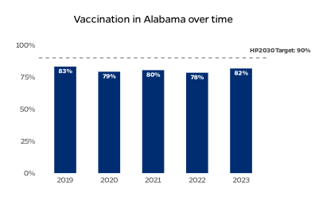
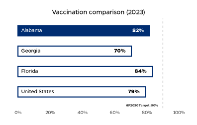
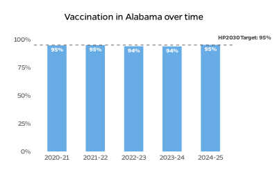
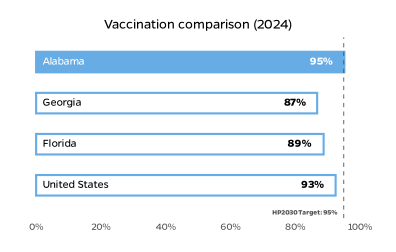

This brief illustrates the current status of childhood immunization in Alabama and is intended to inform state-level policy decisions and priorities. Takeaways include:

- State-level immunization coverage in Alabama for MMR vaccination is above national levels.
- Alabama’s non-medical exemption rate among kindergartners is lower than the U.S. median.
- State-level per capita public health spending is higher than the national rate.
- Alabama has reported 1 case of measles since January 1, 2025.

## Vaccination Coverage

Maintaining sufficient vaccination coverage is critical for establishing community protection. The charts below demonstrate how coverage for two critical vaccines has changed over time in Alabama and how it compares to neighboring states, national rates, and Healthy People 2030 (HP2030) targets.

### Proportion of 2-year-olds fully protected with DTaP vaccines

In 2023, more 2-year-olds were fully vaccinated against diphtheria, tetanus, and pertussis (received all four doses of DTaP) in Alabama compared to the previous year. Coverage in Alabama is below the HP2030 target of 90%.

Source: ChildVaxView

### Proportion of kindergartners protected with MMR vaccines

In 2024, a higher proportion of kindergarteners completed the measles, mumps, and rubella (MMR) vaccine series in Alabama compared to the previous year. Coverage in Alabama exceeds the HP2030 target of 95%.

Source: SchoolVaxView

## Vaccination Exemptions

Many states allow children attending public school to receive vaccination exemptions for religious reasons or for personal reasons, sometimes referred to as "philosophical exemptions." Higher rates of non-medical exemptions have been linked with increased disease transmission.

Alabama's rate of non-medical exemptions among kindergartners during the 2024-25 school year is similar to the state's 2023-24 rate.

Source: NCSL, SchoolVaxView

## Public Health Spending

Low levels of public health spending are thought to contribute to
suboptimal immunization rates. Nationally, Alabama ranks 18th in
public health spending.

## Universal Vaccine Purchasing

In states with Universal Purchase programs, the state government
purchases all recommended vaccines for all children, regardless of
insurance status. These initiatives can help to address disparities in
vaccine coverage and support equitable vaccine access.

## Support for Immunization

Strong policy commitment to immunization is critical for effective vaccination programs. The state legislature has recently introduced several bills that would affect state-wide childhood vaccination, a selection of which are described below. The arrows below indicate whether these bills would strengthen (↑) or weaken (↓) vaccine safety nets.

AL HB 444 (Not enacted) – Allows religious exemptions from immunization requirements for students attending religiously affiliated private schools, with documentation provided by a caregiver

AL HB 367 (Not enacted) – Prohibits governmental entities and county health departments from using public funds to produce or distribute materials that promote vaccination

AL SB 85 (Not enacted) – Specifies that religious exemptions to immunization requirements are permitted with a written declaration from a parent or guardian

## Disease Status

Measles outbreaks can indicate insufficient vaccination coverage within a population. Disease may spread across state borders when vaccine coverage is low. The map below visualizes the number of measles cases reported in Alabama and neighboring states between January 1, 2025 and September 15, 2025.

Vaccines can help prevent expensive disease outbreaks. A 2018–19 measles outbreak in Washington was estimated to cost US$47,479 per case for both direct medical and public health response expenses.

Source: Pike, 2022

## Data Sources

Vaccination coverage:

- DTaP: CDC, ChildVaxView Interactive! https://www.cdc.gov/childvaxview/about/interactive-reports.html. DTaP, ≥ 4 Doses, States/Local Areas, Birth Years/Cohorts 2017–2021, Age 24 months. Updated Aug 2024. 

Vaccination exemptions:

- Status: NCSL, State Non-Medical Exemptions From School Immunization Requirements. https://www.ncsl.org/health/state-non-medical-exemptions-from-school-immunization-requirements. Updated July 2025.
Rates: CDC, SchoolVaxView Interactive! https://www.cdc.gov/schoolvaxview/data/index.html. Exemption – Non-Medical Exemption, States, School Years 2023-24 and 2024-25. Updated July 2025.

Public health spending:

- Public Health Funding in United States, America's Health Rankings, United Health Foundation. https://www.americashealthrankings.org/explore/measures/PH_funding. Accessed July 2025.

Universal vaccine purchasing:

- Association of Immunization Managers, Policy Maps – Universal Vaccine Purchase Program. https://www.immunizationmanagers.org/resources/aim-policy-maps/. Updated April 2025.

Support for immunization:

- Association of Immunization Managers, Legislative Round-ups. https://www.immunizationmanagers.org/resources-toolkits/immunization-program-policy-toolkit/legislative-round-ups/. 
LegiScan. https://legiscan.com/. Accessed July 2025.
- NCSL State Public Health Legislation Database. https://www.ncsl.org/health/state-public-health-legislation-database. Accessed Sept 2025.

Disease status:

- International Vaccine Access Center, U.S. Measles Tracker. https://publichealth.jhu.edu/ivac/resources/us-measles-tracker. Accessed July 22, 2025.

Measles outbreak cost:

- Pike J, Melnick A, Gastañaduy PA, et al. Societal Costs of a Measles Outbreak. Pediatrics. 2021;147(4):e2020027037. doi:10.1542/peds.2020-027037

*Note: The high-level data included in this report do not reflect statewide variation in vaccination coverage or disease status. Further, state reporting policies may limit data completeness. For any data-related questions, please contact ivac@jh.edu.*
