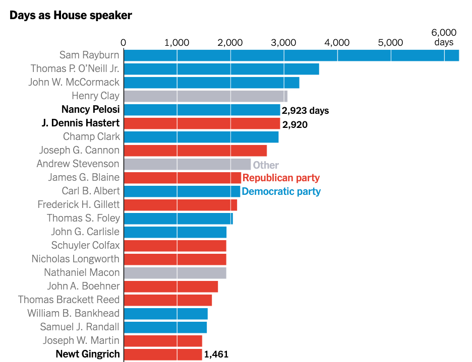
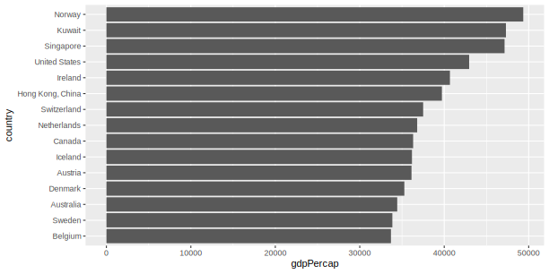
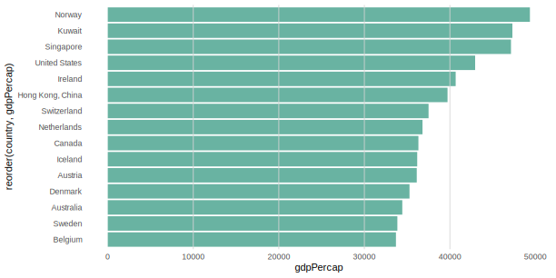

# Use vertical lines instead of axis lines for cleaner charts
David Keyes
2024-09-16

I recently came across a data viz in the *New York Times* that used a
unique approach to adding axis lines. In [this chart about the number of
days that members of the United States House of Representatives served
as speaker](https://arc.net/l/quote/xcvmjwrj), rather than use
traditional axis lines, they used white lines that show up on bars but
are hidden otherwise.



How can we create a bar chart in `ggplot2` without using vertical white
lines instead? This guide will walk you through the steps to create a
polished bar plot using gross domestic product data (GDP) from the
`gapminder` package.

## Load the Necessary Packages

First, we need to load the `tidyverse` package, which includes `ggplot2`
for plotting and `dplyr` for data manipulation. We’ll also be using the
`gapminder` dataset that comes preloaded with the `gapminder` package.
It contains data about life expectancy, GDP per capita, and population
for different countries over time.

``` r
library(tidyverse)
library(gapminder)
```

## Import Data

We’ll focus on the most recent data in the dataset, which is from 2007,
and select the top 10 countries by GDP per capita. We’ll also make the
`country` variable into a factor, reordering it by the `gdpPercap`
variable so that our bar chart will be ordered by GDP per capita.

``` r
gdp_data <-
  gapminder |>
  filter(year == 2007) |>
  select(
    country,
    gdpPercap
  ) |>
  mutate(country = fct_reorder(
    country,
    gdpPercap
  )) |>
  arrange(desc(gdpPercap)) |>
  slice(1:15)
```

Now, let’s take a look at our filtered dataset:

``` r
gdp_data
#> # A tibble: 15 × 2
#>    country          gdpPercap
#>    <fct>                <dbl>
#>  1 Norway              49357.
#>  2 Kuwait              47307.
#>  3 Singapore           47143.
#>  4 United States       42952.
#>  5 Ireland             40676.
#>  6 Hong Kong, China    39725.
#>  7 Switzerland         37506.
#>  8 Netherlands         36798.
#>  9 Canada              36319.
#> 10 Iceland             36181.
#> 11 Austria             36126.
#> 12 Denmark             35278.
#> 13 Australia           34435.
#> 14 Sweden              33860.
#> 15 Belgium             33693.
```

## Create a Basic Horizontal Bar Plot

With our data in place, we will now create a basic bar chart to
visualize the GDP per capita for each country.

``` r
ggplot(
  gdp_data,
  aes(
    x = gdpPercap,
    y = country
  )
) +
  geom_col()
```



This creates a basic bar chart, but it’s still missing the customization
we want, like removing the x-axis and adding vertical white lines.

## Remove Default Axis Lines

Next, we’ll remove the x-axis (since the bars are horizontal, this
refers to the axis along the bottom). We’ll do this by using `theme()`
and setting `panel.grid.major` and `panel.grid.minor` to
`element_blank()`.

``` r
ggplot(
  gdp_data,
  aes(
    x = gdpPercap,
    y = country
  )
) +
  geom_col() +
  theme_minimal() +
  theme(
    panel.grid.major = element_blank(),
    panel.grid.minor = element_blank()
  )
```


## Add Custom Axis Lines

To add vertical white lines in place of the x-axis, we’ll use
`geom_vline()`. This function allows us to add vertical lines at
specified positions. We’ll place the lines at intervals across the
y-axis values to help the viewer estimate the GDP per capita using the
`seq()` function to add lines from 10,000 to 50,000 at increments of
10,000.

``` r
ggplot(
  gdp_data,
  aes(
    x = gdpPercap,
    y = country
  )
) +
  geom_col() +
  geom_vline(
    xintercept = seq(
      from = 10000,
      to = 50000,
      by = 10000
    ),
    color = "white"
  ) +
  theme_minimal() +
  theme(
    panel.grid.major = element_blank(),
    panel.grid.minor = element_blank()
  )
```



### Improve Overall Style

Now that we’ve created the plot with our white vertical lines instead of
axis lines, we can customize it further to make it look just a bit more
polished.

First, let’s add a nicer color to our bars (you might recognize it as
the R for the Rest of Us blue):

``` r
geom_col(fill = "#6cabdd")
```

To do this, we make some tweaks with the `scale_x_continuous()` function
to reduce the horizontal spacing around the bars and make the y-axis
labels to show values in thousands (e.g., \$20k instead of 20000) with
the `dollar_format()` function from the `scales` package.

``` r
scale_x_continuous(
  expand = expansion(add = 500),
  labels = scales::dollar_format(scale = 1 / 1000, suffix = "k")
)
```

We also added a title and caption and removed the x and y axis labels
(since they are now obvious from the title).

``` r
labs(
  x = NULL,
  y = NULL,
  title = "GDP Per Capita (2007)",
  caption = "Source: Gapminder"
)
```

Next, we made a few additional tweaks to the theme. Adding
`base_family = "Roboto"` makes the entire plot use that font and
`base_size = 14` makes the size of all text elements larger in order to
make them more readable.

``` r
theme_minimal(
  base_family = "Roboto",
  base_size = 14
)
```

Finally, we added some additional tweaks in the `theme()` function to
style the title and caption:

``` r
theme(
  panel.grid.major = element_blank(),
  panel.grid.minor = element_blank(),
  plot.title = element_text(face = "bold"),
  plot.caption = element_text(
    size = 10,
    color = "#7f8c8d",
    hjust = 0,
    margin = margin(t = 15)
  )
)
```

All of these elements combined given us our final code:

``` r
ggplot(
  gdp_data,
  aes(
    x = gdpPercap,
    y = country
  )
) +
  geom_col(fill = "#6cabdd") +
  geom_vline(
    xintercept = seq(
      from = 10000,
      to = 50000,
      by = 10000
    ),
    color = "white"
  ) +
  scale_x_continuous(
    expand = expansion(add = 500),
    labels = scales::dollar_format(scale = 1 / 1000, suffix = "k")
  ) +
  labs(
    x = NULL,
    y = NULL,
    title = "GDP Per Capita (2007)",
    caption = "Source: Gapminder"
  ) +
  theme_minimal(
    base_family = "Roboto",
    base_size = 14
  ) +
  theme(
    panel.grid.major = element_blank(),
    panel.grid.minor = element_blank(),
    plot.title = element_text(face = "bold"),
    plot.caption = element_text(
      size = 10,
      color = "#7f8c8d",
      hjust = 0,
      margin = margin(t = 15)
    )
  )
```

And the result looks great!


By following these steps, you now have a clean, polished horizontal bar
plot that uses vertical white lines as reference points for GDP per
capita values. The x-axis has been removed for a cleaner look, but the
vertical lines give viewers a guide for interpreting the values. This
chart is a useful visualization tool for comparing GDP per capita across
countries without the clutter of an x-axis, making the data easy to
interpret at a glance.
